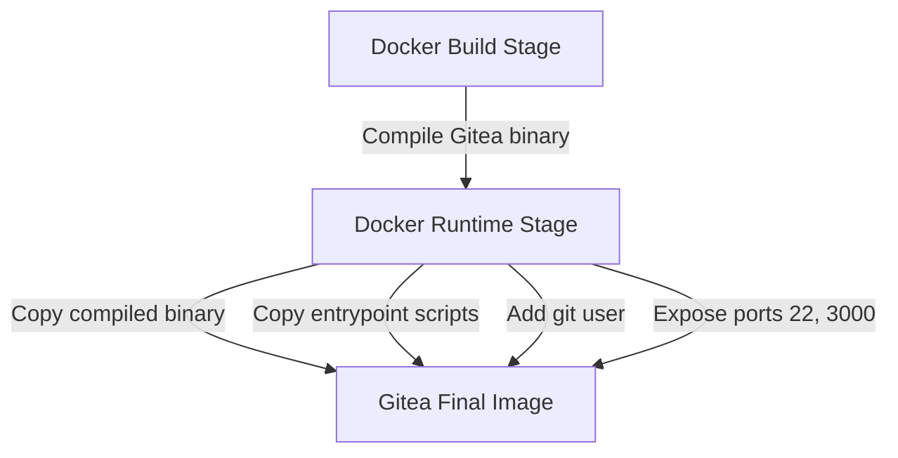
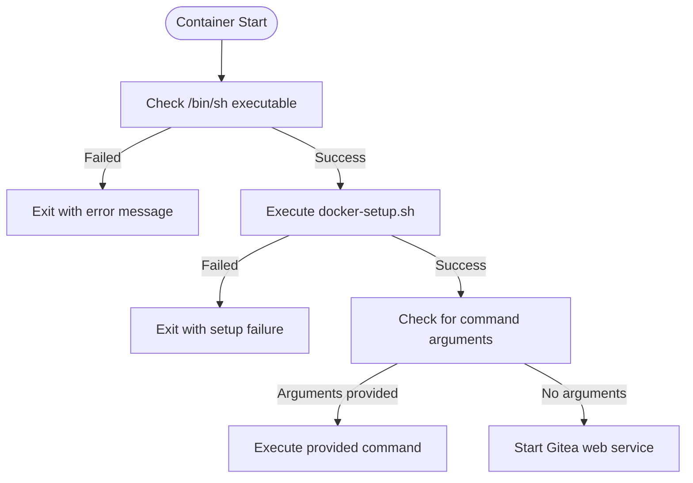
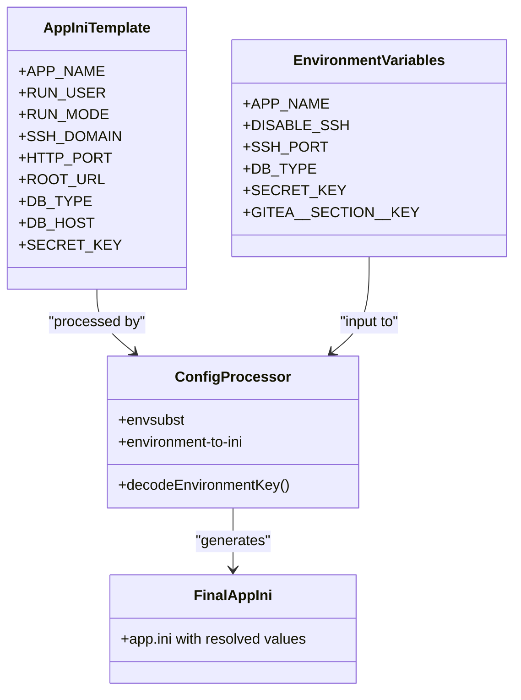

# Docker Deployment

<cite>
**Referenced Files in This Document**   
- [Dockerfile](file://Dockerfile)
- [docker/root/etc/templates/app.ini](file://docker/root/etc/templates/app.ini)
- [docker/rootless/etc/templates/app.ini](file://docker/rootless/etc/templates/app.ini)
- [docker/rootless/usr/local/bin/docker-setup.sh](file://docker/rootless/usr/local/bin/docker-setup.sh)
- [docker/rootless/usr/local/bin/docker-entrypoint.sh](file://docker/rootless/usr/local/bin/docker-entrypoint.sh)
- [modules/setting/config_env.go](file://modules/setting/config_env.go)
- [routers/web/healthcheck/check.go](file://routers/web/healthcheck/check.go)
</cite>

## Table of Contents
1. [Introduction](#introduction)
2. [Dockerfile Structure and Multi-Stage Build](#dockerfile-structure-and-multi-stage-build)
3. [Rootless Container Implementation](#rootless-container-implementation)
4. [Configuration Management and Environment Variables](#configuration-management-and-environment-variables)
5. [Deployment Examples](#deployment-examples)
6. [Volume Mounting and Data Persistence](#volume-mounting-and-data-persistence)
7. [Common Issues and Troubleshooting](#common-issues-and-troubleshooting)
8. [Production Best Practices](#production-best-practices)
9. [Conclusion](#conclusion)

## Introduction
Gitea provides official Docker images for easy deployment in containerized environments. This document details the Docker deployment strategy, focusing on the Dockerfile structure, rootless container implementation, configuration management, and best practices for production use. The Docker setup enables secure, isolated, and portable deployment of Gitea instances with minimal host system impact.

## Dockerfile Structure and Multi-Stage Build



**Diagram sources**
- [Dockerfile](file://Dockerfile#L0-L79)

The Gitea Dockerfile implements a multi-stage build process to optimize image size and security. The first stage uses a `golang:1.25-alpine3.22` base image to compile the Gitea binary, including all necessary build dependencies such as build-base, git, nodejs, and npm. After compilation, the second stage uses a minimal `alpine:3.22` base image to create the runtime environment, copying only the compiled binary and essential runtime files. This approach significantly reduces the final image size and attack surface by excluding build tools from the production container.

The build process supports version specification through the `GITEA_VERSION` build argument and allows customization of build tags through the `TAGS` argument. The final image creates a dedicated `git` user with UID 1000 and sets up the necessary directory structure for data persistence. The container exposes ports 22 (SSH) and 3000 (HTTP) and uses s6 for process supervision.

**Section sources**
- [Dockerfile](file://Dockerfile#L0-L79)

## Rootless Container Implementation



**Diagram sources**
- [docker/rootless/usr/local/bin/docker-entrypoint.sh](file://docker/rootless/usr/local/bin/docker-entrypoint.sh#L0-L16)

The rootless container implementation in Gitea enhances security by running the application without root privileges. The `docker-setup.sh` script initializes the container environment by creating necessary directories for the git user's home, custom configuration, and temporary files, ensuring proper permissions (0700) are set. The script verifies write permissions on critical directories before proceeding, preventing runtime failures due to permission issues.

The entrypoint script first checks for the presence and executability of `/bin/sh` to protect against known issues with older Docker versions and Alpine 3.14+ images. It then executes the setup script to configure the environment and finally starts the Gitea web service with the specified configuration file. This rootless approach follows security best practices by minimizing the container's privileges and reducing the potential impact of security vulnerabilities.

**Section sources**
- [docker/rootless/usr/local/bin/docker-setup.sh](file://docker/rootless/usr/local/bin/docker-setup.sh#L0-L51)
- [docker/rootless/usr/local/bin/docker-entrypoint.sh](file://docker/rootless/usr/local/bin/docker-entrypoint.sh#L0-L16)

## Configuration Management and Environment Variables



**Diagram sources**
- [docker/rootless/etc/templates/app.ini](file://docker/rootless/etc/templates/app.ini#L0-L58)
- [docker/rootless/usr/local/bin/docker-setup.sh](file://docker/rootless/usr/local/bin/docker-setup.sh#L27-L50)
- [modules/setting/config_env.go](file://modules/setting/config_env.go#L72-L124)

Gitea's Docker deployment provides flexible configuration management through environment variables. The configuration process begins with template files in `/etc/templates/app.ini` that contain environment variable placeholders. During container startup, the `docker-setup.sh` script uses `envsubst` to substitute environment variables into the template, creating the initial `app.ini` configuration file.

The script supports direct environment variable substitution for common settings such as `APP_NAME`, `SSH_DOMAIN`, `HTTP_PORT`, `DB_TYPE`, and `SECRET_KEY`, providing sensible defaults when variables are not specified. Additionally, Gitea supports advanced configuration through environment variables in the format `GITEA__SECTION_NAME__KEY_NAME`, which are processed by the `environment-to-ini` tool to override specific settings in the configuration file. This two-tiered approach allows for both simple configuration through common variables and granular control over any setting in the configuration file.

**Section sources**
- [docker/rootless/etc/templates/app.ini](file://docker/rootless/etc/templates/app.ini#L0-L58)
- [docker/rootless/usr/local/bin/docker-setup.sh](file://docker/rootless/usr/local/bin/docker-setup.sh#L27-L50)
- [modules/setting/config_env.go](file://modules/setting/config_env.go#L72-L124)

## Deployment Examples

### Docker Run Command
```bash
docker run -d \
  --name=gitea \
  -p 3000:3000 \
  -p 2222:22 \
  -v /path/to/gitea:/data \
  -e DB_TYPE=postgres \
  -e DB_HOST=db:5432 \
  -e DB_NAME=gitea \
  -e DB_USER=gitea \
  -e DB_PASSWD=giteapass \
  -e SECRET_KEY=your-secret-key \
  gitea/gitea:latest
```

### Docker Compose Configuration
```yaml
version: "3"
services:
  server:
    image: gitea/gitea:latest
    container_name: gitea
    environment:
      - USER_UID=1000
      - USER_GID=1000
      - DB_TYPE=postgres
      - DB_HOST=db:5432
      - DB_NAME=gitea
      - DB_USER=gitea
      - DB_PASSWD=giteapass
    restart: always
    volumes:
      - ./gitea:/data
      - /etc/timezone:/etc/timezone:ro
      - /etc/localtime:/etc/localtime:ro
    ports:
      - "3000:3000"
      - "2222:22"
    depends_on:
      - db

  db:
    image: postgres:15
    restart: always
    environment:
      - POSTGRES_USER=gitea
      - POSTGRES_PASSWORD=giteapass
      - POSTGRES_DB=gitea
    volumes:
      - ./postgres:/var/lib/postgresql/data
```

### Kubernetes Manifest
```yaml
apiVersion: apps/v1
kind: Deployment
metadata:
  name: gitea
spec:
  replicas: 1
  selector:
    matchLabels:
      app: gitea
  template:
    metadata:
      labels:
        app: gitea
    spec:
      containers:
      - name: gitea
        image: gitea/gitea:latest
        ports:
        - containerPort: 3000
        - containerPort: 22
        env:
        - name: DB_TYPE
          value: "postgres"
        - name: DB_HOST
          value: "gitea-postgres"
        - name: DB_NAME
          value: "gitea"
        - name: DB_USER
          value: "gitea"
        - name: DB_PASSWD
          valueFrom:
            secretKeyRef:
              name: gitea-db-secret
              key: password
        volumeMounts:
        - name: gitea-data
          mountPath: /data
      volumes:
      - name: gitea-data
        persistentVolumeClaim:
          claimName: gitea-pvc
---
apiVersion: v1
kind: Service
metadata:
  name: gitea-service
spec:
  selector:
    app: gitea
  ports:
    - protocol: TCP
      port: 3000
      targetPort: 3000
    - protocol: TCP
      port: 22
      targetPort: 22
  type: LoadBalancer
```

**Section sources**
- [docker/rootless/etc/templates/app.ini](file://docker/rootless/etc/templates/app.ini#L0-L58)
- [docker/rootless/usr/local/bin/docker-setup.sh](file://docker/rootless/usr/local/bin/docker-setup.sh#L27-L50)

## Volume Mounting and Data Persistence

```mermaid
graph TB
Host[Host System] --> |Mount| Container[Gitea Container]
subgraph Container
Data[/data]
subgraph DataStructure
Repositories[git/repositories]
GiteaData[gitea]
subgraph GiteaDataStructure
Sessions[sessions]
Avatars[avatars]
Attachments[attachments]
Log[log]
DataDB[data/gitea.db]
end
end
end
Data --> Repositories
Data --> GiteaData
GiteaData --> Sessions
GiteaData --> Avatars
GiteaData --> Attachments
GiteaData --> Log
GiteaData --> DataDB
```

**Diagram sources**
- [docker/rootless/etc/templates/app.ini](file://docker/rootless/etc/templates/app.ini#L0-L58)
- [docker/root/etc/templates/app.ini](file://docker/root/etc/templates/app.ini#L0-L61)

Proper volume mounting is critical for data persistence in Gitea Docker deployments. The primary volume should be mounted at `/data` in the container, which contains all persistent data including repositories, configuration, database (when using SQLite), and application data. The `/data` directory structure separates git repositories from Gitea application data, allowing for flexible backup and migration strategies.

When using external databases such as PostgreSQL or MySQL, the database storage should be managed separately from the Gitea container. For SQLite deployments, the database file is stored at `/data/gitea/gitea.db` and is automatically included in the mounted volume. Additional volumes can be mounted for specific purposes such as custom themes, templates, or webhook logs. Proper file permissions are essential - the mounted directory should be writable by the git user (UID 1000) to prevent startup failures.

**Section sources**
- [docker/rootless/etc/templates/app.ini](file://docker/rootless/etc/templates/app.ini#L0-L58)
- [docker/root/etc/templates/app.ini](file://docker/root/etc/templates/app.ini#L0-L61)

## Common Issues and Troubleshooting

### Permission Problems in Mounted Volumes
Permission issues are the most common problem in Gitea Docker deployments. The git user in the container runs with UID 1000 and GID 1000, so the mounted `/data` directory must be writable by this user. On Linux hosts, ensure the directory ownership is set correctly:
```bash
sudo chown -R 1000:1000 /path/to/gitea
```

### Networking Conflicts
When exposing SSH on port 22, ensure no host SSH service is running on the same port. The default configuration uses port 2222 for container SSH, which is mapped to host port 2222. For production use with SSH access, consider using a reverse proxy or dedicated IP address to avoid port conflicts.

### Resource Limits
Gitea may require adjustment of Docker resource limits, especially for large repositories or high user loads. Monitor container memory usage and adjust limits as needed:
```bash
docker run --memory=2g --cpus=2 ...
```

### Health Checks
Gitea provides a health check endpoint at `/api/healthz` that returns HTTP 200 when the service is operational. This can be used for container orchestration health checks:
```yaml
livenessProbe:
  httpGet:
    path: /api/healthz
    port: 3000
  initialDelaySeconds: 60
  periodSeconds: 30
```

**Section sources**
- [docker/rootless/usr/local/bin/docker-setup.sh](file://docker/rootless/usr/local/bin/docker-setup.sh#L2-L15)
- [routers/web/healthcheck/check.go](file://routers/web/healthcheck/check.go#L0-L38)

## Production Best Practices

### Security Configuration
Run Gitea containers with minimal privileges using rootless mode. Avoid using the `--privileged` flag and restrict container capabilities as much as possible. Use network policies to limit container network access to only required services.

### Logging Strategy
Configure centralized logging by mounting a volume for log files or using Docker logging drivers to forward logs to external systems. The default log path is `/data/gitea/log` and contains important operational information for monitoring and troubleshooting.

### Backup Strategies
Implement regular backups of the `/data` volume, which contains all critical data including repositories, configuration, and database (for SQLite). For production deployments, consider using external databases with their own backup procedures. Gitea also provides a built-in dump command that can create comprehensive backups:
```bash
docker exec gitea gitea dump -f /data/backup/gitea-dump.zip
```

### Monitoring and Alerting
Implement monitoring for key metrics such as response times, database performance, and resource utilization. Use the health check endpoint `/api/healthz` for liveness and readiness probes in container orchestration systems. Monitor log files for error patterns and set up alerts for critical issues.

**Section sources**
- [routers/web/healthcheck/check.go](file://routers/web/healthcheck/check.go#L85-L138)
- [cmd/dump.go](file://cmd/dump.go#L0-L71)

## Conclusion
Gitea's Docker deployment provides a robust, secure, and flexible way to run the application in containerized environments. The multi-stage build process creates optimized images, while the rootless container implementation enhances security. The comprehensive configuration system allows for easy customization through environment variables, and the well-defined volume structure enables reliable data persistence. By following the best practices outlined in this document, administrators can deploy Gitea in production environments with confidence in stability, security, and maintainability.