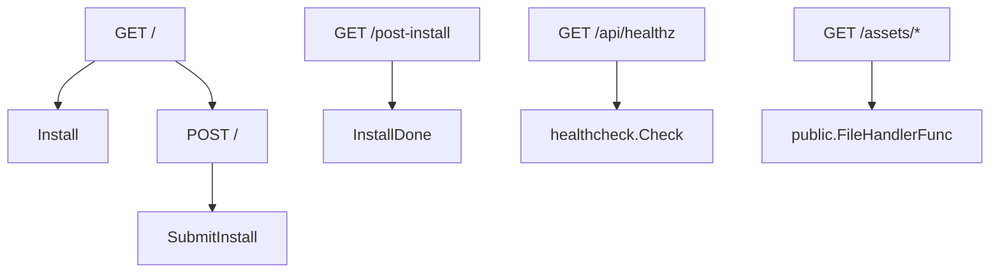
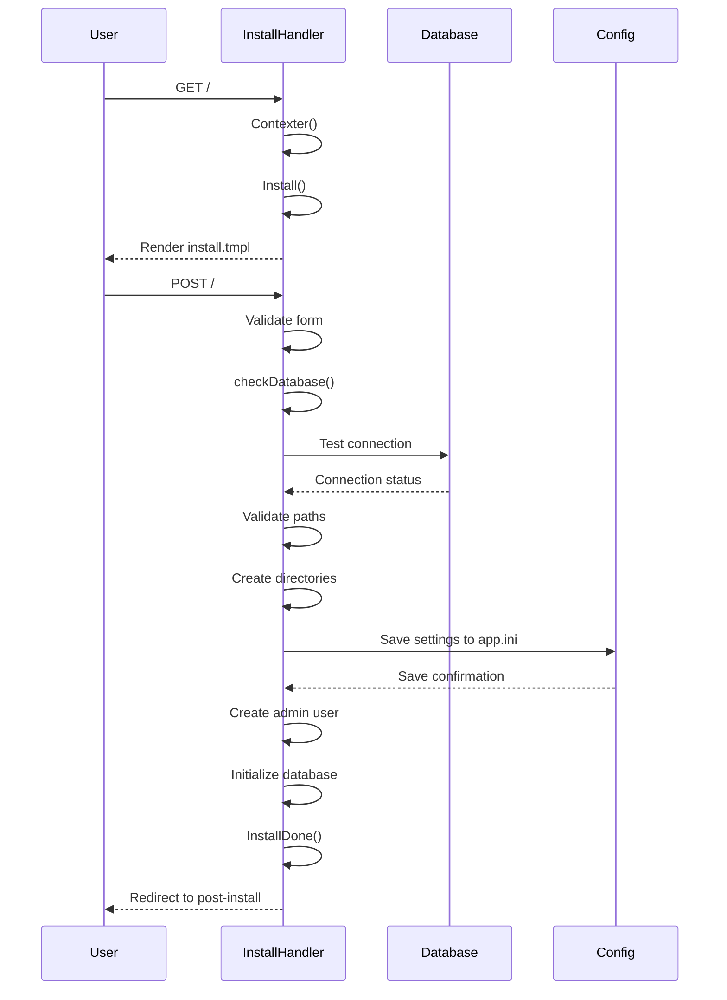
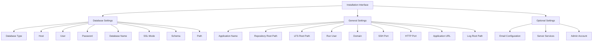
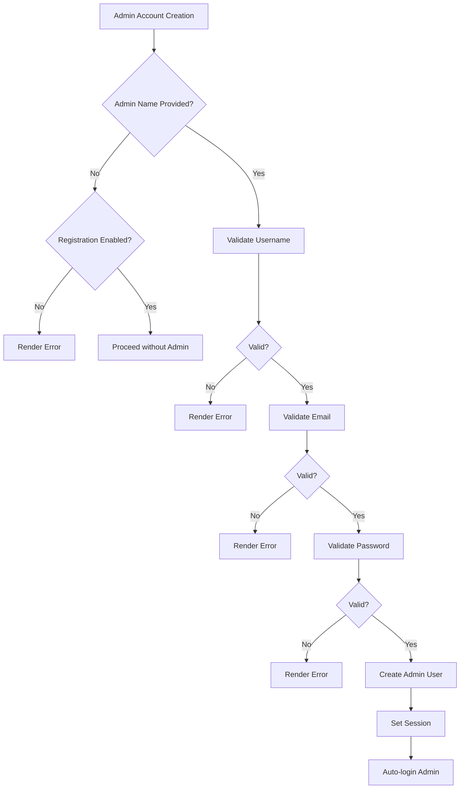
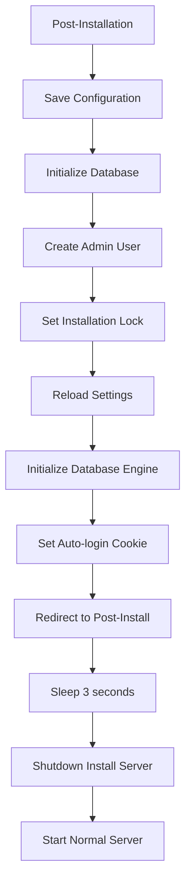
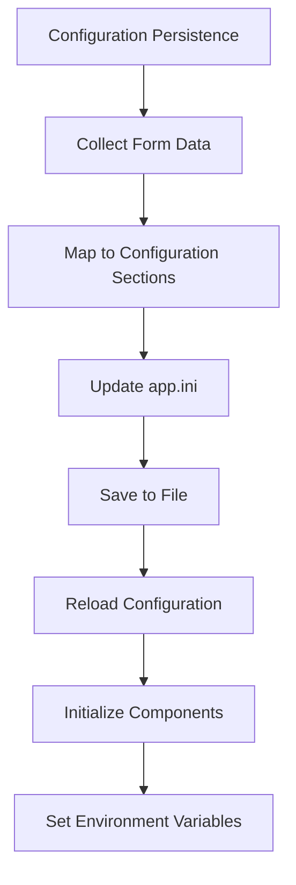

# Installation Wizard

<cite>
**Referenced Files in This Document**   
- [routes.go](file://routers/install/routes.go)
- [install.go](file://routers/install/install.go)
- [database.go](file://modules/setting/database.go)
- [setting.go](file://modules/setting/setting.go)
- [service.go](file://modules/setting/service.go)
- [security.go](file://modules/setting/security.go)
- [install.tmpl](file://templates/install.tmpl)
- [post-install.tmpl](file://templates/post-install.tmpl)
</cite>

## Table of Contents
1. [Introduction](#introduction)
2. [Installation Routes](#installation-routes)
3. [Installation Handler Logic](#installation-handler-logic)
4. [Web-Based Installation Interface](#web-based-installation-interface)
5. [Configuration Options and Recommendations](#configuration-options-and-recommendations)
6. [Database Configuration](#database-configuration)
7. [Admin Account Creation](#admin-account-creation)
8. [Server Settings](#server-settings)
9. [Post-Installation Process](#post-installation-process)
10. [Configuration Persistence](#configuration-persistence)
11. [Common Issues and Troubleshooting](#common-issues-and-troubleshooting)
12. [Successful Installation Flows](#successful-installation-flows)

## Introduction
The Gitea installation wizard provides a web-based interface for configuring and setting up a new Gitea instance. This document details the implementation of the installation routes in `routers/install/routes.go` and the handler logic in `routers/install/install.go`. It explains the step-by-step process of the installation interface, covering database configuration, admin account creation, and server settings. The documentation provides guidance on configuration options, their implications, and recommended values for different deployment scenarios. It also addresses common issues such as database connection failures, configuration validation errors, and post-installation requirements, while explaining the relationship between the installation wizard and the configuration system.

## Installation Routes
The installation routes are defined in `routers/install/routes.go` and establish the HTTP endpoints for the installation process. The `Routes()` function creates a router that handles GET and POST requests for the installation interface, as well as health checks and post-installation status.



**Diagram sources**
- [routes.go](file://routers/install/routes.go#L15-L49)

**Section sources**
- [routes.go](file://routers/install/routes.go#L15-L49)

## Installation Handler Logic
The installation handler logic in `routers/install/install.go` manages the entire installation process, from rendering the installation form to processing submitted configuration and creating the initial admin account. The `Install` function prepares the context with default values from the configuration, while `SubmitInstall` validates and processes the installation form.



**Diagram sources**
- [install.go](file://routers/install/install.go#L70-L607)

**Section sources**
- [install.go](file://routers/install/install.go#L70-L607)

## Web-Based Installation Interface
The web-based installation interface provides a comprehensive form for configuring Gitea during initial setup. The interface is divided into several sections: Database Settings, General Settings, Optional Settings (Email, Server and other services, Admin). The form collects all necessary configuration information before proceeding with the installation.



**Diagram sources**
- [install.tmpl](file://templates/install.tmpl#L1-L354)

**Section sources**
- [install.tmpl](file://templates/install.tmpl#L1-L354)

## Configuration Options and Recommendations
The installation wizard presents various configuration options with specific implications for different deployment scenarios. Each option has default values and validation rules to ensure proper configuration.

### Database Configuration Options
- **Database Type**: MySQL, PostgreSQL, MSSQL, or SQLite3
- **Host**: Database server address (for non-SQLite3 databases)
- **User**: Database username
- **Password**: Database password
- **Database Name**: Name of the database to use
- **SSL Mode**: Security mode for database connections
- **Schema**: Database schema (PostgreSQL-specific)
- **Path**: File path for SQLite3 database

### General Settings
- **Application Name**: Display name for the Gitea instance
- **Repository Root Path**: Directory for storing repositories
- **LFS Root Path**: Directory for Git LFS storage
- **Run User**: System user that runs Gitea
- **Domain**: Domain name for the Gitea instance
- **SSH Port**: Port for SSH connections
- **HTTP Port**: Port for HTTP/HTTPS connections
- **Application URL**: Full URL to access Gitea
- **Log Root Path**: Directory for log files

### Optional Settings
- **Email Configuration**: SMTP settings for sending emails
- **Server Services**: Options for offline mode, Gravatar, OpenID, registration, and captcha
- **Admin Account**: Initial administrator credentials

**Section sources**
- [install.tmpl](file://templates/install.tmpl#L1-L354)
- [install.go](file://routers/install/install.go#L70-L607)

## Database Configuration
The database configuration process validates the database connection and ensures the database is properly configured before proceeding with installation. The `checkDatabase` function in `install.go` performs comprehensive validation of the database settings.

```mermaid
flowchart TD
A[Database Configuration] --> B{Database Type}
B --> |SQLite3| C[Validate Path]
B --> |MySQL| D[Validate Host, User, Password]
B --> |PostgreSQL| E[Validate Host, User, Password]
B --> |MSSQL| F[Validate Host, User, Password]
C --> G[Test Connection)
D --> G
E --> G
F --> G
G --> H{Connection Successful?}
H --> |Yes| I[Check Database Tables]
H --> |No| J[Render Error]
I --> K{Has Users?}
K --> |Yes| L[Show Reinstall Confirmation]
K --> |No| M[Proceed with Installation]
```

**Diagram sources**
- [install.go](file://routers/install/install.go#L200-L250)
- [database.go](file://modules/setting/database.go#L1-L225)

**Section sources**
- [install.go](file://routers/install/install.go#L200-L250)
- [database.go](file://modules/setting/database.go#L1-L225)

## Admin Account Creation
The admin account creation process validates the administrator credentials and creates the initial administrator user. The installation requires either an admin account or public registration to be enabled.



**Diagram sources**
- [install.go](file://routers/install/install.go#L400-L450)

**Section sources**
- [install.go](file://routers/install/install.go#L400-L450)

## Server Settings
The server settings configuration establishes the fundamental parameters for the Gitea instance, including network configuration, file paths, and security options.

### Network Configuration
- **Domain**: The domain name that users will access the Gitea instance through
- **SSH Port**: The port number for SSH connections (0 to disable)
- **HTTP Port**: The port number for HTTP/HTTPS connections
- **Application URL**: The complete URL including protocol and port

### File Path Configuration
- **Repository Root Path**: Absolute path where Git repositories will be stored
- **LFS Root Path**: Absolute path for Git LFS object storage
- **Log Root Path**: Absolute path for log files
- **App Data Path**: Directory for Gitea's internal data (automatically set)

### Security Configuration
- **Offline Mode**: Disables external HTTP requests
- **Disable Gravatar**: Prevents loading avatars from Gravatar
- **Federated Avatar Lookup**: Enables avatar lookup via WebFinger
- **OpenID Sign-in/Sign-up**: Enables OpenID authentication
- **Registration Settings**: Controls user registration options
- **Captcha**: Enables CAPTCHA for registration

**Section sources**
- [install.go](file://routers/install/install.go#L100-L150)
- [setting.go](file://modules/setting/setting.go#L1-L243)
- [service.go](file://modules/setting/service.go#L1-L294)

## Post-Installation Process
The post-installation process finalizes the setup and prepares the system for normal operation. After successful installation, the system redirects to the post-install page and automatically shuts down the installation server.



**Diagram sources**
- [install.go](file://routers/install/install.go#L500-L607)

**Section sources**
- [install.go](file://routers/install/install.go#L500-L607)

## Configuration Persistence
The installation wizard persists configuration settings to the `app.ini` file and environment variables. The configuration system ensures that settings are properly saved and loaded for subsequent operations.



The configuration is organized into sections:
- **[database]**: Database connection settings
- **[server]**: Server and network configuration
- **[mailer]**: Email service settings
- **[service]**: Application service settings
- **[security]**: Security-related settings
- **[session]**: Session management settings
- **[log]**: Logging configuration

**Diagram sources**
- [install.go](file://routers/install/install.go#L450-L500)
- [setting.go](file://modules/setting/setting.go#L1-L243)

**Section sources**
- [install.go](file://routers/install/install.go#L450-L500)
- [setting.go](file://modules/setting/setting.go#L1-L243)

## Common Issues and Troubleshooting
The installation process includes validation and error handling for common issues that may occur during setup.

### Database Connection Failures
- **Cause**: Incorrect database credentials or unreachable database server
- **Solution**: Verify database host, port, username, and password
- **Error Message**: "Invalid database setting: [error details]"

### Configuration Validation Errors
- **Cause**: Invalid form input or missing required fields
- **Solution**: Check highlighted fields in the installation form
- **Error Message**: Specific error messages for each validation failure

### Path Permission Issues
- **Cause**: Gitea process lacks write permissions to specified directories
- **Solution**: Ensure the run user has appropriate permissions
- **Error Message**: "Invalid path: [error details]"

### Reinstallation Detection
- **Cause**: Attempting to reinstall on an existing database
- **Solution**: Confirm reinstallation by checking all three confirmation boxes
- **Error Message**: "Gitea has already been installed. Please confirm reinstallation."

### Git Binary Not Found
- **Cause**: Git is not installed or not in the system PATH
- **Solution**: Install Git and ensure it's accessible from the command line
- **Error Message**: "Test git failed: [error details]"

**Section sources**
- [install.go](file://routers/install/install.go#L200-L400)

## Successful Installation Flows
The installation process follows a consistent flow for successful deployments across different scenarios.

### Standard Installation Flow
1. Access installation page at root URL
2. Configure database settings
3. Set general application settings
4. Configure optional services
5. Create admin account
6. Submit installation form
7. Wait for configuration save and database initialization
8. Redirect to post-installation page
9. Automatic server restart
10. Login as admin user

### Docker Installation Flow
1. Set environment variables for configuration
2. Start container with volume mounts
3. Access web interface
4. Verify pre-filled configuration
5. Create admin account
6. Complete installation
7. Configuration automatically persisted to mounted volume

### High-Availability Installation Flow
1. Configure external database (PostgreSQL/MySQL)
2. Set shared storage for repositories and LFS
3. Configure load balancer settings
4. Enable clustering options
5. Create admin account
6. Complete installation
7. Deploy additional instances with same configuration

**Section sources**
- [install.go](file://routers/install/install.go#L70-L607)
- [install.tmpl](file://templates/install.tmpl#L1-L354)
- [post-install.tmpl](file://templates/post-install.tmpl#L1-L11)