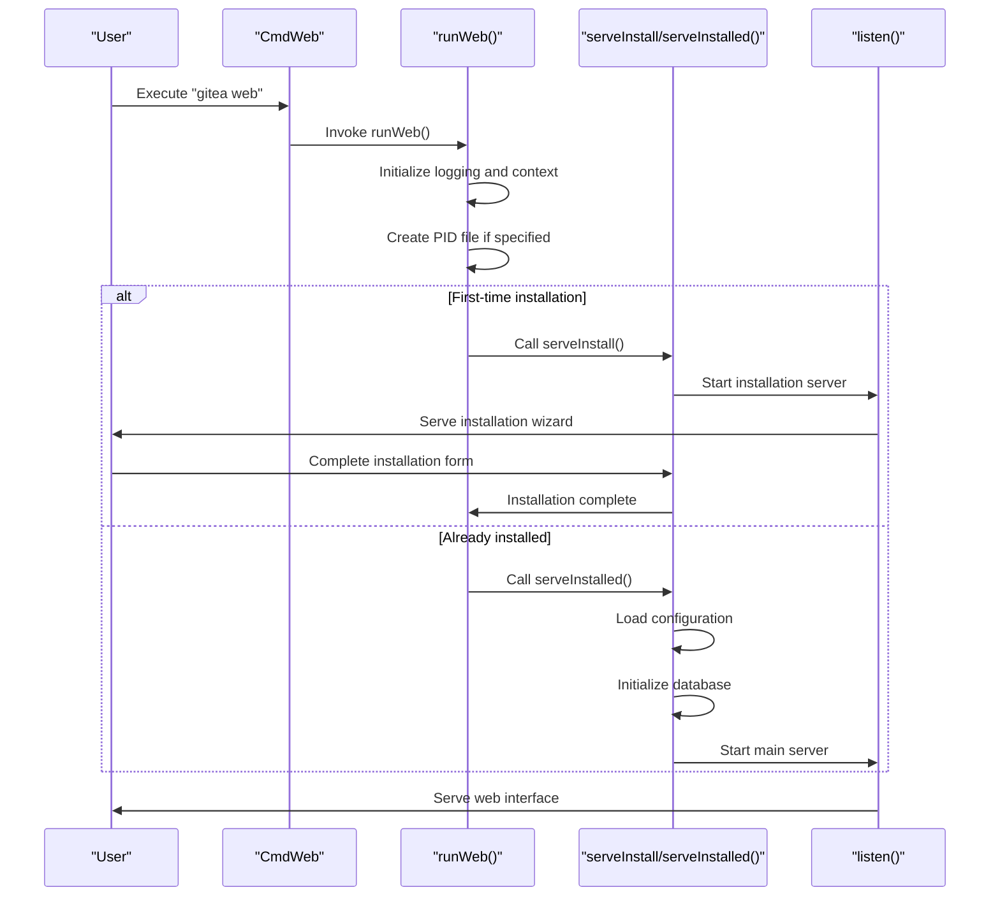
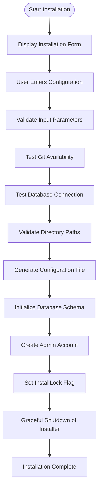

# Installation and Deployment

<cite>
**Referenced Files in This Document**   
- [web.go](file://cmd/web.go)
- [install.go](file://routers/install/install.go)
- [Dockerfile](file://Dockerfile)
- [Makefile](file://Makefile)
- [README.md](file://README.md)
</cite>

## Table of Contents
1. [Installation Methods Overview](#installation-methods-overview)
2. [Binary Installation](#binary-installation)
3. [Docker Deployment](#docker-deployment)
4. [Source Compilation via Makefile](#source-compilation-via-makefile)
5. [Web Server Initialization](#web-server-initialization)
6. [Installation Wizard Implementation](#installation-wizard-implementation)
7. [Configuration and Environment Variables](#configuration-and-environment-variables)
8. [Reverse Proxy Setup](#reverse-proxy-setup)
9. [Database Initialization and Common Issues](#database-initialization-and-common-issues)
10. [Performance Considerations and Scalability](#performance-considerations-and-scalability)

## Installation Methods Overview

Gitea provides multiple installation methods to accommodate different deployment scenarios and user requirements. The three primary installation approaches are binary installation, Docker deployment, and source compilation via Makefile. Each method serves distinct use cases and operational requirements.

Binary installation is ideal for production environments where stability and simplicity are paramount. This method involves downloading pre-compiled binaries that are ready to execute without additional compilation steps. It's particularly suitable for system administrators who prefer straightforward deployment processes and minimal dependencies.

Docker deployment offers containerized isolation and environment consistency across different systems. This approach is recommended for users who require reproducible environments, easy version management, and seamless integration with container orchestration platforms like Kubernetes. The Docker deployment method ensures that Gitea runs in a consistent environment regardless of the host system configuration.

Source compilation via Makefile provides the most flexibility and control over the build process. This method is primarily used by developers, contributors, and organizations that require custom configurations, specific feature sets, or integration with continuous integration/continuous deployment (CI/CD) pipelines. Building from source allows for the inclusion of specific tags and optimizations tailored to particular deployment requirements.

**Section sources**
- [README.md](file://README.md#L0-L213)

## Binary Installation

Binary installation of Gitea involves downloading pre-compiled executables that are ready for immediate execution. This method is the most straightforward approach for deploying Gitea in production environments. The binary distribution includes all necessary dependencies, eliminating the need for additional software installations or compilation steps.

The binary installation process begins with downloading the appropriate executable for the target platform from the official Gitea releases. Gitea supports multiple platforms and architectures, including Linux, macOS, and Windows on x86, amd64, ARM, and PowerPC architectures. After downloading the binary, users typically rename it to "gitea" and make it executable using appropriate file permission commands.

To start Gitea after binary installation, users execute the command "./gitea web" from the directory containing the binary. This command initializes the web server and launches the application. The binary automatically detects the operating system and configures itself accordingly, minimizing the need for manual configuration.

Binary installation is particularly advantageous for users who prioritize stability and ease of deployment. Since the binaries are pre-compiled and tested, they reduce the risk of compilation errors and dependency conflicts. This method also simplifies version management, as users can easily replace the binary with a newer version when upgrading.

**Section sources**
- [README.md](file://README.md#L0-L213)

## Docker Deployment

Docker deployment of Gitea provides a containerized approach to installation that ensures environment consistency and simplifies management. The Dockerfile in the repository defines a multi-stage build process that first compiles Gitea from source and then creates a minimal runtime container. This approach results in a lightweight image that contains only the necessary components for running Gitea.

The Docker deployment process begins with building the image using the provided Dockerfile. The build stage uses a Go development environment to compile Gitea, while the runtime stage uses a minimal Alpine Linux base image. This separation ensures that the final container contains only the compiled binary and essential runtime dependencies, resulting in a small image size and reduced attack surface.

When deploying Gitea with Docker, users typically mount host directories to container volumes for persistent data storage. The standard configuration exposes ports 22 (SSH) and 3000 (HTTP) to enable Git operations and web access. The container runs as the "git" user with UID 1000, ensuring proper file ownership and permissions for repository storage.

Docker deployment offers several advantages, including easy version management, environment consistency, and simplified scaling. Users can quickly switch between different Gitea versions by changing the image tag, and the containerized nature ensures that the application runs identically across different environments. Additionally, Docker deployment integrates seamlessly with container orchestration platforms, enabling automated scaling and management.

**Section sources**
- [Dockerfile](file://Dockerfile#L0-L80)
- [README.md](file://README.md#L0-L213)

## Source Compilation via Makefile

Source compilation of Gitea using the Makefile provides the most comprehensive control over the build process and is essential for development and customization. The Makefile orchestrates the entire build workflow, including dependency management, frontend asset compilation, and backend binary generation.

The compilation process begins with the "make build" command, which triggers both backend and frontend builds. The backend compilation uses Go's build system with specific tags that determine included features. For example, the "sqlite" tag enables SQLite database support, while "bindata" includes embedded assets. The Makefile automatically detects the Go version and ensures compatibility with the minimum required version specified in go.mod.

Frontend compilation involves processing JavaScript and CSS files through webpack, generating optimized assets for production use. The Makefile monitors changes to source files and can automatically rebuild assets during development. This integrated approach ensures that both frontend and backend components are compiled with consistent configurations and dependencies.

Source compilation is particularly valuable for contributors and organizations that need to customize Gitea's functionality. By building from source, users can include specific features, apply patches, or optimize the binary for particular hardware architectures. The Makefile also supports cross-compilation through the xgo tool, enabling the creation of binaries for multiple platforms from a single build environment.

**Section sources**
- [Makefile](file://Makefile#L0-L799)
- [README.md](file://README.md#L0-L213)

## Web Server Initialization

The web server initialization process in Gitea is managed through the cmd/web.go file, which contains the core logic for starting the application server. The initialization sequence begins with the CmdWeb command definition, which establishes the "web" subcommand with configuration options for port settings, PID file location, and logging levels.

The runWeb function serves as the main entry point for the web server, handling the initialization workflow based on the installation status. When Gitea is not yet installed (determined by the InstallLock setting), the server first launches the installation wizard on the specified port. Once installation is complete, the same function continues to start the main web server with the configured settings.

The initialization process includes several critical steps: creating a PID file if specified, setting up graceful shutdown handlers, and configuring the HTTP server based on the selected protocol (HTTP, HTTPS, or Unix socket). The listen function handles the actual server binding, supporting various protocols and proxy configurations. For HTTPS, the server can utilize either standard certificates or ACME (Let's Encrypt) for automatic certificate management.

A key aspect of the initialization is the dynamic port configuration through the setPort function, which updates both the HTTPPort setting and the AppURL to reflect the specified port. This ensures consistency between the listening port and the application's perceived address, preventing configuration mismatches that could affect functionality like redirect handling and URL generation.

**Diagram sources**
- [web.go](file://cmd/web.go#L0-L379)

**Section sources**
- [web.go](file://cmd/web.go#L0-L379)

## Installation Wizard Implementation

The installation wizard in Gitea is implemented in the routers/install/install.go file and provides a guided interface for configuring the application during initial setup. The wizard is accessible through the Install route and presents a comprehensive form for configuring database settings, application parameters, and administrative accounts.

The installation process begins with the Install function, which prepares the context data for rendering the installation template. This includes supported database types, current configuration values, and translation data for internationalization. The form is pre-populated with default values from the configuration, allowing users to modify settings as needed.

When the user submits the installation form, the SubmitInstall function validates the provided configuration and performs several critical checks. These include verifying database connectivity, testing Git availability, and ensuring proper file system permissions for repository and log directories. The function also validates administrative account credentials and checks for potential conflicts with existing installations.

Upon successful validation, the installation process generates a configuration file (app.ini) with the specified settings, initializes the database schema, and creates the administrative user account if specified. The process concludes by setting the InstallLock flag to prevent reinstallation and redirecting to the post-installation page. A background goroutine then gracefully shuts down the installation server, allowing the main application server to continue running.

**Diagram sources**
- [install.go](file://routers/install/install.go#L0-L607)

**Section sources**
- [install.go](file://routers/install/install.go#L0-L607)

## Configuration and Environment Variables

Gitea's configuration system provides multiple methods for setting application parameters, including configuration files, environment variables, and command-line arguments. The primary configuration file (app.ini) serves as the central repository for all settings, with environment variables offering a flexible way to override specific values, particularly in containerized environments.

During installation, the SubmitInstall function processes the form data and writes the configuration to the specified file. The function creates configuration sections for database, server, repository, and service settings, ensuring that all necessary parameters are properly organized. Sensitive values like database passwords and secret keys are generated automatically if not provided, enhancing security.

Environment variables can be used to override configuration settings without modifying the app.ini file. This approach is particularly useful in Docker deployments where configuration can be injected at runtime. The setting.EnvironmentToConfig function processes environment variables and applies them to the configuration, allowing for dynamic configuration based on the deployment environment.

The configuration system also handles special cases like path normalization and permission validation. For example, repository and log paths are validated to ensure they are writable, and the run user is checked against the current system user to prevent permission issues. The system automatically creates necessary directories with appropriate permissions, reducing the administrative burden during setup.

**Section sources**
- [install.go](file://routers/install/install.go#L0-L607)
- [web.go](file://cmd/web.go#L0-L379)

## Reverse Proxy Setup

Reverse proxy setup for Gitea requires careful configuration to ensure proper URL routing and protocol handling. The application's configuration must accurately reflect the external URL as seen by users, which is typically different from the internal server address when behind a reverse proxy.

The key configuration parameters for reverse proxy setup include AppURL, HTTPAddr, and HTTPPort. AppURL should be set to the external URL that users access, while HTTPAddr and HTTPPort specify the internal address and port where Gitea listens. This separation allows Gitea to generate correct URLs for redirects, email notifications, and API responses.

When configuring a reverse proxy, it's essential to preserve the original protocol and host information through appropriate headers. Gitea respects the X-Forwarded-* headers to determine the original request protocol, host, and port. This enables proper handling of HTTPS termination at the proxy level while maintaining secure communication indicators in the application.

The web server initialization process includes specific handling for proxy protocols through the UseProxyProtocol setting. When enabled, Gitea can parse proxy protocol headers to obtain the original client IP address, which is crucial for accurate logging and access control. This feature is particularly important in cloud environments where load balancers or container networks may obscure the true client address.

**Section sources**
- [web.go](file://cmd/web.go#L0-L379)
- [install.go](file://routers/install/install.go#L0-L607)

## Database Initialization and Common Issues

Database initialization in Gitea is a critical step that establishes the application's data storage layer. The installation process includes comprehensive database validation through the checkDatabase function, which verifies connectivity, tests the database driver, and checks for existing installations that might conflict with a new setup.

Common issues during database initialization include missing database drivers, incorrect connection parameters, and permission errors. For SQLite databases, the most frequent problem is an empty or invalid database path. For other database types like MySQL or PostgreSQL, connection failures often result from incorrect hostnames, ports, or authentication credentials.

Permission errors typically occur when the Gitea process lacks write access to the data directory or when the specified repository path is not writable. The installation process includes checks for these conditions and provides specific error messages to help diagnose and resolve the issues. For example, the system verifies that the current user matches the configured run user and that all necessary directories can be created.

Database migration issues may arise when upgrading from previous versions or when attempting to reinstall in a database that previously contained Gitea data. The system detects existing migration versions and prevents accidental overwrites unless explicitly confirmed by the user. This safeguard protects against data loss during reinstallation attempts.

**Section sources**
- [install.go](file://routers/install/install.go#L0-L607)
- [web.go](file://cmd/web.go#L0-L379)

## Performance Considerations and Scalability

Performance considerations for Gitea deployment vary significantly based on the installation method and expected workload. Binary installations typically offer the best performance as they are optimized for the target platform and can leverage system-specific optimizations. Docker deployments introduce a small overhead due to containerization but provide excellent resource isolation and monitoring capabilities.

For high-traffic deployments, several configuration options can enhance performance. Enabling Redis for caching reduces database load and improves response times for frequently accessed data. Configuring proper database connection pooling and optimizing database indexes can significantly improve query performance, especially for large repositories and active user bases.

Scalability recommendations include separating services across multiple instances, with dedicated servers for the web interface, database, and file storage. For very large deployments, consider implementing read replicas for the database and distributed file storage solutions. The containerized nature of Docker deployments facilitates horizontal scaling through orchestration platforms like Kubernetes.

Resource allocation should consider the expected number of repositories, users, and concurrent operations. Git operations can be resource-intensive, particularly for large repositories or complex merge operations. Adequate CPU, memory, and disk I/O resources should be provisioned, with particular attention to disk performance for repository storage.

**Section sources**
- [web.go](file://cmd/web.go#L0-L379)
- [install.go](file://routers/install/install.go#L0-L607)
- [Makefile](file://Makefile#L0-L799)