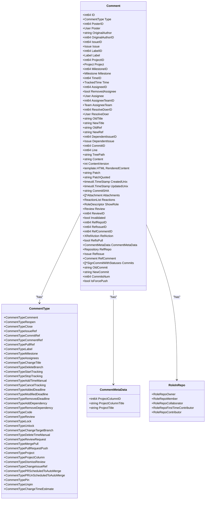
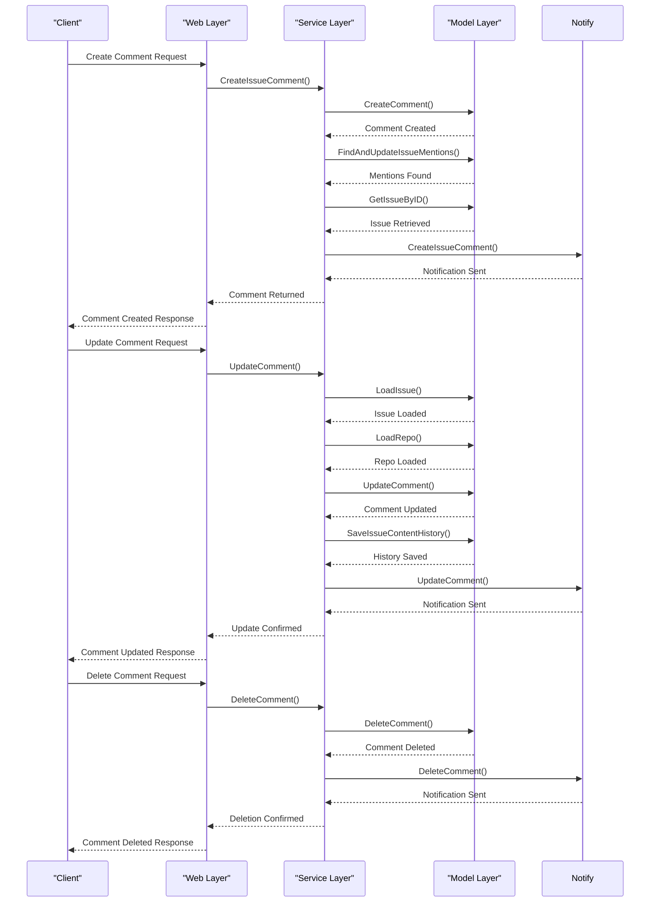
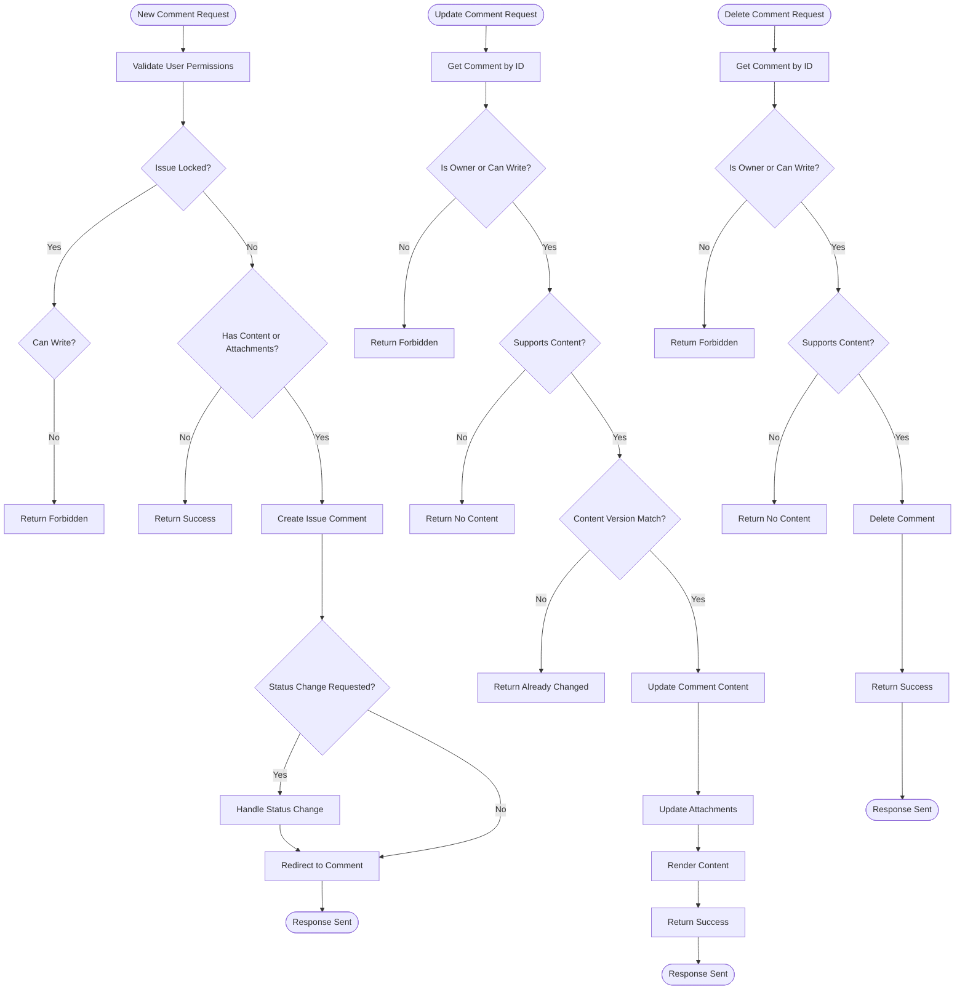
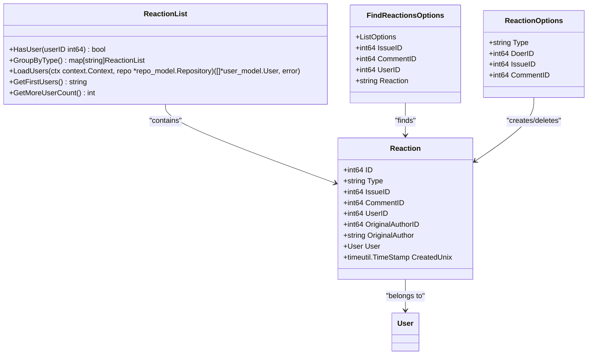
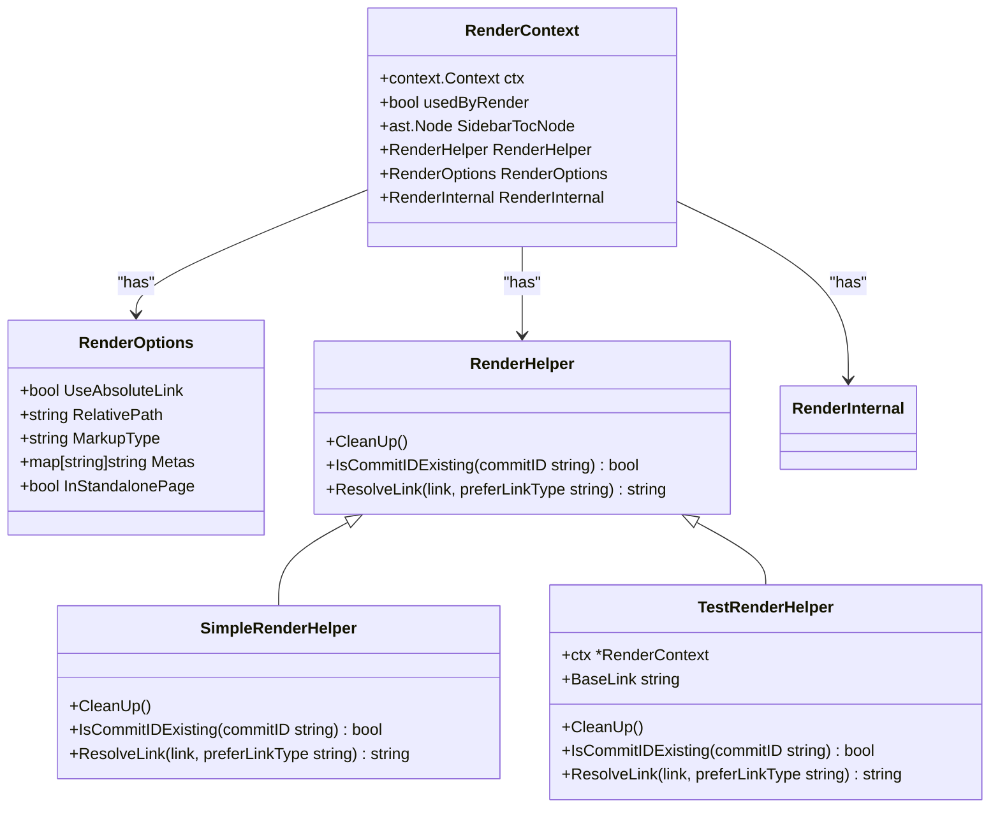

# Comments and Discussions

<cite>
**Referenced Files in This Document**   
- [models/issues/comment.go](file://models/issues/comment.go)
- [services/issue/comments.go](file://services/issue/comments.go)
- [routers/web/repo/issue_comment.go](file://routers/web/repo/issue_comment.go)
- [models/issues/reaction.go](file://models/issues/reaction.go)
- [modules/markup/render.go](file://modules/markup/render.go)
- [modules/markup/render_helper.go](file://modules/markup/render_helper.go)
</cite>

## Table of Contents
1. [Introduction](#introduction)
2. [Domain Model](#domain-model)
3. [Service Layer Logic](#service-layer-logic)
4. [Web Interface Processing](#web-interface-processing)
5. [Reactions Integration](#reactions-integration)
6. [Markup Rendering](#markup-rendering)
7. [Common Issues](#common-issues)
8. [Performance Considerations](#performance-considerations)

## Introduction
This document provides a comprehensive analysis of the comment and discussion system in Gitea, focusing on issue comments and pull request discussions. It covers the domain model, service layer logic, web interface processing, reactions integration, markup rendering, common issues, and performance considerations. The implementation supports rich discussions with features like comment editing, reactions, and markdown rendering.

## Domain Model

The domain model for comments is defined in `models/issues/comment.go`. The `Comment` struct represents a comment in commit and issue pages, with various fields that capture different aspects of the comment.

**Diagram sources**
- [models/issues/comment.go](file://models/issues/comment.go#L15-L799)

**Section sources**
- [models/issues/comment.go](file://models/issues/comment.go#L15-L799)

## Service Layer Logic

The service layer logic for handling comments is implemented in `services/issue/comments.go`. This layer provides functions for creating, updating, and deleting comments, as well as loading comment push commits.

**Diagram sources**
- [services/issue/comments.go](file://services/issue/comments.go#L15-L197)

**Section sources**
- [services/issue/comments.go](file://services/issue/comments.go#L15-L197)

## Web Interface Processing

The web interface processing for comments is handled in `routers/web/repo/issue_comment.go`. This file contains handlers for creating, updating, and deleting comments through the web interface.

**Diagram sources**
- [routers/web/repo/issue_comment.go](file://routers/web/repo/issue_comment.go#L15-L483)

**Section sources**
- [routers/web/repo/issue_comment.go](file://routers/web/repo/issue_comment.go#L15-L483)

## Reactions Integration

The integration between comments and reactions is defined in `models/issues/reaction.go`. This file contains the `Reaction` struct and functions for managing reactions on comments.

**Diagram sources**
- [models/issues/reaction.go](file://models/issues/reaction.go#L15-L368)

**Section sources**
- [models/issues/reaction.go](file://models/issues/reaction.go#L15-L368)

## Markup Rendering

The integration with markup rendering is handled in `modules/markup/render.go` and `modules/markup/render_helper.go`. These files provide the functionality for rendering markdown content in comments.

**Diagram sources**
- [modules/markup/render.go](file://modules/markup/render.go#L15-L325)
- [modules/markup/render_helper.go](file://modules/markup/render_helper.go#L15-L58)

**Section sources**
- [modules/markup/render.go](file://modules/markup/render.go#L15-L325)
- [modules/markup/render_helper.go](file://modules/markup/render_helper.go#L15-L58)

## Common Issues

### Comment Notification Spam
Comment notification spam can occur when multiple comments are created in quick succession or when users are mentioned frequently. The system mitigates this by batching notifications and providing user preferences for notification settings.

### Markdown Parsing Errors
Markdown parsing errors can occur due to malformed syntax or unsupported extensions. The system handles these by:
1. Validating markdown syntax before rendering
2. Providing fallback rendering for problematic content
3. Logging parsing errors for debugging
4. Allowing administrators to configure markdown rendering options

## Performance Considerations

### Large Comment Threads
For issues with hundreds of comments, performance considerations include:
1. **Pagination**: Comments are loaded in pages to reduce initial load time
2. **Caching**: Rendered comment content is cached to avoid repeated processing
3. **Database Indexing**: Key fields like IssueID and CreatedUnix are indexed for fast retrieval
4. **Lazy Loading**: Attachments and reactions are loaded on demand

### Database Operations
Efficient database operations are crucial for comment performance:
1. **Batch Operations**: Multiple comments can be processed in a single transaction
2. **Index Optimization**: Proper indexing reduces query time for comment retrieval
3. **Connection Pooling**: Database connections are pooled to reduce overhead

### Rendering Performance
Markdown rendering performance is optimized by:
1. **Caching**: Rendered HTML is cached to avoid repeated processing
2. **Streaming**: Large comments are rendered in chunks to reduce memory usage
3. **Concurrent Processing**: Multiple comments can be rendered concurrently

**Section sources**
- [models/issues/comment.go](file://models/issues/comment.go#L15-L799)
- [services/issue/comments.go](file://services/issue/comments.go#L15-L197)
- [routers/web/repo/issue_comment.go](file://routers/web/repo/issue_comment.go#L15-L483)
- [models/issues/reaction.go](file://models/issues/reaction.go#L15-L368)
- [modules/markup/render.go](file://modules/markup/render.go#L15-L325)
- [modules/markup/render_helper.go](file://modules/markup/render_helper.go#L15-L58)