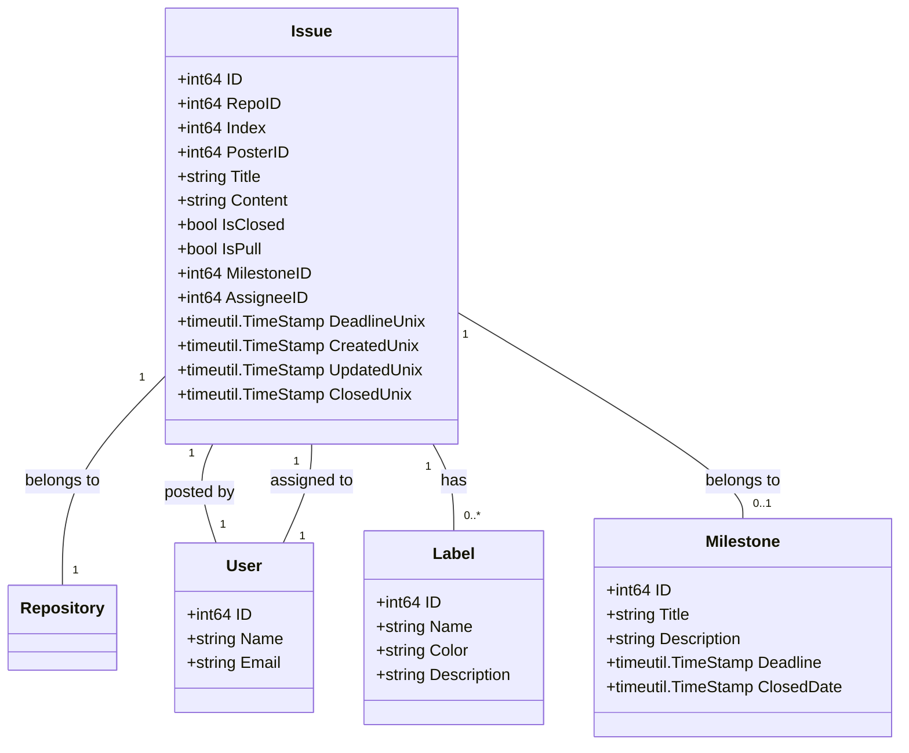
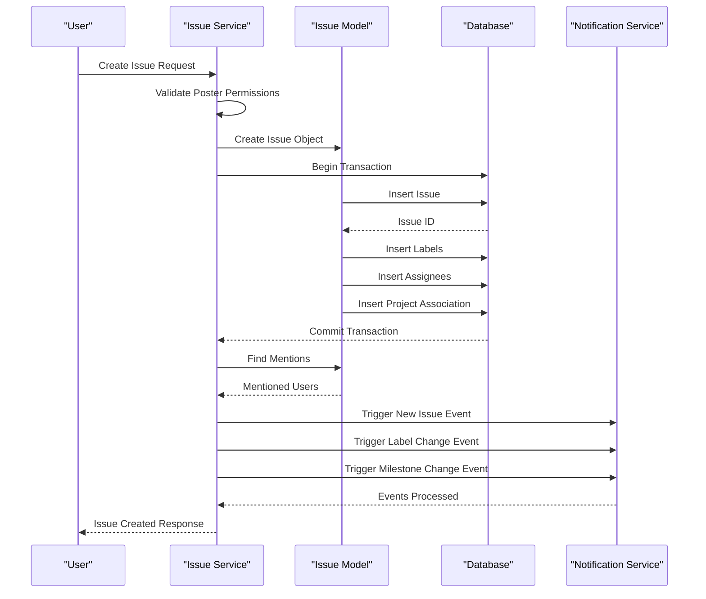
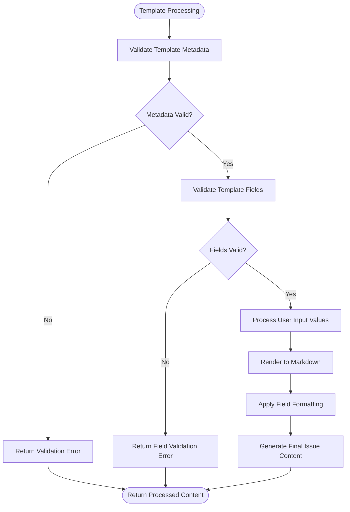
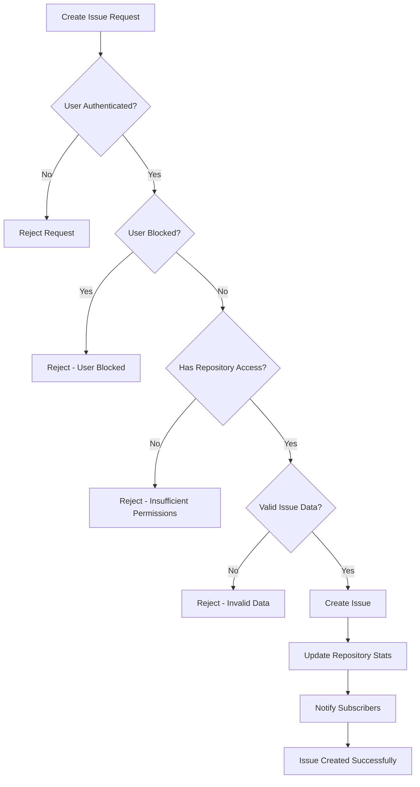
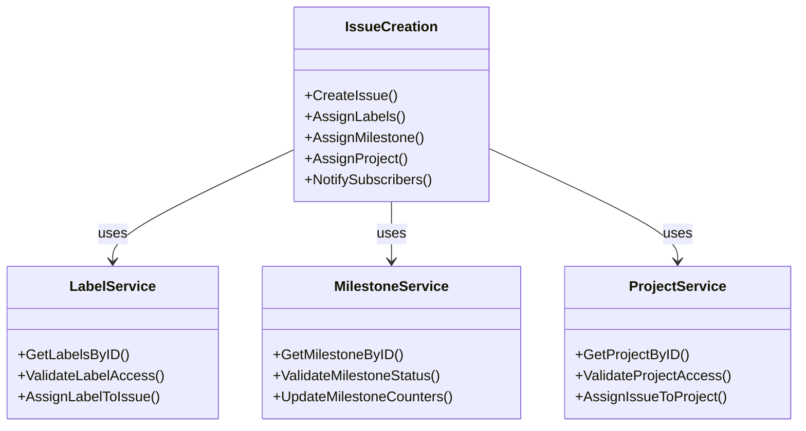
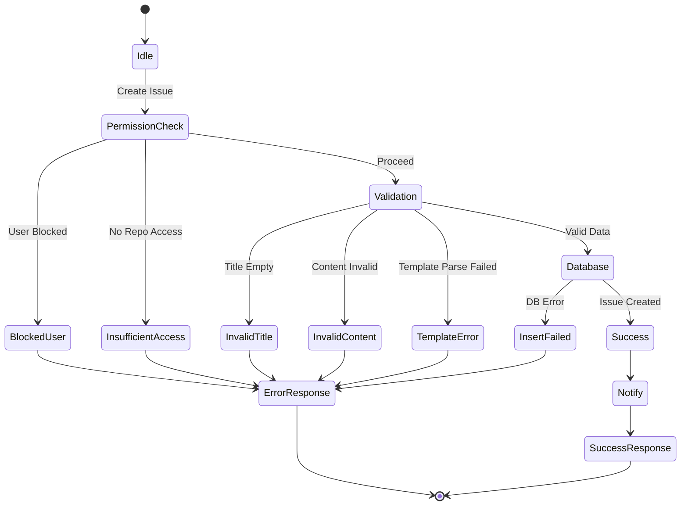
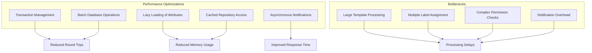

# Issue Creation

<cite>
**Referenced Files in This Document**   
- [issue.go](file://models/issues/issue.go)
- [issue.go](file://services/issue/issue.go)
- [template.go](file://modules/issue/template/template.go)
</cite>

## Table of Contents
1. [Introduction](#introduction)
2. [Domain Model](#domain-model)
3. [Service Layer Logic](#service-layer-logic)
4. [Issue Template Processing](#issue-template-processing)
5. [Repository Permissions and Access Control](#repository-permissions-and-access-control)
6. [Integration with Labels and Milestones](#integration-with-labels-and-milestones)
7. [Common Issues and Error Handling](#common-issues-and-error-handling)
8. [Performance Considerations](#performance-considerations)

## Introduction
This document provides a comprehensive analysis of issue creation in Gitea, covering both web interface and API implementations. It details the domain model, service layer logic, template processing, permission system, and integration points for labels and milestones. The documentation also addresses common issues such as permission errors and template parsing failures, along with performance considerations for large repositories.

## Domain Model

The Issue domain model in Gitea represents both issues and pull requests within a repository. The core structure is defined in `models/issues/issue.go` and contains essential fields for tracking and managing issues.

**Diagram sources**
- [issue.go](file://models/issues/issue.go#L150-L250)

**Section sources**
- [issue.go](file://models/issues/issue.go#L150-L800)

## Service Layer Logic

The service layer for issue creation is implemented in `services/issue/issue.go` and provides the business logic for creating, updating, and managing issues. The `NewIssue` function serves as the primary entry point for issue creation, handling validation, database operations, and event triggering.

**Diagram sources**
- [issue.go](file://services/issue/issue.go#L15-L50)

**Section sources**
- [issue.go](file://services/issue/issue.go#L15-L387)

## Issue Template Processing

Issue templates in Gitea are processed through the `modules/issue/template/template.go` module, which handles validation and rendering of template content. The system supports YAML-based templates with various field types including input, textarea, dropdown, and checkboxes.

**Diagram sources**
- [template.go](file://modules/issue/template/template.go#L15-L50)

**Section sources**
- [template.go](file://modules/issue/template/template.go#L15-L487)

## Repository Permissions and Access Control

Issue creation is governed by repository permissions, ensuring that only authorized users can create issues. The permission system checks both direct repository access and user blocking status before allowing issue creation.

**Diagram sources**
- [issue.go](file://services/issue/issue.go#L20-L35)

## Integration with Labels and Milestones

Issue creation integrates with labeling and milestone assignment systems, allowing for immediate categorization and tracking. The service layer handles the association of labels and milestones during the creation process.

**Diagram sources**
- [issue.go](file://services/issue/issue.go#L30-L45)

## Common Issues and Error Handling

The issue creation system implements comprehensive error handling for common scenarios such as permission errors and template parsing failures. The system provides specific error types to help diagnose and resolve issues.

**Diagram sources**
- [issue.go](file://services/issue/issue.go#L20-L60)
- [issue.go](file://models/issues/issue.go#L20-L50)

## Performance Considerations

Issue creation performance is optimized through transaction management and batch operations, particularly important for large repositories with extensive issue tracking requirements.

**Diagram sources**
- [issue.go](file://services/issue/issue.go#L25-L40)
- [issue.go](file://models/issues/issue.go#L300-L350)