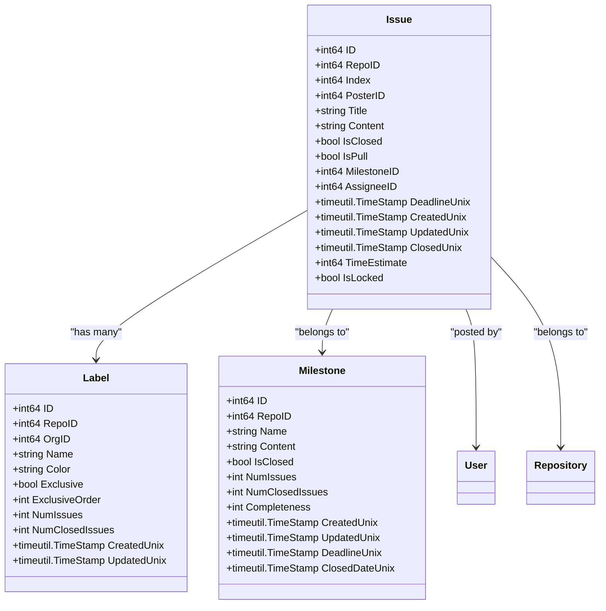
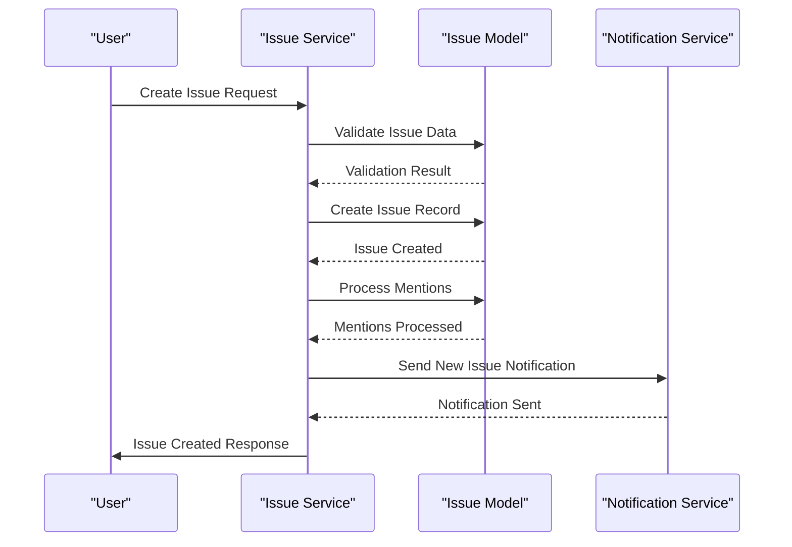
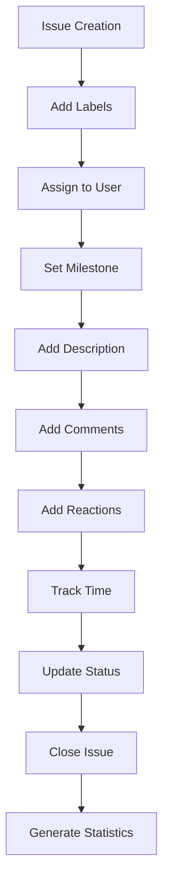
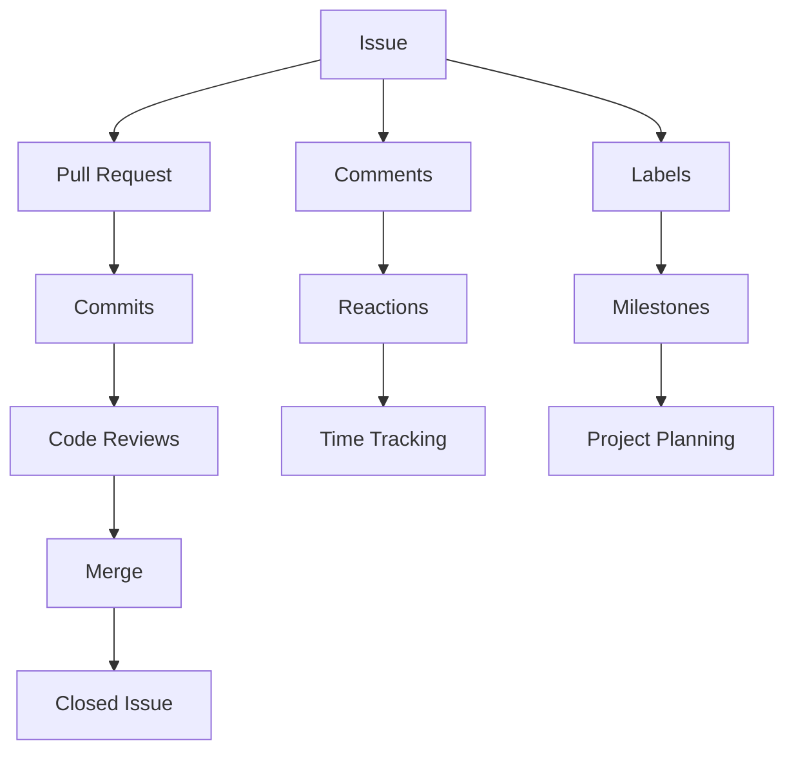

# Issue Tracking

<cite>
**Referenced Files in This Document**   
- [issue.go](file://models/issues/issue.go)
- [issue.go](file://services/issue/issue.go)
- [label.go](file://models/issues/label.go)
- [milestone.go](file://models/issues/milestone.go)
- [comment.go](file://models/issues/comment.go)
- [reaction.go](file://models/issues/reaction.go)
</cite>

## Table of Contents
1. [Introduction](#introduction)
2. [Issue Model Implementation](#issue-model-implementation)
3. [Issue Services](#issue-services)
4. [Core Issue Features](#core-issue-features)
5. [Issue Workflows](#issue-workflows)
6. [Relationships with Pull Requests and Repository Activities](#relationships-with-pull-requests-and-repository-activities)
7. [Common Issues and Troubleshooting](#common-issues-and-troubleshooting)
8. [Performance Considerations](#performance-considerations)
9. [Conclusion](#conclusion)

## Introduction
Gitea's issue tracking system provides a comprehensive solution for managing software development workflows, including bug tracking, feature requests, and project planning. The system is designed to support collaborative development with robust features for issue management, team collaboration, and project organization. This document details the implementation and usage of Gitea's issue tracking system, focusing on the core models, services, and features that enable effective issue management.

## Issue Model Implementation

The issue model in Gitea is implemented in `models/issues/issue.go` and represents the core data structure for issues and pull requests. The `Issue` struct contains comprehensive fields for tracking issue metadata, relationships, and state.

**Diagram sources**
- [issue.go](file://models/issues/issue.go#L50-L150)
- [label.go](file://models/issues/label.go#L50-L100)
- [milestone.go](file://models/issues/milestone.go#L50-L100)

**Section sources**
- [issue.go](file://models/issues/issue.go#L1-L823)
- [label.go](file://models/issues/label.go#L1-L514)
- [milestone.go](file://models/issues/milestone.go#L1-L342)

## Issue Services

The issue services in `services/issue/issue.go` provide the business logic for creating, updating, and managing issues. These services act as an abstraction layer between the API/controllers and the data models, ensuring proper validation, permission checks, and notification handling.

**Diagram sources**
- [issue.go](file://services/issue/issue.go#L1-L387)
- [issue.go](file://models/issues/issue.go#L1-L823)

**Section sources**
- [issue.go](file://services/issue/issue.go#L1-L387)

## Core Issue Features

Gitea's issue tracking system provides a comprehensive set of features for managing software development workflows.

### Creation and Assignment
Issues can be created with detailed descriptions, labels, milestones, and assigned to specific users. The system supports both individual and multiple assignees, allowing teams to collaborate effectively on issue resolution.

### Labeling and Categorization
Labels provide a flexible way to categorize issues by type, priority, or any other criteria. Labels can be repository-specific or organization-wide, and support color coding for visual identification. The system also supports exclusive labels, which ensure that only one label from a specific category can be applied to an issue.

### Milestone Tracking
Milestones enable project planning by grouping issues into time-bound goals. Each milestone tracks progress through completion percentage and provides deadline management with overdue status indication. The system automatically updates milestone statistics as issues are created, closed, or reassigned.

### Comments and Discussions
Issues support threaded discussions through comments, allowing team members to collaborate on issue resolution. Comments can include formatted text, code snippets, and attachments. The system also supports inline comments on code changes within pull requests.

### Reactions and Engagement
Users can react to issues and comments with emoji-style reactions, providing a lightweight way to express agreement, request changes, or show appreciation. The system limits the number of users displayed in reaction tooltips for performance reasons.

### Time Tracking
The time tracking feature allows users to estimate work required for issues and track actual time spent. This includes both manual time entries and automatic tracking through stopwatch functionality. Time tracking data is aggregated at both issue and milestone levels.

**Diagram sources**
- [issue.go](file://models/issues/issue.go#L1-L823)
- [comment.go](file://models/issues/comment.go#L1-L1285)
- [reaction.go](file://models/issues/reaction.go#L1-L368)

**Section sources**
- [issue.go](file://models/issues/issue.go#L1-L823)
- [comment.go](file://models/issues/comment.go#L1-L1285)
- [reaction.go](file://models/issues/reaction.go#L1-L368)

## Issue Workflows

Gitea supports comprehensive workflows for issue management from creation to resolution.

### Creation Workflow
When a new issue is created, the system performs several operations:
1. Validates the issue data and user permissions
2. Creates the issue record in the database
3. Processes any user mentions in the issue content
4. Sends notifications to mentioned users and subscribers
5. Updates repository statistics

### Assignment Workflow
The assignment system supports both single and multiple assignees:
- Assignees can be added or removed individually
- The system validates that assignees have appropriate repository access
- Notifications are sent to newly assigned users
- Assignment history is tracked through comment records

### Resolution Workflow
The typical resolution workflow includes:
1. Issue triage and prioritization
2. Assignment to appropriate team members
3. Discussion and technical analysis
4. Implementation of fixes or features
5. Code review and testing
6. Issue closure with resolution details

## Relationships with Pull Requests and Repository Activities

Issues are deeply integrated with pull requests and other repository activities, creating a cohesive development workflow.

### Pull Request Integration
Every pull request is represented as an issue in the system, allowing consistent handling of both bug reports and code changes. Pull requests inherit all issue features, including:
- Comments and discussions
- Labels and milestones
- Assignees and reviewers
- Time tracking and reactions

The system maintains bidirectional links between pull requests and related issues, enabling automatic closure of issues when pull requests are merged.

### Repository Activity Tracking
Issues are connected to repository activities through:
- Commit references (issues mentioned in commit messages)
- Branch creation and deletion
- Code review activities
- Merge operations
- Automated actions triggered by issue events

This integration creates a complete audit trail of development activities related to each issue.

**Diagram sources**
- [issue.go](file://models/issues/issue.go#L1-L823)
- [pull.go](file://models/issues/pull.go#L1-L100)

**Section sources**
- [issue.go](file://models/issues/issue.go#L1-L823)
- [pull.go](file://models/issues/pull.go#L1-L100)

## Common Issues and Troubleshooting

### Notification Spam
Users may experience notification spam when subscribed to active repositories. This can be mitigated by:
- Adjusting notification settings at repository or global level
- Using filters to prioritize important notifications
- Unsubscribing from specific issues when no longer relevant
- Configuring notification rules based on issue labels or assignees

### Permission Problems
Permission issues typically occur when:
- Users are blocked by repository owners
- Team permissions are not properly configured
- Organization membership changes affect access
- External user mappings are incorrect

The system performs permission checks before allowing issue operations, and administrators should verify user and team permissions when access issues arise.

## Performance Considerations

### Issue Search and Filtering
For repositories with large numbers of issues, search and filtering performance is critical. The system optimizes performance through:
- Database indexing on key fields (repository, status, assignee, milestone)
- Pagination of search results
- Caching of frequently accessed issue data
- Efficient query construction to minimize database load

### Large Dataset Handling
When dealing with large datasets, consider:
- Using specific filters to narrow search results
- Implementing rate limiting for API access
- Optimizing database configuration for read-heavy workloads
- Using the issue indexer for complex search queries
- Monitoring system resources during peak usage periods

## Conclusion
Gitea's issue tracking system provides a robust and flexible platform for managing software development workflows. By combining comprehensive issue management features with tight integration to pull requests and repository activities, the system supports efficient collaboration and project planning. The modular architecture, with clear separation between models and services, enables extensibility while maintaining data integrity and performance. For optimal use, teams should establish consistent workflows, leverage the full range of features, and monitor system performance when managing large repositories.