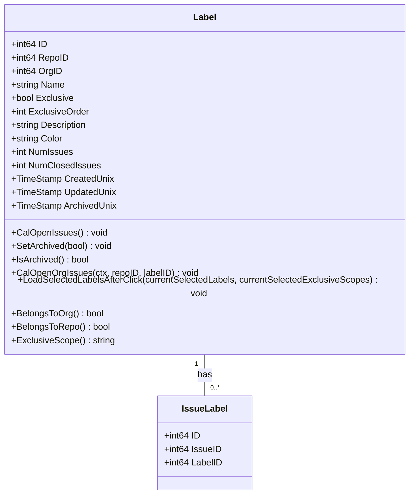
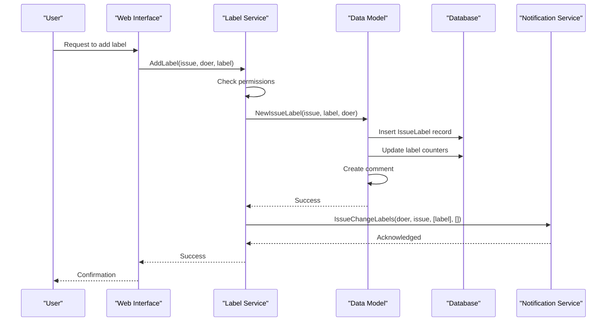
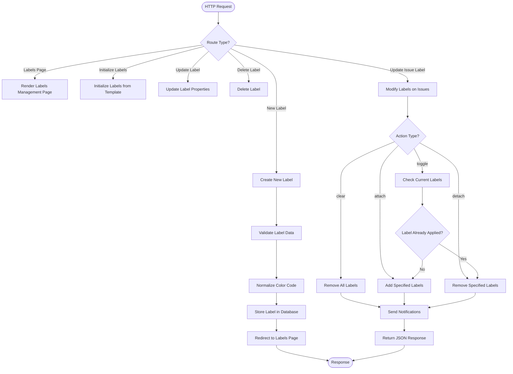
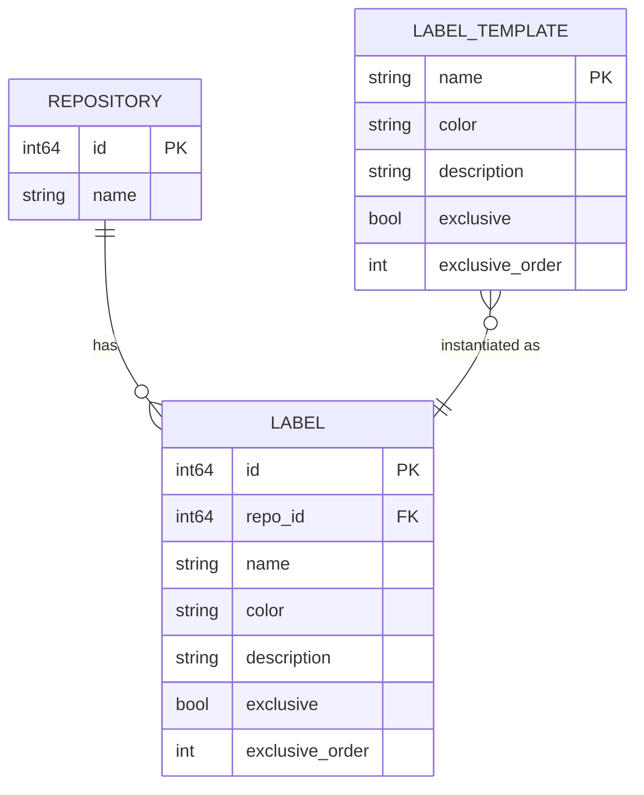

# Labels and Label Management

<cite>
**Referenced Files in This Document**   
- [label.go](file://models/issues/label.go)
- [issue_label.go](file://models/issues/issue_label.go)
- [label.go](file://services/issue/label.go)
- [issue_label.go](file://routers/web/repo/issue_label.go)
- [Advanced.yaml](file://options/label/Advanced.yaml)
- [label.go](file://modules/label/label.go)
- [parser.go](file://modules/label/parser.go)
- [issue.go](file://services/convert/issue.go)
</cite>

## Table of Contents
1. [Introduction](#introduction)
2. [Domain Model](#domain-model)
3. [Service Layer Logic](#service-layer-logic)
4. [Web Interface Management](#web-interface-management)
5. [Label Templates](#label-templates)
6. [Label Filtering and Querying](#label-filtering-and-querying)
7. [Common Issues](#common-issues)
8. [Performance Considerations](#performance-considerations)
9. [Conclusion](#conclusion)

## Introduction
Labels in Gitea serve as a powerful categorization system for issues and pull requests, enabling teams to organize, filter, and prioritize their work effectively. This document provides a comprehensive analysis of the label management system in Gitea, covering the domain model, service layer logic, web interface implementation, and integration with label templates. The system supports repository-specific and organization-wide labels, with features like exclusive scopes, color coding, and archival capabilities. Labels can be applied, removed, and replaced through both the web interface and API, with appropriate permission checks and notification mechanisms in place.

## Domain Model

The label domain model in Gitea is implemented in `models/issues/label.go` and represents the core data structure for labels. The `Label` struct contains essential fields for label management:

- **ID**: Unique identifier for the label
- **RepoID**: Repository identifier (for repo-specific labels)
- **OrgID**: Organization identifier (for org-wide labels)
- **Name**: Label name with support for scoped labels (e.g., "Kind/Bug")
- **Exclusive**: Boolean flag indicating if the label belongs to an exclusive scope
- **ExclusiveOrder**: Order value for exclusive labels within their scope
- **Description**: Optional description of the label's purpose
- **Color**: Color code for visual identification
- **NumIssues**: Total number of issues associated with the label
- **NumClosedIssues**: Number of closed issues with this label
- **CreatedUnix**: Timestamp of label creation
- **UpdatedUnix**: Timestamp of last update
- **ArchivedUnix**: Timestamp indicating when the label was archived

The model supports both repository-specific labels (when RepoID > 0) and organization-wide labels (when OrgID > 0). Exclusive labels are designed to work in scopes where only one label from a particular scope can be applied to an issue at a time, such as priority levels or review statuses. The model includes methods for calculating open issues, checking archival status, and handling exclusive scope relationships.

**Diagram sources**
- [label.go](file://models/issues/label.go#L78-L128)
- [issue_label.go](file://models/issues/issue_label.go#L12-L15)

**Section sources**
- [label.go](file://models/issues/label.go#L78-L513)
- [issue_label.go](file://models/issues/issue_label.go#L12-L470)

## Service Layer Logic

The service layer for label management is implemented in `services/issue/label.go` and provides the business logic for label operations. This layer acts as an intermediary between the web interface and the data access layer, handling complex operations and ensuring proper authorization and notification.

The service layer exposes several key functions:

- **ClearLabels**: Removes all labels from an issue
- **AddLabel**: Adds a single label to an issue
- **AddLabels**: Adds multiple labels to an issue
- **RemoveLabel**: Removes a specific label from an issue
- **ReplaceLabels**: Replaces all current labels on an issue with a new set

Each operation includes permission checks to ensure the user has appropriate write access to issues or pull requests. When labels are modified, the service layer triggers notifications through the `notify_service` package to inform relevant parties of the changes. The implementation uses database transactions to ensure data consistency, particularly when multiple operations are performed (such as replacing labels, which involves both removal and addition).

The service layer also handles exclusive label scopes, automatically removing other labels in the same scope when a new exclusive label is added. This ensures that only one label from each exclusive scope is applied to an issue at any given time, maintaining data integrity and preventing conflicting labels.

**Diagram sources**
- [label.go](file://services/issue/label.go#L15-L87)
- [issue_label.go](file://models/issues/issue_label.go#L120-L160)

**Section sources**
- [label.go](file://services/issue/label.go#L15-L87)
- [issue_label.go](file://models/issues/issue_label.go#L120-L470)

## Web Interface Management

The web interface for label management is implemented in `routers/web/repo/issue_label.go` and provides the HTTP endpoints for label operations. The controller handles various actions including creating, updating, deleting, and applying labels to issues.

Key endpoints include:

- **Labels**: Renders the labels management page
- **InitializeLabels**: Initializes labels from a template
- **NewLabel**: Creates a new label for a repository
- **UpdateLabel**: Updates an existing label's properties
- **DeleteLabel**: Removes a label from a repository
- **UpdateIssueLabel**: Modifies labels on one or more issues

The web interface integrates with the service layer to perform operations and includes proper error handling and user feedback. For example, when initializing labels from a template, the controller validates the template file and provides appropriate error messages if the file cannot be loaded. The interface also handles different actions for modifying issue labels, including "attach", "detach", "toggle", and "clear" operations.

The implementation includes client-side JavaScript components that enhance the user experience, such as the LabelEdit component that manages the label editing modal. These components interact with the server endpoints through AJAX calls, providing a responsive interface without requiring full page reloads.

**Diagram sources**
- [issue_label.go](file://routers/web/repo/issue_label.go#L70-L231)
- [LabelEdit.ts](file://web_src/js/features/comp/LabelEdit.ts#L0-L85)

**Section sources**
- [issue_label.go](file://routers/web/repo/issue_label.go#L70-L231)
- [LabelEdit.ts](file://web_src/js/features/comp/LabelEdit.ts#L0-L85)

## Label Templates

Gitea supports label templates that allow repositories to be initialized with predefined sets of labels. The `options/label/Advanced.yaml` file provides an example template with a comprehensive set of labels organized by category.

The template system is implemented in `modules/label/parser.go` and supports both YAML and legacy text formats. The YAML format allows for more structured data with fields for name, color, description, exclusivity, and order. The parser validates label data, normalizes color codes, and handles errors appropriately.

The Advanced.yaml template includes several categories of labels:

- **Kind**: Categorizes the nature of the issue (Bug, Feature, Enhancement, etc.)
- **Compat**: Indicates compatibility implications (Breaking changes)
- **Reviewed**: Tracks review status (Duplicate, Invalid, Confirmed, Won't Fix)
- **Status**: Indicates current status (Need More Info, Blocked, Abandoned)
- **Priority**: Indicates priority level (Critical, High, Medium, Low)

Each category uses exclusive labels to ensure only one status from each category can be applied at a time. The template system allows organizations to standardize their labeling conventions across multiple repositories, improving consistency and reducing setup time for new projects.

**Diagram sources**
- [Advanced.yaml](file://options/label/Advanced.yaml#L1-L82)
- [parser.go](file://modules/label/parser.go#L0-L118)

**Section sources**
- [Advanced.yaml](file://options/label/Advanced.yaml#L1-L82)
- [parser.go](file://modules/label/parser.go#L0-L118)
- [label.go](file://modules/label/label.go#L0-L51)

## Label Filtering and Querying

Labels are integral to issue filtering and searching in Gitea. The system provides multiple methods for querying issues based on their labels, both through the web interface and API.

The `BuildLabelNamesIssueIDsCondition` function in `models/issues/label.go` creates database queries to find issues matching specific label names. This function is used in the issue search functionality to filter issues by labels. The implementation uses SQL joins between the `issue_label` and `label` tables to efficiently retrieve issues with specific labels.

The label model includes methods for retrieving labels by various criteria, including:
- By repository ID with sorting options
- By organization ID with sorting options
- By specific IDs
- By names within a repository or organization

These methods support pagination through the `ListOptions` parameter, allowing efficient retrieval of large label sets. The system also calculates derived metrics such as the number of open issues for each label, which is used in the labels management interface to provide insights into label usage.

The filtering system supports both inclusive and exclusive label queries, allowing users to find issues with specific labels or issues without certain labels. This flexibility enables complex queries for issue triage and reporting.

**Section sources**
- [label.go](file://models/issues/label.go#L300-L350)
- [issue_label.go](file://models/issues/issue_label.go#L360-L400)

## Common Issues

Several common issues can arise when managing labels in Gitea, particularly in repositories with complex labeling requirements or multiple contributors.

**Duplicate Label Creation**: Users may attempt to create labels with the same name, either accidentally or due to lack of awareness of existing labels. The system prevents exact duplicates within the same repository or organization, but similar labels with slight name variations can still be created. Implementing label name validation and suggestions could help mitigate this issue.

**Permission Problems**: Users without appropriate permissions may encounter errors when modifying labels. The system checks write permissions for issues or pull requests before allowing label modifications. Organization owners can manage org-wide labels, while repository collaborators can manage repository-specific labels. Clear error messages help users understand permission requirements.

**Exclusive Label Conflicts**: When using exclusive label scopes, conflicts can occur if users attempt to apply multiple labels from the same scope. The system automatically resolves these conflicts by removing existing labels in the same scope when a new one is added, but this behavior should be clearly communicated to users.

**Color Code Validation**: Invalid color codes can cause issues with label display. The system normalizes color codes and validates them against a regular expression pattern, rejecting invalid colors. This ensures consistent visual presentation across the application.

**Section sources**
- [label.go](file://models/issues/label.go#L150-L200)
- [issue_label.go](file://models/issues/issue_label.go#L120-L180)
- [issue.go](file://services/convert/issue.go#L276-L295)

## Performance Considerations

Label operations in repositories with hundreds of labels require careful performance consideration to maintain responsiveness and scalability.

**Database Indexing**: The label system uses database indexes on key fields such as RepoID, OrgID, and name to optimize query performance. These indexes enable efficient retrieval of labels by repository or organization, even with large numbers of labels.

**Batch Operations**: When modifying multiple labels on an issue, the system uses database transactions to ensure atomicity and consistency. However, large batch operations should be performed carefully to avoid long-running transactions that could impact database performance.

**Caching**: The system could benefit from additional caching mechanisms for frequently accessed label data, particularly for repositories with many labels. Caching label lists and their metadata could reduce database load and improve response times.

**Pagination**: The label retrieval methods support pagination, which is essential for repositories with large numbers of labels. This prevents performance degradation when displaying label lists in the web interface.

**Counter Updates**: Label issue counters are updated efficiently using database expressions that calculate counts directly in the database rather than retrieving all associated issues. This approach scales well even with large numbers of issues per label.

**Section sources**
- [label.go](file://models/issues/label.go#L400-L500)
- [issue_label.go](file://models/issues/issue_label.go#L300-L400)

## Conclusion
The label management system in Gitea provides a comprehensive solution for categorizing and organizing issues and pull requests. The domain model supports both repository-specific and organization-wide labels with features like exclusive scopes and archival. The service layer implements robust business logic with proper authorization and notification mechanisms, while the web interface provides an intuitive user experience for label management. Integration with label templates enables consistent labeling across repositories, and the filtering system supports complex queries for issue triage. While the system performs well in most scenarios, repositories with hundreds of labels may benefit from additional performance optimizations such as enhanced caching. Overall, the label system in Gitea is a powerful tool for project organization and workflow management.