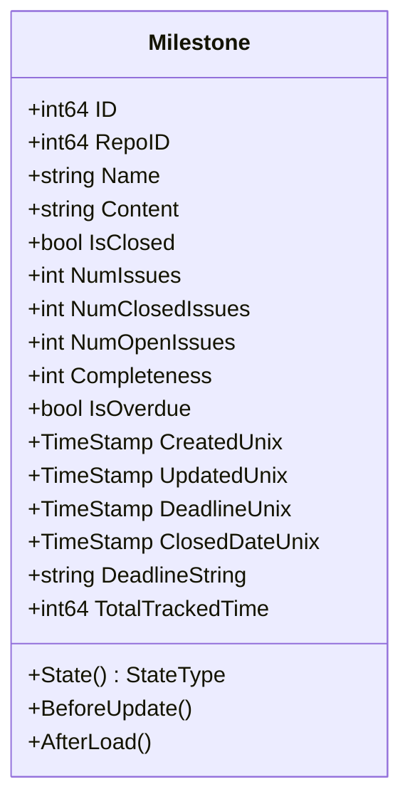
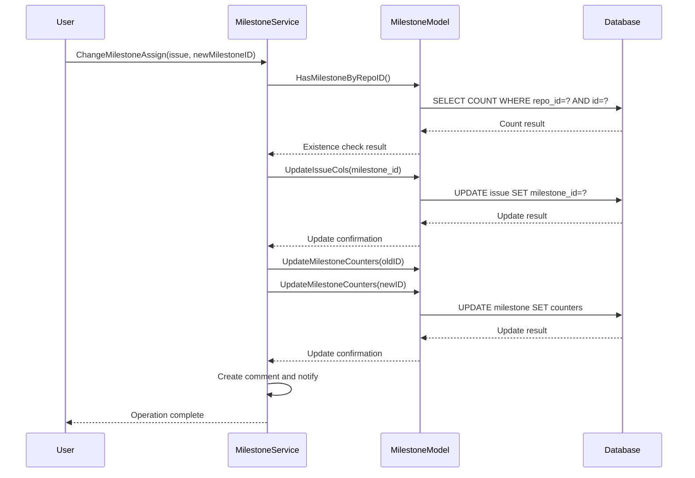
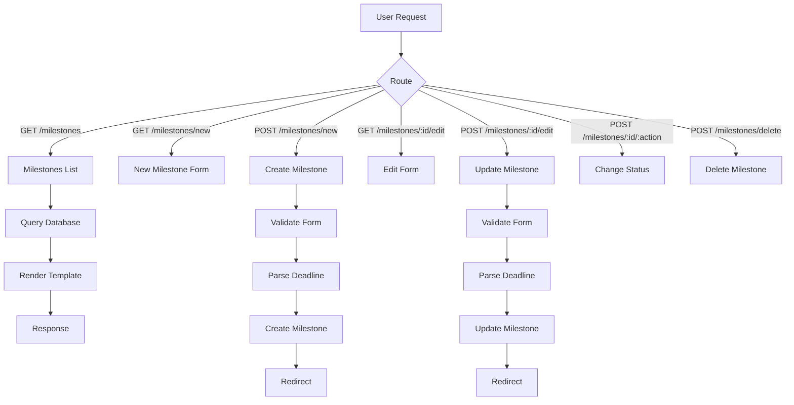
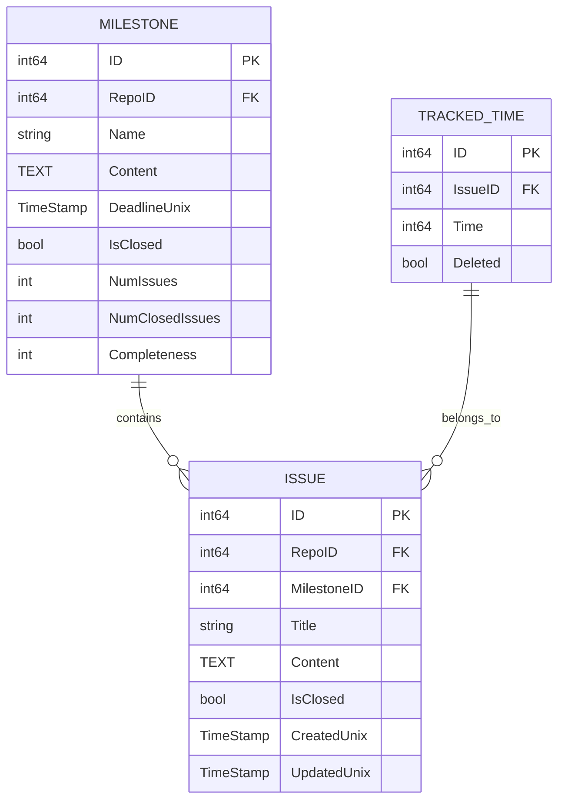

# Milestones

<cite>
**Referenced Files in This Document**   
- [models/issues/milestone.go](file://models/issues/milestone.go)
- [models/issues/milestone_list.go](file://models/issues/milestone_list.go)
- [services/issue/milestone.go](file://services/issue/milestone.go)
- [routers/web/repo/milestone.go](file://routers/web/repo/milestone.go)
- [modules/structs/issue_milestone.go](file://modules/structs/issue_milestone.go)
- [web_src/js/features/repo-milestone.ts](file://web_src/js/features/repo-milestone.ts)
</cite>

## Table of Contents
1. [Introduction](#introduction)
2. [Domain Model](#domain-model)
3. [Service Layer Logic](#service-layer-logic)
4. [Web Interface Management](#web-interface-management)
5. [Milestone and Issue Relationship](#milestone-and-issue-relationship)
6. [Common Issues](#common-issues)
7. [Performance Considerations](#performance-considerations)

## Introduction
Milestones in Gitea serve as time-based targets for managing the completion of issues and pull requests within repositories. They provide a structured way to organize work, set deadlines, and track progress across multiple issues. This document details the implementation of milestones, covering the domain model, service layer logic, web interface integration, and performance characteristics.

## Domain Model

The milestone domain model is defined in `models/issues/milestone.go` and represents a time-bound target for issue and pull request completion. Key fields include:

- **ID**: Unique identifier for the milestone
- **RepoID**: Reference to the repository containing the milestone
- **Name**: Title of the milestone (e.g., "v1.0 Release")
- **Content**: Description of the milestone's goals and scope
- **DeadlineUnix**: Unix timestamp representing the deadline
- **IsClosed**: Boolean indicating whether the milestone is completed
- **NumIssues**: Total number of issues associated with the milestone
- **NumClosedIssues**: Number of closed issues in the milestone
- **Completeness**: Calculated percentage of completion (0-100)
- **IsOverdue**: Computed field indicating if the milestone has passed its deadline

The model includes lifecycle hooks:
- `BeforeUpdate()`: Automatically calculates completeness percentage based on issue closure status
- `AfterLoad()`: Computes derived fields like `NumOpenIssues` and `DeadlineString` after database retrieval

Milestones are stored in the database with indexes on `RepoID`, `CreatedUnix`, `UpdatedUnix`, and `DeadlineUnix` to optimize query performance for repository-specific and time-based operations.

**Diagram sources**
- [models/issues/milestone.go](file://models/issues/milestone.go#L50-L100)

**Section sources**
- [models/issues/milestone.go](file://models/issues/milestone.go#L1-L342)

## Service Layer Logic

The service layer in `services/issue/milestone.go` handles business logic for milestone operations, particularly focusing on the relationship between milestones and issues. The primary function `ChangeMilestoneAssign()` manages the assignment of issues to milestones:

1. Validates that the target milestone exists within the repository
2. Updates the issue's milestone ID in the database
3. Recalculates counters for both the old and new milestone (if applicable)
4. Creates a system comment to record the milestone change
5. Triggers notifications to interested parties

The service layer uses database transactions to ensure data consistency during milestone reassignment. It also integrates with the notification system to inform users when issues are moved between milestones.

When milestone counters are updated, the system recalculates `NumIssues`, `NumClosedIssues`, and `Completeness` through SQL operations that count associated issues, ensuring accuracy across concurrent modifications.

**Diagram sources**
- [services/issue/milestone.go](file://services/issue/milestone.go#L1-L80)

**Section sources**
- [services/issue/milestone.go](file://services/issue/milestone.go#L1-L80)

## Web Interface Management

The web interface for milestone management is implemented in `routers/web/repo/milestone.go`, providing controllers for all milestone operations:

- **Milestones()**: Renders the milestone listing page with filtering by state (open/closed) and sorting options
- **NewMilestone()** and **NewMilestonePost()**: Handle creation of new milestones with form validation
- **EditMilestone()** and **EditMilestonePost()**: Manage milestone editing with input validation
- **ChangeMilestoneStatus()**: Toggles milestone status between open and closed
- **DeleteMilestone()**: Removes a milestone from the repository
- **MilestoneIssuesAndPulls()**: Displays all issues and pull requests associated with a milestone

The web interface integrates with client-side JavaScript in `web_src/js/features/repo-milestone.ts` to enhance the user experience, including functionality to clear deadline dates from the form. Date parsing is handled through `common.ParseDeadlineDateToEndOfDay()` which ensures deadlines are set to the end of the specified day in the server's timezone.

**Diagram sources**
- [routers/web/repo/milestone.go](file://routers/web/repo/milestone.go#L1-L273)
- [web_src/js/features/repo-milestone.ts](file://web_src/js/features/repo-milestone.ts#L1-L8)

**Section sources**
- [routers/web/repo/milestone.go](file://routers/web/repo/milestone.go#L1-L273)

## Milestone and Issue Relationship

Milestones are intrinsically linked to issues through the `milestone_id` foreign key in the issue table. The progress of a milestone is calculated based on the status of its associated issues:

- **Completeness**: Calculated as `(NumClosedIssues / NumIssues) * 100`
- **NumIssues**: Total count of issues assigned to the milestone
- **NumClosedIssues**: Count of issues with `is_closed = true`
- **NumOpenIssues**: Derived as `NumIssues - NumClosedIssues`

The system automatically updates these counters whenever:
1. An issue is created or deleted
2. An issue's milestone assignment changes
3. An issue's closed status changes
4. A milestone's status changes

For repositories with time tracking enabled, the `LoadTotalTrackedTime()` method calculates the total time spent on all issues within the milestone by summing the `tracked_time.time` values from associated issues.

**Diagram sources**
- [models/issues/milestone.go](file://models/issues/milestone.go#L50-L100)
- [models/issues/issue.go](file://models/issues/issue.go)

**Section sources**
- [models/issues/milestone.go](file://models/issues/milestone.go#L1-L342)
- [models/issues/milestone_list.go](file://models/issues/milestone_list.go#L1-L196)

## Common Issues

### Deadline Timezone Confusion
Milestone deadlines are stored as Unix timestamps, but the web interface displays them in the server's local timezone. This can lead to confusion when users in different timezones interpret the deadline. The system uses `common.ParseDeadlineDateToEndOfDay()` to set deadlines to 23:59:59 in the server's timezone, but does not provide timezone conversion for display.

### Milestone Completion Status Inconsistencies
In rare cases with high concurrency, milestone counters may become inconsistent due to race conditions between:
1. Multiple users closing issues simultaneously
2. Background processes updating milestone statistics
3. Database transaction isolation levels

The system mitigates this through transactional updates and the `UpdateMilestoneCounters()` function, but temporary discrepancies can occur during peak load.

## Performance Considerations

Milestone operations in repositories with large numbers of associated issues require careful performance consideration:

1. **Counter Updates**: The `UpdateMilestoneCounters()` function uses direct SQL aggregation to calculate issue counts, avoiding the need to load all issues into memory. This scales well with large issue volumes.

2. **Batch Operations**: When multiple issues are modified simultaneously (e.g., through bulk editing), the system should batch milestone counter updates to minimize database round trips.

3. **Indexing Strategy**: Database indexes on `milestone_id` and `is_closed` fields in the issue table ensure efficient counting operations even with hundreds of thousands of issues.

4. **Caching**: For repositories with very large issue volumes, consider implementing application-level caching of milestone statistics to reduce database load.

5. **Time Tracking**: The `LoadTotalTrackedTimes()` method in `MilestoneList` uses a single batch query to retrieve time tracking data for multiple milestones, optimizing performance when displaying multiple milestones.

The current implementation demonstrates good scalability characteristics, with counter updates executing in O(1) time regardless of the number of associated issues, thanks to the use of SQL aggregate functions rather than application-level iteration.

**Section sources**
- [models/issues/milestone.go](file://models/issues/milestone.go#L200-L250)
- [models/issues/milestone_list.go](file://models/issues/milestone_list.go#L100-L150)