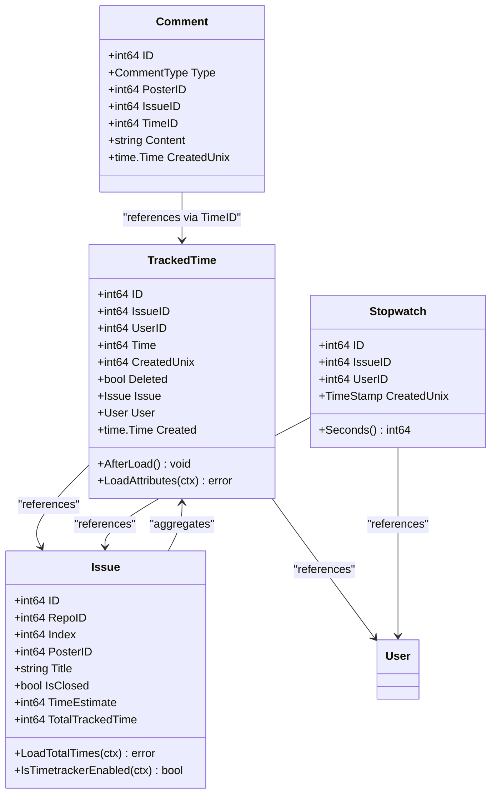
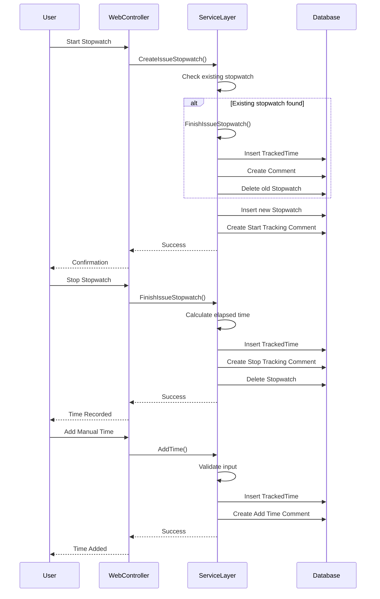
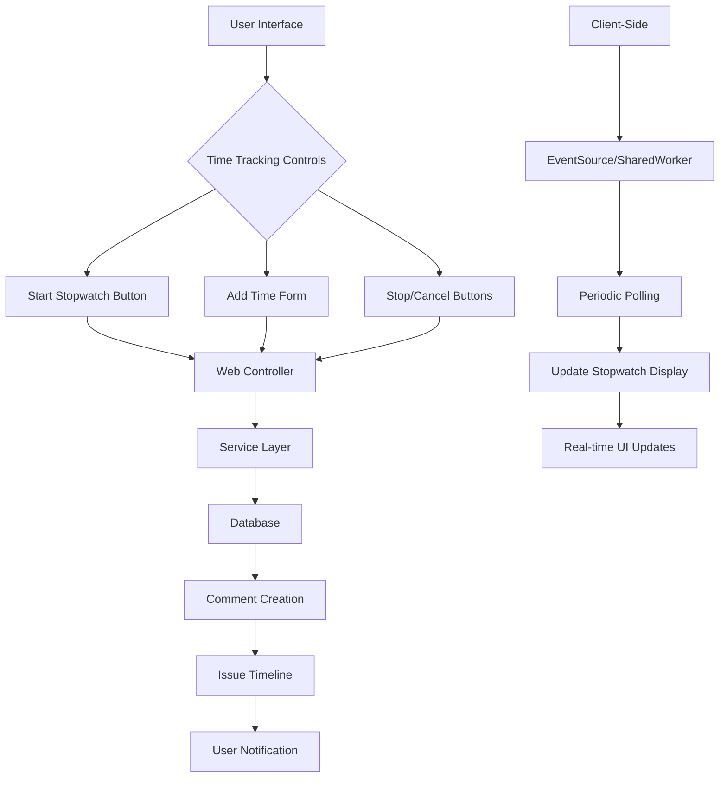

# Time Tracking

<cite>
**Referenced Files in This Document**   
- [models/issues/tracked_time.go](file://models/issues/tracked_time.go)
- [models/issues/stopwatch.go](file://models/issues/stopwatch.go)
- [routers/web/repo/issue_timetrack.go](file://routers/web/repo/issue_timetrack.go)
- [models/issues/issue.go](file://models/issues/issue.go)
- [models/issues/comment.go](file://models/issues/comment.go)
- [routers/api/v1/repo/issue_stopwatch.go](file://routers/api/v1/repo/issue_stopwatch.go)
- [web_src/js/features/stopwatch.ts](file://web_src/js/features/stopwatch.ts)
</cite>

## Table of Contents
1. [Introduction](#introduction)
2. [Domain Model](#domain-model)
3. [Service Layer Logic](#service-layer-logic)
4. [Web Interface Integration](#web-interface-integration)
5. [Issue Status and Permissions](#issue-status-and-permissions)
6. [Common Issues](#common-issues)
7. [Performance Considerations](#performance-considerations)
8. [Conclusion](#conclusion)

## Introduction
Time tracking in Gitea is a feature that allows users to record time spent on issues, either through manual entries or by using a stopwatch mechanism. This functionality enables teams to monitor effort, manage workloads, and generate reports on time investment across issues. The implementation spans multiple layers including data models, service logic, and web interface components. This document provides a comprehensive analysis of the time tracking system, detailing its architecture, domain model, service operations, user interface integration, permission model, and performance characteristics.

## Domain Model

The time tracking system in Gitea is built around two primary domain entities: `TrackedTime` and `Stopwatch`, both defined in the `models/issues` package. These entities represent the core data structures for recording and managing time spent on issues.

**Diagram sources**
- [models/issues/tracked_time.go](file://models/issues/tracked_time.go#L15-L40)
- [models/issues/stopwatch.go](file://models/issues/stopwatch.go#L15-L25)
- [models/issues/issue.go](file://models/issues/issue.go#L25-L70)
- [models/issues/comment.go](file://models/issues/comment.go#L150-L200)

### TrackedTime Entity
The `TrackedTime` struct represents a time entry that has been spent on a specific issue. It contains the following key fields:
- **ID**: Unique identifier for the time entry
- **IssueID**: Reference to the issue this time is associated with
- **UserID**: Reference to the user who recorded this time
- **Time**: Duration in seconds that was tracked
- **CreatedUnix**: Timestamp when this time entry was created
- **Deleted**: Soft delete flag to mark entries as removed without permanent deletion

The `TrackedTime` entity includes several methods for data loading and attribute management:
- `AfterLoad()`: Converts the Unix timestamp to a proper time.Time object using the default UI location
- `LoadAttributes(ctx)`: Loads associated Issue and User objects to provide full context
- The entity is designed to work with Gitea's soft delete pattern, where entries are marked as deleted rather than permanently removed from the database

### Stopwatch Entity
The `Stopwatch` struct represents an active time tracking session for a specific user and issue combination. Key aspects include:
- **ID**: Unique identifier for the stopwatch record
- **IssueID**: Reference to the issue being timed
- **UserID**: Reference to the user who started the stopwatch
- **CreatedUnix**: Timestamp when the stopwatch was started

The `Stopwatch` entity includes a `Seconds()` method that calculates the elapsed time since creation based on the current server time. This design ensures that time calculations are consistent across the system and not dependent on client-side clocks.

### Integration with Issue Entity
The `Issue` entity has direct integration with time tracking through several fields and methods:
- **TimeEstimate**: Stores the planned time for the issue in seconds
- **TotalTrackedTime**: Caches the sum of all tracked time entries for the issue
- **LoadTotalTimes(ctx)**: Method to calculate and load the total tracked time from associated `TrackedTime` entries
- **IsTimetrackerEnabled(ctx)**: Helper method to check if time tracking is enabled for the issue's repository

The integration between these entities creates a comprehensive time tracking system where stopwatches can be started and stopped to create tracked time entries, which are then aggregated at the issue level for reporting and display purposes.

**Section sources**
- [models/issues/tracked_time.go](file://models/issues/tracked_time.go#L15-L365)
- [models/issues/stopwatch.go](file://models/issues/stopwatch.go#L15-L235)
- [models/issues/issue.go](file://models/issues/issue.go#L25-L100)

## Service Layer Logic

The service layer for time tracking in Gitea handles the core business logic for managing time entries and stopwatch operations. This logic is primarily implemented in the `models/issues` package, with key functions that manage the lifecycle of time tracking activities.

**Diagram sources**
- [models/issues/stopwatch.go](file://models/issues/stopwatch.go#L139-L185)
- [models/issues/tracked_time.go](file://models/issues/tracked_time.go#L187-L200)
- [routers/web/repo/issue_timetrack.go](file://routers/web/repo/issue_timetrack.go#L15-L35)

### Stopwatch Management
The stopwatch functionality follows a strict single-instance-per-user pattern, ensuring that each user can only have one active stopwatch at a time. The `CreateIssueStopwatch` function implements this logic:

1. **Existing Stopwatch Check**: Before creating a new stopwatch, the system checks if the user already has an active stopwatch using `HasUserStopwatch`
2. **Automatic Stop**: If an existing stopwatch is found on a different issue, it is automatically stopped by calling `finishIssueStopwatch`, which creates a time entry and comment
3. **Prevent Duplicate Start**: The system prevents starting a stopwatch on an issue where one is already running by returning an error if the issue IDs match
4. **Database Operations**: The new stopwatch is inserted into the database, and a comment of type `CommentTypeStartTracking` is created to record the action in the issue timeline

When stopping a stopwatch via `FinishIssueStopwatch`, the system:
- Calculates the elapsed time by comparing the current time with the stopwatch creation time
- Creates a `TrackedTime` entry with the calculated duration
- Generates a comment of type `CommentTypeStopTracking` with the time worked
- Removes the stopwatch record from the database

### Manual Time Entry
The `AddTime` function handles manual time entries, allowing users to add specific time amounts to an issue:
- Accepts a time duration in seconds and an optional creation timestamp
- Creates a `TrackedTime` record with the specified duration
- Generates a comment of type `CommentTypeAddTimeManual` to document the manual entry
- Uses database transactions to ensure atomicity of the time entry and comment creation

The service layer also provides comprehensive query functionality through the `FindTrackedTimesOptions` struct, which supports filtering by:
- Issue ID
- User ID
- Repository ID
- Milestone ID
- Date ranges (created before/after)
- Pagination parameters

These options enable efficient retrieval of time tracking data for reporting and display purposes, with methods like `GetTrackedTimes`, `CountTrackedTimes`, and `GetTrackedSeconds` providing different views of the data.

**Section sources**
- [models/issues/stopwatch.go](file://models/issues/stopwatch.go#L139-L235)
- [models/issues/tracked_time.go](file://models/issues/tracked_time.go#L187-L365)

## Web Interface Integration

The web interface for time tracking in Gitea is implemented through a combination of server-side controllers and client-side JavaScript, providing a seamless user experience for managing time entries and stopwatches.

**Diagram sources**
- [routers/web/repo/issue_timetrack.go](file://routers/web/repo/issue_timetrack.go#L15-L119)
- [web_src/js/features/stopwatch.ts](file://web_src/js/features/stopwatch.ts#L7-L153)
- [routers/api/v1/repo/issue_stopwatch.go](file://routers/api/v1/repo/issue_stopwatch.go#L15-L235)

### Server-Side Controllers
The web interface integration is primarily handled by controllers in the `routers/web/repo` package. The `issue_timetrack.go` file contains three key endpoints:

1. **AddTimeManually**: Handles manual time entry submissions
   - Validates user input for hours and minutes
   - Ensures the time entry is positive
   - Calls the `AddTime` service function to create the time entry
   - Returns appropriate JSON responses for success or error conditions

2. **DeleteTime**: Handles deletion of time entries
   - Verifies the user has permission to delete the time entry (either the original poster or site admin)
   - Calls the `DeleteTime` service function to remove the entry
   - Provides user feedback through flash messages

3. **UpdateIssueTimeEstimate**: Manages time estimates for issues
   - Validates the time estimate format
   - Updates the issue's `TimeEstimate` field through the service layer
   - Creates appropriate comments to document changes

These controllers integrate with Gitea's permission system through the `CanUseTimetracker` method, which checks whether the current user has the necessary permissions to use time tracking on the given issue.

### Client-Side Implementation
The client-side time tracking functionality is implemented in `web_src/js/features/stopwatch.ts`, which provides real-time updates and interactive controls:

1. **Initialization**: The `initStopwatch` function sets up the stopwatch UI elements and determines the update mechanism to use
2. **Update Mechanisms**: The system supports two update mechanisms:
   - **EventSource with SharedWorker**: For browsers that support these technologies, providing real-time updates with minimal server load
   - **Periodic Polling**: A fallback mechanism for older browsers, with adaptive timeout intervals that increase when no stopwatch is active

3. **UI Updates**: The `updateStopwatchData` function processes stopwatch data and updates the DOM:
   - Shows or hides stopwatch controls based on active timers
   - Updates the displayed time in hours or minutes format
   - Sets appropriate URLs for stop and cancel actions
   - Updates issue references in the UI

The client-side code also handles edge cases such as worker errors, message deserialization issues, and logout events, ensuring a robust user experience across different browser environments.

**Section sources**
- [routers/web/repo/issue_timetrack.go](file://routers/web/repo/issue_timetrack.go#L15-L119)
- [web_src/js/features/stopwatch.ts](file://web_src/js/features/stopwatch.ts#L7-L153)
- [routers/api/v1/repo/issue_stopwatch.go](file://routers/api/v1/repo/issue_stopwatch.go#L15-L235)

## Issue Status and Permissions

The time tracking system in Gitea integrates closely with issue status and user permissions, ensuring that time recording activities are properly controlled and documented within the context of the overall issue management workflow.

### Permission Model
Access to time tracking functionality is governed by a multi-layered permission system that considers both repository-level settings and user roles:

1. **Repository Configuration**: Time tracking must be enabled at the repository level before any time tracking operations can occur
2. **User Permissions**: The `CanUseTimetracker` method checks whether the current user has sufficient permissions, typically requiring:
   - Write access to issues or pull requests
   - Or specific time tracking permissions if configured

3. **Time Entry Deletion**: Deletion of time entries has stricter requirements:
   - Only the original poster of the time entry can delete it
   - Site administrators have override privileges
   - This prevents unauthorized modification of time records

The permission checks are implemented consistently across both web and API controllers, ensuring uniform access control regardless of the interface used.

### Issue Status Integration
Time tracking activities are closely tied to the status of issues through several mechanisms:

1. **Comment Integration**: All time tracking operations generate comments in the issue timeline:
   - Starting a stopwatch creates a `CommentTypeStartTracking` entry
   - Stopping a stopwatch creates a `CommentTypeStopTracking` entry with the duration
   - Manual time entries create `CommentTypeAddTimeManual` entries
   - These comments provide an audit trail of all time tracking activities

2. **Status Transitions**: When an issue is closed, any active stopwatch is automatically stopped, and the time is recorded. This ensures that all work is properly accounted for before an issue is considered complete.

3. **Time Estimation**: Issues support time estimation through the `TimeEstimate` field, which can be updated independently of actual time tracking. Changes to time estimates are recorded with `CommentTypeChangeTimeEstimate` comments, providing visibility into planning adjustments.

The integration between time tracking and issue status ensures that time recording is not an isolated activity but an integral part of the issue management workflow, with proper documentation and audit trails for all time-related operations.

**Section sources**
- [routers/web/repo/issue_timetrack.go](file://routers/web/repo/issue_timetrack.go#L25-L35)
- [models/issues/comment.go](file://models/issues/comment.go#L80-L100)
- [models/issues/issue.go](file://models/issues/issue.go#L100-L120)

## Common Issues

Despite the robust design of Gitea's time tracking system, several common issues can arise in practice, particularly related to synchronization, permissions, and data consistency.

### Stopwatch Synchronization Problems
The most common issue involves stopwatch synchronization, particularly in environments with high latency or unreliable network connections:

1. **Client-Server Time Drift**: Since the stopwatch duration is calculated server-side based on the creation timestamp, significant time differences between client and server clocks can lead to inaccurate time recording
2. **Network Latency**: Delays in API requests can cause perceived lag between user actions and UI updates, potentially leading to users attempting to start multiple stopwatches
3. **Browser Tab Inactivity**: Modern browsers may throttle JavaScript execution in inactive tabs, affecting the accuracy of client-side stopwatch displays

The system mitigates these issues through its server-side time calculation approach, which ensures that time recording is based on server time rather than potentially unreliable client clocks.

### Time Entry Permission Errors
Permission-related issues are another common category:

1. **Insufficient Repository Permissions**: Users may attempt to track time on issues without having the necessary write permissions, resulting in access denied errors
2. **Time Tracking Disabled**: Repository administrators may disable time tracking, preventing all time recording activities
3. **Deletion Restrictions**: Users may attempt to delete time entries they did not create, triggering permission errors

These issues are typically resolved by ensuring proper repository configuration and user role assignments.

### Data Consistency Issues
Several potential data consistency problems can occur:

1. **Orphaned Stopwatch Records**: In rare cases of system failure, stopwatch records may not be properly cleaned up, preventing users from starting new stopwatches
2. **Duplicate Time Entries**: Concurrent requests could potentially create duplicate time entries, though the transactional design minimizes this risk
3. **Cache Invalidation**: The `TotalTrackedTime` cache on issues may become stale if time entries are modified outside the normal workflow

The system addresses these through transactional operations, soft deletes for time entries, and periodic cache validation mechanisms.

**Section sources**
- [models/issues/stopwatch.go](file://models/issues/stopwatch.go#L139-L185)
- [routers/web/repo/issue_timetrack.go](file://routers/web/repo/issue_timetrack.go#L45-L65)
- [models/issues/tracked_time.go](file://models/issues/tracked_time.go#L250-L290)

## Performance Considerations

The time tracking system in Gitea has been designed with performance in mind, particularly for operations that may involve large numbers of issues and users. Several optimization strategies are employed to ensure efficient operation at scale.

### Database Query Optimization
The system uses several techniques to optimize database queries:

1. **Indexed Fields**: Critical fields like `IssueID`, `UserID`, and `CreatedUnix` are indexed to enable fast lookups
2. **Batch Operations**: When retrieving time tracking data for multiple issues, the system uses batch queries to minimize database round trips
3. **Pagination Support**: List operations support pagination through the `ListOptions` structure, preventing memory issues with large result sets
4. **Conditional Joins**: The `FindTrackedTimesOptions` struct only joins with the issue table when necessary (e.g., when filtering by repository or milestone), reducing query complexity

### Caching Strategy
A multi-layered caching approach improves performance:

1. **Issue-Level Caching**: The `TotalTrackedTime` field on the Issue entity caches the sum of all tracked time entries, avoiding repeated aggregation queries
2. **Attribute Loading**: The `LoadAttributes` method on `TrackedTime` loads associated Issue and User objects in a single operation, reducing the number of database queries
3. **Client-Side Caching**: The browser-based stopwatch implementation uses adaptive polling intervals, reducing server load when no stopwatches are active

### Scalability Features
The system includes several features to support scalability:

1. **Chunked Processing**: For operations involving large numbers of issues, the system processes data in chunks to avoid memory exhaustion
2. **Asynchronous Operations**: Time tracking operations are designed to complete quickly, with minimal blocking operations
3. **Efficient Data Structures**: The use of maps and sets for aggregating time data by user ensures O(1) lookup times

These performance considerations ensure that the time tracking system remains responsive and efficient even in repositories with thousands of issues and hundreds of users actively tracking their time.

**Section sources**
- [models/issues/tracked_time.go](file://models/issues/tracked_time.go#L300-L365)
- [models/issues/issue.go](file://models/issues/issue.go#L100-L120)
- [models/issues/stopwatch.go](file://models/issues/stopwatch.go#L100-L120)

## Conclusion
Gitea's time tracking system provides a comprehensive solution for recording and managing time spent on issues, combining a robust domain model with efficient service logic and an intuitive web interface. The system's architecture balances data integrity with performance, using server-side time calculation to ensure accuracy while providing real-time client updates through efficient polling mechanisms. The integration with issue status and user permissions ensures that time tracking is a well-governed part of the overall issue management workflow, with proper audit trails and access controls. While some common issues related to synchronization and permissions may arise, the system's design minimizes their impact through careful transaction management and clear error handling. The performance optimizations, including indexing, caching, and chunked processing, ensure that the system remains effective even at scale. Overall, Gitea's time tracking implementation provides a solid foundation for teams to monitor their work and improve their project management practices.