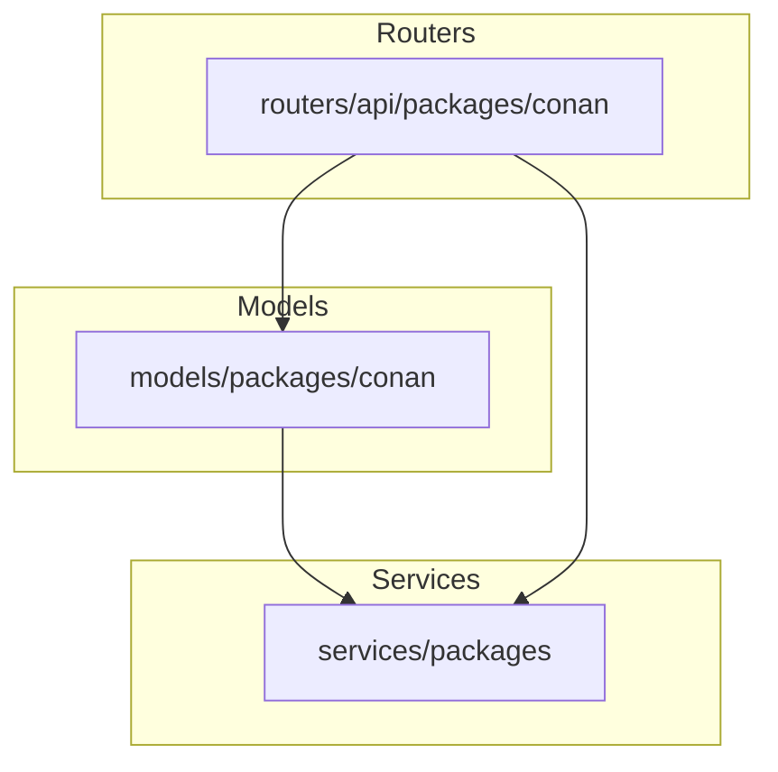
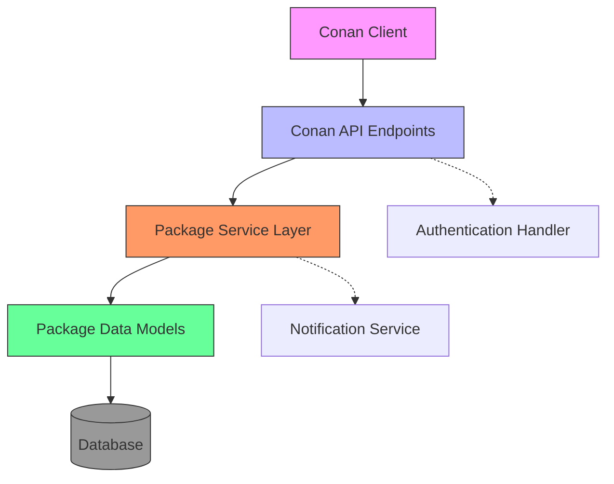
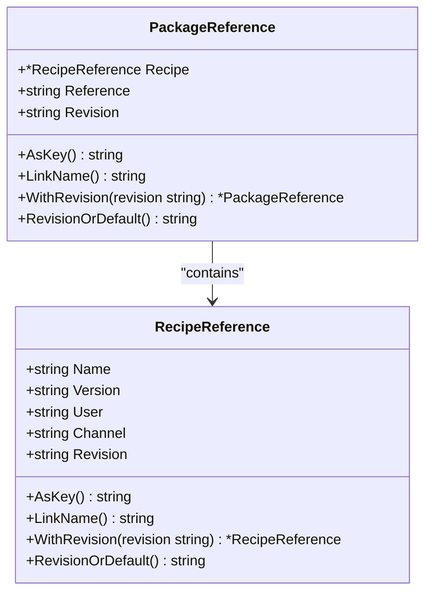
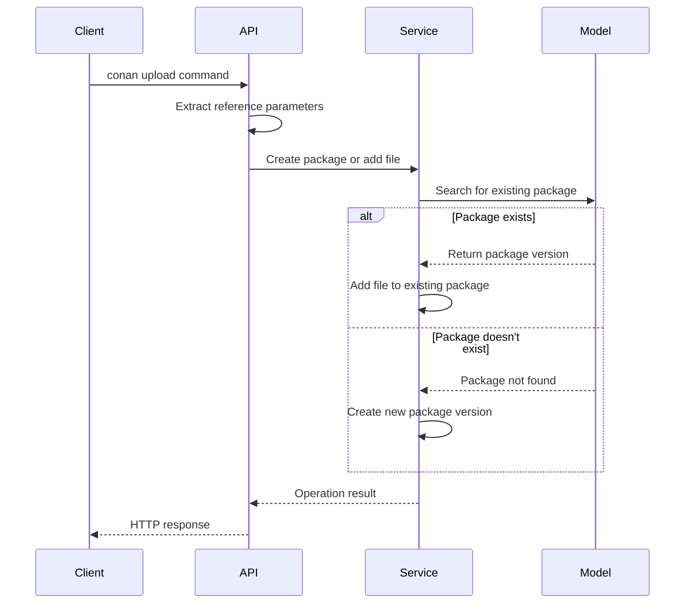
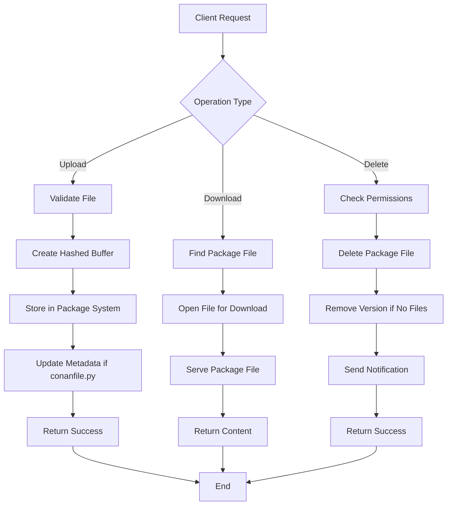
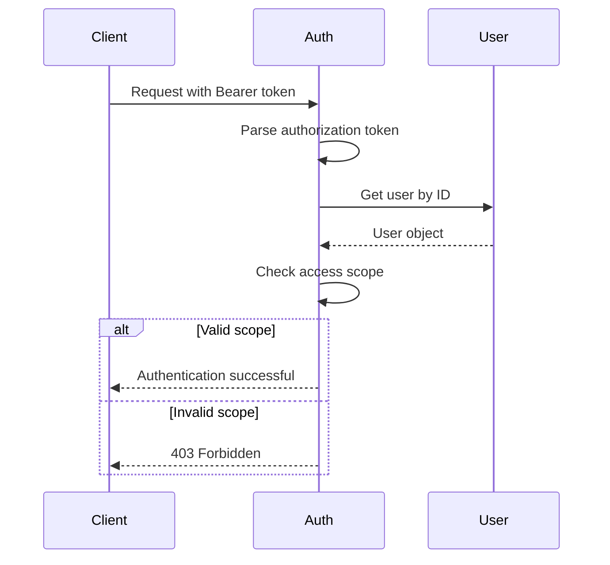
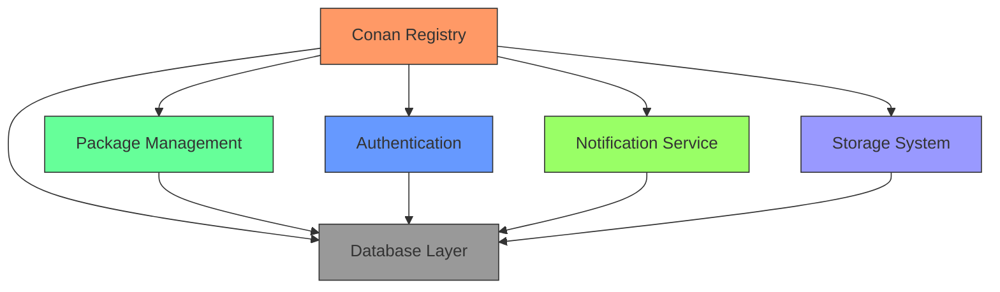

# Conan Registry

<cite>
**Referenced Files in This Document**   
- [references.go](file://models/packages/conan/references.go)
- [search.go](file://models/packages/conan/search.go)
- [conan.go](file://routers/api/packages/conan/conan.go)
- [auth.go](file://routers/api/packages/conan/auth.go)
- [search.go](file://routers/api/packages/conan/search.go)
- [api.go](file://routers/api/packages/api.go)
</cite>

## Table of Contents
1. [Introduction](#introduction)
2. [Project Structure](#project-structure)
3. [Core Components](#core-components)
4. [Architecture Overview](#architecture-overview)
5. [Detailed Component Analysis](#detailed-component-analysis)
6. [Dependency Analysis](#dependency-analysis)
7. [Performance Considerations](#performance-considerations)
8. [Troubleshooting Guide](#troubleshooting-guide)
9. [Conclusion](#conclusion)

## Introduction
This document provides a comprehensive overview of the Conan package registry implementation within Gitea. It details the Conan-specific reference parsing, recipe and binary package management, service layer integration with the core package model, and configuration options. The document explains how Conan packages are published and consumed, the relationship between Conan references and Gitea repository structures, common issues, and optimization techniques.

## Project Structure
The Conan package registry implementation is organized within the Gitea codebase with specific directories for models, routers, and services. The core Conan functionality is located in the `models/packages/conan` directory, with API endpoints defined in `routers/api/packages/conan`. The implementation follows a modular structure that separates concerns between data models, API handlers, and business logic.

**Diagram sources**
- [references.go](file://models/packages/conan/references.go)
- [conan.go](file://routers/api/packages/conan/conan.go)
- [api.go](file://routers/api/packages/api.go)

**Section sources**
- [references.go](file://models/packages/conan/references.go)
- [search.go](file://models/packages/conan/search.go)

## Core Components
The Conan registry implementation consists of several core components that work together to provide package management functionality. These include reference parsing, recipe management, binary package handling, authentication, and search capabilities. The implementation integrates with Gitea's core package model while providing Conan-specific features such as revision management and property-based filtering.

**Section sources**
- [references.go](file://models/packages/conan/references.go#L1-L170)
- [conan.go](file://routers/api/packages/conan/conan.go#L1-L830)

## Architecture Overview
The Conan registry architecture follows a layered approach with clear separation between the API layer, service layer, and data models. The API layer handles HTTP requests and responses according to the Conan client protocol, while the service layer implements business logic and interacts with the core package management system. The data models provide Conan-specific functionality for reference parsing and property management.

**Diagram sources**
- [conan.go](file://routers/api/packages/conan/conan.go#L1-L830)
- [auth.go](file://routers/api/packages/conan/auth.go#L1-L45)

## Detailed Component Analysis

### Conan Reference Parsing
The Conan reference parsing implementation handles the complex reference format used by Conan packages, which includes name, version, user, channel, and revision components. The system validates references and extracts their components for use in package management operations.

**Diagram sources**
- [references.go](file://models/packages/conan/references.go#L1-L170)

**Section sources**
- [references.go](file://models/packages/conan/references.go#L1-L170)

### Recipe and Package Management
The recipe and package management system implements the core functionality for handling Conan recipes and binary packages. This includes creating, updating, and deleting recipes and packages, as well as managing their revisions and associated files.

**Diagram sources**
- [conan.go](file://routers/api/packages/conan/conan.go#L1-L830)
- [references.go](file://models/packages/conan/references.go#L1-L170)

**Section sources**
- [conan.go](file://routers/api/packages/conan/conan.go#L1-L830)

### Binary Package Handling
The binary package handling system manages the storage and retrieval of Conan binary packages, including conaninfo.txt, conan_package.tgz, and other package files. The implementation supports upload, download, and deletion operations for package files.

**Diagram sources**
- [conan.go](file://routers/api/packages/conan/conan.go#L1-L830)

**Section sources**
- [conan.go](file://routers/api/packages/conan/conan.go#L1-L830)

### Authentication and Authorization
The authentication system for the Conan registry integrates with Gitea's package authentication framework, allowing users to authenticate using bearer tokens and ensuring proper access control for package operations.

**Diagram sources**
- [auth.go](file://routers/api/packages/conan/auth.go#L1-L45)

**Section sources**
- [auth.go](file://routers/api/packages/conan/auth.go#L1-L45)

## Dependency Analysis
The Conan registry implementation has dependencies on several core Gitea components, including the package management system, database layer, and authentication framework. These dependencies enable the Conan-specific functionality while leveraging Gitea's existing infrastructure.

**Diagram sources**
- [conan.go](file://routers/api/packages/conan/conan.go#L1-L830)
- [references.go](file://models/packages/conan/references.go#L1-L170)

**Section sources**
- [conan.go](file://routers/api/packages/conan/conan.go#L1-L830)
- [references.go](file://models/packages/conan/references.go#L1-L170)

## Performance Considerations
The Conan registry implementation includes several performance optimizations for handling large binary packages and high-volume operations. These include efficient database queries for reference lookups, streaming file operations to minimize memory usage, and caching mechanisms for frequently accessed data.

When managing large binary packages, the system uses hashed buffers to compute file checksums during upload without loading the entire file into memory. The property-based filtering system allows for efficient searching of packages based on user, channel, and revision attributes without requiring full text searches.

**Section sources**
- [conan.go](file://routers/api/packages/conan/conan.go#L1-L830)
- [references.go](file://models/packages/conan/references.go#L1-L170)

## Troubleshooting Guide
This section provides guidance for troubleshooting common issues with the Conan registry implementation.

### Reference Parsing Errors
Reference parsing errors typically occur when the Conan reference format is invalid. Ensure that references follow the format `name/version@user/channel` and that all components are properly URL-encoded when used in API requests.

### Package Upload Conflicts
Package upload conflicts may occur when attempting to upload a file that already exists. The system supports overwriting existing files, but this requires appropriate permissions. Check that the user has write access to the package and that the overwrite flag is set.

### Remote Configuration Issues
Remote configuration issues often stem from incorrect URL formatting or authentication problems. Verify that the remote URL points to the correct Gitea instance and that the authentication token has the necessary package access scopes.

### Search Functionality Problems
Search functionality may return unexpected results if wildcards are not properly handled. The search system supports wildcards (*) in queries, but these must be used appropriately in the search parameters.

**Section sources**
- [conan.go](file://routers/api/packages/conan/conan.go#L1-L830)
- [search.go](file://routers/api/packages/conan/search.go#L1-L164)
- [references.go](file://models/packages/conan/references.go#L1-L170)

## Conclusion
The Conan registry implementation in Gitea provides a comprehensive package management solution that integrates seamlessly with the Conan client. The system handles reference parsing, recipe and binary package management, and authentication while leveraging Gitea's core package infrastructure. The modular architecture allows for efficient operations and easy maintenance, making it a robust solution for hosting Conan packages within Gitea instances.