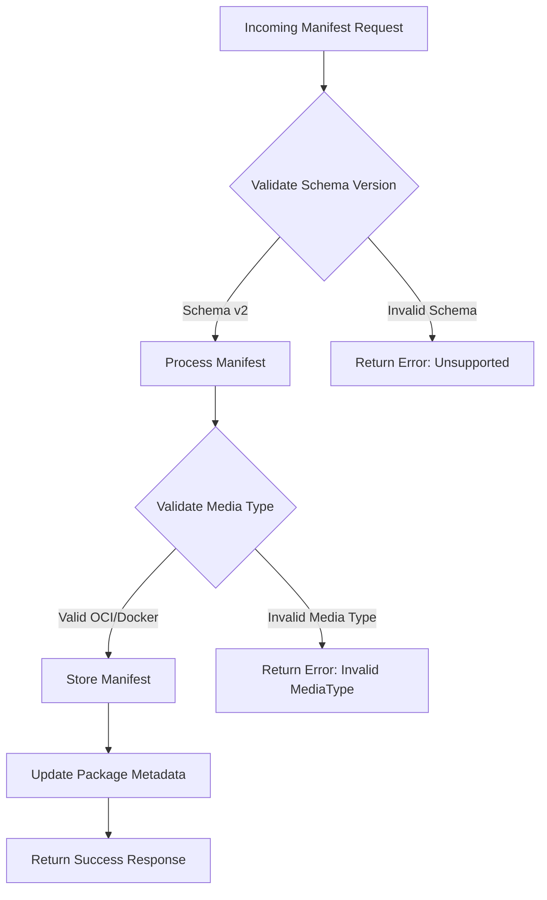
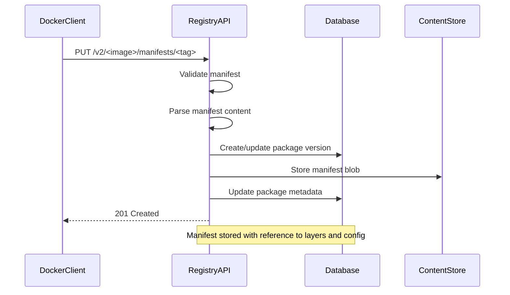
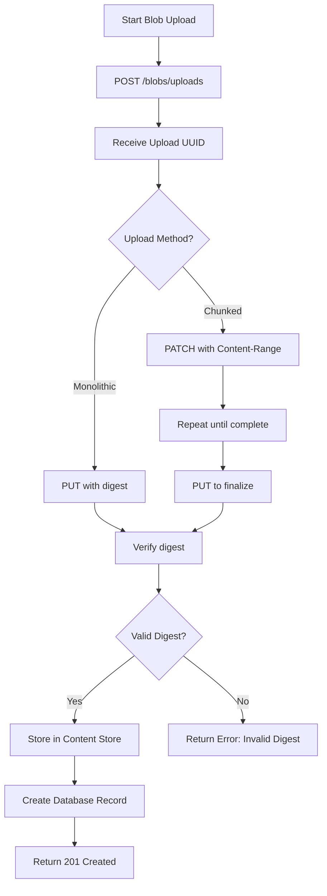
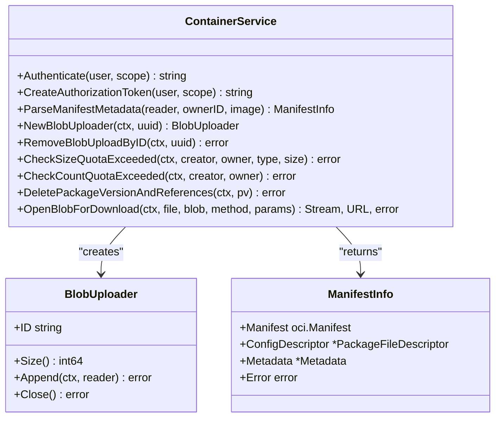
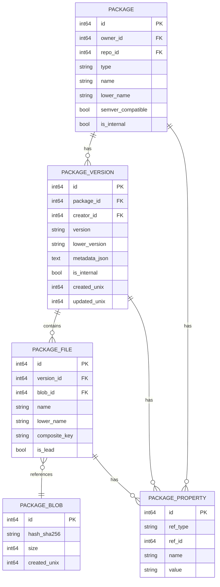
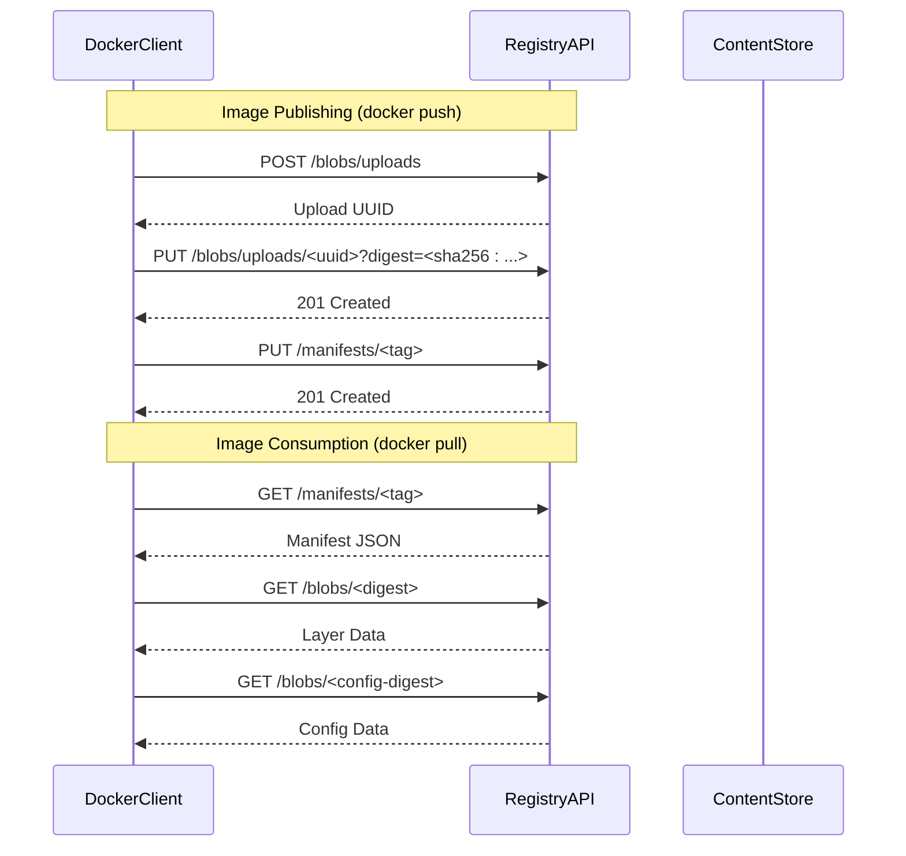
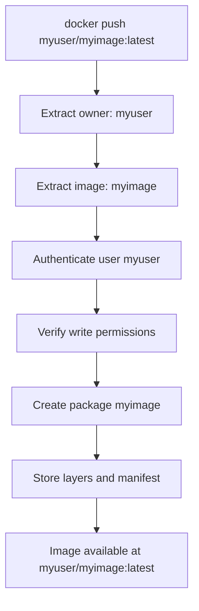
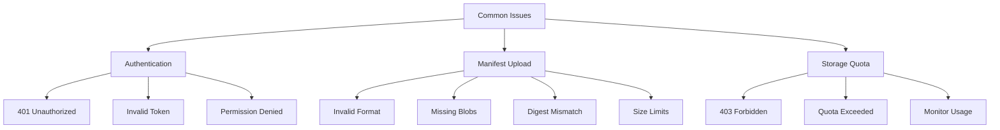
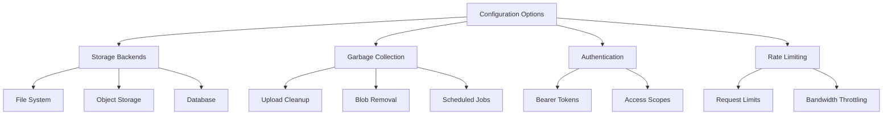
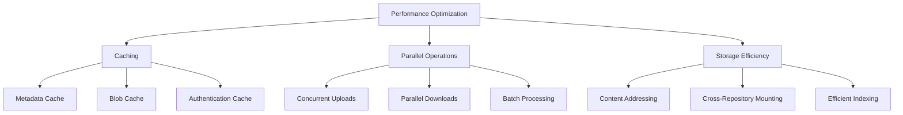

# Container Registry (OCI)

<cite>
**Referenced Files in This Document**   
- [container.go](file://routers/api/packages/container/container.go)
- [manifest.go](file://routers/api/packages/container/manifest.go)
- [blob.go](file://routers/api/packages/container/blob.go)
- [metadata.go](file://modules/packages/container/metadata.go)
- [const.go](file://modules/packages/container/const.go)
- [package.go](file://models/packages/package.go)
- [container_test.go](file://tests/integration/api_packages_container_test.go)
</cite>

## Table of Contents
1. [Introduction](#introduction)
2. [OCI Image Format Handling](#oci-image-format-handling)
3. [Manifest Management](#manifest-management)
4. [Layer Storage Mechanisms](#layer-storage-mechanisms)
5. [Container Service Layer Implementation](#container-service-layer-implementation)
6. [Integration with Core Package Model](#integration-with-core-package-model)
7. [Image Publishing and Consumption](#image-publishing-and-consumption)
8. [Image Names and Repository Namespaces](#image-names-and-repository-namespaces)
9. [Common Issues and Troubleshooting](#common-issues-and-troubleshooting)
10. [Configuration Options](#configuration-options)
11. [Performance Optimization](#performance-optimization)

## Introduction
The Container Registry (OCI) implementation in Gitea provides a comprehensive solution for managing OCI-compliant container images. This document details the architecture, implementation, and operational aspects of the container registry, focusing on OCI image format handling, manifest management, layer storage, and integration with the core package model. The registry supports standard Docker client operations such as `docker push` and `docker pull`, while providing robust authentication, storage management, and performance optimization features.

## OCI Image Format Handling
The container registry implementation supports the Open Container Initiative (OCI) image format specification, enabling compatibility with standard Docker clients and OCI-compliant tools. The system handles both OCI image manifests and Docker distribution manifests, ensuring broad compatibility across container ecosystems.

The implementation validates incoming manifests against the OCI specification, supporting schema version 2 with proper media type recognition. The registry accepts manifests with media types `application/vnd.oci.image.manifest.v1+json` and `application/vnd.docker.distribution.manifest.v2+json`, ensuring interoperability with various container tools.

**Diagram sources**
- [container.go](file://routers/api/packages/container/container.go#L516-L558)
- [manifest.go](file://routers/api/packages/container/manifest.go#L42-L85)

**Section sources**
- [container.go](file://routers/api/packages/container/container.go#L516-L558)
- [manifest.go](file://routers/api/packages/container/manifest.go#L42-L85)
- [metadata.go](file://modules/packages/container/metadata.go#L51-L79)

## Manifest Management
The manifest management system handles the creation, retrieval, and deletion of container image manifests according to the OCI distribution specification. The implementation supports both single image manifests and image indexes (manifest lists), enabling multi-architecture image support.

When a manifest is pushed to the registry, the system performs the following operations:
1. Validates the manifest structure and schema version
2. Processes the manifest content to extract configuration and layer information
3. Creates or updates the corresponding package version in the database
4. Stores the manifest blob in the content store
5. Updates package metadata with manifest details

For image indexes, the system processes each referenced manifest, storing platform-specific information and creating relationships between the index and individual manifests.

**Diagram sources**
- [manifest.go](file://routers/api/packages/container/manifest.go#L109-L146)
- [container.go](file://routers/api/packages/container/container.go#L516-L558)

**Section sources**
- [manifest.go](file://routers/api/packages/container/manifest.go#L109-L146)
- [container.go](file://routers/api/packages/container/container.go#L516-L558)
- [metadata.go](file://modules/packages/container/metadata.go#L51-L79)

## Layer Storage Mechanisms
The layer storage system implements the OCI distribution specification for blob handling, supporting both monolithic uploads and chunked uploads for large layers. The implementation uses a content-addressable storage model where each blob is identified by its SHA-256 digest.

The storage workflow includes:
1. Blob upload initiation with POST to `/blobs/uploads`
2. Optional chunked upload with PATCH requests
3. Finalization with PUT request containing the digest
4. Content verification and storage in the content store
5. Database record creation linking the blob to the package

The system supports cross-repository blob mounting, allowing efficient copying of layers between repositories without data transfer. This optimization reduces storage requirements and improves push performance when images share common layers.

**Diagram sources**
- [blob.go](file://routers/api/packages/container/blob.go#L87-L170)
- [container.go](file://routers/api/packages/container/container.go#L127-L205)

**Section sources**
- [blob.go](file://routers/api/packages/container/blob.go#L87-L170)
- [container.go](file://routers/api/packages/container/container.go#L127-L205)

## Container Service Layer Implementation
The container service layer provides the business logic for container registry operations, implementing the OCI distribution API endpoints. The service layer sits between the HTTP API handlers and the data access layer, orchestrating operations across multiple components.

Key components of the service layer include:
- Authentication and authorization handlers
- Manifest processing and validation
- Blob upload management
- Package version creation and metadata management
- Storage quota enforcement

The service layer uses transactional operations to ensure data consistency, particularly during manifest creation where multiple database operations must succeed or fail together. Global locks are employed to prevent race conditions when creating packages and versions.

**Diagram sources**
- [container.go](file://routers/api/packages/container/container.go#L86-L127)
- [blob.go](file://routers/api/packages/container/blob.go#L87-L170)
- [manifest.go](file://routers/api/packages/container/manifest.go#L109-L146)

**Section sources**
- [container.go](file://routers/api/packages/container/container.go#L86-L127)
- [blob.go](file://routers/api/packages/container/blob.go#L87-L170)
- [manifest.go](file://routers/api/packages/container/manifest.go#L109-L146)

## Integration with Core Package Model
The container registry integrates with Gitea's core package model through the packages system, leveraging the generic package storage and metadata framework. Container images are stored as packages of type "container", with versions representing image tags or digests.

The integration points include:
- Package creation and version management
- Blob storage in the content store
- Property system for storing container-specific metadata
- Quota management for storage limits
- Access control through package permissions

Each container image is represented as a package with properties including the repository name, digest, media type, and manifest references. The package version stores the image metadata, including platform information, labels, and layer history.

**Diagram sources**
- [package.go](file://models/packages/package.go#L0-L351)
- [container.go](file://routers/api/packages/container/container.go#L228-L260)
- [blob.go](file://routers/api/packages/container/blob.go#L127-L170)

**Section sources**
- [package.go](file://models/packages/package.go#L0-L351)
- [container.go](file://routers/api/packages/container/container.go#L228-L260)
- [blob.go](file://routers/api/packages/container/blob.go#L127-L170)

## Image Publishing and Consumption
The container registry supports standard Docker client operations for publishing and consuming container images. Users can push images using `docker push` and pull them using `docker pull`, with the registry implementing the full OCI distribution API.

### Image Publishing Process
When publishing an image via `docker push`:
1. The client authenticates and receives a bearer token
2. The client uploads each layer (blob) to the registry
3. The client uploads the image configuration blob
4. The client pushes the manifest referencing the layers and config
5. The registry validates and stores the complete image

### Image Consumption Process
When consuming an image via `docker pull`:
1. The client authenticates and receives a bearer token
2. The client retrieves the manifest for the requested tag or digest
3. The client downloads each referenced layer in parallel
4. The client downloads the image configuration
5. The client assembles the image locally

**Diagram sources**
- [container.go](file://routers/api/packages/container/container.go#L516-L558)
- [blob.go](file://routers/api/packages/container/blob.go#L87-L170)
- [container_test.go](file://tests/integration/api_packages_container_test.go#L495-L526)

**Section sources**
- [container.go](file://routers/api/packages/container/container.go#L516-L558)
- [blob.go](file://routers/api/packages/container/blob.go#L87-L170)
- [container_test.go](file://tests/integration/api_packages_container_test.go#L495-L526)

## Image Names and Repository Namespaces
The container registry maps container image names to Gitea repository namespaces following a structured naming convention. Image names are derived from the combination of the owner's username and the image name, creating a hierarchical namespace similar to Docker Hub.

The naming pattern follows the format `<owner>/<image>`, where:
- `<owner>` is the username or organization name
- `<image>` is the repository name within the owner's namespace

The system validates image names using a regular expression pattern that allows lowercase letters, digits, and separators (`-`, `.`, `_`) in specific positions. This ensures compatibility with container ecosystem conventions while preventing invalid characters.

When a user pushes an image to `myuser/myimage`, the registry:
1. Authenticates the user and verifies write permissions
2. Creates a container package with name `myimage` owned by `myuser`
3. Stores the image layers and manifest in the package version
4. Makes the image available for pull operations

**Diagram sources**
- [container.go](file://routers/api/packages/container/container.go#L42-L84)
- [container.go](file://routers/api/packages/container/container.go#L228-L260)
- [metadata.go](file://modules/packages/container/metadata.go#L0-L49)

**Section sources**
- [container.go](file://routers/api/packages/container/container.go#L42-L84)
- [container.go](file://routers/api/packages/container/container.go#L228-L260)
- [metadata.go](file://modules/packages/container/metadata.go#L0-L49)

## Common Issues and Troubleshooting
This section addresses common issues encountered when using the container registry and provides troubleshooting guidance.

### Authentication Challenges
Authentication issues typically occur when users fail to authenticate properly with the registry. The registry uses bearer token authentication, requiring users to authenticate via the `/v2/token` endpoint.

Common symptoms and solutions:
- **401 Unauthorized responses**: Ensure the user has valid credentials and the registry URL is correct
- **Invalid token errors**: Regenerate the authentication token and retry the operation
- **Permission denied**: Verify the user has write permissions for publishing or read permissions for pulling

### Manifest Upload Failures
Manifest upload failures can occur due to various reasons:
- **Invalid manifest format**: Ensure the manifest follows OCI specification with schema version 2
- **Missing referenced blobs**: Upload all layers and config blobs before pushing the manifest
- **Digest mismatch**: Verify the manifest digest matches the calculated SHA-256 hash
- **Size limits**: Manifests are limited to 10MB; split large manifests into multiple images

### Storage Quota Management
The registry enforces storage quotas at multiple levels:
- Total storage quota for the instance
- Per-user storage quota
- Per-package type storage quota

When quota limits are exceeded, users receive 403 Forbidden responses. Administrators can configure quota limits in the system settings, and users can monitor their usage through the web interface.

**Section sources**
- [container.go](file://routers/api/packages/container/container.go#L86-L127)
- [container.go](file://routers/api/packages/container/container.go#L516-L558)
- [blob.go](file://routers/api/packages/container/blob.go#L87-L170)

## Configuration Options
The container registry provides several configuration options to customize its behavior and integrate with different storage backends.

### Storage Backends
The registry supports multiple storage backends through the content store interface:
- **File system storage**: Default backend storing blobs on the local file system
- **Object storage**: Integration with S3-compatible object storage services
- **Database storage**: Storing blobs in the database (not recommended for production)

Storage configuration is managed through the `app.ini` file, allowing administrators to specify the storage backend and associated parameters.

### Garbage Collection
The registry includes garbage collection functionality to remove unused blobs and optimize storage:
- Automatic cleanup of incomplete blob uploads after a configurable timeout
- Removal of unreferenced blobs when packages are deleted
- Scheduled cleanup jobs to optimize storage usage

Garbage collection settings can be configured to balance storage efficiency with performance requirements.

**Section sources**
- [container.go](file://routers/api/packages/container/container.go#L86-L127)
- [blob.go](file://routers/api/packages/container/blob.go#L87-L170)
- [container.go](file://routers/api/packages/container/container.go#L516-L558)

## Performance Optimization
The container registry includes several performance optimization techniques to ensure efficient operation under various workloads.

### Caching Strategies
The system implements multiple caching layers:
- **Metadata caching**: Frequently accessed package metadata is cached in memory
- **Blob caching**: Recently accessed blobs are cached to reduce storage I/O
- **Authentication caching**: Token validation results are cached to reduce database queries

### Parallel Operations
The registry supports parallel operations for improved performance:
- Concurrent blob uploads during image push operations
- Parallel layer downloads during image pull operations
- Concurrent manifest processing for multi-architecture images

### Storage Optimization
Storage efficiency is optimized through:
- Content-addressable storage eliminating duplicate layers
- Cross-repository blob mounting reducing data transfer
- Efficient indexing of package metadata for fast lookups

**Section sources**
- [container.go](file://routers/api/packages/container/container.go#L86-L127)
- [blob.go](file://routers/api/packages/container/blob.go#L87-L170)
- [container.go](file://routers/api/packages/container/container.go#L516-L558)