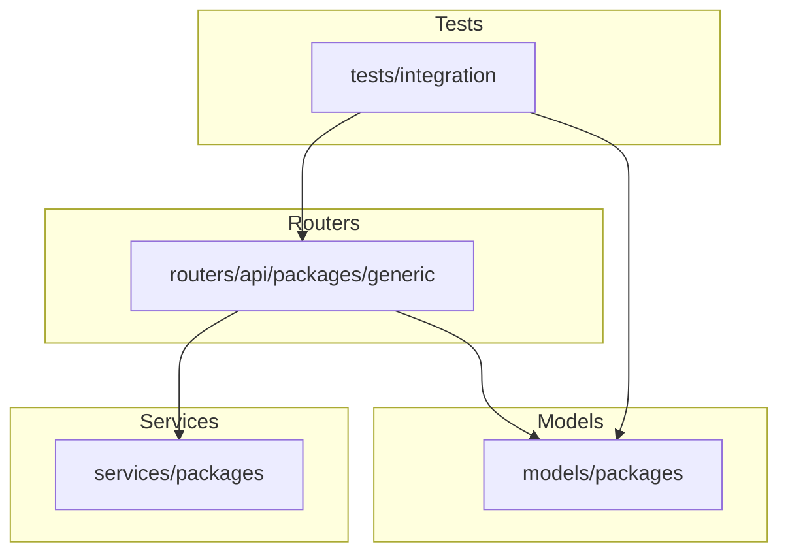
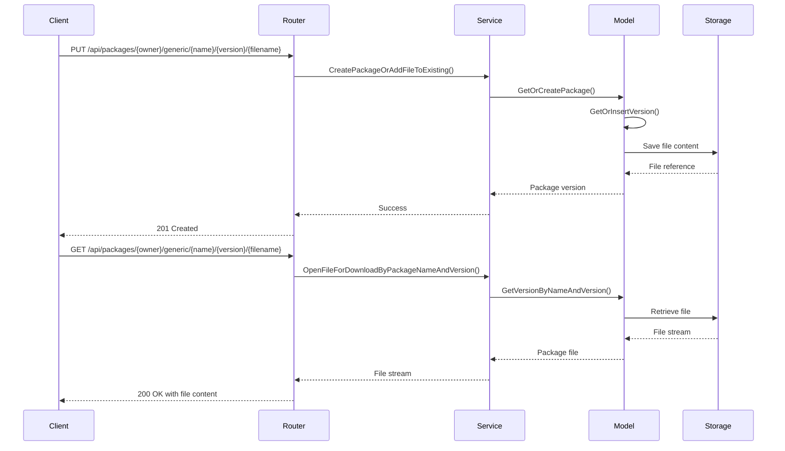
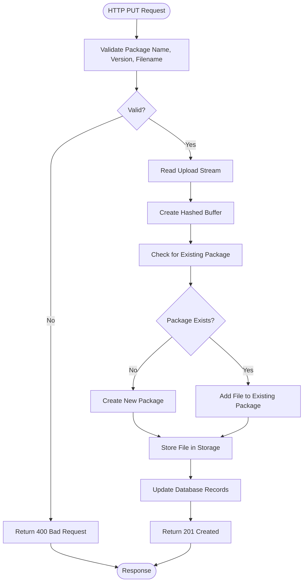
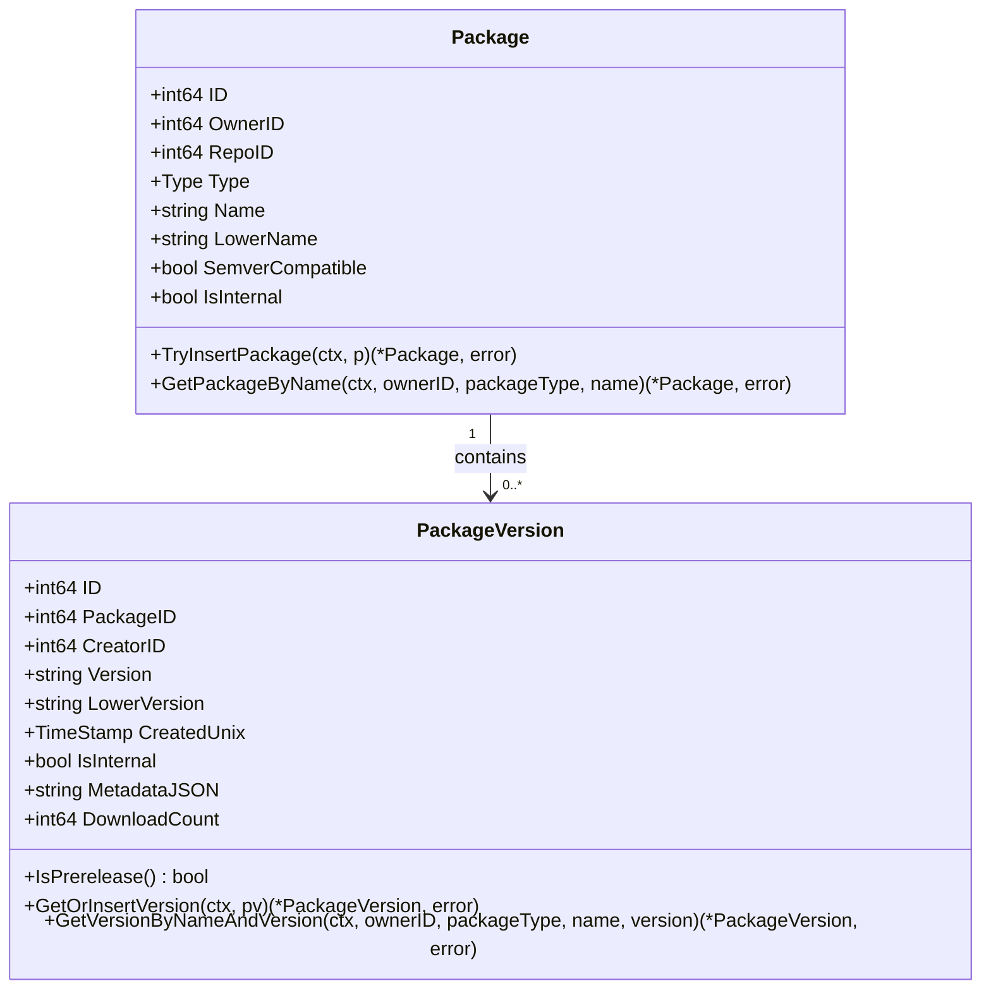
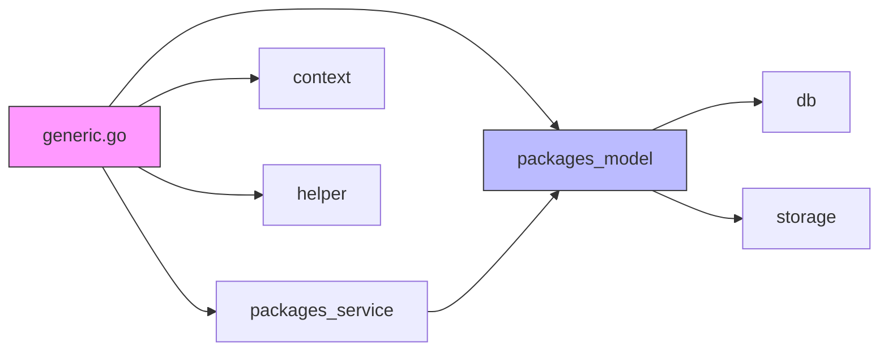

# Generic Registry

<cite>
**Referenced Files in This Document**   
- [generic.go](file://routers/api/packages/generic/generic.go)
- [package.go](file://models/packages/package.go)
- [package_version.go](file://models/packages/package_version.go)
- [api_packages_generic_test.go](file://tests/integration/api_packages_generic_test.go)
</cite>

## Table of Contents
1. [Introduction](#introduction)
2. [Project Structure](#project-structure)
3. [Core Components](#core-components)
4. [Architecture Overview](#architecture-overview)
5. [Detailed Component Analysis](#detailed-component-analysis)
6. [Dependency Analysis](#dependency-analysis)
7. [Performance Considerations](#performance-considerations)
8. [Troubleshooting Guide](#troubleshooting-guide)
9. [Conclusion](#conclusion)

## Introduction
The Generic Package Registry in Gitea provides a flexible storage system for arbitrary file uploads with versioning support. This document details the implementation of the generic service layer, its integration with the core package model, and explains how generic packages are published and consumed via HTTP endpoints. The system supports versioned file storage, access control, and metadata management for generic binary artifacts.

## Project Structure
The generic package registry implementation follows a modular architecture with clear separation of concerns between routing, service logic, and data models. The core components are organized across multiple directories:

**Diagram sources**
- [generic.go](file://routers/api/packages/generic/generic.go)
- [package.go](file://models/packages/package.go)

**Section sources**
- [generic.go](file://routers/api/packages/generic/generic.go)
- [package.go](file://models/packages/package.go)

## Core Components
The generic package registry consists of three main components: the HTTP API layer, the service layer, and the data model layer. These components work together to provide a complete package management system with versioning, file storage, and access control.

**Section sources**
- [generic.go](file://routers/api/packages/generic/generic.go)
- [package.go](file://models/packages/package.go)
- [package_version.go](file://models/packages/package_version.go)

## Architecture Overview
The generic package registry follows a layered architecture pattern with well-defined interfaces between components. The system handles package uploads, downloads, and management operations through a RESTful API that interacts with service layers and persistent storage.

**Diagram sources**
- [generic.go](file://routers/api/packages/generic/generic.go)
- [package.go](file://models/packages/package.go)
- [package_version.go](file://models/packages/package_version.go)

## Detailed Component Analysis

### Generic Package Service Layer
The service layer provides the business logic for package operations, handling the coordination between the API layer and data models. It manages package creation, file association, and access control.

#### Package Upload and Versioning
The generic registry supports versioned package uploads through HTTP PUT requests. Each package is identified by owner, name, version, and filename. The system validates package names, versions, and filenames before processing uploads.

**Diagram sources**
- [generic.go](file://routers/api/packages/generic/generic.go)

**Section sources**
- [generic.go](file://routers/api/packages/generic/generic.go#L53-L98)

#### Filename Resolution and Validation
The system implements strict validation rules for package names and filenames to ensure compatibility and security. Package names must match the regex pattern `\A[-_+.\w]+\z` and cannot be "..". Filenames have a more permissive pattern `\A[-_+=:;.()\[\]{}~!@#$%^& \w]+\z` but must not contain leading/trailing whitespace and cannot be "." or "..".

**Section sources**
- [generic.go](file://routers/api/packages/generic/generic.go#L53-L98)

### Core Package Model Integration
The generic package registry integrates with the core package model through standardized interfaces and data structures. This allows consistent handling of different package types while maintaining type-specific functionality.

#### Package Data Model
The package system uses two primary entities: Package and PackageVersion. The Package entity represents a named package within an owner's namespace, while PackageVersion represents a specific versioned instance with associated files.

**Diagram sources**
- [package.go](file://models/packages/package.go)
- [package_version.go](file://models/packages/package_version.go)

**Section sources**
- [package.go](file://models/packages/package.go)
- [package_version.go](file://models/packages/package_version.go)

## Dependency Analysis
The generic package registry has well-defined dependencies on core Gitea components, following a dependency inversion principle to maintain loose coupling between layers.

**Diagram sources**
- [generic.go](file://routers/api/packages/generic/generic.go)
- [package.go](file://models/packages/package.go)

**Section sources**
- [generic.go](file://routers/api/packages/generic/generic.go)
- [package.go](file://models/packages/package.go)

## Performance Considerations
The generic package registry is designed to efficiently handle large binary files through streaming operations and optimized database queries. File content is processed as a stream to minimize memory usage, and database operations are batched where possible. The system uses hashed buffers to compute file checksums during upload without storing the entire file in memory.

For serving large files, the registry leverages Gitea's storage abstraction which can be configured to use various backends including local filesystem, S3-compatible storage, or other cloud storage providers. This allows for scalable distribution of package files with appropriate caching and CDN integration.

## Troubleshooting Guide
Common issues with the generic package registry typically fall into three categories: upload failures, download issues, and configuration problems.

### Upload Failures
- **Invalid package name**: Ensure the package name matches the pattern `\A[-_+.\w]+\z` and is not ".."
- **Invalid filename**: Verify the filename matches the allowed pattern and has no leading/trailing whitespace
- **Invalid version**: Check that the version string has no leading/trailing whitespace
- **Duplicate file**: The system rejects attempts to upload the same filename to the same package version
- **Quota exceeded**: Package creation may be blocked by quota limits on total count, type size, or total size

### Download Issues
- **404 Not Found**: Verify the owner, package name, version, and filename are correct
- **403 Forbidden**: Check authentication and permissions; some packages may require sign-in to view
- **Incomplete downloads**: Network issues or storage backend problems may cause incomplete file transfers

### Configuration Options
The generic registry behavior can be customized through configuration settings:
- **File size limits**: Configure maximum upload size through the application settings
- **Allowed extensions**: While the generic registry doesn't enforce extension restrictions, these can be implemented at the reverse proxy or storage layer
- **Storage backend**: Configure the storage location and type for package files in the application configuration

**Section sources**
- [generic.go](file://routers/api/packages/generic/generic.go)
- [api_packages_generic_test.go](file://tests/integration/api_packages_generic_test.go)

## Conclusion
The Generic Package Registry in Gitea provides a robust, flexible system for storing and managing versioned binary artifacts. Its modular architecture separates concerns between routing, service logic, and data models, enabling maintainable code and extensible design. The system supports standard HTTP operations for package management with comprehensive validation and error handling. By integrating with Gitea's core package model, it provides a consistent user experience across different package types while maintaining the flexibility needed for arbitrary file storage.