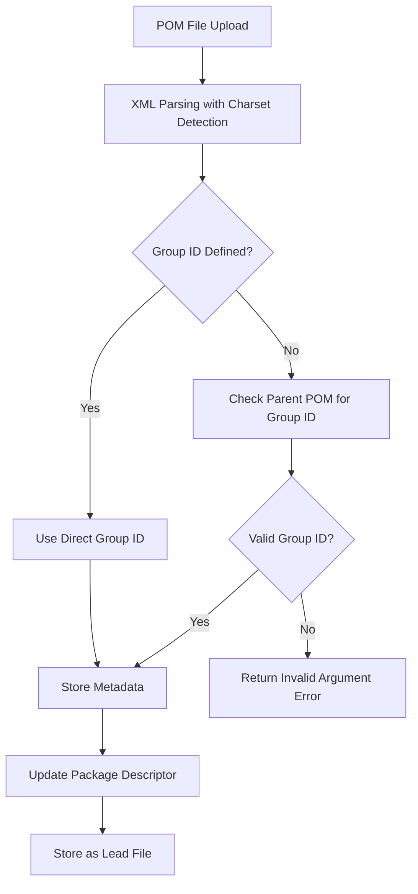
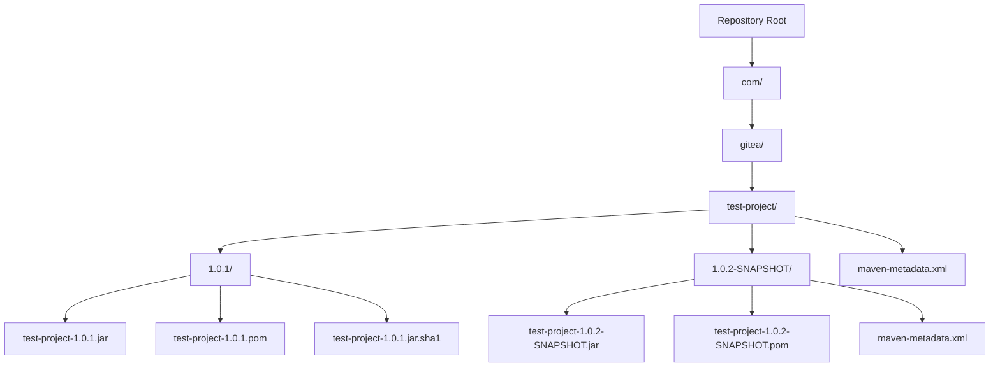
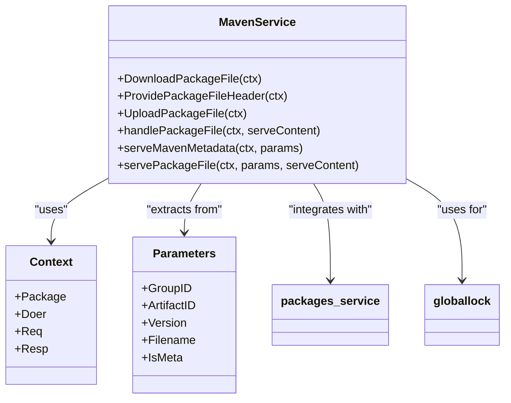
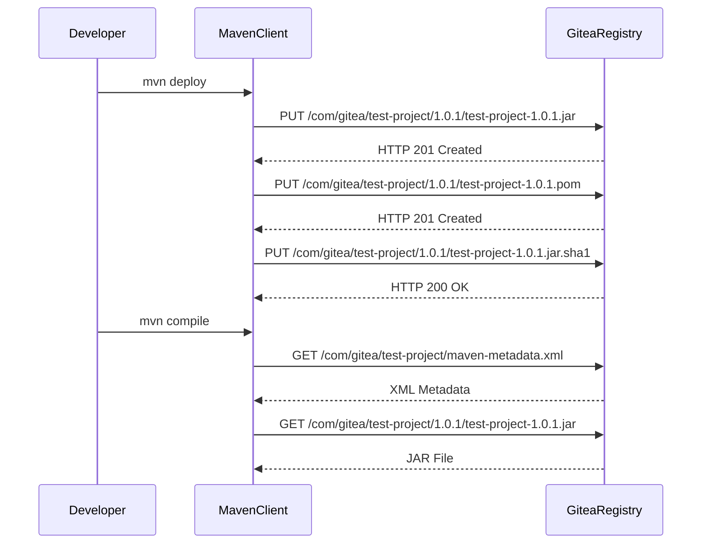

# Maven Registry

<cite>
**Referenced Files in This Document**   
- [maven.go](file://routers/api/packages/maven/maven.go)
- [api.go](file://routers/api/packages/maven/api.go)
- [metadata.go](file://modules/packages/maven/metadata.go)
- [api_packages_maven_test.go](file://tests/integration/api_packages_maven_test.go)
- [metadata_test.go](file://modules/packages/maven/metadata_test.go)
</cite>

## Table of Contents
1. [Introduction](#introduction)
2. [Maven Coordinate System](#maven-coordinate-system)
3. [POM File Handling](#pom-file-handling)
4. [Repository Structure](#repository-structure)
5. [Maven Service Layer Implementation](#maven-service-layer-implementation)
6. [Artifact Publishing and Consumption](#artifact-publishing-and-consumption)
7. [Group ID and Gitea Organization Relationship](#group-id-and-gitea-organization-relationship)
8. [Common Issues](#common-issues)
9. [Configuration Options](#configuration-options)
10. [Performance Considerations](#performance-considerations)
11. [Troubleshooting Guide](#troubleshooting-guide)

## Introduction
The Maven package registry implementation in Gitea provides a comprehensive solution for managing Maven artifacts within the platform. This document details the architecture, functionality, and operational aspects of the Maven registry, focusing on coordinate handling, POM processing, repository organization, and integration with the core package model. The implementation supports standard Maven workflows including artifact publication via `mvn deploy` and dependency resolution, while addressing common challenges such as checksum validation and snapshot version management.

## Maven Coordinate System
The Maven coordinate system in Gitea follows the standard Maven convention of Group ID, Artifact ID, and Version (GAV) to uniquely identify packages. The system parses incoming requests to extract these coordinates from the URL path structure, where the Group ID is derived from directory segments joined with dots, the Artifact ID corresponds to the final directory name, and the Version is specified in the subsequent path segment.

The implementation handles both current and legacy package naming conventions, supporting the transition from hyphen-separated names (GroupID-ArtifactID) to colon-separated format (GroupID:ArtifactID). This ensures backward compatibility while maintaining alignment with Maven specifications. The coordinate extraction process validates input parameters and prevents the use of illegal characters in any coordinate component.

**Section sources**
- [maven.go](file://routers/api/packages/maven/maven.go#L350-L399)

## POM File Handling
POM (Project Object Model) file handling is a critical aspect of the Maven registry implementation. When a POM file is uploaded, the system parses its XML content to extract metadata including project name, description, URL, licenses, and dependencies. The parsing process supports various character encodings through charset detection and handles inheritance from parent POMs by resolving the Group ID when not explicitly defined in the current module.

The extracted metadata is stored in the package descriptor and made available through the API. The POM file is marked as the lead file for its version, establishing it as the primary artifact descriptor. The implementation validates URLs and extracts relevant information while maintaining compatibility with standard Maven POM structures.

**Diagram sources**
- [metadata.go](file://modules/packages/maven/metadata.go#L49-L110)
- [maven.go](file://routers/api/packages/maven/maven.go#L270-L293)

**Section sources**
- [metadata.go](file://modules/packages/maven/metadata.go#L49-L110)
- [metadata_test.go](file://modules/packages/maven/metadata_test.go#L87-L122)

## Repository Structure
The repository structure follows the standard Maven directory layout where artifacts are organized by Group ID (converted from dots to directory separators), Artifact ID, and Version. Each version directory contains the primary artifact (typically a JAR file), its POM file, and associated checksums. The structure also includes metadata files at various levels to support Maven client operations.

The root of the repository contains `maven-metadata.xml` files that provide information about available versions, latest release, and snapshot details. These metadata files are automatically generated and updated when new versions are published. The implementation supports both release and snapshot versions, with snapshot metadata tracking timestamps and build numbers for reproducible builds.

**Diagram sources**
- [maven.go](file://routers/api/packages/maven/maven.go#L100-L179)
- [api.go](file://routers/api/packages/maven/api.go#L20-L46)

**Section sources**
- [maven.go](file://routers/api/packages/maven/maven.go#L100-L179)
- [api_packages_maven_test.go](file://tests/integration/api_packages_maven_test.go#L265-L293)

## Maven Service Layer Implementation
The Maven service layer implements the core functionality for handling package operations through REST API endpoints. The implementation follows a modular approach with separate functions for uploading, downloading, and providing headers for package files. The service layer integrates with the core package model through the packages_service module, creating and updating package records in the database.

A global locking mechanism ensures that concurrent uploads of the same package are serialized, preventing race conditions and data corruption. The service validates incoming requests, processes file content, and manages checksum verification. For metadata files, the implementation dynamically generates content based on the current state of the repository rather than storing static files.

The API routes are configured to handle PUT requests for uploads, GET requests for downloads, and HEAD requests for header information. The implementation distinguishes between regular package files and metadata files, applying different processing logic based on the request path and file extension.

**Diagram sources**
- [maven.go](file://routers/api/packages/maven/maven.go#L55-L348)
- [api.go](file://routers/api/packages/api.go#L354-L385)

**Section sources**
- [maven.go](file://routers/api/packages/maven/maven.go#L55-L348)

## Artifact Publishing and Consumption
Artifact publishing in the Maven registry follows the standard Maven deployment workflow using the `mvn deploy` command. When a developer executes this command, the Maven client sends HTTP PUT requests to the registry endpoint with the artifact coordinates in the URL path. The implementation accepts JAR files, POM files, and checksum files, processing them according to their file extensions.

For consumption, Maven clients retrieve artifacts through dependency declarations in project POM files. The registry supports both direct downloads of specific versions and metadata-based resolution that allows clients to discover the latest version or resolve snapshot builds. The implementation returns appropriate HTTP headers including content type, content length, and last modified timestamp to support client caching and validation.

The system handles checksum files (MD5, SHA1, SHA256, SHA512) by either generating them from uploaded content or verifying provided checksums against the actual file content. This ensures the integrity of published artifacts and prevents corruption during transfer.

**Diagram sources**
- [maven.go](file://routers/api/packages/maven/maven.go#L242-L348)
- [api_packages_maven_test.go](file://tests/integration/api_packages_maven_test.go#L49-L79)

**Section sources**
- [maven.go](file://routers/api/packages/maven/maven.go#L242-L348)
- [api_packages_maven_test.go](file://tests/integration/api_packages_maven_test.go#L49-L79)

## Group ID and Gitea Organization Relationship
The relationship between Maven Group IDs and Gitea organization structures is implemented through the package owner system. The Group ID does not directly map to Gitea organizations but rather serves as a namespace within the package registry. Packages are associated with a Gitea user or organization as the owner, and the Group ID provides an additional layer of organization within that namespace.

This decoupling allows for flexible package management where a single Gitea organization can maintain multiple Group IDs, and packages with the same Group ID can be owned by different Gitea users or organizations. The implementation supports this flexibility by storing the Group ID as part of the package name in the format "GroupID:ArtifactID", with the package owner recorded separately in the database.

The system handles legacy package names that used hyphens instead of colons as separators, automatically migrating them to the current format when accessed. This ensures backward compatibility while maintaining a consistent internal representation.

**Section sources**
- [maven.go](file://routers/api/packages/maven/maven.go#L260-L270)
- [api_packages_maven_test.go](file://tests/integration/api_packages_maven_test.go#L78-L121)

## Common Issues
### Checksum Validation Failures
Checksum validation failures occur when the provided checksum does not match the computed hash of the uploaded file. The implementation verifies checksums for MD5, SHA1, SHA256, and SHA512 algorithms, rejecting uploads with mismatched hashes. This ensures the integrity of published artifacts but may cause deployment failures if the client generates incorrect checksums.

### Snapshot Version Handling
Snapshot versions are handled according to Maven specifications, with metadata tracking the latest snapshot build. The implementation supports overwriting snapshot metadata, allowing for continuous integration workflows where the same snapshot version is updated multiple times. However, this requires careful configuration of Maven client settings to ensure proper snapshot resolution.

### Repository Metadata Generation
Repository metadata generation issues can occur when the dynamic metadata generation process encounters errors. The implementation generates metadata on-the-fly from database queries, sorting versions by creation timestamp rather than version string. This ensures chronological ordering but may not align with semantic versioning expectations if packages are created out of sequence.

**Section sources**
- [maven.go](file://routers/api/packages/maven/maven.go#L180-L240)
- [api_packages_maven_test.go](file://tests/integration/api_packages_maven_test.go#L238-L267)

## Configuration Options
The Maven registry implementation includes several configuration options to control its behavior. The system supports a testing parameter "use_legacy_package_name" that allows clients to force the use of legacy package naming conventions for compatibility testing. This parameter should not be used in production environments.

The registry automatically handles the transition from legacy to current package naming formats, updating package records in the database when necessary. No additional configuration is required for this migration process, as it occurs transparently during package access.

The implementation respects standard HTTP headers and methods, with no additional configuration parameters exposed through the API. System-level configuration is managed through Gitea's global package registry settings rather than Maven-specific options.

**Section sources**
- [maven.go](file://routers/api/packages/maven/maven.go#L250-L260)

## Performance Considerations
The Maven registry implementation includes several performance optimizations for handling large numbers of artifacts. The use of global locks for package uploads ensures data consistency but may create bottlenecks under high concurrent load. The system is designed to handle concurrent uploads of different packages efficiently, as demonstrated by integration tests.

Database queries are optimized to retrieve package information with minimal overhead, using indexed fields for package type, owner, and name. The metadata generation process sorts results by creation timestamp, which is indexed for performance. For repositories with large numbers of versions, this approach ensures consistent performance regardless of version string complexity.

The implementation streams file content directly from storage to the client, minimizing memory usage for large artifact downloads. Checksums are stored in the database, allowing for quick retrieval without recalculating hashes on every request.

**Section sources**
- [maven.go](file://routers/api/packages/maven/maven.go#L180-L240)
- [api_packages_maven_test.go](file://tests/integration/api_packages_maven_test.go#L295-L331)

## Troubleshooting Guide
### Build Errors
When encountering build errors related to the Maven registry, verify that the repository URL is correctly configured in the project's settings.xml or pom.xml file. Ensure that authentication credentials are properly set up, as the registry requires authentication for both upload and download operations.

### Checksum Mismatch
For checksum mismatch errors, verify that the client is generating correct checksums. Some build tools may generate checksums using different algorithms or encoding than expected. The registry supports standard hexadecimal encoding for all checksum types.

### Metadata Not Found
If metadata files cannot be found, ensure that at least one version of the package has been successfully published. The maven-metadata.xml file is generated dynamically based on existing versions, so it will not exist for packages with no published versions.

### Concurrent Upload Issues
When experiencing issues with concurrent uploads, consider the global lock mechanism that serializes uploads for the same package. While this prevents race conditions, it may cause timeouts under high load. Implement retry logic in client applications to handle temporary upload failures.

**Section sources**
- [maven.go](file://routers/api/packages/maven/maven.go#L180-L240)
- [api_packages_maven_test.go](file://tests/integration/api_packages_maven_test.go#L162-L194)