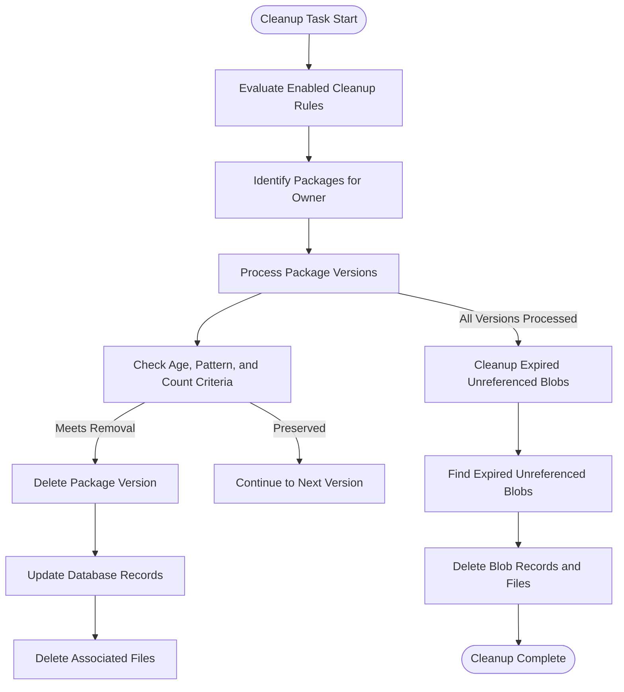

# Package Management

<cite>
**Referenced Files in This Document**   
- [package_cleanup_rule.go](file://models/packages/package_cleanup_rule.go)
- [cleanup.go](file://services/packages/cleanup/cleanup.go)
- [package.go](file://models/packages/package.go)
- [app.ini](file://docker/root/etc/templates/app.ini)
</cite>

## Table of Contents
1. [Introduction](#introduction)
2. [Package Cleanup Rules](#package-cleanup-rules)
3. [Cleanup Workflow and Storage Impact](#cleanup-workflow-and-storage-impact)
4. [Retention Policies and Storage Quotas](#retention-policies-and-storage-quotas)
5. [Configuration Options](#configuration-options)
6. [Common Issues and Troubleshooting](#common-issues-and-troubleshooting)
7. [Performance Considerations](#performance-considerations)

## Introduction
This document provides comprehensive documentation on the package management system in Gitea, focusing on automated cleanup rules, retention policies, and storage management. The system enables administrators and users to automatically remove old or unused packages based on configurable policies, helping maintain optimal storage usage and system performance. The documentation covers implementation details, configuration options, workflow mechanics, and troubleshooting guidance for package management operations.

## Package Cleanup Rules

Package cleanup rules in Gitea provide a flexible mechanism for automatically removing old or unused packages based on configurable policies. These rules are defined at the organization or user level and can be applied to specific package types. The system evaluates these rules during scheduled cleanup tasks to identify and remove packages that meet the removal criteria.

The `PackageCleanupRule` struct defines the configuration parameters for cleanup rules, including:
- **Enabled**: Boolean flag to activate or deactivate the rule
- **OwnerID**: Identifier of the user or organization that owns the rule
- **Type**: Package type to which the rule applies (e.g., container, debian, npm)
- **KeepCount**: Number of most recent versions to preserve
- **KeepPattern**: Regular expression pattern for versions to always keep
- **RemoveDays**: Age threshold in days for removal
- **RemovePattern**: Regular expression pattern for versions to remove
- **MatchFullName**: Flag to match against package name and version combination

Cleanup rules are processed by the `ExecuteCleanupRules` function, which iterates through all enabled rules and applies them to the corresponding packages. For each rule, the system retrieves all packages of the specified type for the owner, then evaluates each package version against the rule's criteria. Versions are removed if they exceed the age threshold, don't match the keep pattern, and aren't among the most recent versions specified by KeepCount.

When container packages are processed, special handling occurs through the `ShouldBeSkipped` function, which prevents removal of tagged images or other protected container versions. After package versions are deleted, repository-specific cleanup occurs for certain package types (e.g., Debian, Alpine, RPM, Arch) to regenerate repository metadata files.

**Section sources**
- [package_cleanup_rule.go](file://models/packages/package_cleanup_rule.go#L1-L110)
- [cleanup.go](file://services/packages/cleanup/cleanup.go#L1-L211)

## Cleanup Workflow and Storage Impact

The package cleanup workflow in Gitea follows a systematic process that ensures data integrity while efficiently reclaiming storage space. The workflow begins with the evaluation of enabled cleanup rules, followed by the identification of candidate packages for removal, and concludes with the actual deletion process and storage cleanup.

The cleanup process operates in several phases. First, the system identifies packages that match the cleanup criteria based on age, version patterns, and retention policies. For each identified package version, the system performs a transactional deletion that removes the version record from the database and all associated files. The deletion is wrapped in a database transaction to ensure consistency between the database records and stored files.

After package versions are removed, the system handles orphaned package blobs - binary data that is no longer referenced by any package version. The `FindExpiredUnreferencedBlobs` function identifies blobs that have not been accessed within a specified time period, and these are then deleted from both the database and the content store. This two-phase approach ensures that storage is reclaimed efficiently while maintaining referential integrity.

The storage impact of package cleanup is significant, particularly for repositories with frequent package updates or large container images. By removing outdated versions and unreferenced blobs, the system can reclaim substantial disk space. The content store, which stores the actual package files, is cleaned separately from the database cleanup to ensure that file deletion occurs only after successful database updates.



**Diagram sources**
- [cleanup.go](file://services/packages/cleanup/cleanup.go#L1-L211)

**Section sources**
- [cleanup.go](file://services/packages/cleanup/cleanup.go#L1-L211)
- [package.go](file://models/packages/package.go#L1-L352)

## Retention Policies and Storage Quotas

Package retention policies in Gitea work in conjunction with storage quotas to provide comprehensive storage management. Retention policies determine which packages are kept or removed based on age, version patterns, and count, while storage quotas set hard limits on the total storage consumption for packages.

The relationship between retention policies and storage quotas is complementary. Retention policies proactively manage storage by removing outdated packages according to schedule, while storage quotas provide a safety mechanism that prevents unbounded growth. When a user or organization approaches their storage quota, new package uploads may be rejected, prompting administrators to either increase the quota or adjust retention policies to be more aggressive.

Storage quotas are configured in the system settings and can be set at different levels:
- **Global quotas**: Apply to the entire system
- **Owner-level quotas**: Apply to specific users or organizations
- **Package-type quotas**: Apply to specific package types (e.g., container, npm)

The system evaluates storage usage when processing package uploads and can prevent uploads that would exceed configured limits. This prevents storage exhaustion and ensures fair resource allocation across users and organizations. When combined with retention policies, this creates a balanced approach to storage management that prevents both gradual storage creep and sudden storage exhaustion.

**Section sources**
- [app.ini](file://docker/root/etc/templates/app.ini#L1-L63)
- [cleanup.go](file://services/packages/cleanup/cleanup.go#L1-L211)

## Configuration Options

Package management settings in Gitea can be configured through both the web interface and the app.ini configuration file. These settings control various aspects of package handling, including cleanup rules, storage locations, and access policies.

In the app.ini configuration file, package-related settings are organized under the [packages] section. Key configuration options include:

```ini
[packages]
ENABLED = true
; Storage settings
STORAGE_TYPE = filesystem
STORAGE_PATH = /data/gitea/packages
; Size limits
LIMIT_TOTAL_OWNER_SIZE = -1
LIMIT_SIZE_GENERIC = -1
LIMIT_SIZE_CONTAINER = -1
; Cleanup settings
CLEANUP_ENABLED = true
CLEANUP_INTERVAL = 24h
```

The web interface provides a user-friendly way to manage package cleanup rules. Administrators and owners can create, edit, and delete cleanup rules through the package settings page. The interface allows specifying the package type, retention count, age-based removal criteria, and regular expression patterns for version matching.

Cleanup rules can be enabled or disabled individually, allowing for testing of new rules before full deployment. The interface also provides visibility into existing rules and their status, helping administrators understand which rules are actively managing package retention.

**Section sources**
- [app.ini](file://docker/root/etc/templates/app.ini#L1-L63)
- [package_cleanup_rule.go](file://models/packages/package_cleanup_rule.go#L1-L110)

## Common Issues and Troubleshooting

Package management operations can encounter various issues that require troubleshooting. Understanding these common problems and their solutions is essential for maintaining a reliable package management system.

### Accidental Package Deletion
Accidental deletion can occur when cleanup rules are misconfigured with overly aggressive patterns or age thresholds. To prevent this, administrators should:
- Test new rules with logging enabled before full deployment
- Use specific regular expressions rather than broad patterns
- Start with conservative retention policies and adjust as needed
- Monitor system logs for cleanup operations

### Cleanup Job Failures
Cleanup jobs may fail due to various reasons, including:
- Database connectivity issues
- File system permission problems
- Storage backend errors
- Memory or timeout constraints

When cleanup jobs fail, the system logs detailed error messages that can help diagnose the issue. The logs include the rule ID, package name, and specific error that occurred during processing. Administrators should monitor these logs regularly and address any recurring failures.

### Dependency Breakage
Package deletion can potentially break dependencies if downstream systems rely on specific package versions. To mitigate this risk:
- Coordinate with development teams before implementing aggressive cleanup policies
- Maintain a minimum retention period that aligns with development cycles
- Use semantic versioning patterns in keep rules to preserve major versions
- Communicate cleanup schedules to stakeholders

Troubleshooting cleanup issues typically involves checking system logs, verifying database integrity, and ensuring proper file system permissions. The admin monitoring interface provides visibility into scheduled tasks, including cleanup jobs, allowing administrators to verify that jobs are running as expected.

**Section sources**
- [cleanup.go](file://services/packages/cleanup/cleanup.go#L1-L211)
- [package_cleanup_rule.go](file://models/packages/package_cleanup_rule.go#L1-L110)

## Performance Considerations

Package management operations, particularly cleanup tasks, can have significant performance implications for large-scale deployments. Understanding these considerations is crucial for maintaining system responsiveness and reliability.

For large repositories with extensive package histories, cleanup operations can be resource-intensive, requiring substantial database queries and file system operations. The system processes cleanup rules sequentially, with each rule potentially affecting thousands of package versions. To minimize performance impact, cleanup tasks are typically scheduled during off-peak hours.

The database performance is affected by the need to query package versions, update records, and maintain referential integrity. Indexes on key fields like OwnerID, Type, and CreatedUnix help optimize these queries. However, very large datasets may require additional database tuning or partitioning strategies.

Storage performance is another critical factor, particularly when dealing with large package files like container images. Deleting large files can be time-consuming, especially on network-attached storage or object storage systems. The system handles this by processing deletions in batches and continuing with other operations even if individual file deletions fail.

Memory usage during cleanup operations is generally moderate, as the system processes packages in batches rather than loading all data into memory simultaneously. However, complex regular expression patterns or very large result sets can increase memory consumption.

To optimize performance for large-scale package management:
- Schedule cleanup tasks during periods of low system activity
- Monitor system resource usage during cleanup operations
- Consider staggering cleanup rules across different times
- Regularly review and refine cleanup policies to avoid unnecessary processing
- Ensure adequate database indexing and maintenance

**Section sources**
- [cleanup.go](file://services/packages/cleanup/cleanup.go#L1-L211)
- [package_cleanup_rule.go](file://models/packages/package_cleanup_rule.go#L1-L110)