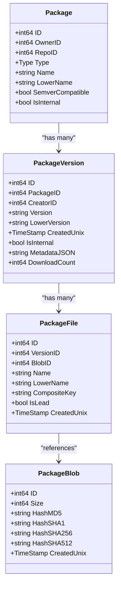
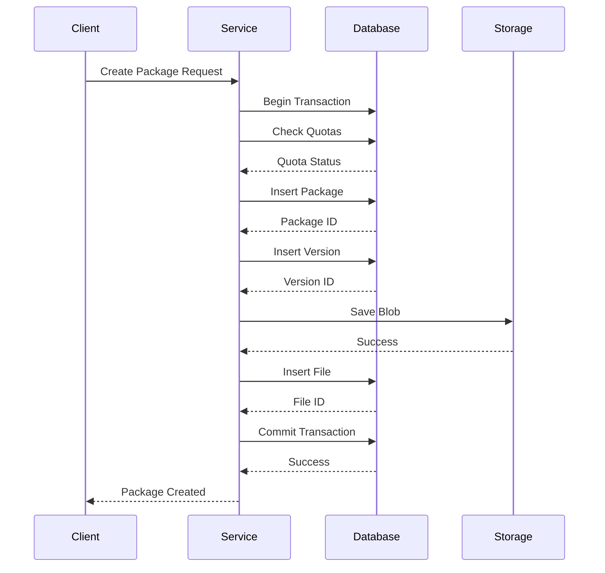

# Package Registry Overview

<cite>
**Referenced Files in This Document**   
- [package.go](file://models/packages/package.go)
- [package_version.go](file://models/packages/package_version.go)
- [package_file.go](file://models/packages/package_file.go)
- [package_blob.go](file://models/packages/package_blob.go)
- [packages.go](file://services/packages/packages.go)
- [auth.go](file://services/packages/auth.go)
</cite>

## Table of Contents
1. [Unified Package Management Architecture](#unified-package-management-architecture)
2. [Core Data Structures](#core-data-structures)
3. [Service Layer Operations](#service-layer-operations)
4. [Access Control Model](#access-control-model)
5. [Package-Repository Relationship](#package-repository-relationship)
6. [Common Issues and Resolution](#common-issues-and-resolution)
7. [Performance and Storage Optimization](#performance-and-storage-optimization)

## Unified Package Management Architecture

Gitea implements a unified package registry system that supports multiple package formats through a common model layer. This architecture enables consistent handling of diverse package types while maintaining format-specific behaviors. The system is designed around a shared data model that abstracts package metadata, versioning, file storage, and access patterns across all supported formats.

The unified architecture follows a layered approach where package-specific logic is isolated in dedicated modules while core operations like storage, retrieval, and access control are centralized. This design allows Gitea to support various package types including Alpine, Arch, Cargo, Conan, Container, Debian, NuGet, RPM, and others through a consistent interface. Each package type can implement its own resolution logic, version comparison rules, and repository operations while leveraging the common infrastructure for storage, authentication, and metadata management.

This approach provides several benefits: consistent user experience across package types, simplified maintenance of core functionality, and easier addition of new package formats. The architecture ensures that all packages, regardless of type, benefit from the same security model, storage optimization techniques, and administrative controls.

**Section sources**
- [package.go](file://models/packages/package.go#L25-L50)
- [packages.go](file://services/packages/packages.go#L25-L50)

## Core Data Structures

The package registry system is built around four core entities: Package, PackageVersion, PackageFile, and PackageBlob. These entities form a hierarchical relationship that represents the complete package lifecycle from creation to distribution.

The **Package** entity represents a named package within a namespace (user or organization). It contains metadata such as name, type, and ownership information. Each package can have multiple versions and is uniquely identified by its owner, type, and name. The Package entity also tracks whether it follows semantic versioning conventions and can be linked to a repository.

The **PackageVersion** entity represents a specific version of a package. It contains version-specific metadata including the version string, creation timestamp, download count, and custom properties. Package versions are linked to their parent package and can contain multiple files. The system supports both semantic and non-semantic versioning schemes.

The **PackageFile** entity represents individual files within a package version. Each file has a name, creation timestamp, and reference to its content blob. Files can be marked as "lead" files, which are typically the primary distribution artifact. The system supports composite keys for files, enabling advanced naming schemes and variant management.

The **PackageBlob** entity represents the actual binary content of package files. It uses content-addressable storage with multiple hash algorithms (MD5, SHA-1, SHA-256, SHA-512) to ensure data integrity and enable deduplication. Blobs are stored separately from file metadata, allowing multiple package files to reference the same content.

**Diagram sources**
- [package.go](file://models/packages/package.go#L100-L150)
- [package_version.go](file://models/packages/package_version.go#L50-L100)
- [package_file.go](file://models/packages/package_file.go#L50-L100)
- [package_blob.go](file://models/packages/package_blob.go#L50-L100)

**Section sources**
- [package.go](file://models/packages/package.go#L1-L350)
- [package_version.go](file://models/packages/package_version.go#L1-L350)
- [package_file.go](file://models/packages/package_file.go#L1-L240)
- [package_blob.go](file://models/packages/package_blob.go#L1-L150)

## Service Layer Operations

The service layer in services/packages handles all package operations including creation, resolution, and deletion. This layer provides a transactional interface for package management, ensuring data consistency across the package hierarchy.

Package creation is handled through the `CreatePackageAndAddFile` and `CreatePackageOrAddFileToExisting` functions, which manage the complete workflow of creating a package, version, and associated files. These operations are wrapped in database transactions to ensure atomicity. The service layer also handles quota enforcement, checking both size and count limits before allowing package creation.

Package resolution is implemented through search functions that support various filtering criteria including owner, package type, name, version, and custom properties. The system provides both exact match and pattern-based searches, with case-insensitive lookups using lower-case normalized fields. Version resolution supports semantic versioning patterns and can return either specific versions or the latest version matching criteria.

Package deletion operations are designed to maintain referential integrity. When a package version is deleted, all associated files and properties are automatically removed. The system also handles cascading operations, such as removing unreferenced blobs during cleanup. Deletion operations are logged and trigger notifications to inform relevant parties.

The service layer also manages content storage operations, handling the upload and retrieval of package blobs. It integrates with Gitea's storage system, supporting both local and remote storage backends. For large files, the system can serve direct download URLs when supported by the storage backend, reducing server load.

**Diagram sources**
- [packages.go](file://services/packages/packages.go#L100-L200)
- [package.go](file://models/packages/package.go#L200-L250)
- [package_version.go](file://models/packages/package_version.go#L200-L250)

**Section sources**
- [packages.go](file://services/packages/packages.go#L1-L650)
- [package.go](file://models/packages/package.go#L200-L300)
- [package_version.go](file://models/packages/package_version.go#L200-L300)

## Access Control Model

The access control model for packages is tightly integrated with Gitea's repository and organization permissions system. Package access is determined by the ownership and visibility settings of the associated user or organization, ensuring consistent security policies across all Gitea features.

Package permissions are inherited from the owner's access rights. For user-owned packages, the owner has full control, while organization-owned packages follow the organization's team-based permission model. Users must have at least read access to the owner (user or organization) to view packages, with write access required for package creation and management.

Authentication for package operations is handled through JWT tokens, which contain the user ID and access scope. The `CreateAuthorizationToken` function generates tokens with a 24-hour expiration, while `ParseAuthorizationRequest` validates incoming authentication headers. This token-based approach enables secure API access without requiring session management.

The system supports fine-grained access control through package properties and scopes. Different package types can define their own access scopes, allowing for type-specific permission models. The access control checks are performed at multiple levels: package type, individual package, and specific operations.

For blob access, the system performs additional authorization checks to ensure users can only access content they are permitted to view. This is particularly important for internal packages and private repositories. The `IsBlobAccessibleForUser` function evaluates access based on user role, organization membership, and team permissions.

**Section sources**
- [auth.go](file://services/packages/auth.go#L1-L85)
- [package_blob.go](file://models/packages/package_blob.go#L100-L150)
- [packages.go](file://services/packages/packages.go#L500-L550)

## Package-Repository Relationship

Packages in Gitea can be associated with repositories, creating a direct link between source code and distribution artifacts. This relationship enables several important features: automatic package cleanup when repositories are deleted, unified access control, and contextual package discovery.

Each package can be linked to a specific repository through the RepoID field in the Package entity. This association is optional, allowing for standalone packages that are not tied to a particular code repository. When a package is linked to a repository, it inherits the repository's visibility and access permissions.

The system provides functions to manage the package-repository relationship, including `SetRepositoryLink`, `UnlinkRepository`, and `UnlinkRepositoryFromAllPackages`. These operations ensure referential integrity and can be used during repository migration, transfer, or deletion.

Packages are scoped to user or organization namespaces, following Gitea's standard naming conventions. This scoping prevents naming conflicts between different owners while allowing the same package name to be used by different users or organizations. The namespace is implicitly determined by the package owner, with no separate namespace entity.

When repositories are deleted, the system automatically unlinks all associated packages but does not delete them by default. This behavior preserves package history and allows for package recovery. Administrators can configure cleanup policies to automatically remove orphaned packages after a specified period.

**Section sources**
- [package.go](file://models/packages/package.go#L150-L200)
- [packages.go](file://services/packages/packages.go#L600-L650)

## Common Issues and Resolution

The package registry system addresses several common issues in package management, including name collisions, version resolution conflicts, and quota management.

Package name collisions are prevented through the composite unique constraint on owner, type, and name. This ensures that each user or organization can have only one package of a specific type with a given name. The system uses case-insensitive name matching through the LowerName field, preventing conflicts from different capitalizations.

Version resolution conflicts are handled through careful transaction management and unique constraints. The system uses a combination of package ID and lower-case version string to ensure version uniqueness within a package. For semantic versions, the system provides utilities to handle pre-release versions and build metadata consistently.

Quota management is implemented to prevent resource exhaustion. The system enforces three types of quotas: total package count per owner, total storage size per owner, and type-specific size limits. These quotas can be configured globally and are checked before package creation. Administrators can set limits to -1 to disable specific quotas.

The system also handles file-level conflicts through composite keys and overwrite policies. When adding files to packages, the service layer can either reject duplicates or overwrite existing files based on the OverwriteExisting flag. This flexibility supports both immutable package policies and update scenarios.

For internal packages used for system operations, the system uses the IsInternal flag to distinguish between user-facing packages and system-managed packages. This separation prevents naming conflicts and allows for different retention policies.

**Section sources**
- [package.go](file://models/packages/package.go#L50-L100)
- [package_version.go](file://models/packages/package_version.go#L100-L150)
- [packages.go](file://services/packages/packages.go#L250-L300)

## Performance and Storage Optimization

The package registry system includes several performance and storage optimization techniques to handle large-scale deployments efficiently.

Storage optimization is achieved through content deduplication at the blob level. Since PackageBlob entities are identified by their cryptographic hashes, identical content is stored only once regardless of how many packages reference it. This significantly reduces storage requirements for commonly used dependencies and repeated uploads.

The system implements efficient indexing strategies to support fast package discovery. Database indexes are created on frequently queried fields including owner ID, package type, lower-case names, and creation timestamps. Search operations use these indexes to quickly locate packages without full table scans.

For large registries, the system provides pagination support through the Paginator interface, allowing clients to retrieve packages in manageable chunks. This prevents memory exhaustion and improves response times for large result sets.

The content storage system supports direct serving when using compatible backends like S3. This allows the storage system to generate pre-signed URLs for package downloads, reducing server load and bandwidth usage. The system falls back to proxy serving when direct serving is not available.

Regular cleanup operations help maintain system performance. The system can identify and remove unreferenced blobs, expired internal packages, and orphaned package versions. These operations can be scheduled through Gitea's cron system to run during off-peak hours.

The system also optimizes database queries through careful use of joins and subqueries. For example, the SearchVersions function uses optimized SQL queries with proper indexing to efficiently filter and sort large numbers of package versions.

**Section sources**
- [package_blob.go](file://models/packages/package_blob.go#L100-L150)
- [package_file.go](file://models/packages/package_file.go#L200-L240)
- [packages.go](file://services/packages/packages.go#L300-L400)