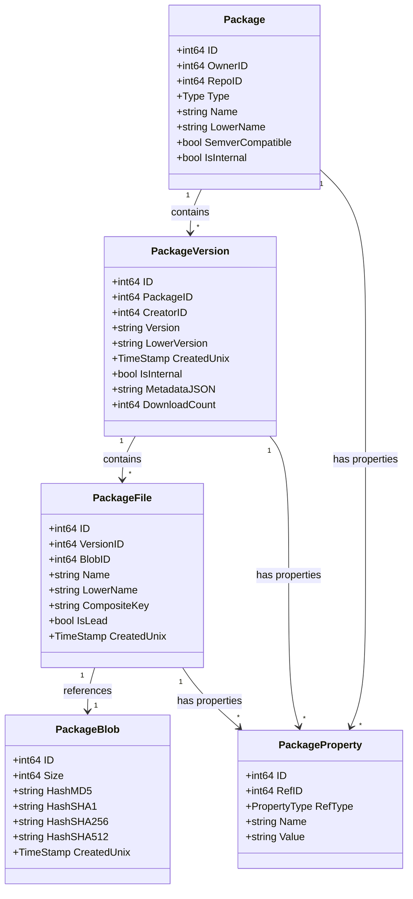

# Packages

<cite>
**Referenced Files in This Document**   
- [package.go](file://models/packages/package.go)
- [package_version.go](file://models/packages/package_version.go)
- [package_file.go](file://models/packages/package_file.go)
- [package_blob.go](file://models/packages/package_blob.go)
- [descriptor.go](file://models/packages/descriptor.go)
- [packages.go](file://services/packages/packages.go)
- [package_cleanup_rule.go](file://models/packages/package_cleanup_rule.go)
- [cleanup.go](file://services/packages/cleanup/cleanup.go)
- [README.md](file://routers/api/packages/README.md)
</cite>

## Table of Contents
1. [Introduction](#introduction)
2. [Core Data Models](#core-data-models)
3. [Package Services](#package-services)
4. [Supported Package Formats](#supported-package-formats)
5. [Package Lifecycle Management](#package-lifecycle-management)
6. [Access Control and Repository Integration](#access-control-and-repository-integration)
7. [Common Issues and Troubleshooting](#common-issues-and-troubleshooting)
8. [Performance and Storage Optimization](#performance-and-storage-optimization)

## Introduction
Gitea provides an integrated package registry system that supports multiple package formats within repositories. This system allows users to publish, consume, and manage packages alongside their source code, creating a unified development experience. The package registry is designed with a modular architecture that separates concerns between data models, business logic, and API endpoints, enabling support for various package formats while maintaining code reuse and consistency.

The package registry system in Gitea is built on a foundation of shared models that represent packages, versions, files, and their content. This architecture enables efficient storage through content deduplication and provides a consistent interface across different package types. The system supports a wide range of package formats including npm, NuGet, Conan, container/OCI, Maven, and generic packages, making it a versatile solution for modern development workflows.

**Section sources**
- [README.md](file://routers/api/packages/README.md#L0-L17)

## Core Data Models
The package registry system in Gitea is built on a set of core data models that provide a consistent foundation across all supported package formats. These models are organized in a hierarchical relationship that represents the structure of packages, their versions, and associated files.

**Diagram sources**
- [package.go](file://models/packages/package.go#L1-L352)
- [package_version.go](file://models/packages/package_version.go#L1-L351)
- [package_file.go](file://models/packages/package_file.go#L1-L243)
- [package_blob.go](file://models/packages/package_blob.go#L1-L155)
- [package_property.go](file://models/packages/package_property.go#L1-L100)

The core data models follow a hierarchical structure where a Package represents the root entity with attributes that remain constant across all versions (such as name and type). Each Package can have multiple PackageVersion entities, which represent specific versions of the package with their own metadata and creation timestamps. Each PackageVersion can contain multiple PackageFile entities, which describe individual files associated with that version. Finally, PackageFile entities reference PackageBlob entities, which store the actual content of files and enable deduplication across packages.

The system also includes the PackageProperty model, which allows for flexible attachment of additional metadata to packages, versions, or files. This extensible property system supports routing requirements and other format-specific needs without requiring changes to the core schema. The PackageBlob model implements content deduplication by storing file content with cryptographic hashes (MD5, SHA1, SHA256, and SHA512), ensuring that identical content is stored only once regardless of how many packages reference it.

**Section sources**
- [package.go](file://models/packages/package.go#L1-L352)
- [package_version.go](file://models/packages/package_version.go#L1-L351)
- [package_file.go](file://models/packages/package_file.go#L1-L243)
- [package_blob.go](file://models/packages/package_blob.go#L1-L155)
- [descriptor.go](file://models/packages/descriptor.go#L1-L281)

## Package Services
The services layer in Gitea's package registry provides a comprehensive set of operations for managing packages throughout their lifecycle. These services abstract the complexity of database operations and business logic, providing a clean interface for API endpoints and other components to interact with the package system.

**Diagram sources**
- [packages.go](file://services/packages/packages.go#L1-L659)
- [package.go](file://models/packages/package.go#L1-L352)
- [package_version.go](file://models/packages/package_version.go#L1-L351)
- [package_file.go](file://models/packages/package_file.go#L1-L243)
- [package_blob.go](file://models/packages/package_blob.go#L1-L155)

The package services provide several key operations for package management. The `CreatePackageAndAddFile` function creates a new package with a version and associated file in a single transaction, returning an error if the package version already exists. This function handles the complete workflow of package creation, including quota checks, property assignment, and content storage. For scenarios where packages might already exist, the `CreatePackageOrAddFileToExisting` function provides idempotent behavior, creating the package if it doesn't exist or adding the file to an existing package.

The services also include comprehensive download functionality through the `OpenFileForDownload` family of functions. These functions not only retrieve package content but also handle download counting and support for direct serving when storage backends allow it. When direct serving is enabled, the service returns a pre-signed URL to the storage backend, offloading the bandwidth cost from the Gitea server. Otherwise, it streams the content through the application server while incrementing the download counter for lead files.

Package deletion is handled through a cascading system that ensures data consistency. The `RemovePackageVersion` function deletes a package version and all associated files and properties, while `RemovePackageFileAndVersionIfUnreferenced` provides a more granular operation that removes a file and the version only if no other files remain. These operations are wrapped in transactions to maintain data integrity and include appropriate notifications through the system's event system.

**Section sources**
- [packages.go](file://services/packages/packages.go#L1-L659)

## Supported Package Formats
Gitea's package registry supports a wide range of package formats, each with specific characteristics and use cases. The system is designed with extensibility in mind, allowing for the addition of new package formats through a modular architecture that separates format-specific logic from the core package management functionality.

**Diagram sources**
- [package.go](file://models/packages/package.go#L1-L352)
- [README.md](file://routers/api/packages/README.md#L0-L50)

The system supports the following package formats:

- **npm**: For JavaScript and Node.js packages, following the npm package specification
- **NuGet**: For .NET packages, compatible with NuGet client tools
- **Conan**: For C and C++ packages, supporting the Conan package manager
- **Container/OCI**: For container images following the Open Container Initiative specification
- **Maven**: For Java and JVM-based packages, compatible with Maven and Gradle
- **Generic**: For arbitrary files with no specific format requirements

Each package format is implemented as a separate module within the codebase, following a consistent pattern where format-specific logic is isolated in dedicated packages. The `modules/packages/<type>` directories contain format-specific functionality such as metadata extraction, validation rules, and content processing. This modular design allows each package format to evolve independently while sharing the common infrastructure for storage, access control, and API endpoints.

The system uses a type enumeration to identify package formats, with each format having a corresponding SVG icon for display in the user interface. The extensible property system allows format-specific metadata to be attached to packages, versions, or files as needed, without requiring changes to the core schema. This flexibility enables the system to support the unique requirements of each package format while maintaining a consistent user experience.

**Section sources**
- [package.go](file://models/packages/package.go#L1-L352)
- [README.md](file://routers/api/packages/README.md#L0-L50)

## Package Lifecycle Management
Package lifecycle management in Gitea encompasses the complete workflow from package creation and publication to consumption, version management, and cleanup. The system provides comprehensive APIs and services to handle each stage of the package lifecycle, ensuring data consistency and enforcing appropriate business rules.

**Diagram sources**
- [packages.go](file://services/packages/packages.go#L1-L659)
- [package_cleanup_rule.go](file://models/packages/package_cleanup_rule.go#L1-L100)
- [cleanup.go](file://services/packages/cleanup/cleanup.go#L1-L100)

The package publication process begins with the creation of a package descriptor containing the package name, version, and metadata. The system validates the package against configured quotas, checking both package type size limits and overall storage quotas for the owner. If the package passes validation, the system creates the necessary database records in a transaction to ensure atomicity.

During publication, the system calculates cryptographic hashes (MD5, SHA1, SHA256, and SHA512) for the package content and checks for existing blobs with identical content. This deduplication mechanism ensures that identical content is stored only once, regardless of how many packages reference it, optimizing storage efficiency. The system also supports composite keys for package files, allowing multiple files with the same name to coexist within a version when they have different characteristics.

Package consumption is optimized through the support for direct serving when using compatible storage backends. When a client requests a package file, the system can generate a pre-signed URL that allows the client to download the content directly from the storage backend, reducing bandwidth usage on the Gitea server. For backends that don't support direct serving, the system streams the content through the application server while incrementing the download counter for lead files.

The system includes automated cleanup capabilities through configurable rules that can remove unused packages, versions, and blobs. These rules can be based on age, usage patterns, or other criteria, helping to manage storage usage over time. The cleanup process is designed to maintain referential integrity, ensuring that blobs are only deleted when no files reference them, and versions are only deleted when they contain no files.

**Section sources**
- [packages.go](file://services/packages/packages.go#L1-L659)
- [package_cleanup_rule.go](file://models/packages/package_cleanup_rule.go#L1-L100)
- [cleanup.go](file://services/packages/cleanup/cleanup.go#L1-L100)

## Access Control and Repository Integration
Gitea's package registry integrates seamlessly with the platform's access control system and repository model, ensuring that package visibility and permissions align with the associated repository or owner. This integration provides a consistent user experience and leverages the existing authentication and authorization infrastructure.

**Diagram sources**
- [package.go](file://models/packages/package.go#L1-L352)
- [package_blob.go](file://models/packages/package_blob.go#L1-L155)
- [packages.go](file://services/packages/packages.go#L1-L659)

Packages in Gitea can be associated with either a user or organization account, or linked to a specific repository. When a package is linked to a repository, its visibility and access permissions are derived from the repository's settings. This integration means that users who have access to a repository automatically have appropriate access to its associated packages, creating a unified permission model.

The access control system evaluates permissions hierarchically, first checking if the user is an administrator (who has full access), then if they are the package owner, followed by team memberships and repository collaboration status. For public packages, anonymous users have read access, while private packages require authentication and appropriate permissions. The system also supports fine-grained permissions through team-based access control, allowing organizations to manage package access at the team level.

Repository integration extends beyond access control to include features like automatic package linking during repository operations. When a repository is transferred or renamed, associated packages are automatically updated to maintain the link. The system also provides web interfaces that allow users to browse packages within the context of a repository, view package metadata, and download files directly from the repository's package tab.

The integration with repositories enables additional features such as package discovery through repository search, automatic documentation generation, and dependency visualization. When packages are published from within a repository context, the system can automatically link the package to the repository's source code, providing a complete development workflow from code to package.

**Section sources**
- [package.go](file://models/packages/package.go#L1-L352)
- [package_blob.go](file://models/packages/package_blob.go#L1-L155)
- [packages.go](file://services/packages/packages.go#L1-L659)

## Common Issues and Troubleshooting
While Gitea's package registry is designed for reliability and ease of use, certain issues may arise during package management operations. Understanding these common issues and their solutions can help administrators and users maintain a healthy package ecosystem.

**Diagram sources**
- [packages.go](file://services/packages/packages.go#L1-L659)
- [package.go](file://models/packages/package.go#L1-L352)
- [package_version.go](file://models/packages/package_version.go#L1-L351)

Package upload failures are among the most common issues, typically occurring due to validation errors, quota limits, or network problems. Validation failures may result from malformed package formats or missing required metadata. The system performs extensive validation on upload, checking package format compliance, metadata completeness, and content integrity. When validation fails, detailed error messages should be examined to identify the specific issue.

Quota-related issues occur when users exceed configured storage limits, either for specific package types or overall storage. The system enforces both type-specific size limits and total storage quotas for package owners. When quota limits are reached, package uploads will be rejected until sufficient space is freed. Administrators can monitor storage usage through system metrics and configure appropriate quota limits based on available resources.

Dependency resolution problems may arise when packages declare dependencies that cannot be resolved within the registry. This can occur due to missing package versions, incorrect version ranges, or private packages that are not accessible to the requesting user. The system stores dependency information as package properties, which are used during resolution. Ensuring that all required dependencies are published and accessible is crucial for successful dependency resolution.

Permission errors typically manifest as authentication failures or insufficient access rights. These issues may stem from incorrect credentials, expired tokens, or inadequate permissions in the target repository or organization. The system's access control is hierarchical, so ensuring that users have appropriate team memberships or repository collaboration rights is essential for successful package operations.

Network-related issues, particularly timeouts during large package uploads or downloads, can be mitigated by adjusting timeout settings in the server configuration. For environments with restrictive firewalls or proxies, ensuring that the necessary endpoints are accessible and that any required authentication is properly configured is important for reliable package operations.

**Section sources**
- [packages.go](file://services/packages/packages.go#L1-L659)
- [package.go](file://models/packages/package.go#L1-L352)
- [package_version.go](file://models/packages/package_version.go#L1-L351)

## Performance and Storage Optimization
Gitea's package registry includes several performance and storage optimization techniques to ensure efficient operation, particularly in environments with large numbers of packages or high traffic volumes. These optimizations focus on reducing storage requirements, improving access performance, and minimizing server resource usage.

**Diagram sources**
- [package_blob.go](file://models/packages/package_blob.go#L1-L155)
- [packages.go](file://services/packages/packages.go#L1-L659)
- [descriptor.go](file://models/packages/descriptor.go#L1-L281)

Content deduplication is a key storage optimization that eliminates redundant package content. When packages are uploaded, their content is hashed using SHA256, and the system checks for existing blobs with identical content. If a matching blob is found, the new package file references the existing blob instead of storing duplicate content. This optimization is particularly effective in environments where multiple packages include common dependencies or when users publish multiple versions with minor changes.

Direct serving is a performance optimization that reduces server load during package downloads. When using storage backends that support pre-signed URLs (such as S3-compatible object storage), the system can generate temporary URLs that allow clients to download package content directly from the storage backend. This offloads bandwidth usage from the Gitea server and can significantly improve download performance, especially for large packages or high-concurrency scenarios.

Caching is employed at multiple levels to improve access performance. The system uses ephemeral caching for frequently accessed data such as package descriptors, user information, and repository metadata. This reduces database queries and speeds up API responses. The caching strategy is designed to balance performance gains with memory usage, with automatic expiration of cached data to ensure consistency.

Database indexing is optimized to support efficient querying of package data. The system employs composite indexes on frequently queried fields such as package owner, type, name, and version. These indexes enable fast searches and filtering operations, even with large numbers of packages. The search functionality supports various query patterns, including exact matches, partial matches, and property-based filtering.

Background processing is used for resource-intensive operations such as package cleanup and storage optimization. These tasks are scheduled to run during off-peak hours to minimize impact on user-facing operations. The system includes configurable cleanup rules that can automatically remove unused packages, versions, and blobs based on age, usage patterns, or other criteria, helping to manage storage usage over time.

**Section sources**
- [package_blob.go](file://models/packages/package_blob.go#L1-L155)
- [packages.go](file://services/packages/packages.go#L1-L659)
- [descriptor.go](file://models/packages/descriptor.go#L1-L281)