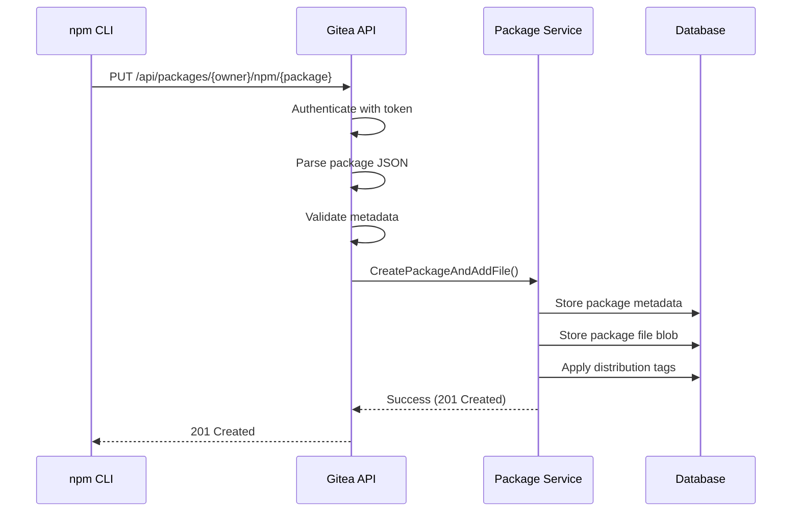
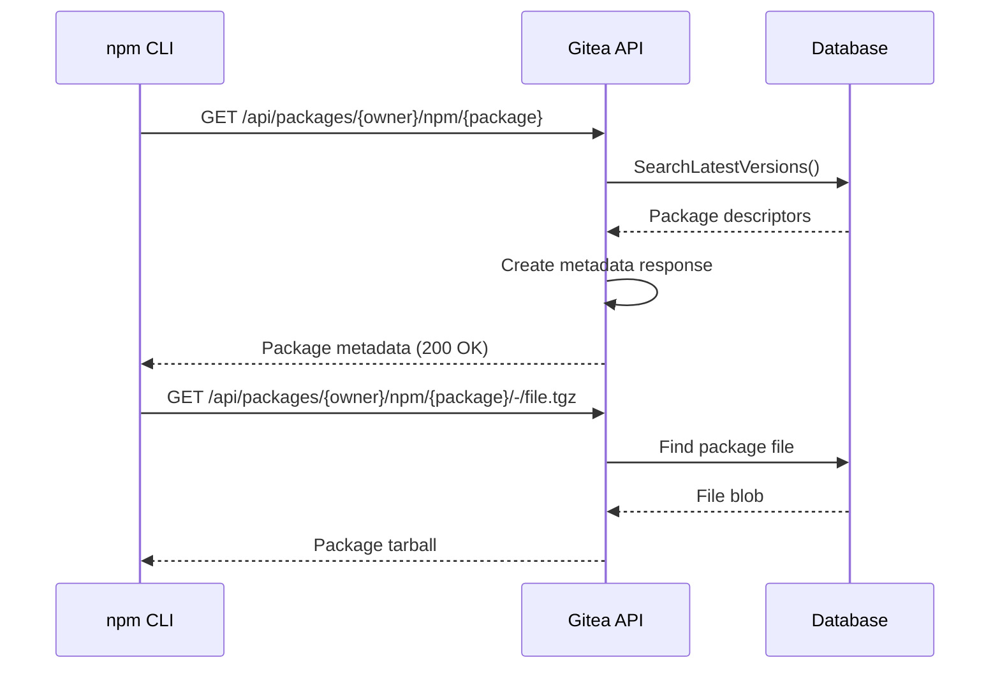

# npm Registry

<cite>
**Referenced Files in This Document**   
- [npm.go](file://routers/api/packages/npm/npm.go)
- [api.go](file://routers/api/packages/npm/api.go)
- [creator.go](file://modules/packages/npm/creator.go)
- [metadata.go](file://modules/packages/npm/metadata.go)
- [packages.go](file://models/packages/package.go)
- [package_version.go](file://models/packages/package_version.go)
- [packages.go](file://modules/setting/packages.go)
- [app.ini](file://docker/root/etc/templates/app.ini)
- [api_packages_npm_test.go](file://tests/integration/api_packages_npm_test.go)
</cite>

## Table of Contents
1. [Introduction](#introduction)
2. [npm Package Naming and Scoping](#npm-package-naming-and-scoping)
3. [Semantic Versioning Support](#semantic-versioning-support)
4. [Package Metadata Handling](#package-metadata-handling)
5. [npm Service Implementation](#npm-service-implementation)
6. [Package Publishing Process](#package-publishing-process)
7. [Package Consumption via npm install](#package-consumption-via-npm-install)
8. [Scope and Organization Relationship](#scope-and-organization-relationship)
9. [Authentication and Token Handling](#authentication-and-token-handling)
10. [Common Issues and Troubleshooting](#common-issues-and-troubleshooting)
11. [Configuration Options](#configuration-options)
12. [Performance Optimization](#performance-optimization)

## Introduction
Gitea provides a built-in npm package registry that allows users to publish and consume npm packages within their organization or personal namespace. The npm registry implementation follows the npm Registry API specification while integrating with Gitea's core package management system. This document details the implementation specifics of the npm package registry, including metadata handling, naming conventions, versioning support, and integration points with the core package model.

The npm registry service is implemented in the services/packages/npm directory and follows a RESTful API design that is compatible with standard npm clients. Packages are stored in the database with metadata and file blobs separated for efficient retrieval and management.

**Section sources**
- [npm.go](file://routers/api/packages/npm/npm.go#L0-L50)
- [api.go](file://routers/api/packages/npm/api.go#L0-L50)

## npm Package Naming and Scoping
The npm package registry in Gitea supports both scoped and unscoped package names following the npm naming conventions. Scoped packages are identified by the @scope/package-name pattern, where the scope corresponds to a Gitea organization or user.

The package name validation is implemented using a regular expression pattern that ensures compliance with npm naming rules:
```regex
^(@[a-z0-9-][a-z0-9-._]*/)?[a-z0-9-][a-z0-9-._]*$
```

When a package is uploaded, the name is parsed to extract the scope and package name components. For scoped packages, the scope (e.g., @scope) is extracted and stored separately from the actual package name. Unscoped packages are associated with the user's personal namespace.

The relationship between npm scopes and Gitea organizations allows for organizational package management, where packages under a specific scope are managed by members of the corresponding organization. This enables teams to maintain private packages within their organization while following standard npm naming conventions.

**Section sources**
- [creator.go](file://modules/packages/npm/creator.go#L175-L207)
- [npm.go](file://routers/api/packages/npm/npm.go#L0-L50)

## Semantic Versioning Support
Gitea's npm registry fully supports semantic versioning (SemVer) for package versions. The implementation uses the hashicorp/go-version library to parse and compare version strings according to the SemVer 2.0.0 specification.

When a package is uploaded, the version string is validated using the NewSemver function from the version library. This ensures that only valid semver-compliant version strings are accepted. The version validation occurs during the package parsing phase before the package is stored in the database.

The registry maintains proper version ordering when returning package metadata, sorting versions according to semver precedence rules. This ensures that operations like "npm install package-name" will correctly resolve to the latest semver-compatible version.

Pre-release versions (e.g., 1.0.0-alpha) and build metadata are supported according to the SemVer specification. The registry correctly handles version comparisons involving pre-release identifiers, ensuring that pre-release versions are considered older than their release counterparts.

**Section sources**
- [creator.go](file://modules/packages/npm/creator.go#L175-L207)
- [api.go](file://routers/api/packages/npm/api.go#L0-L50)

## Package Metadata Handling
The npm registry implementation in Gitea handles package metadata according to the npm Registry API specification. Metadata is stored in the database as part of the package descriptor and includes essential information such as name, version, description, author, license, and dependency information.

The core metadata structure is defined in the Metadata type in modules/packages/npm/metadata.go, which includes fields for:
- Scope and name
- Description and author information
- License and project URL
- Keywords and repository information
- Various dependency types (dependencies, devDependencies, peerDependencies, etc.)
- Bin scripts and readme content

When a package is uploaded via npm publish, the metadata from the package.json file is extracted and stored in the database. The registry API endpoints then use this stored metadata to construct responses that are compatible with npm client expectations.

The metadata is also used to generate the package search response, which includes additional fields like publisher information and links to the registry and homepage. This enables npm clients to display rich package information in search results.

**Section sources**
- [metadata.go](file://modules/packages/npm/metadata.go#L0-L26)
- [api.go](file://routers/api/packages/npm/api.go#L52-L79)

## npm Service Implementation
The npm service implementation is located in services/packages/npm and consists of several key components that handle different aspects of the npm registry functionality.

The main API endpoints are defined in npm.go and include handlers for:
- Package publishing (PUT /api/packages/{owner}/npm/{package})
- Package metadata retrieval (GET /api/packages/{owner}/npm/{package})
- Package file download (GET /api/packages/{owner}/npm/{package}/-/{filename})
- Tag management (GET/PUT/DELETE /api/packages/{owner}/npm/-/package/{package}/dist-tags/{tag})
- Package search (GET /api/packages/{owner}/npm/-/v1/search)

The service integrates with the core package model through the packages_service.CreatePackageAndAddFile function, which handles the creation of package records and storage of package files. This integration ensures that npm packages follow the same storage and access control patterns as other package types in Gitea.

The service also handles repository linking, where published packages can be associated with a Git repository. This enables features like displaying the source repository in package metadata and linking package versions to specific code commits.

**Section sources**
- [npm.go](file://routers/api/packages/npm/npm.go#L193-L246)
- [api.go](file://routers/api/packages/npm/api.go#L0-L50)

## Package Publishing Process
The package publishing process begins when an npm client executes npm publish with authentication credentials. The request is handled by the PUT /api/packages/{owner}/npm/{package} endpoint in the npm service.

The publishing workflow follows these steps:
1. Authentication is verified using the provided token
2. The package tarball is received and parsed as a JSON object
3. Package metadata is validated for name, version, and integrity
4. The package is created in the database with associated metadata
5. The package file is stored as a blob in the package storage
6. Distribution tags (like "latest") are applied to the package version
7. Repository linking is established if a repository is specified

The package upload is expected to be in the format specified by the npm Registry API, with a JSON structure containing the package metadata, version information, and base64-encoded attachments. The integrity of the package is verified using SHA-512 checksums, and the tarball URL is generated based on the package name, version, and filename.

If a package version already exists, the registry returns a 409 Conflict status code, preventing overwriting of published versions in accordance with npm best practices.



**Diagram sources**
- [npm.go](file://routers/api/packages/npm/npm.go#L193-L246)
- [api.go](file://routers/api/packages/npm/api.go#L52-L79)

**Section sources**
- [npm.go](file://routers/api/packages/npm/npm.go#L193-L246)
- [api.go](file://routers/api/packages/npm/api.go#L52-L79)
- [api_packages_npm_test.go](file://tests/integration/api_packages_npm_test.go#L94-L135)

## Package Consumption via npm install
Package consumption through npm install follows the standard npm client workflow, with the Gitea registry providing compatible API responses. When a user runs npm install package-name, the npm client makes requests to the registry to resolve and download packages.

The primary endpoint for package consumption is the GET /api/packages/{owner}/npm/{package} endpoint, which returns the package metadata in the format expected by npm clients. This metadata includes:
- All available versions and their metadata
- Distribution tags mapping (e.g., "latest" -> "1.2.3")
- Download URLs for package tarballs
- Dependency information for dependency resolution

The tarball download is handled by the GET /api/packages/{owner}/npm/{package}/-/{filename} endpoint, which serves the package file with appropriate content headers. The download URL is constructed using the registry URL, package name, version, and filename, ensuring compatibility with npm client expectations.

Authentication for package consumption depends on the package visibility and registry configuration. Public packages can be consumed without authentication, while private packages require valid authentication tokens.



**Diagram sources**
- [api.go](file://routers/api/packages/npm/api.go#L0-L50)
- [npm.go](file://routers/api/packages/npm/npm.go#L393-L462)

**Section sources**
- [api.go](file://routers/api/packages/npm/api.go#L0-L50)
- [npm.go](file://routers/api/packages/npm/npm.go#L393-L462)

## Scope and Organization Relationship
The npm registry in Gitea establishes a direct relationship between npm scopes and Gitea organizations. When a package is published with a scope (e.g., @organization/package-name), the scope must correspond to an existing organization in Gitea.

This relationship enables organizational package management, where:
- Organization members can publish packages to the organization's scope
- Organization administrators can manage access to scoped packages
- Scoped packages inherit the organization's visibility settings
- Package permissions are aligned with organization membership

The scope validation occurs during package upload, where the system checks if the specified scope matches an existing organization. If the scope does not correspond to a valid organization, the package upload is rejected.

This integration allows organizations to maintain private npm packages that are only accessible to organization members, while still using standard npm client tools and workflows. It also enables centralized management of organizational packages through Gitea's organization administration interface.

**Section sources**
- [creator.go](file://modules/packages/npm/creator.go#L175-L207)
- [npm.go](file://routers/api/packages/npm/npm.go#L0-L50)

## Authentication and Token Handling
Authentication for the npm registry is handled through bearer tokens, which are passed in the Authorization header of HTTP requests. The tokens are standard Gitea access tokens with appropriate scopes for package operations.

For publishing packages, the token must have the write:package scope, while reading packages requires the read:package scope. The authentication is processed by Gitea's standard authentication middleware, which validates the token and associates it with the requesting user.

The registry supports both scoped and unscoped authentication:
- For scoped packages (@scope/package), the authenticated user must be a member of the corresponding organization
- For unscoped packages, the authenticated user must be the owner of the personal namespace

Token-based authentication is used for both npm publish and npm install operations when accessing private packages. Public packages can be consumed without authentication.

The system also handles token revocation and expiration according to Gitea's standard token management policies, ensuring that compromised tokens can be invalidated across all services including the package registry.

**Section sources**
- [npm.go](file://routers/api/packages/npm/npm.go#L193-L246)
- [api.go](file://routers/api/packages/api.go#L414-L454)

## Common Issues and Troubleshooting
Several common issues may arise when using the npm registry in Gitea, along with their troubleshooting approaches:

**Authentication Token Issues**
- Invalid token format: Ensure the token is passed as "Bearer {token}" in the Authorization header
- Insufficient scopes: Verify the token has write:package scope for publishing
- Organization membership: For scoped packages, ensure the user is a member of the organization

**Package Publishing Failures**
- 409 Conflict: Package version already exists; npm does not allow overwriting published versions
- 400 Bad Request: Invalid package name or version; verify the package follows naming conventions
- 413 Payload Too Large: Package exceeds size limits configured in app.ini

**Dependency Resolution Problems**
- Missing dependencies: Ensure all required packages are published to the registry
- Version conflicts: Check that dependency version ranges are compatible
- Network issues: Verify the registry URL is accessible from the client environment

**Registry Performance Issues**
- Slow metadata responses: Consider enabling caching for frequently accessed packages
- Large package downloads: Optimize network connectivity between clients and server
- High CPU usage: Monitor background tasks and consider scaling the instance

The integration tests in api_packages_npm_test.go provide examples of expected error responses and success conditions for various operations, which can be used as reference for troubleshooting.

**Section sources**
- [npm.go](file://routers/api/packages/npm/npm.go#L193-L246)
- [api.go](file://routers/api/packages/npm/api.go#L52-L79)
- [api_packages_npm_test.go](file://tests/integration/api_packages_npm_test.go#L94-L135)

## Configuration Options
The npm registry behavior can be configured through both app.ini settings and environment variables. The primary configuration options are defined in the [packages] section of app.ini.

Key configuration options include:
- **Enabled**: Controls whether the package registry is enabled (default: true)
- **LimitSizeNpm**: Sets the maximum size for npm packages in bytes
- **LimitTotalOwnerSize**: Sets the maximum total storage per owner
- **Storage**: Configures the storage backend for package files

These settings can be overridden using environment variables:
- PKG_ENABLED: Enables or disables the package registry
- PKG_LIMIT_SIZE_NPM: Sets the npm package size limit
- PKG_LIMIT_TOTAL_OWNER_SIZE: Sets the total storage limit per owner

The storage configuration allows specifying different backends for package files, including local filesystem, S3-compatible storage, and other supported storage providers. This enables scaling the registry for large installations with high package volume.

Configuration changes require a server restart to take effect, as the package settings are loaded during application initialization.

**Section sources**
- [packages.go](file://modules/setting/packages.go#L0-L64)
- [app.ini](file://docker/root/etc/templates/app.ini#L0-L62)

## Performance Optimization
Several performance optimization strategies can be applied to the npm registry:

**Caching**
- Implement HTTP caching headers for package metadata responses
- Use reverse proxy caching for frequently accessed packages
- Enable database query caching for package lookups

**Storage Optimization**
- Use high-performance storage backends for package files
- Configure appropriate storage class for cloud storage (e.g., SSD-backed)
- Implement storage tiering for rarely accessed packages

**Database Optimization**
- Ensure proper indexing on package metadata fields
- Monitor and optimize queries for package search and retrieval
- Consider database connection pooling settings

**Network Optimization**
- Use CDN for geographically distributed users
- Enable compression for package metadata responses
- Optimize TLS configuration for secure but fast connections

**Resource Limits**
- Configure appropriate size limits to prevent abuse
- Monitor package storage usage and set quotas
- Implement rate limiting for API endpoints

These optimizations should be balanced against the specific use case and infrastructure constraints, with monitoring in place to measure the impact of changes.

**Section sources**
- [packages.go](file://modules/setting/packages.go#L66-L91)
- [npm.go](file://routers/api/packages/npm/npm.go#L393-L462)