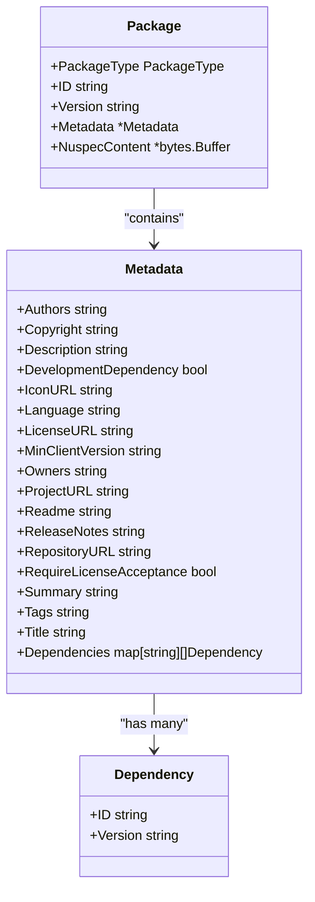
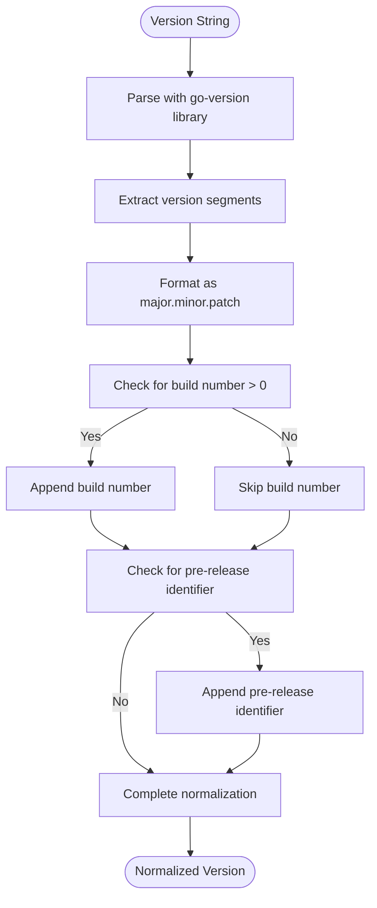
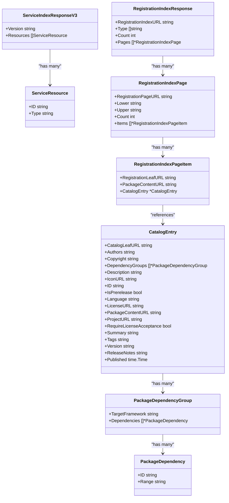
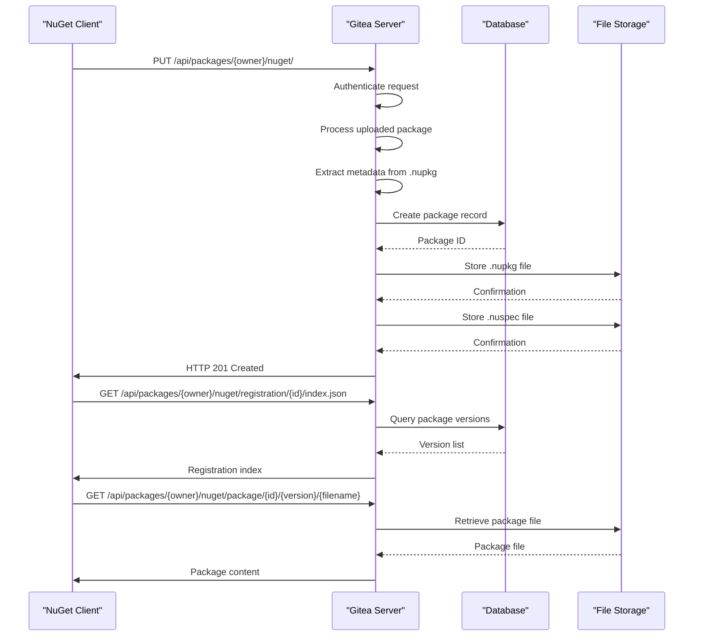
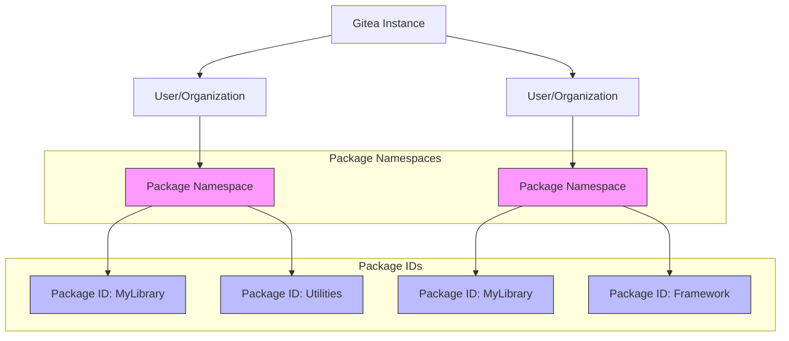
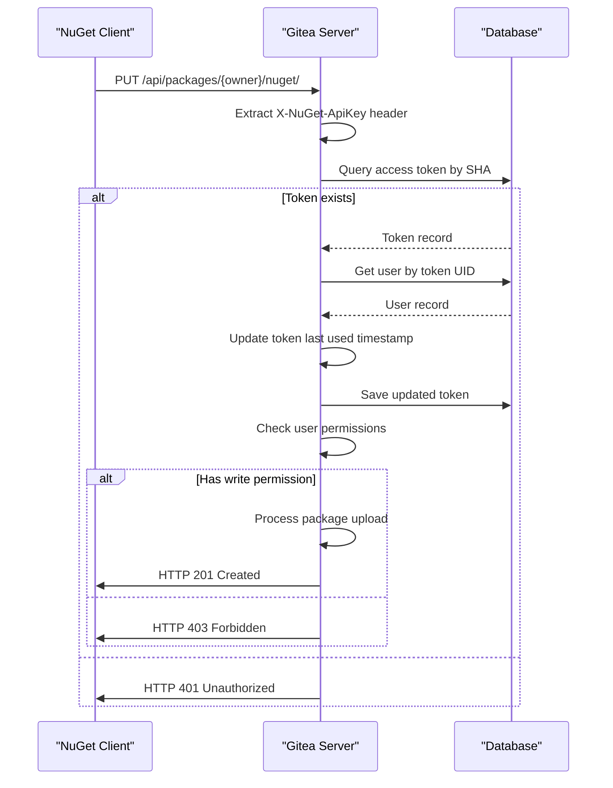
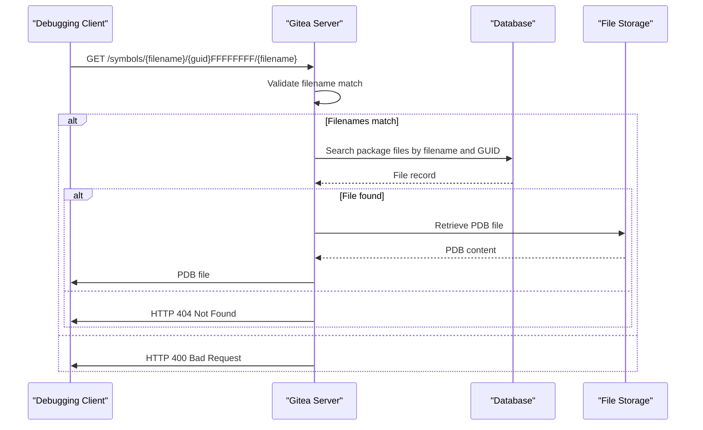
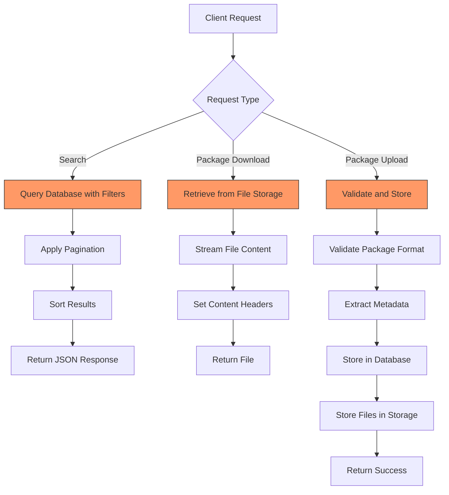

# nuget Registry

<cite>
**Referenced Files in This Document**   
- [nuget.go](file://routers/api/packages/nuget/nuget.go)
- [api_v2.go](file://routers/api/packages/nuget/api_v2.go)
- [api_v3.go](file://routers/api/packages/nuget/api_v3.go)
- [auth.go](file://routers/api/packages/nuget/auth.go)
- [links.go](file://routers/api/packages/nuget/links.go)
- [metadata.go](file://modules/packages/nuget/metadata.go)
- [search.go](file://models/packages/nuget/search.go)
</cite>

## Table of Contents
1. [Introduction](#introduction)
2. [NuGet Package Format and Metadata Structure](#nuget-package-format-and-metadata-structure)
3. [Versioning System and Normalization](#versioning-system-and-normalization)
4. [NuGet Service Layer Implementation](#nuget-service-layer-implementation)
5. [Package Publishing and Consumption](#package-publishing-and-consumption)
6. [Package ID and Repository Namespace Relationship](#package-id-and-repository-namespace-relationship)
7. [Authentication and Security](#authentication-and-security)
8. [Symbol Server Integration](#symbol-server-integration)
9. [Configuration and Performance Considerations](#configuration-and-performance-considerations)
10. [Troubleshooting Common Issues](#troubleshooting-common-issues)

## Introduction
The nuget registry implementation in Gitea provides a comprehensive package management system for .NET developers. This document details the architecture, implementation, and operational aspects of the nuget package registry, focusing on the specific requirements and workflows associated with nuget packages. The system supports both v2 and v3 API specifications, enabling compatibility with various nuget clients and tools. The implementation handles package publishing, consumption, metadata management, and versioning according to nuget standards while integrating seamlessly with Gitea's existing package management infrastructure.

## NuGet Package Format and Metadata Structure

The nuget package format handling in Gitea follows the official nuget specification, with specific implementation details in the `metadata.go` file. The system processes nuget packages (`.nupkg` files) which are essentially ZIP archives containing the package content and a NUSPEC file that describes the package metadata.

The metadata structure is defined by the `Metadata` struct in the nuget module, which includes essential fields such as:
- **Authors**: Package authors
- **Description**: Package description
- **Copyright**: Copyright information
- **Dependencies**: Package dependencies organized by target framework
- **IconURL**: URL to the package icon
- **LicenseURL**: URL to the package license
- **ProjectURL**: URL to the project homepage
- **Tags**: Package tags for discoverability
- **Title**: Package title
- **RequireLicenseAcceptance**: Whether license acceptance is required

The system validates the package ID format using a regular expression pattern `\A\w+(?:[.-]\w+)*\z`, ensuring it conforms to nuget specifications. The NUSPEC file is limited to a maximum size of 3MB to prevent abuse and ensure system performance.

**Diagram sources**
- [metadata.go](file://modules/packages/nuget/metadata.go#L0-L276)

**Section sources**
- [metadata.go](file://modules/packages/nuget/metadata.go#L0-L276)

## Versioning System and Normalization

The nuget registry implements a sophisticated versioning system that adheres to semver standards while providing normalization for consistent package management. The version normalization process converts version strings to a standardized format as specified by nuget guidelines.

The version normalization function `toNormalizedVersion` processes version strings according to the following rules:
- Removes leading zeros from version segments
- Preserves pre-release identifiers
- Formats the version as `major.minor.patch.build` where applicable
- Handles pre-release versions by appending the pre-release identifier with a hyphen

For example, version `1.04.5.2.5-rc.1+metadata` is normalized to `1.4.5.2-rc.1`, maintaining semantic versioning compatibility while ensuring consistent representation across the system.

The system uses the `go-version` library to parse and compare version strings, enabling proper version ordering and dependency resolution. This ensures that when multiple versions of a package exist, they are correctly sorted and the appropriate version is selected based on dependency requirements.

**Diagram sources**
- [metadata.go](file://modules/packages/nuget/metadata.go#L224-L275)

**Section sources**
- [metadata.go](file://modules/packages/nuget/metadata.go#L224-L275)

## NuGet Service Layer Implementation

The nuget service layer is implemented across multiple files in the `routers/api/packages/nuget` directory, providing comprehensive API endpoints for package management. The service layer follows the nuget v2 and v3 API specifications, ensuring compatibility with standard nuget clients.

The implementation is organized into several key components:
- **Service Index**: Provides discovery endpoints for available resources
- **Package Publishing**: Handles package upload and registration
- **Package Metadata**: Manages package information and search capabilities
- **Package Download**: Facilitates package retrieval
- **Registration Service**: Maintains package registration information

The service layer uses a link builder pattern to generate consistent URLs for various endpoints, ensuring proper navigation and resource location. The `linkBuilder` struct in `links.go` provides methods for generating URLs for registration indexes, registration leaves, package downloads, and package metadata.

**Diagram sources**
- [api_v3.go](file://routers/api/packages/nuget/api_v3.go#L0-L315)

**Section sources**
- [nuget.go](file://routers/api/packages/nuget/nuget.go#L0-L705)
- [api_v3.go](file://routers/api/packages/nuget/api_v3.go#L0-L315)

## Package Publishing and Consumption

The package publishing and consumption workflow in the nuget registry follows the standard nuget client-server interaction model. Packages are published using the `nuget push` command, which sends an HTTP PUT request to the package publish endpoint.

The publishing process involves:
1. Client authentication using API key or basic authentication
2. Package upload to the server
3. Metadata extraction and validation
4. Package storage in the database and file system
5. Registration in the package catalog

The `UploadPackage` function in `nuget.go` handles the package upload process, validating the package format, extracting metadata, and storing the package files. The system creates both the main package file (`.nupkg`) and the NUSPEC file as separate entries in the package storage system.

For package consumption, clients use the `nuget install` command or package restore functionality, which queries the registration service to discover available packages and their versions. The system supports both v2 and v3 API endpoints for package discovery and download.

**Diagram sources**
- [nuget.go](file://routers/api/packages/nuget/nuget.go#L423-L471)
- [api_v2.go](file://routers/api/packages/nuget/api_v2.go#L352-L379)

**Section sources**
- [nuget.go](file://routers/api/packages/nuget/nuget.go#L423-L471)
- [api_v2.go](file://routers/api/packages/nuget/api_v2.go#L352-L379)

## Package ID and Repository Namespace Relationship

The relationship between nuget package IDs and Gitea repository namespaces is implemented through the package owner system. Each package is associated with a specific owner (user or organization), and the package endpoint includes the owner's name in the URL path.

The package namespace is structured as `/api/packages/{owner}/nuget/`, where `{owner}` represents the Gitea user or organization that owns the package. This creates a clear separation between packages from different owners, even if they have the same package ID.

When a package is published, the system verifies that the authenticated user has write access to the owner's namespace. This ensures that only authorized users can publish packages to a specific namespace. The package ID itself is independent of the repository name, allowing multiple packages to be published from a single repository.

The search functionality respects the namespace boundaries, returning only packages from the specified owner unless the user has appropriate permissions to access packages from other namespaces. This provides both isolation and controlled sharing of packages within the Gitea instance.

**Diagram sources**
- [nuget.go](file://routers/api/packages/nuget/nuget.go#L47-L85)
- [api.go](file://routers/api/packages/api.go#L354-L385)

**Section sources**
- [nuget.go](file://routers/api/packages/nuget/nuget.go#L47-L85)

## Authentication and Security

The nuget registry implements API key authentication for package publishing operations, following the nuget specification. The authentication system is implemented in the `auth.go` file and integrates with Gitea's existing access token system.

The authentication process works as follows:
1. The client sends an HTTP request with the `X-NuGet-ApiKey` header containing the API key
2. The server validates the API key by looking up the corresponding access token in the database
3. If valid, the associated user is authenticated and granted appropriate permissions
4. The access token's last used timestamp is updated for audit purposes

The system supports both API key authentication and basic authentication (username/password) for compatibility with different client configurations. Write operations (package publishing) require authentication with appropriate permissions, while read operations (package download, metadata retrieval) may be accessible to anonymous users depending on the package visibility settings.

The authentication system also handles token scope validation, ensuring that tokens with write permissions are required for package publishing operations. This prevents unauthorized package uploads and maintains the integrity of the package registry.

**Diagram sources**
- [auth.go](file://routers/api/packages/nuget/auth.go#L0-L48)

**Section sources**
- [auth.go](file://routers/api/packages/nuget/auth.go#L0-L48)

## Symbol Server Integration

The nuget registry supports symbol server integration for debugging purposes, allowing developers to publish and retrieve symbol files (PDB files) alongside their packages. The symbol server functionality is implemented according to the Simple Symbol Query Protocol specification.

Symbol packages (`.snupkg` files) can be published separately from the main package, containing portable PDB files and other debugging symbols. The system extracts the PDB files from the symbol package and stores them with their GUID identifiers, enabling efficient symbol retrieval during debugging sessions.

The symbol server endpoint follows the pattern `/symbols/{filename}/{guid}/{filename}` and supports case-insensitive GUID matching with the last 8 characters masked as 'F' for compatibility with Visual Studio and other debugging tools. This allows debuggers to locate the appropriate symbol files based on the binary's debug information.

The integration ensures that symbol files are properly associated with their corresponding packages, maintaining the relationship between binaries and their debugging symbols while providing efficient lookup capabilities.

**Diagram sources**
- [nuget.go](file://routers/api/packages/nuget/nuget.go#L618-L664)
- [api.go](file://routers/api/packages/api.go#L354-L385)

**Section sources**
- [nuget.go](file://routers/api/packages/nuget/nuget.go#L618-L664)

## Configuration and Performance Considerations

The nuget registry implementation includes several performance optimizations and configuration considerations for handling large package repositories. The system is designed to efficiently manage package metadata and file storage while providing responsive API endpoints.

Key performance considerations include:
- **Package Size Limits**: The NUSPEC file size is limited to 3MB to prevent abuse and ensure system stability
- **Database Indexing**: Package names and versions are indexed for efficient searching and retrieval
- **Caching**: Package metadata and search results can be cached to reduce database load
- **Pagination**: Large result sets are paginated to prevent memory exhaustion
- **File Storage**: Package files are stored separately from metadata to optimize retrieval

The search functionality is optimized through the use of database queries with appropriate filtering and sorting. The `SearchVersions` function in `search.go` implements efficient querying with support for pagination and case-insensitive name matching. The system uses SQL builder patterns to construct optimized queries that leverage database indexes for improved performance.

For large repositories, the system can be configured to use external storage backends for package files, reducing the load on the primary database. The package service layer abstracts the storage implementation, allowing for flexible configuration based on deployment requirements.

**Diagram sources**
- [search.go](file://models/packages/nuget/search.go#L0-L70)
- [nuget.go](file://routers/api/packages/nuget/nuget.go#L354-L385)

**Section sources**
- [search.go](file://models/packages/nuget/search.go#L0-L70)

## Troubleshooting Common Issues

This section addresses common issues encountered when working with the nuget registry and provides guidance for resolution.

### API Key Authentication Failures
Common causes and solutions:
- **Invalid API key**: Verify the API key format and ensure it matches a valid access token
- **Insufficient permissions**: Ensure the token has write permissions for package operations
- **Expired token**: Check if the token has expired and generate a new one if necessary
- **Incorrect header**: Verify the `X-NuGet-ApiKey` header is properly formatted

### Package Validation Failures
Common validation issues and solutions:
- **Invalid package ID**: Ensure the package ID matches the pattern `\A\w+(?:[.-]\w+)*\z`
- **Missing NUSPEC file**: Verify the package contains a valid NUSPEC file in the root directory
- **Invalid version format**: Ensure the version string is a valid semver
- **Large NUSPEC file**: Reduce the NUSPEC file size below 3MB if it exceeds the limit

### Symbol Server Issues
Common symbol server problems and solutions:
- **404 Not Found for symbols**: Verify the filename and GUID match exactly, including case
- **400 Bad Request**: Ensure both filename parameters in the URL are identical
- **Slow symbol retrieval**: Check storage performance and consider optimizing file access

### Performance Optimization Techniques
- **Enable caching**: Configure response caching for frequently accessed endpoints
- **Optimize database**: Ensure proper indexing on package name and version fields
- **Use external storage**: For large repositories, consider using external file storage
- **Monitor package sizes**: Implement quotas to prevent excessively large packages
- **Regular maintenance**: Perform database optimization and cleanup operations regularly

**Section sources**
- [nuget.go](file://routers/api/packages/nuget/nuget.go#L423-L471)
- [auth.go](file://routers/api/packages/nuget/auth.go#L0-L48)
- [metadata.go](file://modules/packages/nuget/metadata.go#L0-L276)