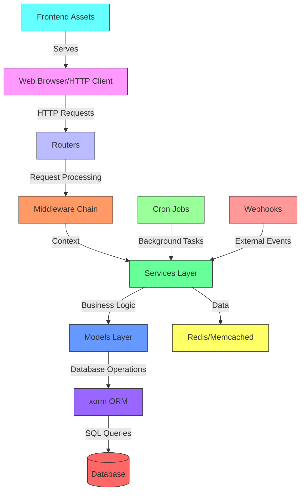
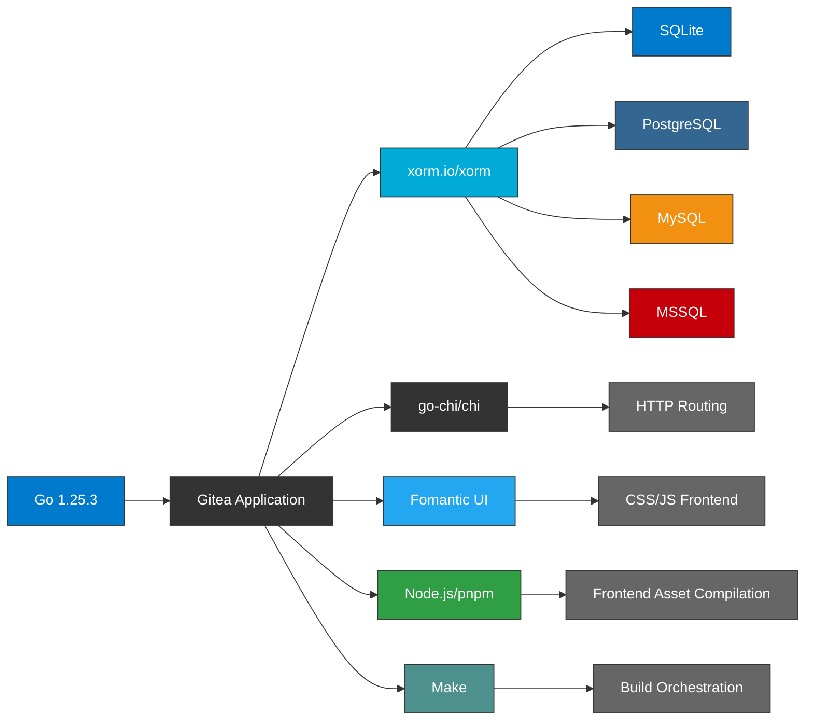
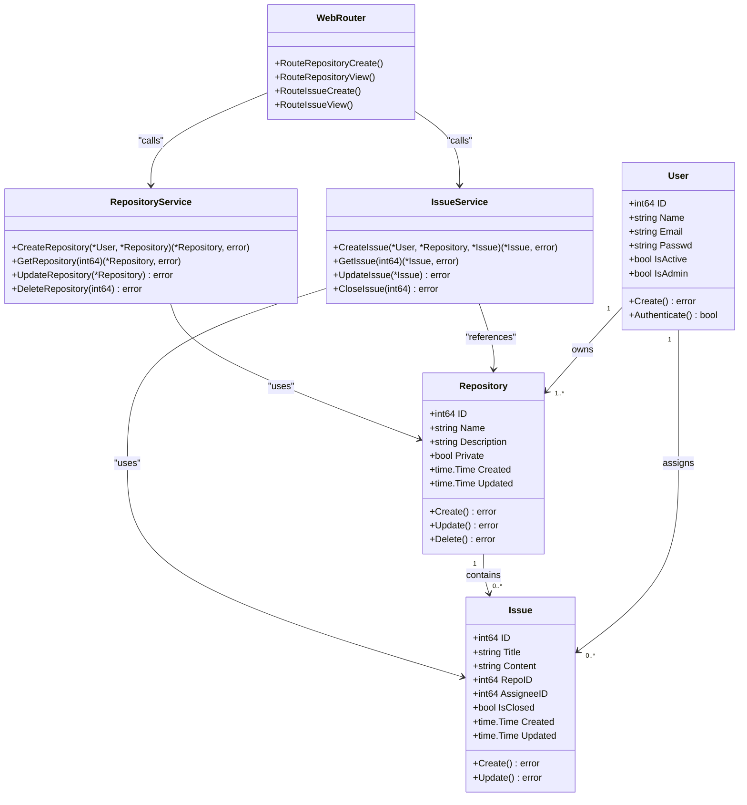

# Project Overview

<cite>
**Referenced Files in This Document**   
- [main.go](file://main.go)
- [go.mod](file://go.mod)
- [README.md](file://README.md)
- [models/repo.go](file://models/repo.go)
- [routers/web/repo.go](file://routers/web/repo.go)
- [services/repository/create.go](file://services/repository/create.go)
- [models/issues/issue.go](file://models/issues/issue.go)
- [routers/web/repo/issue.go](file://routers/web/repo/issue.go)
- [modules/setting/setting.go](file://modules/setting/setting.go)
- [routers/init.go](file://routers/init.go)
- [models/db/engine.go](file://models/db/engine.go)
- [routers/api/v1/api.go](file://routers/api/v1/api.go)
- [modules/web/middleware.go](file://modules/web/middleware.go)
</cite>

## Table of Contents
1. [Introduction](#introduction)
2. [Core Functionality](#core-functionality)
3. [Architecture Overview](#architecture-overview)
4. [Technology Stack](#technology-stack)
5. [Component Relationships](#component-relationships)
6. [Practical Examples](#practical-examples)
7. [Conclusion](#conclusion)

## Introduction

Gitea is a lightweight, open-source, self-hosted Git service designed to provide a painless and efficient way to manage source code repositories. Written entirely in Go, Gitea offers a full suite of DevOps tools including repository management, issue tracking, pull requests, wiki, package registry, and built-in CI/CD capabilities. The project originated as a fork of Gogs in 2016 and has since evolved into a robust platform supporting multiple database backends and deployment architectures across Linux, macOS, Windows, and various CPU architectures including x86, ARM, and PowerPC.

As a self-hosted solution, Gitea empowers organizations and individuals to maintain full control over their code and data while providing a GitHub-like experience. The application follows a modular, layered architecture that separates concerns between data access, business logic, routing, and presentation layers. This design enables extensibility, maintainability, and clean separation of responsibilities throughout the codebase.

**Section sources**
- [README.md](file://README.md#L1-L40)
- [main.go](file://main.go#L1-L62)

## Core Functionality

Gitea provides comprehensive Git repository management with a rich set of collaboration features. At its core, it enables users to create, clone, and manage Git repositories through both web interface and standard Git protocols. The platform supports SSH, HTTP/HTTPS, and Git protocol access to repositories, allowing seamless integration with existing Git tooling.

Beyond basic repository hosting, Gitea includes integrated issue tracking with labels, milestones, and assignees, enabling teams to manage their development workflow within the same platform. Pull requests facilitate code review with inline comments, approval workflows, and merge strategies including rebase, squash, and merge commits. The wiki system provides Markdown-based documentation tied to repositories, while the package registry supports multiple package formats including Alpine, Debian, Docker, npm, NuGet, and more.

The built-in CI/CD system, Gitea Actions, allows automated testing and deployment workflows defined through YAML configuration files. Additional features include user and organization management, access control with fine-grained permissions, webhooks for external integrations, and LDAP/SSO authentication support. The system also provides activity tracking, notifications, and RSS/Atom feeds for monitoring project activity.

**Section sources**
- [README.md](file://README.md#L1-L100)
- [models/repo.go](file://models/repo.go#L1-L50)
- [models/issues/issue.go](file://models/issues/issue.go#L1-L40)

## Architecture Overview

Gitea follows a layered, modular architecture with clear separation between components. The application is structured around several key layers: models for data representation, services for business logic, routers for request handling, and frontend assets for user interface presentation. This clean separation enables maintainability and testability across the codebase.

The backend is built using Go with the go-chi/chi web framework (formerly using go-macaron/macaron) for routing HTTP requests. Data persistence is handled through xorm.io/xorm as an ORM layer, supporting multiple database systems including SQLite, PostgreSQL, MySQL, and MSSQL. The frontend uses Fomantic UI (a Semantic UI fork) for styling, with JavaScript components enhancing interactivity.

**Diagram sources**
- [routers/init.go](file://routers/init.go#L1-L30)
- [modules/setting/setting.go](file://modules/setting/setting.go#L1-L100)
- [models/db/engine.go](file://models/db/engine.go#L1-L50)

## Technology Stack

Gitea leverages a modern technology stack optimized for performance, portability, and developer experience. The backend is implemented in Go (Golang), taking advantage of Go's concurrency model, static compilation, and excellent standard library. The web framework has transitioned from go-macaron/macaron to go-chi/chi, providing a more standard-compliant and performant routing layer.

For object-relational mapping, Gitea uses xorm.io/xorm, which provides a powerful interface for database operations while supporting multiple database backends. The frontend is built with Fomantic UI for styling and layout, complemented by custom JavaScript for dynamic interactions. Build tooling relies on Make, Node.js, and pnpm for managing dependencies and compiling assets.

The application incorporates several key libraries: github.com/go-chi/chi for HTTP routing, gopkg.in/ini.v1 for configuration parsing, github.com/sergi/go-diff for diff operations, and various Go Git libraries for repository operations. For authentication, Gitea supports multiple methods including LDAP, OAuth2, SMTP, and WebAuthn, with pluggable authentication sources.

**Diagram sources**
- [go.mod](file://go.mod#L1-L310)
- [package.json](file://package.json#L1-L50)
- [Makefile](file://Makefile#L1-L100)

## Component Relationships

The Gitea codebase is organized into several key directories that represent distinct architectural layers. The `models` directory contains data structures and database access methods, representing the application's domain entities such as User, Repository, Issue, and Milestone. These models use xorm tags to define database mappings and relationships.

The `routers` directory handles HTTP request routing, with separate packages for web interface routes (`web/`) and API endpoints (`api/`). Routers parse incoming requests, validate parameters, and delegate to appropriate service functions. The `services` directory contains the business logic layer, implementing use cases like repository creation, issue management, and user authentication. Services coordinate between multiple models and handle transaction boundaries.

Middleware components in `modules/web/middleware.go` provide cross-cutting concerns like authentication, logging, and request context management. The dependency flow follows a unidirectional pattern: routers depend on services, services depend on models, and models depend on the database layer. This architecture prevents circular dependencies and makes testing easier through dependency injection.

**Diagram sources**
- [models/repo.go](file://models/repo.go#L1-L100)
- [models/issues/issue.go](file://models/issues/issue.go#L1-L100)
- [services/repository/create.go](file://services/repository/create.go#L1-L50)
- [routers/web/repo.go](file://routers/web/repo.go#L1-L50)

## Practical Examples

### Repository Creation Workflow
When a user creates a new repository through the web interface, the following sequence occurs: the browser sends a POST request to `/repo/create` which is handled by the `Create` function in `routers/web/repo.go`. The router middleware authenticates the user and binds form data to a Repository model. The request is then passed to `services/repository.CreateRepository()` which validates the input, checks permissions, creates the database record using xorm, initializes the Git repository on disk, and returns the result. The router then redirects to the new repository's home page.

### Issue Tracking Process
Creating an issue follows a similar pattern: the web form submits to `/repo/owner/repo/issues/new` routed to `routers/web/repo/issue.go`. After authentication and CSRF validation, the request data is passed to `services/issue.CreateIssue()` which creates both the database record and associated activity entry. The service layer handles side effects like sending notifications to watchers and updating repository statistics. The entire operation runs within a database transaction to ensure consistency.

These workflows demonstrate Gitea's consistent architectural pattern: presentation layer (routers) receives input, service layer processes business logic with proper validation and transaction management, and data access layer (models) persists changes to the database. This separation allows for clear extension points and testing at each layer.

**Section sources**
- [routers/web/repo.go](file://routers/web/repo.go#L100-L200)
- [services/repository/create.go](file://services/repository/create.go#L50-L150)
- [routers/web/repo/issue.go](file://routers/web/repo/issue.go#L1-L100)
- [services/issue/create.go](file://services/issue/create.go#L1-L100)

## Conclusion

Gitea represents a comprehensive, self-hosted Git service with a well-structured, modular architecture that balances functionality with maintainability. Its Go-based implementation provides excellent performance and cross-platform compatibility, while the layered design separates concerns between data access, business logic, and presentation. The technology stack leverages proven libraries for ORM, web routing, and frontend development, creating a cohesive ecosystem for source code management.

The architecture demonstrates several best practices: clear separation of concerns, dependency injection, middleware for cross-cutting concerns, and comprehensive API support. By providing both a rich web interface and RESTful API, Gitea serves both end users and automation workflows. The extensible plugin system and webhook support enable integration with external tools, making it adaptable to various development environments.

For developers, Gitea offers a transparent codebase with consistent patterns throughout, making contributions accessible. The project's documentation, active community, and straightforward build process lower the barrier to entry for both users and contributors. As organizations increasingly seek control over their development infrastructure, Gitea provides a compelling open-source alternative to cloud-based Git hosting services.

**Section sources**
- [README.md](file://README.md#L1-L214)
- [main.go](file://main.go#L1-L62)
- [go.mod](file://go.mod#L1-L310)