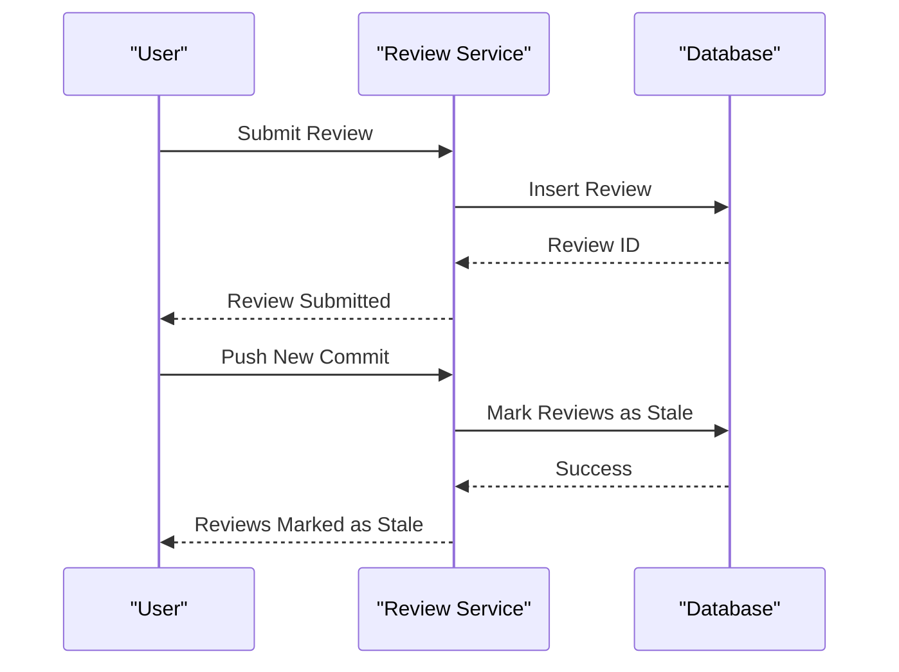
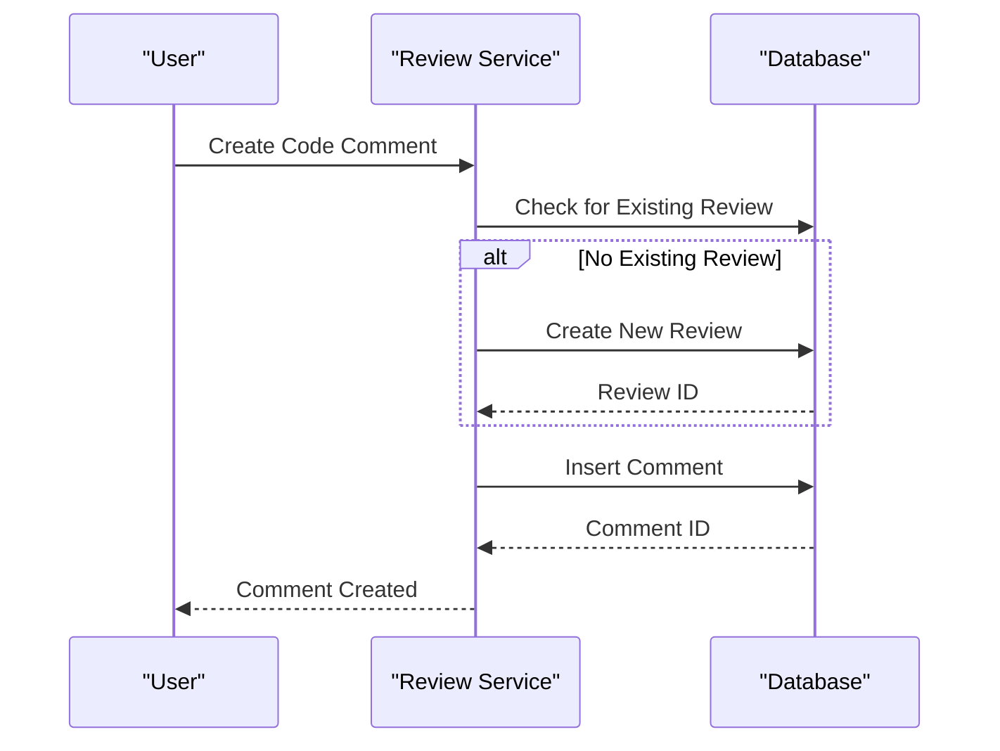
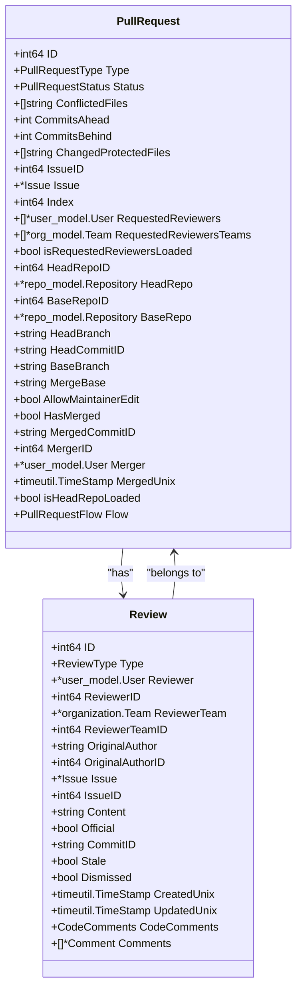
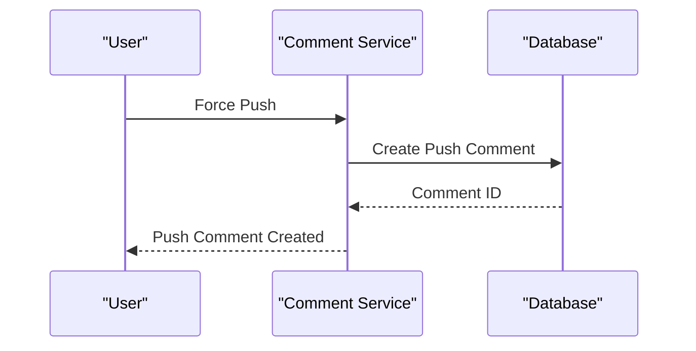

# Code Review Workflow

<cite>
**Referenced Files in This Document**   
- [review.go](file://services/pull/review.go)
- [comment.go](file://services/pull/comment.go)
- [review.go](file://models/issues/review.go)
- [comment.go](file://models/issues/comment.go)
- [pull.go](file://models/issues/pull.go)
</cite>

## Table of Contents
1. [Introduction](#introduction)
2. [Domain Model of Code Reviews](#domain-model-of-code-reviews)
3. [Review State Management](#review-state-management)
4. [Creating and Managing Review Comments](#creating-and-managing-review-comments)
5. [Pull Request and Review Relationship](#pull-request-and-review-relationship)
6. [Handling Force Pushes and Notifications](#handling-force-pushes-and-notifications)
7. [Best Practices for Code Reviews](#best-practices-for-code-reviews)
8. [Conclusion](#conclusion)

## Introduction
This document provides a comprehensive overview of Gitea's code review workflow, focusing on the implementation details of the code review system. It covers the creation, threading, and resolution of review comments, the domain model of code reviews, and how review states are persisted in the database. The document also explains the relationship between pull requests and reviews, including how review status affects merge eligibility. Additionally, it addresses common issues such as lost comments during force pushes and notification delivery, and provides best practices for conducting effective code reviews and managing review threads.

**Section sources**
- [review.go](file://services/pull/review.go#L1-L497)
- [comment.go](file://services/pull/comment.go#L1-L87)

## Domain Model of Code Reviews
The domain model of code reviews in Gitea is centered around the `Review` and `Comment` entities. A `Review` represents a collection of code comments that provide feedback on a pull request. Each `Review` is associated with a specific issue (pull request) and can have one of several types: `Pending`, `Approve`, `Reject`, `Comment`, or `Request`. The `Review` entity includes fields such as `ID`, `Type`, `Reviewer`, `Issue`, `Content`, `Official`, `CommitID`, `Stale`, and `Dismissed`.

The `Comment` entity is used to store individual comments within a review. Each `Comment` has a `Type` field that can be `CommentTypeCode` for code comments, `CommentTypeReview` for general review comments, and other types for different kinds of comments. The `Comment` entity also includes fields such as `ID`, `Poster`, `Issue`, `Content`, `Line`, `TreePath`, `Patch`, and `ReviewID`.

```mermaid
classDiagram
class Review {
+int64 ID
+ReviewType Type
+*user_model.User Reviewer
+int64 ReviewerID
+*organization.Team ReviewerTeam
+int64 ReviewerTeamID
+string OriginalAuthor
+int64 OriginalAuthorID
+*Issue Issue
+int64 IssueID
+string Content
+bool Official
+string CommitID
+bool Stale
+bool Dismissed
+timeutil.TimeStamp CreatedUnix
+timeutil.TimeStamp UpdatedUnix
+CodeComments CodeComments
+[]*Comment Comments
}
class Comment {
+int64 ID
+CommentType Type
+int64 PosterID
+*user_model.User Poster
+string OriginalAuthor
+int64 OriginalAuthorID
+int64 IssueID
+*Issue Issue
+int64 LabelID
+*Label Label
+[]*Label AddedLabels
+[]*Label RemovedLabels
+int64 OldProjectID
+int64 ProjectID
+*project_model.Project OldProject
+*project_model.Project Project
+int64 OldMilestoneID
+int64 MilestoneID
+*Milestone OldMilestone
+*Milestone Milestone
+int64 TimeID
+*TrackedTime Time
+int64 AssigneeID
+bool RemovedAssignee
+*user_model.User Assignee
+int64 AssigneeTeamID
+*organization.Team AssigneeTeam
+int64 ResolveDoerID
+*user_model.User ResolveDoer
+string OldTitle
+string NewTitle
+string OldRef
+string NewRef
+int64 DependentIssueID
+*Issue DependentIssue
+int64 CommitID
+int64 Line
+string TreePath
+string Content
+int ContentVersion
+template.HTML RenderedContent
+string Patch
+string PatchQuoted
+timeutil.TimeStamp CreatedUnix
+timeutil.TimeStamp UpdatedUnix
+string CommitSHA
+[]*repo_model.Attachment Attachments
+ReactionList Reactions
+RoleDescriptor ShowRole
+*Review Review
+int64 ReviewID
+bool Invalidated
+int64 RefRepoID
+int64 RefIssueID
+int64 RefCommentID
+references.XRefAction RefAction
+bool RefIsPull
+*CommentMetaData CommentMetaData
+*repo_model.Repository RefRepo
+*Issue RefIssue
+*Comment RefComment
+[]*git_model.SignCommitWithStatuses Commits
+string OldCommit
+string NewCommit
+int64 CommitsNum
+bool IsForcePush
}
Review --> Comment : "has"
Comment --> Review : "belongs to"
```

**Diagram sources**
- [review.go](file://models/issues/review.go#L1-L799)
- [comment.go](file://models/issues/comment.go#L1-L799)

**Section sources**
- [review.go](file://models/issues/review.go#L1-L799)
- [comment.go](file://models/issues/comment.go#L1-L799)

## Review State Management
The review state in Gitea is managed through the `Review` entity, which includes fields such as `Type`, `Stale`, and `Dismissed`. The `Type` field can be one of the following: `Pending`, `Approve`, `Reject`, `Comment`, or `Request`. The `Stale` field indicates whether the review is stale, meaning it was made on a previous commit and may no longer be relevant. The `Dismissed` field indicates whether the review has been dismissed.

When a new commit is pushed to the pull request, the system checks if the review is still valid by comparing the commit SHA. If the commit SHA has changed, the review is marked as stale. This is done using the `MarkReviewsAsStale` function, which updates the `stale` field in the database.

**Diagram sources**
- [review.go](file://services/pull/review.go#L1-L497)
- [review.go](file://models/issues/review.go#L1-L799)

**Section sources**
- [review.go](file://services/pull/review.go#L1-L497)
- [review.go](file://models/issues/review.go#L1-L799)

## Creating and Managing Review Comments
Creating and managing review comments in Gitea involves several steps. When a user creates a code comment, the system first checks if there is an existing pending review for the user. If not, a new pending review is created. The comment is then associated with the review and stored in the database.

The `CreateCodeComment` function in `services/pull/review.go` handles the creation of code comments. It takes parameters such as the user, the issue, the line number, the content, the tree path, and whether the comment is part of a pending review. If the comment is part of a pending review, it is associated with the existing review. Otherwise, a new review is created.

**Diagram sources**
- [review.go](file://services/pull/review.go#L1-L497)
- [comment.go](file://models/issues/comment.go#L1-L799)

**Section sources**
- [review.go](file://services/pull/review.go#L1-L497)
- [comment.go](file://models/issues/comment.go#L1-L799)

## Pull Request and Review Relationship
The relationship between pull requests and reviews is managed through the `PullRequest` and `Review` entities. Each pull request can have multiple reviews, and each review is associated with a specific pull request. The `PullRequest` entity includes fields such as `ID`, `IssueID`, `HeadRepoID`, `BaseRepoID`, `HeadBranch`, `BaseBranch`, `MergeBase`, `HasMerged`, `MergedCommitID`, `MergerID`, and `MergedUnix`.

The `Review` entity includes a `ReviewID` field that references the `ID` of the `PullRequest` it is associated with. This allows the system to track which reviews belong to which pull requests.

**Diagram sources**
- [pull.go](file://models/issues/pull.go#L1-L799)
- [review.go](file://models/issues/review.go#L1-L799)

**Section sources**
- [pull.go](file://models/issues/pull.go#L1-L799)
- [review.go](file://models/issues/review.go#L1-L799)

## Handling Force Pushes and Notifications
When a force push is made to a pull request, the system needs to handle the potential loss of comments and ensure that notifications are delivered correctly. The `CreatePushPullComment` function in `services/pull/comment.go` is responsible for creating a comment that indicates a force push has occurred. This function takes parameters such as the pusher, the pull request, the old commit ID, the new commit ID, and whether the push was a force push.

If the push is a force push, the function creates a comment with the `CommentTypePullRequestPush` type and includes the old and new commit IDs in the comment content. This helps users understand the changes that have been made and why their comments may have been lost.

**Diagram sources**
- [comment.go](file://services/pull/comment.go#L1-L87)
- [comment.go](file://models/issues/comment.go#L1-L799)

**Section sources**
- [comment.go](file://services/pull/comment.go#L1-L87)
- [comment.go](file://models/issues/comment.go#L1-L799)

## Best Practices for Code Reviews
Conducting effective code reviews is crucial for maintaining code quality and ensuring that changes are well-understood by the team. Here are some best practices for conducting code reviews in Gitea:

1. **Be Specific and Constructive**: Provide specific feedback on the code, focusing on areas that need improvement. Avoid vague comments and be constructive in your suggestions.
2. **Use Inline Comments**: Use inline comments to point out specific lines of code that need attention. This helps the author understand exactly what needs to be changed.
3. **Request Changes When Necessary**: If you find issues that need to be addressed before the code can be merged, use the "Request Changes" option to clearly indicate that the pull request cannot be merged in its current state.
4. **Approve When Ready**: Once you are satisfied with the changes, use the "Approve" option to indicate that the pull request can be merged.
5. **Communicate Clearly**: Use clear and concise language in your comments. Avoid using jargon or technical terms that may not be familiar to all team members.
6. **Respect the Author**: Be respectful and professional in your comments. Avoid personal attacks or negative language.
7. **Follow Up**: After providing feedback, follow up with the author to ensure that the changes have been made and that the pull request is ready to be merged.

**Section sources**
- [review.go](file://services/pull/review.go#L1-L497)
- [comment.go](file://services/pull/comment.go#L1-L87)

## Conclusion
Gitea's code review workflow is designed to be flexible and powerful, allowing teams to conduct thorough and effective code reviews. By understanding the domain model, review state management, and the relationship between pull requests and reviews, teams can make the most of Gitea's features to improve code quality and collaboration. Following best practices for code reviews ensures that the process is constructive and respectful, leading to better outcomes for the project.

**Section sources**
- [review.go](file://services/pull/review.go#L1-L497)
- [comment.go](file://services/pull/comment.go#L1-L87)