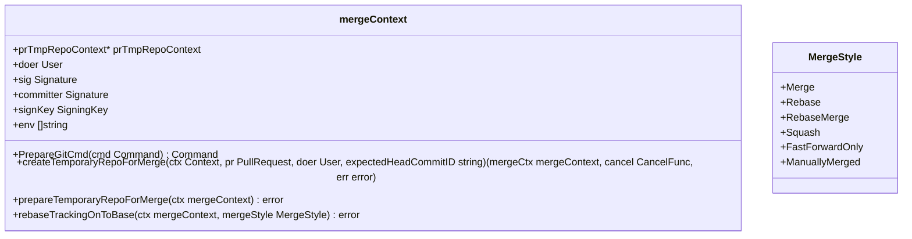
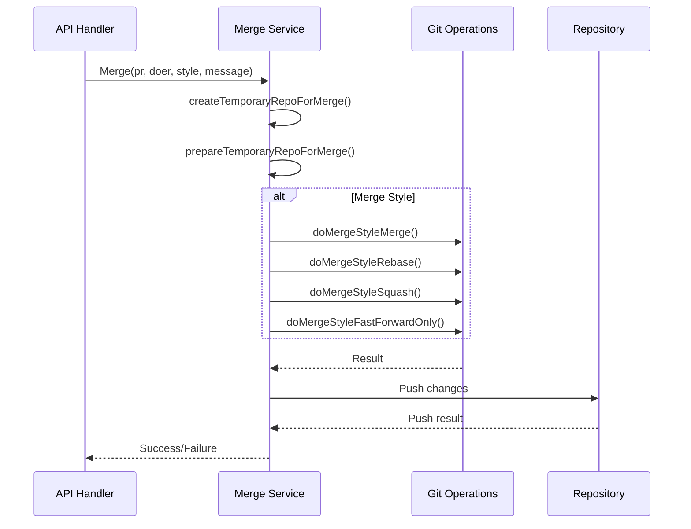
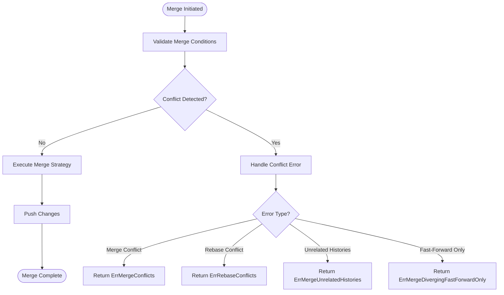

# Merge Strategies

<cite>
**Referenced Files in This Document**   
- [merge.go](file://services/pull/merge.go)
- [merge_merge.go](file://services/pull/merge_merge.go)
- [merge_rebase.go](file://services/pull/merge_rebase.go)
- [merge_squash.go](file://services/pull/merge_squash.go)
- [merge_ff_only.go](file://services/pull/merge_ff_only.go)
- [merge_prepare.go](file://services/pull/merge_prepare.go)
</cite>

## Table of Contents
1. [Introduction](#introduction)
2. [Merge Strategy Overview](#merge-strategy-overview)
3. [Domain Model of Merge Operations](#domain-model-of-merge-operations)
4. [Merge Strategy Implementation Details](#merge-strategy-implementation-details)
5. [Pre-Merge Checks and Validation](#pre-merge-checks-and-validation)
6. [Conflict Detection and Resolution](#conflict-detection-and-resolution)
7. [Commit Generation and Signing](#commit-generation-and-signing)
8. [Error Handling and Common Issues](#error-handling-and-common-issues)
9. [Strategy Selection Guidance](#strategy-selection-guidance)
10. [Conclusion](#conclusion)

## Introduction
This document provides a comprehensive analysis of Gitea's pull request merge strategies implementation. It details the four available merge strategies: merge commit, rebase and merge, squash and merge, and fast-forward only. The documentation covers the domain model, pre-merge validation, conflict detection, and error handling mechanisms. The analysis focuses on the services/pull/merge_*.go files that implement the core merging functionality, explaining how each strategy transforms the commit history and interacts with Git operations.

## Merge Strategy Overview
Gitea implements four distinct pull request merge strategies that provide flexibility in how contributions are integrated into the base repository. Each strategy serves different workflow needs and has specific implications for the resulting commit history. The merge strategies are implemented as separate functions in the services/pull package, with a common entry point that routes to the appropriate implementation based on the selected strategy. The strategies include:

- **Merge Commit**: Creates a new merge commit that combines changes from both branches
- **Rebase and Merge**: Reapplies commits from the feature branch onto the base branch
- **Squash and Merge**: Combines all feature branch commits into a single commit
- **Fast-Forward Only**: Only allows merging when no merge commit is required

These strategies are designed to accommodate various team workflows and repository policies, from maintaining complete history to creating clean, linear histories.

**Section sources**
- [merge.go](file://services/pull/merge.go#L199-L236)
- [merge.go](file://services/pull/merge.go#L507-L539)

## Domain Model of Merge Operations
The merge operation domain model in Gitea centers around the `mergeContext` struct, which encapsulates all necessary information and state for performing a merge. This context includes references to the pull request, the doer (user performing the merge), Git signatures, signing keys, and environment variables. The model also incorporates pre-merge validation through repository unit configurations that determine which merge strategies are allowed.

The merge process follows a consistent pattern: create a temporary repository context, prepare the merge environment, execute the specific merge strategy, and push the results back to the base repository. The domain model ensures that all merge operations are performed in isolated temporary repositories to prevent interference with the main repository state during the merge process.

**Diagram sources**
- [merge_prepare.go](file://services/pull/merge_prepare.go#L60-L102)
- [merge.go](file://services/pull/merge.go#L199-L236)

## Merge Strategy Implementation Details
Each merge strategy is implemented as a separate function that operates on the `mergeContext`. The implementation follows a consistent pattern of preparing the Git command, executing it, and handling the results. The strategies differ in their Git command construction and post-merge processing.

### Merge Commit Strategy
The merge commit strategy creates a new commit that combines the changes from both branches. It uses `git merge --no-ff --no-commit` to create a merge commit without automatically committing, allowing for custom commit message generation. After the merge preparation, it creates the final commit with the generated message.

### Rebase and Merge Strategy
The rebase strategy reapplies commits from the feature branch onto the base branch. It first rebases the tracking branch onto the base branch, then either fast-forwards (for simple rebase) or creates a merge commit (for rebase-merge). The rebase process preserves the individual commit history while creating a linear timeline.

### Squash and Merge Strategy
The squash strategy combines all commits from the feature branch into a single commit. It uses `git merge --squash` to stage the changes, then creates a single commit with a generated message. The authorship of the squashed commit is determined by examining the commit history to find the most appropriate author signature.

### Fast-Forward Only Strategy
The fast-forward only strategy only allows merging when the base branch can be moved forward without creating a merge commit. It uses `git merge --ff-only` to ensure that no merge commit is created, maintaining a strictly linear history.

**Diagram sources**
- [merge_merge.go](file://services/pull/merge_merge.go#L10-L25)
- [merge_rebase.go](file://services/pull/merge_rebase.go#L70-L125)
- [merge_squash.go](file://services/pull/merge_squash.go#L40-L90)
- [merge_ff_only.go](file://services/pull/merge_ff_only.go#L10-L21)

## Pre-Merge Checks and Validation
Before executing any merge strategy, Gitea performs comprehensive validation to ensure the merge can proceed safely. The validation process includes checking repository permissions, verifying merge strategy availability, and confirming that the pull request meets all branch protection requirements.

The `IsUserAllowedToMerge` function checks if the user has write permissions to the code unit or is whitelisted in protected branch rules. The `CheckPullBranchProtections` function validates that all required status checks have passed, sufficient approvals have been obtained, and there are no requested changes blocking the merge.

Additionally, the system verifies that the head commit SHA matches the expected value to prevent race conditions where the branch has been updated between the merge decision and execution. This is implemented through the `ErrSHADoesNotMatch` error type, which ensures merge operations are based on the most recent state of the branch.

**Section sources**
- [merge.go](file://services/pull/merge.go#L199-L236)
- [merge_prepare.go](file://services/pull/merge_prepare.go#L60-L102)

## Conflict Detection and Resolution
Gitea implements robust conflict detection mechanisms that identify merge conflicts and provide appropriate error responses. The system uses Git's internal state files to detect conflicts: the presence of a MERGE_HEAD file indicates a merge conflict, while a REBASE_HEAD file indicates a rebase conflict.

When a conflict is detected, Gitea returns specific error types (`ErrMergeConflicts`, `ErrRebaseConflicts`) that include detailed information about the conflict, including standard output and error streams from the Git command. This information is used by the API layer to provide meaningful error responses to clients.

The conflict resolution process is designed to be transparent, with detailed logging that captures the state of the merge operation. The system also handles special cases like unrelated histories (detected by "refusing to merge unrelated histories" message) and fast-forward impossibility (detected by "Not possible to fast-forward" message).

**Diagram sources**
- [merge.go](file://services/pull/merge.go#L507-L539)
- [merge_prepare.go](file://services/pull/merge_prepare.go#L250-L300)

## Commit Generation and Signing
The commit generation process in Gitea includes sophisticated message templating and authorship determination. Each merge strategy can utilize custom merge message templates stored in the repository (`.gitea/default_merge_message/*.TEMPLATE.md`), which are expanded with contextual variables like pull request details and reviewer information.

For squash merges, the system determines the appropriate author signature by examining the commit history of the feature branch. It looks for commits with email addresses matching the pull request poster, prioritizing those from the same user. If no matching commits are found, it falls back to the poster's default Git signature.

The system also supports GPG signing of merge commits when configured. The signing key is determined by the `SignMerge` function from the asymkey service, which considers repository trust models and user permissions. The commit environment variables (GIT_AUTHOR_* and GIT_COMMITTER_*) are properly set to ensure correct attribution.

**Section sources**
- [merge.go](file://services/pull/merge.go#L10-L150)
- [merge_squash.go](file://services/pull/merge_squash.go#L10-L40)

## Error Handling and Common Issues
Gitea's merge implementation includes comprehensive error handling for common issues that may arise during the merge process. The system defines specific error types for different failure modes, allowing for precise error reporting and appropriate client responses.

Common issues and their handling include:

- **Merge Conflicts**: Detected by the presence of MERGE_HEAD file, returned as `ErrMergeConflicts`
- **Rebase Conflicts**: Detected by REBASE_HEAD file, returned as `ErrRebaseConflicts` with failing commit SHA
- **Dirty Working Directory**: Prevented by using temporary repositories for merge operations
- **Failed Pre-receive Hooks**: Handled by Git's push rejection mechanism, returned as `ErrPushRejected`
- **Out-of-Date Branches**: Detected by SHA mismatch, returned as `ErrSHADoesNotMatch`
- **Unrelated Histories**: Detected by Git error message, returned as `ErrMergeUnrelatedHistories`

The API layer translates these errors into appropriate HTTP responses, such as 409 Conflict for merge conflicts and 405 Method Not Allowed for invalid merge styles.

**Section sources**
- [merge.go](file://services/pull/merge.go#L507-L539)
- [pull.go](file://routers/api/v1/repo/pull.go#L1018-L1046)

## Strategy Selection Guidance
Choosing the appropriate merge strategy depends on team workflow preferences and repository policies. The following guidance can help teams select the most suitable strategy:

- **Merge Commit**: Best for teams that want to preserve complete history and clearly identify when features were integrated. Maintains all individual commits and creates explicit merge points.

- **Rebase and Merge**: Ideal for teams that prefer a clean, linear history. Preserves individual commits while eliminating merge commits, making history easier to follow.

- **Squash and Merge**: Suitable for feature branches with many small, iterative commits. Creates a single, clean commit that represents the complete feature, simplifying history review.

- **Fast-Forward Only**: Recommended for teams that require a strictly linear history with no merge commits. Ensures that all changes are integrated in a straight line.

Repository administrators can configure allowed merge strategies through repository settings, enabling them to enforce policies that align with their development workflow. Teams should consider factors like code review requirements, release management practices, and debugging needs when selecting their merge strategy.

## Conclusion
Gitea's pull request merge strategies provide a flexible and robust system for integrating contributions into repositories. The implementation carefully balances Git operations with application-level validation and error handling, ensuring reliable merges while providing detailed feedback when issues occur. By understanding the domain model, implementation details, and error handling mechanisms, teams can effectively utilize these strategies to maintain code quality and streamline their development workflow.