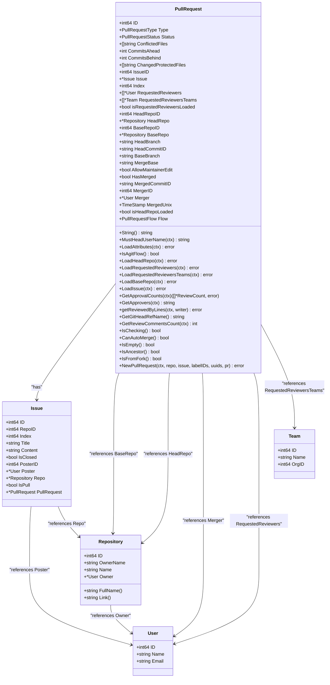
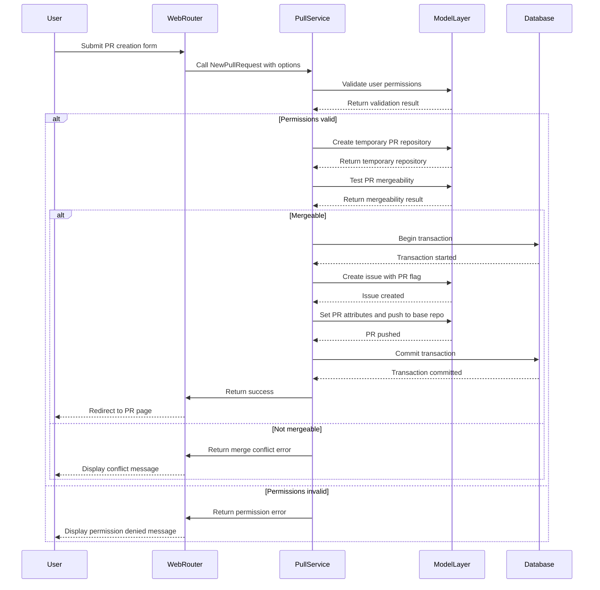
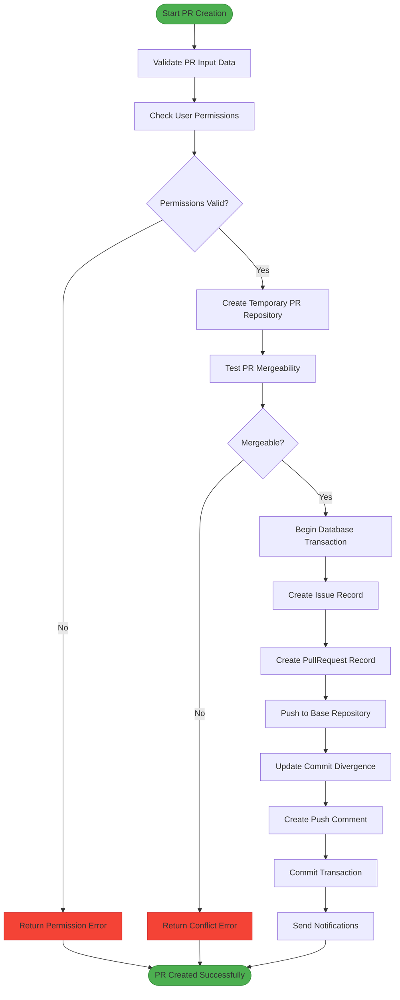
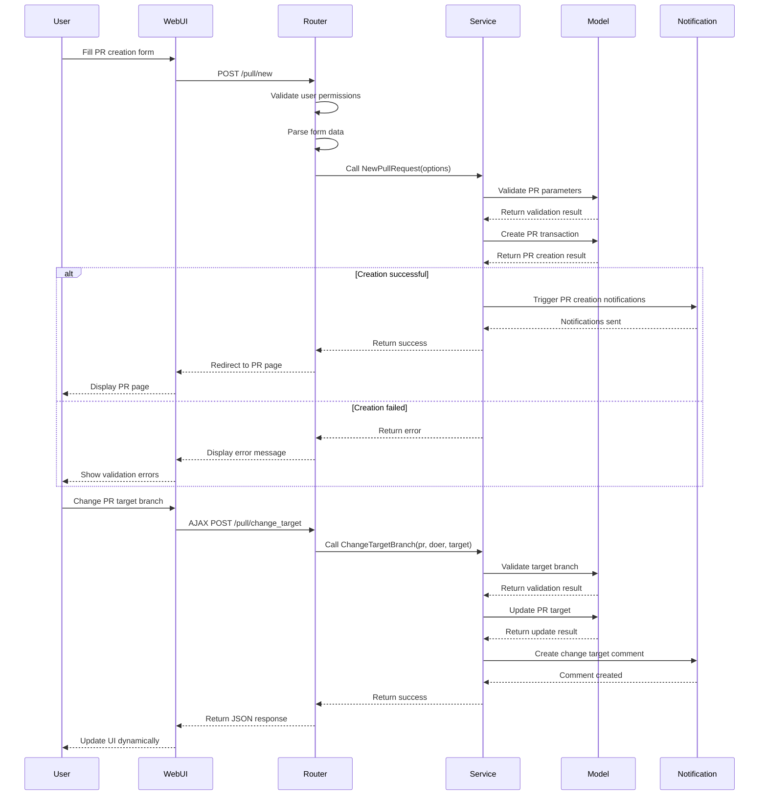
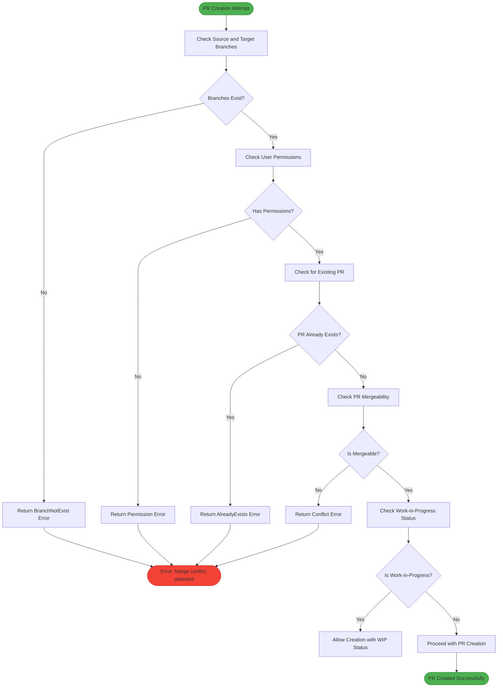

# Pull Request Creation

<cite>
**Referenced Files in This Document**   
- [models/issues/pull.go](file://models/issues/pull.go)
- [services/pull/pull.go](file://services/pull/pull.go)
- [routers/web/repo/pull.go](file://routers/web/repo/pull.go)
</cite>

## Table of Contents
1. [Introduction](#introduction)
2. [Domain Model of PullRequest](#domain-model-of-pullrequest)
3. [Pull Request Initialization and Validation](#pull-request-initialization-and-validation)
4. [Pull Request Storage and Persistence](#pull-request-storage-and-persistence)
5. [Web Interface and API Invocation Flow](#web-interface-and-api-invocation-flow)
6. [Common Issues and Error Handling](#common-issues-and-error-handling)
7. [Best Practices for Pull Request Creation](#best-practices-for-pull-request-creation)
8. [Conclusion](#conclusion)

## Introduction
This document provides a comprehensive analysis of pull request creation in Gitea, focusing on the implementation details in `models/issues/pull.go` and `services/pull/pull.go`. It explains how pull requests are initialized, validated, and stored within the system, along with the invocation relationship between the web router (`routers/web/repo/pull.go`) and the pull service layer. The document covers the domain model of PullRequest, including source/destination branches, repository relationships, and metadata. It also addresses common issues such as invalid branch combinations and permission errors, providing guidance on best practices for creating meaningful pull requests with proper descriptions and reviewers.

## Domain Model of PullRequest
The PullRequest struct represents the relationship between a pull request and repositories, encapsulating essential information about the pull request's state, branches, and associated repositories. It contains fields for tracking the pull request's status, conflicted files, commit divergence, and repository relationships. The model includes references to both the head and base repositories through HeadRepoID and BaseRepoID, with corresponding pointers to Repository objects. The PullRequest struct also maintains metadata such as the issue ID, index, merge status, and timestamps for merging. Additional fields track requested reviewers, merge base information, and whether maintainainer edits are allowed.

**Diagram sources**
- [models/issues/pull.go](file://models/issues/pull.go#L150-L250)

**Section sources**
- [models/issues/pull.go](file://models/issues/pull.go#L150-L250)

## Pull Request Initialization and Validation
The pull request creation process begins with validation of user permissions and repository access. The system first checks if the user is an administrator or if they have appropriate collaboration rights on the repository. For non-admin users, the system verifies whether they are owners, members, or collaborators of the organization, or have write permissions on the head repository. The validation process also ensures that the specified branches exist in their respective repositories and that the pull request doesn't already exist for the given branch combination.

The initialization process involves creating a temporary repository for the pull request and testing its mergeability. This includes checking for conflicts between the source and destination branches, validating that the branches are not identical, and ensuring that the target branch exists in the base repository. The system also handles different pull request flows, distinguishing between GitHub-style flows and Agit flows, which have different requirements for branch existence and merge strategies.

**Diagram sources**
- [services/pull/pull.go](file://services/pull/pull.go#L30-L150)
- [models/issues/pull.go](file://models/issues/pull.go#L500-L550)

**Section sources**
- [services/pull/pull.go](file://services/pull/pull.go#L30-L150)
- [models/issues/pull.go](file://models/issues/pull.go#L500-L550)

## Pull Request Storage and Persistence
Pull requests are persisted through a transactional process that ensures data consistency across related entities. The storage mechanism creates both an Issue record and a PullRequest record, linking them through the IssueID field. The process begins by generating a unique index for the pull request within the repository, then creates the associated issue with the "IsPull" flag set to true. Once the issue is successfully created, the pull request record is inserted with all relevant metadata, including repository IDs, branch names, and flow type.

The persistence layer handles various edge cases, such as cleaning up temporary references if the creation process fails. When a pull request is created, the system establishes the necessary Git references in the base repository, either by pushing the head branch commits (for GitHub flow) or by updating the reference directly (for Agit flow). The system also creates initial push comments to document the pull request creation and triggers notifications to relevant parties.

**Diagram sources**
- [models/issues/pull.go](file://models/issues/pull.go#L550-L600)
- [services/pull/pull.go](file://services/pull/pull.go#L100-L200)

**Section sources**
- [models/issues/pull.go](file://models/issues/pull.go#L550-L600)
- [services/pull/pull.go](file://services/pull/pull.go#L100-L200)

## Web Interface and API Invocation Flow
The web interface for pull request creation follows a structured flow from user interaction to backend processing. When a user submits a pull request through the web interface, the request is handled by the router in `routers/web/repo/pull.go`, which validates the user's access permissions and repository rights. The router then collects the necessary form data, including source and target branches, title, description, labels, and reviewers, and constructs a NewPullRequestOptions object to pass to the service layer.

The service layer in `services/pull/pull.go` orchestrates the creation process by first validating the request parameters and user permissions, then coordinating with the model layer to create the pull request entity. After successful creation, the service triggers notification events for mentioned users, assigned reviewers, and team members. The web interface also supports AJAX requests for dynamic updates, allowing users to update pull request targets and receive real-time feedback on mergeability status.

**Diagram sources**
- [routers/web/repo/pull.go](file://routers/web/repo/pull.go#L200-L400)
- [services/pull/pull.go](file://services/pull/pull.go#L150-L250)

**Section sources**
- [routers/web/repo/pull.go](file://routers/web/repo/pull.go#L200-L400)
- [services/pull/pull.go](file://services/pull/pull.go#L150-L250)

## Common Issues and Error Handling
The pull request creation system handles several common issues through comprehensive error handling mechanisms. One frequent issue is invalid branch combinations, where either the source or target branch does not exist in the respective repository. The system validates branch existence before proceeding with creation and returns appropriate error messages when branches are missing. Another common issue is permission errors, which occur when users attempt to create pull requests without sufficient collaboration rights on the repository.

The system also handles cases where pull requests already exist for the same branch combination, preventing duplicate pull requests. When users attempt to create a pull request with conflicting changes, the system detects merge conflicts and prevents creation until the conflicts are resolved. Additionally, the system manages cases where repositories or branches have been deleted, providing appropriate error messages and cleanup procedures. Error handling is implemented through custom error types like ErrPullRequestNotExist and ErrPullRequestAlreadyExists, which provide detailed information about the nature of the error.

**Diagram sources**
- [models/issues/pull.go](file://models/issues/pull.go#L300-L400)
- [services/pull/pull.go](file://services/pull/pull.go#L250-L350)

**Section sources**
- [models/issues/pull.go](file://models/issues/pull.go#L300-L400)
- [services/pull/pull.go](file://services/pull/pull.go#L250-L350)

## Best Practices for Pull Request Creation
Creating effective pull requests in Gitea involves following several best practices to ensure clarity, maintainability, and efficient code review. First, use descriptive titles that clearly communicate the purpose of the changes, avoiding vague terms like "fix" or "update" without context. Include detailed descriptions that explain the motivation behind the changes, the problem being solved, and any alternative approaches considered. When applicable, reference related issues or tickets to provide additional context.

For branch management, use meaningful branch names that reflect the feature or fix being implemented, following a consistent naming convention across the team. Keep pull requests focused on a single concern or feature to make code reviews more manageable. When requesting reviews, explicitly mention team members or individuals with relevant expertise, and consider using code owners to automatically request reviews from appropriate stakeholders.

Ensure that pull requests are created from branches with write permissions, either through direct collaboration or forked repositories with appropriate access. Regularly update pull requests with new commits to incorporate feedback, and use the "Work-in-Progress" prefix when the changes are not yet ready for full review. Finally, include relevant labels to categorize the pull request and help with filtering and tracking.

**Section sources**
- [models/issues/pull.go](file://models/issues/pull.go#L700-L750)
- [services/pull/pull.go](file://services/pull/pull.go#L400-L450)

## Conclusion
The pull request creation system in Gitea provides a robust framework for managing code contributions through a well-defined domain model, comprehensive validation, and structured persistence. The implementation in `models/issues/pull.go` and `services/pull/pull.go` demonstrates a clear separation of concerns between data modeling and business logic, while the web interface in `routers/web/repo/pull.go` provides an intuitive user experience. By understanding the domain model, initialization process, storage mechanisms, and error handling strategies, users and developers can effectively create and manage pull requests while following best practices for collaborative development.