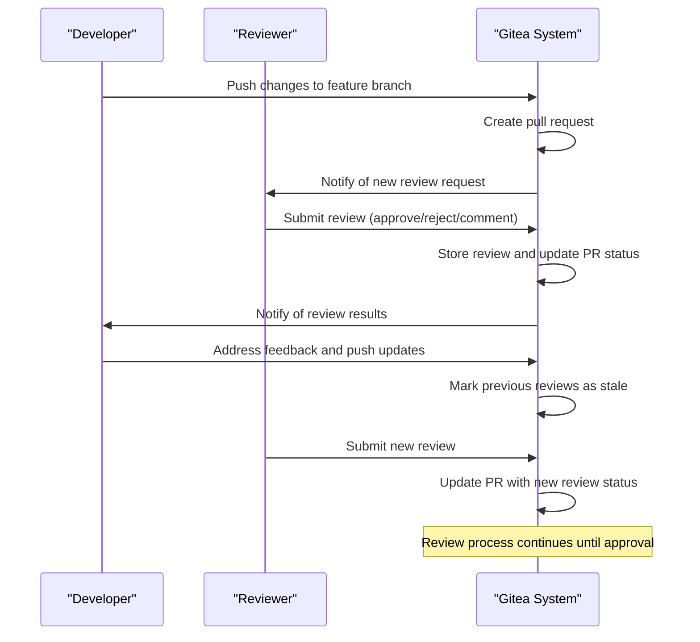
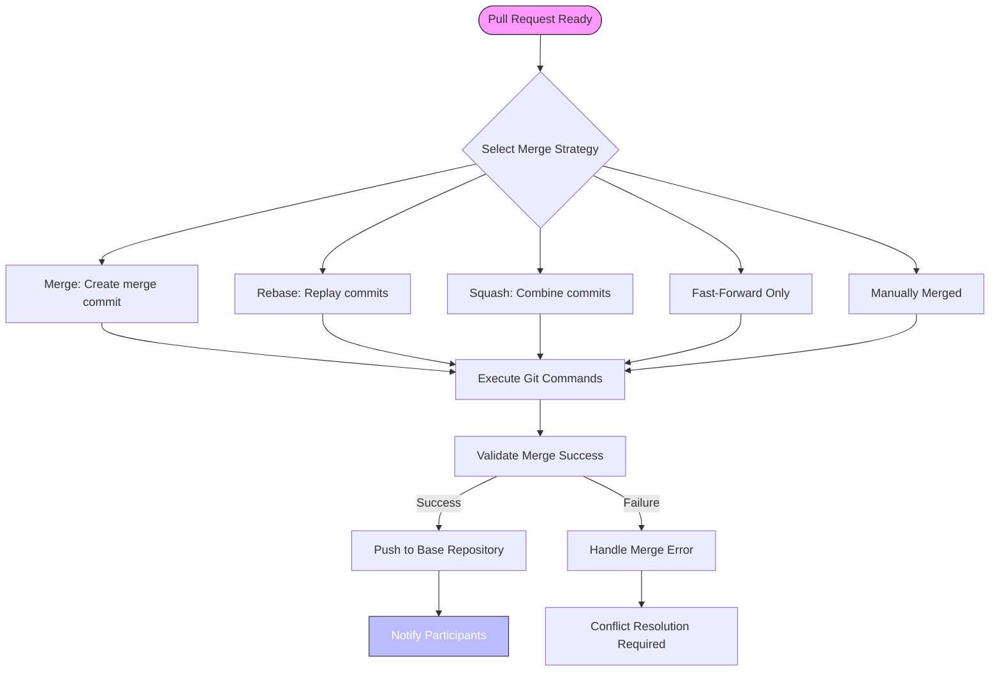
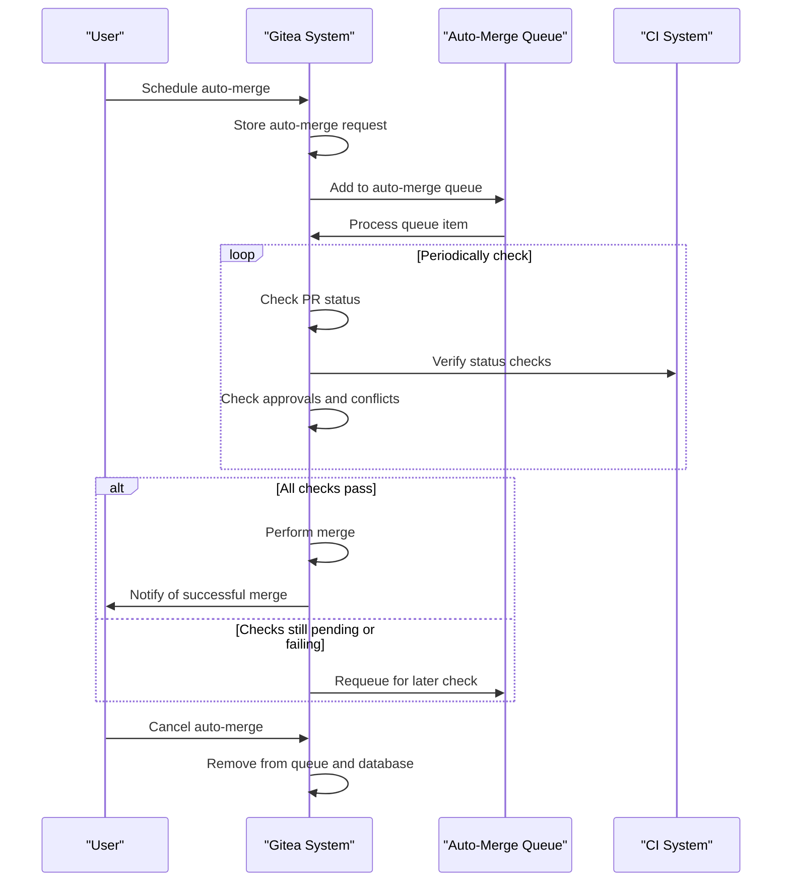

# Pull Requests

<cite>
**Referenced Files in This Document**   
- [pull.go](file://models/issues/pull.go)
- [review.go](file://models/issues/review.go)
- [merge.go](file://services/pull/merge.go)
- [check.go](file://services/pull/check.go)
- [commit_status.go](file://services/pull/commit_status.go)
- [automerge.go](file://services/automerge/automerge.go)
- [automerge.go](file://models/pull/automerge.go)
</cite>

## Table of Contents
1. [Introduction](#introduction)
2. [Pull Request Models](#pull-request-models)
3. [Pull Request Services](#pull-request-services)
4. [Pull Request Creation](#pull-request-creation)
5. [Code Review Workflow](#code-review-workflow)
6. [Status Checks and CI/CD Integration](#status-checks-and-cicd-integration)
7. [Merge Strategies](#merge-strategies)
8. [Auto-Merge Functionality](#auto-merge-functionality)
9. [Conflict Resolution](#conflict-resolution)
10. [Performance Considerations](#performance-considerations)
11. [Best Practices](#best-practices)

## Introduction
Gitea's pull request system provides a comprehensive collaborative development workflow that enables teams to review code changes, discuss implementation details, and maintain code quality through automated checks. The system integrates tightly with Git's version control capabilities while providing a user-friendly interface for code collaboration. Pull requests in Gitea serve as the central mechanism for proposing changes, conducting code reviews, and ensuring that all modifications meet quality standards before being merged into the main codebase. This documentation covers the implementation details of pull request models and services, including creation, review comments, status checks, merge strategies, and auto-merge functionality.

## Pull Request Models
The pull request model in Gitea is implemented in `models/issues/pull.go` and represents the core data structure for managing pull requests. The `PullRequest` struct contains essential fields for tracking the state and metadata of a pull request, including repository references, branch information, merge status, and conflict detection. Key attributes include `HeadRepoID` and `BaseRepoID` for tracking source and target repositories, `HeadBranch` and `BaseBranch` for branch references, and `Status` which tracks the current state of the pull request (mergeable, conflicting, checking, etc.). The model also includes fields for tracking merge conflicts (`ConflictedFiles`), commit divergence (`CommitsAhead` and `CommitsBehind`), and merge metadata such as `MergedCommitID` and `MergerID`. The implementation supports both GitHub-style and Agit-style pull request flows through the `Flow` field, allowing flexibility in workflow patterns. The model provides methods for loading related entities like repositories and issues, checking mergeability, and determining work-in-progress status based on title prefixes.

**Section sources**
- [pull.go](file://models/issues/pull.go#L1-L799)

## Pull Request Services
The pull request services in Gitea are implemented across multiple files in the `services/pull` directory, providing the business logic for pull request operations. The service layer handles operations such as merge conflict detection, status checking, and merge execution. The `check.go` file contains logic for determining pull request mergeability, including conflict checking and branch protection validation. The `merge.go` file implements the actual merge operations using various strategies, while `commit_status.go` handles integration with CI/CD systems for status checks. Services are designed to work transactionally, ensuring data consistency during operations. The implementation uses a queue-based system for handling pull request checks asynchronously, preventing blocking operations during pull request viewing. The service layer also integrates with Gitea's notification system to inform users of pull request events and updates.

**Section sources**
- [merge.go](file://services/pull/merge.go#L1-L753)
- [check.go](file://services/pull/check.go#L1-L480)
- [commit_status.go](file://services/pull/commit_status.go#L1-L117)

## Pull Request Creation
Pull requests in Gitea are created through the `NewPullRequest` function in the pull request model, which initializes a new pull request with associated issue tracking. The creation process involves generating a unique index for the pull request, associating it with labels and attachments, and establishing the relationship between the source and target repositories and branches. When a pull request is created, Gitea automatically initializes the pull request check process to determine mergeability. The system supports both branch-based and reference-based pull requests through different flow types. Pull requests can be created from the same repository (direct branch) or from forked repositories, with appropriate permission checks applied. The creation process also handles work-in-progress detection by checking the pull request title against configured prefixes, automatically marking pull requests as drafts when appropriate.

**Section sources**
- [pull.go](file://models/issues/pull.go#L650-L690)

## Code Review Workflow
Gitea's code review workflow is implemented through the review system in `models/issues/review.go`, which tracks feedback on pull requests. Reviews can have different types including approval, comment, rejection, and review requests. Each review is associated with a specific commit and can include inline comments on code changes. The system supports both official and unofficial reviews, where official reviews count toward merge requirements. Reviewers can be individuals or teams, and the system tracks review requests and their fulfillment. When a user submits a review, the system validates that the reviewer has appropriate permissions and that the pull request is still open. The implementation includes methods for creating, updating, and dismissing reviews, as well as calculating approval counts for merge requirements. The workflow also handles stale reviews, marking them as outdated when new commits are pushed to the pull request branch.

**Diagram sources **
- [review.go](file://models/issues/review.go#L1-L1057)
- [pull.go](file://models/issues/pull.go#L1-L799)

**Section sources**
- [review.go](file://models/issues/review.go#L1-L1057)

## Status Checks and CI/CD Integration
Gitea integrates with CI/CD systems through its status check functionality implemented in `services/pull/commit_status.go`. The system tracks commit statuses from external services and uses them to determine pull request merge eligibility. Status checks are associated with specific commits and can have different states including pending, success, failure, and error. The implementation calculates the overall status of a pull request by evaluating all required status checks against configured rules. Protected branches can require specific status checks to pass before merging, and the system validates these requirements before allowing merges. The status check system supports glob patterns for matching status contexts, allowing flexible configuration of required checks. When a pull request is updated, the system automatically re-evaluates status checks and updates the pull request status accordingly. The integration also supports custom merge messages that include information about successful status checks and reviewers.

**Section sources**
- [commit_status.go](file://services/pull/commit_status.go#L1-L117)

## Merge Strategies
Gitea supports multiple merge strategies through the `Merge` function in `services/pull/merge.go`, allowing teams to choose the appropriate approach for their workflow. The available strategies include:

- **Merge**: Creates a merge commit combining the feature branch with the base branch
- **Rebase**: Reapplies commits from the feature branch onto the base branch
- **Squash**: Combines all feature branch commits into a single commit
- **Fast-Forward Only**: Only allows merges when the feature branch can be fast-forwarded
- **Manually Merged**: Marks a pull request as merged when the changes have been applied externally

Each strategy is implemented as a separate function that prepares the appropriate Git commands. The system validates that the selected merge strategy is allowed for the repository before execution. Merge operations are performed in temporary repositories to prevent conflicts with the main repository, and the results are pushed back to the base repository. The implementation handles various merge failure scenarios including conflicts, unrelated histories, and push rejections, providing appropriate error messages to users. The system also supports custom merge messages that can be templated based on repository configuration.

**Diagram sources **
- [merge.go](file://services/pull/merge.go#L1-L753)

**Section sources**
- [merge.go](file://services/pull/merge.go#L1-L753)

## Auto-Merge Functionality
Gitea's auto-merge functionality allows pull requests to be automatically merged when all requirements are met, implemented in `services/automerge/automerge.go` and `models/pull/automerge.go`. Users can schedule a pull request for auto-merging, which creates a record in the `pull_auto_merge` database table. The system monitors the pull request for changes and re-evaluates merge eligibility whenever new commits are pushed or status checks update. When all requirements are satisfied (approvals, status checks, no conflicts), the system automatically performs the merge using the specified strategy. The implementation uses a queue-based system to handle auto-merge requests efficiently, preventing race conditions. Users can cancel scheduled auto-merges at any time before the merge occurs. The system also handles edge cases such as head branch updates and failed merges, providing appropriate error handling and notifications.

**Diagram sources **
- [automerge.go](file://services/automerge/automerge.go#L1-L279)
- [automerge.go](file://models/pull/automerge.go#L1-L104)

**Section sources**
- [automerge.go](file://services/automerge/automerge.go#L1-L279)
- [automerge.go](file://models/pull/automerge.go#L1-L104)

## Conflict Resolution
Gitea handles merge conflicts through its conflict detection and resolution system. When a pull request is created or updated, the system automatically checks for conflicts between the feature branch and base branch. Conflicts are detected by attempting to merge the branches in a temporary repository and examining the results. If conflicts are found, the pull request status is set to `PullRequestStatusConflict` and the conflicting files are recorded in the `ConflictedFiles` field. The system provides clear error messages to users attempting to merge conflicting pull requests, including details from the Git merge command. For rebase operations, the system detects rebase conflicts similarly. The implementation also handles unrelated histories, preventing merges when branches have no common ancestry. Users must resolve conflicts by updating their feature branch before the pull request can be merged. The system continuously monitors for conflict resolution, updating the pull request status when conflicts are resolved.

**Section sources**
- [merge.go](file://services/pull/merge.go#L507-L539)
- [check.go](file://services/pull/check.go#L43-L83)

## Performance Considerations
Gitea's pull request system includes several performance optimizations for handling large pull requests. The system uses asynchronous processing for pull request checks to prevent blocking operations during pull request viewing. Large pull requests are handled efficiently by only loading necessary data and using pagination where appropriate. The conflict checking system operates on temporary repositories to avoid impacting the main repository performance. For repositories with many pull requests, the system can be configured to delay checks for inactive pull requests, reducing resource usage. The database schema is optimized with appropriate indexes on frequently queried fields such as repository IDs, branch names, and pull request status. The implementation also includes caching mechanisms for frequently accessed data such as commit counts. For very large repositories, the system can be configured to limit the size of merge messages and other metadata to prevent performance degradation.

**Section sources**
- [check.go](file://services/pull/check.go#L36-L65)
- [pull.go](file://models/issues/pull.go#L1-L799)

## Best Practices
Effective use of Gitea's pull request system involves several best practices. Teams should establish clear guidelines for pull request size, aiming for focused changes that are easier to review. Meaningful commit messages and pull request descriptions help reviewers understand the context and purpose of changes. Using work-in-progress markers in pull request titles prevents accidental merges of incomplete work. Teams should configure appropriate branch protection rules, including required approvals and status checks, to maintain code quality. Regularly updating feature branches with changes from the base branch helps prevent merge conflicts. Using the auto-merge functionality for routine changes can streamline the development workflow. Teams should also establish clear code review expectations, including response times and review quality standards. Proper use of labels and milestones helps organize pull requests and track progress.

**Section sources**
- [pull.go](file://models/issues/pull.go#L1-L799)
- [merge.go](file://services/pull/merge.go#L1-L753)