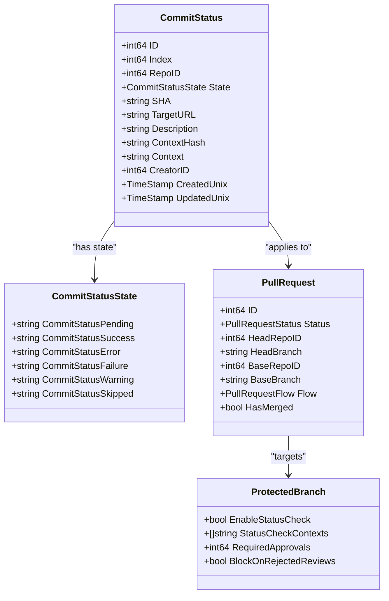
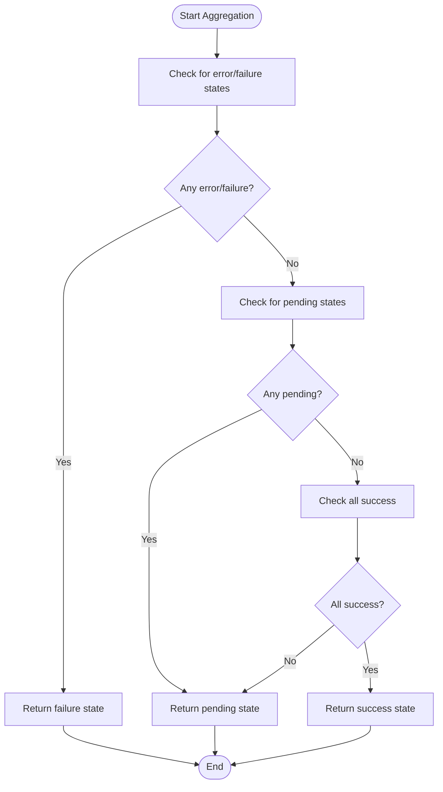
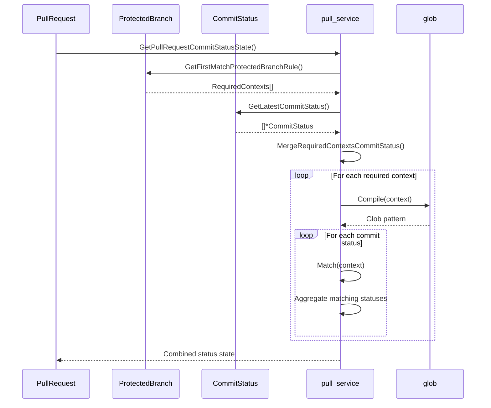
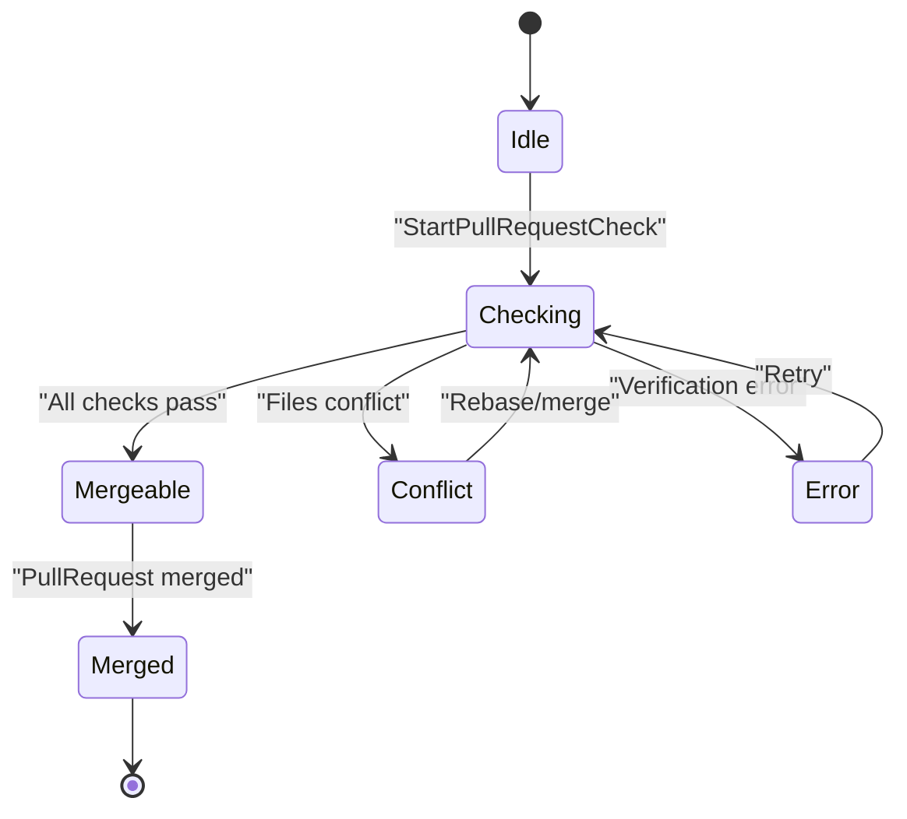
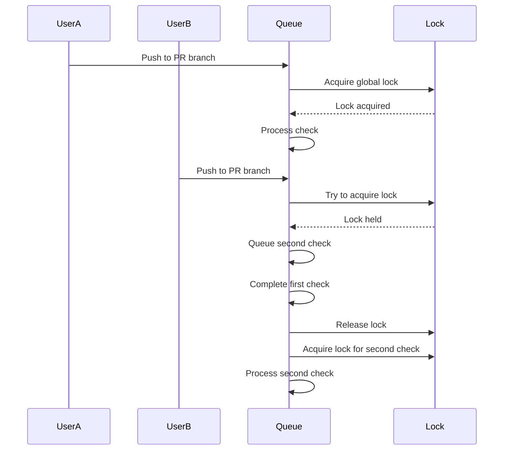

# Status Checks and CI Integration

<cite>
**Referenced Files in This Document**   
- [services/pull/commit_status.go](file://services/pull/commit_status.go)
- [models/git/commit_status.go](file://models/git/commit_status.go)
- [modules/commitstatus/commit_status.go](file://modules/commitstatus/commit_status.go)
- [models/issues/pull.go](file://models/issues/pull.go)
- [routers/web/repo/pull.go](file://routers/web/repo/pull.go)
</cite>

## Table of Contents
1. [Introduction](#introduction)
2. [Domain Model of Commit Statuses](#domain-model-of-commit-statuses)
3. [Status Reporting and Aggregation](#status-reporting-and-aggregation)
4. [Required Checks Enforcement](#required-checks-enforcement)
5. [CI Integration with Gitea Actions](#ci-integration-with-gitea-actions)
6. [Merge Gate Logic](#merge-gate-logic)
7. [Common Issues and Edge Cases](#common-issues-and-edge-cases)
8. [Best Practices for Configuration](#best-practices-for-configuration)

## Introduction
This document provides a comprehensive analysis of the status checks and CI integration system in Gitea. It explains how commit statuses are reported, aggregated, and used to control pull request merging. The implementation centers around the commit status model, protected branch rules, and the pull request merge verification process. The system supports both internal Gitea Actions and external CI systems, providing a flexible framework for enforcing code quality and testing requirements before merging.

## Domain Model of Commit Statuses
The commit status system in Gitea is built around several key components that define the state and behavior of CI checks. The domain model includes status states, context identification, and relationship with pull requests and repositories.



**Diagram sources**
- [models/git/commit_status.go](file://models/git/commit_status.go#L31-L110)
- [modules/commitstatus/commit_status.go](file://modules/commitstatus/commit_status.go#L8-L65)
- [models/issues/pull.go](file://models/issues/pull.go#L110-L150)
- [models/git/protected_branch.go](file://models/git/protected_branch.go#L20-L40)

**Section sources**
- [models/git/commit_status.go](file://models/git/commit_status.go#L31-L110)
- [modules/commitstatus/commit_status.go](file://modules/commitstatus/commit_status.go#L8-L65)

## Status Reporting and Aggregation
The status reporting system in Gitea allows CI systems to report the outcome of various checks against specific commits. These statuses are then aggregated to determine the overall state of a pull request.

### Status States and Transitions
Gitea supports five primary commit status states that represent the outcome of CI checks:
- **pending**: The check is in progress or has not yet started
- **success**: The check completed successfully
- **failure**: The check completed but failed its criteria
- **error**: The check encountered an error during execution
- **warning**: The check completed with warnings but not failures

The aggregation logic combines multiple status checks into a single overall state according to the following rules:
1. If any status is in "error" or "failure" state, the overall state is "failure"
2. If all statuses are "success", the overall state is "success"
3. If there are no statuses or any status is "pending", the overall state is "pending"



**Diagram sources**
- [modules/commitstatus/commit_status.go](file://modules/commitstatus/commit_status.go#L70-L82)
- [models/git/commit_status.go](file://models/git/commit_status.go#L240-L270)

**Section sources**
- [modules/commitstatus/commit_status.go](file://modules/commitstatus/commit_status.go#L70-L82)
- [models/git/commit_status.go](file://models/git/commit_status.go#L240-L270)

## Required Checks Enforcement
Gitea enforces required status checks through protected branch rules, which specify which contexts must pass before a pull request can be merged.

### Context Matching with Glob Patterns
The system supports flexible context matching using glob patterns, allowing repository administrators to specify required checks using wildcards. For example, a rule with context "ci/*" would require all checks with contexts like "ci/unit", "ci/integration", etc., to pass.



**Diagram sources**
- [services/pull/commit_status.go](file://services/pull/commit_status.go#L10-L82)
- [routers/web/repo/pull.go](file://routers/web/repo/pull.go#L518-L550)

**Section sources**
- [services/pull/commit_status.go](file://services/pull/commit_status.go#L10-L82)
- [routers/web/repo/pull.go](file://routers/web/repo/pull.go#L518-L550)

## CI Integration with Gitea Actions
Gitea integrates with its built-in Actions system to provide native CI/CD capabilities. The integration follows the standard commit status reporting pattern but includes specific features for Gitea Actions.

### Gitea Actions URL Structure
When Gitea Actions reports status, it uses a specific URL structure that links directly to the workflow run and job:
```
{RepoLink}/actions/runs/{RunID}/jobs/{JobID}
```

The system can parse these URLs to extract the run and job IDs, allowing for deep linking from the pull request interface to the specific workflow execution.

### External CI System Integration
External CI systems can integrate with Gitea by making API calls to create commit statuses. The process involves:
1. Running the CI pipeline for a specific commit
2. Determining the outcome of the checks
3. Making a POST request to the Gitea API with the status information
4. Including a target URL that links to the CI system's build results

This integration pattern allows any CI system (Jenkins, GitHub Actions, GitLab CI, etc.) to report status to Gitea pull requests.

**Section sources**
- [models/git/commit_status.go](file://models/git/commit_status.go#L180-L200)
- [modules/structs/status.go](file://modules/structs/status.go#L30-L60)

## Merge Gate Logic
The merge gate logic determines whether a pull request can be merged based on the status of required checks and other protection rules.

### Pull Request Status Workflow
The pull request status transitions through several states during the merge verification process:



### Status Verification Process
The verification process follows these steps:
1. Load the pull request and its associated repositories
2. Verify the head branch exists
3. Retrieve the latest commit SHA from the head branch
4. Fetch all commit statuses for that SHA
5. Apply protected branch rules to determine required contexts
6. Aggregate the status of required checks
7. Update the pull request status accordingly

```go
// Pseudocode representation of the merge verification logic
func IsPullCommitStatusPass(ctx context.Context, pr *PullRequest) (bool, error) {
    pb, err := GetFirstMatchProtectedBranchRule(ctx, pr.BaseRepoID, pr.BaseBranch)
    if err != nil || pb == nil || !pb.EnableStatusCheck {
        return true, nil // No status check required
    }
    
    state, err := GetPullRequestCommitStatusState(ctx, pr)
    if err != nil {
        return false, err
    }
    
    return state.IsSuccess(), nil
}
```

**Diagram sources**
- [models/issues/pull.go](file://models/issues/pull.go#L140-L150)
- [services/pull/commit_status.go](file://services/pull/commit_status.go#L77-L117)

**Section sources**
- [services/pull/commit_status.go](file://services/pull/commit_status.go#L77-L117)
- [services/pull/check.go](file://services/pull/check.go#L36-L65)

## Common Issues and Edge Cases
Several edge cases and potential issues can arise when working with status checks in Gitea. Understanding these helps in troubleshooting and designing robust CI workflows.

### Stale Statuses
Stale statuses occur when a CI system reports a status for a commit that is no longer relevant, such as after a force push. Gitea handles this by:
- Using the latest status for each unique context
- Requiring all required contexts to have a passing status
- Not automatically removing old statuses, which preserves audit trails

### Missing Checks
Missing checks happen when a required context has no associated status. This typically results in a "pending" overall state, preventing merge until the missing check is reported. This can occur when:
- A CI system fails to start
- Network issues prevent status reporting
- Configuration errors in the CI system

### Race Conditions During Rebasing
When multiple contributors are working on related branches, race conditions can occur during rebasing. The system mitigates this by:
- Using database transactions for status updates
- Implementing queue-based processing for pull request checks
- Using global locks to prevent concurrent verification of the same pull request



**Diagram sources**
- [services/pull/check.go](file://services/pull/check.go#L102-L125)
- [services/pull/check.go](file://services/pull/check.go#L234-L271)

**Section sources**
- [services/pull/check.go](file://services/pull/check.go#L102-L125)
- [services/pull/check.go](file://services/pull/check.go#L234-L271)

## Best Practices for Configuration
Proper configuration of status checks and CI integration is crucial for maintaining code quality while avoiding unnecessary friction in the development workflow.

### Configuring Required Status Checks
When configuring required status checks, consider the following best practices:
- Use descriptive context names that clearly identify the check purpose
- Leverage glob patterns to group related checks
- Balance thoroughness with developer experience - too many required checks can slow down development
- Document the purpose of each required check in the repository documentation

### Integrating with External CI Systems
For external CI integration:
- Ensure the CI system can authenticate with Gitea to report statuses
- Configure webhooks to trigger CI builds on push events
- Use meaningful descriptions in status reports to help developers understand failures
- Include direct links to build logs in the target URL

### Handling Flaky Tests
To address flaky tests that occasionally fail:
- Implement retry mechanisms in the CI system
- Use the "warning" state for non-critical issues that don't block merging
- Consider using required approvals in addition to status checks for critical changes
- Monitor status check failure patterns to identify and fix flaky tests

**Section sources**
- [services/pull/commit_status.go](file://services/pull/commit_status.go#L10-L82)
- [models/git/commit_status.go](file://models/git/commit_status.go#L483-L520)