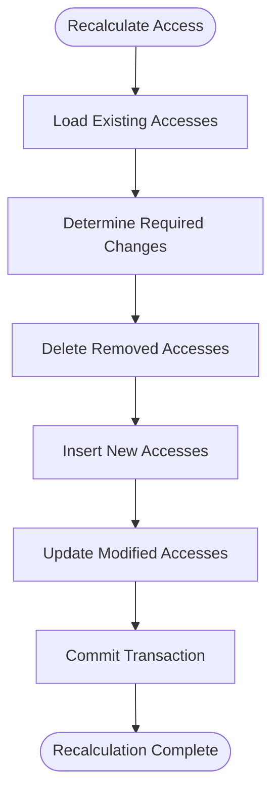

# Access Control and Collaboration

<cite>
**Referenced Files in This Document**   
- [models/repo/collaboration.go](file://models/repo/collaboration.go)
- [services/repository/collaboration.go](file://services/repository/collaboration.go)
- [routers/web/repo/setting/collaboration.go](file://routers/web/repo/setting/collaboration.go)
- [models/perm/access_mode.go](file://models/perm/access_mode.go)
- [models/unit/unit.go](file://models/unit/unit.go)
- [models/organization/team.go](file://models/organization/team.go)
- [services/org/team.go](file://services/org/team.go)
- [models/perm/access/access.go](file://models/perm/access/access.go)
</cite>

## Table of Contents
1. [Introduction](#introduction)
2. [Core Domain Models](#core-domain-models)
3. [Permission Levels and Access Modes](#permission-levels-and-access-modes)
4. [Collaboration Management](#collaboration-management)
5. [Team-Based Access Control](#team-based-access-control)
6. [Web Interface and Service Layer Integration](#web-interface-and-service-layer-integration)
7. [Permission Inheritance and Recalculation](#permission-inheritance-and-recalculation)
8. [Common Issues and Troubleshooting](#common-issues-and-troubleshooting)
9. [Performance Considerations](#performance-considerations)
10. [Best Practices for Least Privilege](#best-practices-for-least-privilege)

## Introduction
Gitea implements a comprehensive access control and collaboration system that enables fine-grained permission management for repositories. The system supports both individual user collaborations and team-based access, with multiple permission levels and inheritance mechanisms. This document provides a detailed analysis of the implementation, focusing on the core components that manage repository access, collaboration workflows, and permission inheritance.

**Section sources**
- [models/repo/collaboration.go](file://models/repo/collaboration.go#L1-L178)
- [services/repository/collaboration.go](file://services/repository/collaboration.go#L1-L125)

## Core Domain Models

### Collaboration Model
The Collaboration model represents the relationship between an individual user and a repository, storing the access mode granted to that user. The model includes fields for repository ID, user ID, and access mode, with appropriate database constraints to ensure data integrity.

**Diagram sources**
- [models/repo/collaboration.go](file://models/repo/collaboration.go#L15-L35)

### Repository Units
Repository units represent different functional components of a repository (code, issues, wiki, etc.) and their associated permission requirements. Each unit has a maximum access mode that determines the highest level of access required to interact with that unit.

**Diagram sources**
- [models/unit/unit.go](file://models/unit/unit.go#L15-L377)

## Permission Levels and Access Modes

### Access Mode Hierarchy
Gitea implements a hierarchical access model with four distinct permission levels, each granting progressively more privileges. The access modes are implemented as an enumeration with corresponding string representations for display purposes.

**Diagram sources**
- [models/perm/access_mode.go](file://models/perm/access_mode.go#L15-L65)

### Permission Level Descriptions
The following table outlines the capabilities associated with each permission level:

| Permission Level | Code Access | Issues Access | Pull Requests | Releases | Wiki | Settings Access |
|------------------|-----------|---------------|---------------|----------|------|----------------|
| Read | View | View | View | View | View | No |
| Write | Push | Create/Edit | Create/Merge | Create | Edit | No |
| Admin | Full | Full | Full | Full | Full | Yes |
| Owner | Full | Full | Full | Full | Full | Full |

**Section sources**
- [models/perm/access_mode.go](file://models/perm/access_mode.go#L15-L65)
- [models/unit/unit.go](file://models/unit/unit.go#L15-L377)

## Collaboration Management

### Adding Collaborators
The process of adding a collaborator involves validating the user, checking for existing collaborations, and establishing the appropriate access level. The system prevents adding organization accounts or blocked users as collaborators.

**Diagram sources**
- [services/repository/collaboration.go](file://services/repository/collaboration.go#L1-L125)
- [models/repo/collaboration.go](file://models/repo/collaboration.go#L1-L178)

### Changing Access Levels
Modifying a collaborator's access level involves updating the collaboration record and recalculating the user's effective permissions. The system validates the new access mode and updates both the collaboration and access tables.

**Diagram sources**
- [models/repo/collaboration.go](file://models/repo/collaboration.go#L128-L178)
- [models/perm/access/access.go](file://models/perm/access/access.go#L1-L255)

**Section sources**
- [models/repo/collaboration.go](file://models/repo/collaboration.go#L128-L178)
- [models/perm/access/access.go](file://models/perm/access/access.go#L1-L255)

## Team-Based Access Control

### Team Model Structure
Teams in Gitea are organizational units that can be granted access to repositories. Each team has its own access mode and can be configured to include all repositories or specific ones.

**Diagram sources**
- [models/organization/team.go](file://models/organization/team.go#L1-L249)

### Team Repository Management
Teams can be added to or removed from repositories, with appropriate permission checks and access recalculation. The system ensures that only users with appropriate permissions can modify team access.

**Diagram sources**
- [routers/web/repo/setting/collaboration.go](file://routers/web/repo/setting/collaboration.go#L1-L217)
- [services/org/team.go](file://services/org/team.go#L1-L352)

**Section sources**
- [routers/web/repo/setting/collaboration.go](file://routers/web/repo/setting/collaboration.go#L1-L217)
- [services/org/team.go](file://services/org/team.go#L1-L352)

## Web Interface and Service Layer Integration

### Request Flow for Collaboration Management
The web interface handles collaboration management requests by delegating to the appropriate service layer functions. This separation of concerns ensures that business logic remains in the service layer while the web layer handles presentation and user interaction.

**Diagram sources**
- [routers/web/repo/setting/collaboration.go](file://routers/web/repo/setting/collaboration.go#L1-L217)
- [services/repository/collaboration.go](file://services/repository/collaboration.go#L1-L125)

**Section sources**
- [routers/web/repo/setting/collaboration.go](file://routers/web/repo/setting/collaboration.go#L1-L217)

## Permission Inheritance and Recalculation

### Access Recalculation Process
When collaboration or team membership changes, Gitea recalculates the effective access permissions for affected users. This ensures that the access table accurately reflects the current permission state.

**Diagram sources**
- [models/perm/access/access.go](file://models/perm/access/access.go#L1-L255)
- [services/repository/collaboration.go](file://services/repository/collaboration.go#L1-L125)

**Section sources**
- [models/perm/access/access.go](file://models/perm/access/access.go#L1-L255)

### Effective Permission Determination
Gitea determines a user's effective permission level by considering multiple factors: direct collaboration, team membership, and repository ownership. The system combines these factors to determine the highest applicable access mode.

**Diagram sources**
- [models/repo/collaboration.go](file://models/repo/collaboration.go#L150-L178)
- [models/perm/access/access.go](file://models/perm/access/access.go#L1-L255)

**Section sources**
- [models/repo/collaboration.go](file://models/repo/collaboration.go#L150-L178)

## Common Issues and Troubleshooting

### Permission Escalation Prevention
Gitea implements several safeguards to prevent unauthorized permission escalation. These include validation of access modes, ownership checks, and blocking of organization accounts from being added as collaborators.

**Diagram sources**
- [routers/web/repo/setting/collaboration.go](file://routers/web/repo/setting/collaboration.go#L1-L217)

**Section sources**
- [routers/web/repo/setting/collaboration.go](file://routers/web/repo/setting/collaboration.go#L1-L217)

### Broken Collaboration Links
When a user account is deleted or deactivated, Gitea handles the situation by creating ghost user records to maintain referential integrity while preventing access. This ensures that collaboration history remains intact without compromising security.

**Diagram sources**
- [models/repo/collaboration.go](file://models/repo/collaboration.go#L84-L128)

**Section sources**
- [models/repo/collaboration.go](file://models/repo/collaboration.go#L84-L128)

## Performance Considerations

### Scalability with Numerous Collaborators
For repositories with many collaborators, Gitea optimizes performance by batching database operations and using efficient query patterns. The system minimizes the number of database round-trips by retrieving multiple records in single queries.

**Diagram sources**
- [models/repo/collaboration.go](file://models/repo/collaboration.go#L50-L84)

**Section sources**
- [models/repo/collaboration.go](file://models/repo/collaboration.go#L50-L84)

### Caching and Recalculation Optimization
The access recalculation system is designed to minimize unnecessary database operations. It only updates access records when changes occur and uses transactional integrity to ensure data consistency.

**Diagram sources**
- [models/perm/access/access.go](file://models/perm/access/access.go#L1-L255)

**Section sources**
- [models/perm/access/access.go](file://models/perm/access/access.go#L1-L255)

## Best Practices for Least Privilege

### Principle of Least Privilege Implementation
Gitea enforces the principle of least privilege by defaulting to the minimum necessary permissions and requiring explicit elevation for higher access levels. This approach minimizes the risk of accidental or malicious changes.

**Section sources**
- [services/repository/collaboration.go](file://services/repository/collaboration.go#L1-L125)
- [routers/web/repo/setting/collaboration.go](file://routers/web/repo/setting/collaboration.go#L1-L217)

### Access Review and Maintenance
Regular access reviews are essential for maintaining security and compliance. Gitea provides tools to list all collaborators and their access levels, making it easier to identify and remove unnecessary permissions.

**Section sources**
- [models/repo/collaboration.go](file://models/repo/collaboration.go#L1-L178)
- [routers/web/repo/setting/collaboration.go](file://routers/web/repo/setting/collaboration.go#L1-L217)