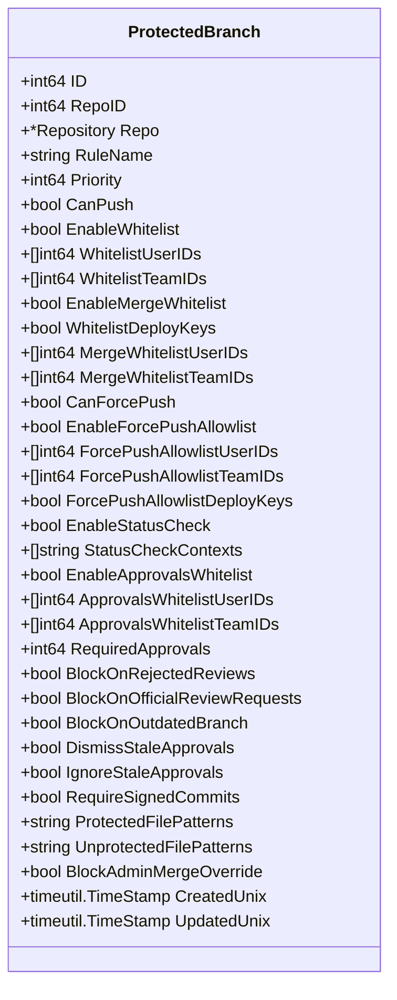
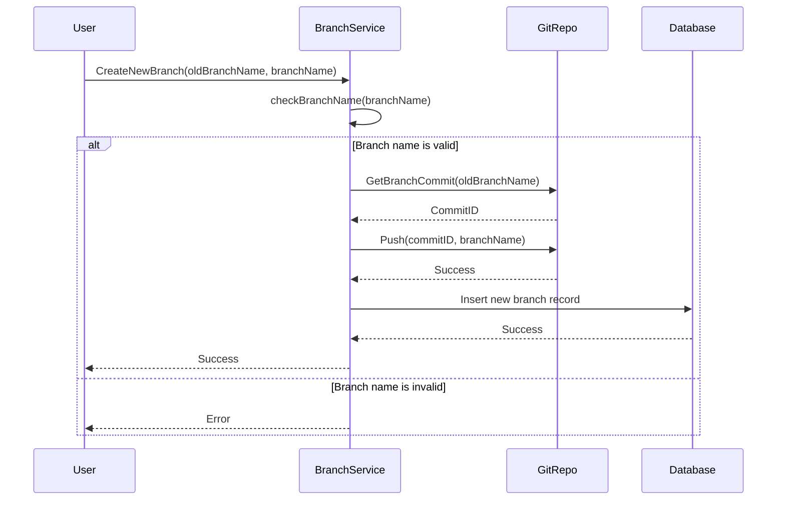
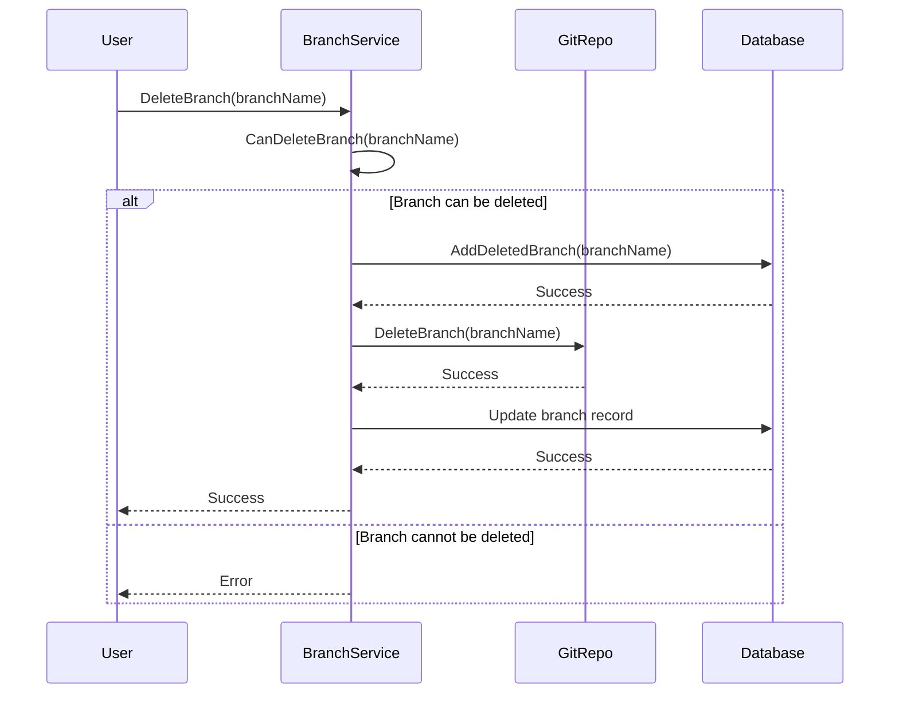
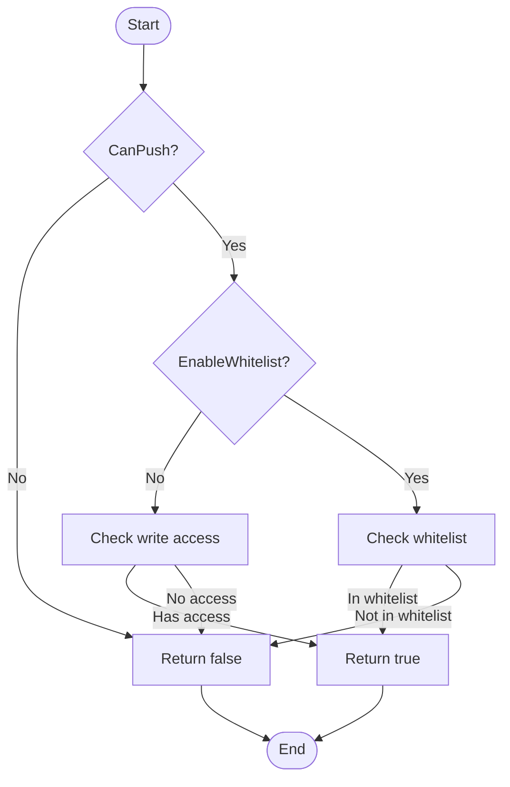
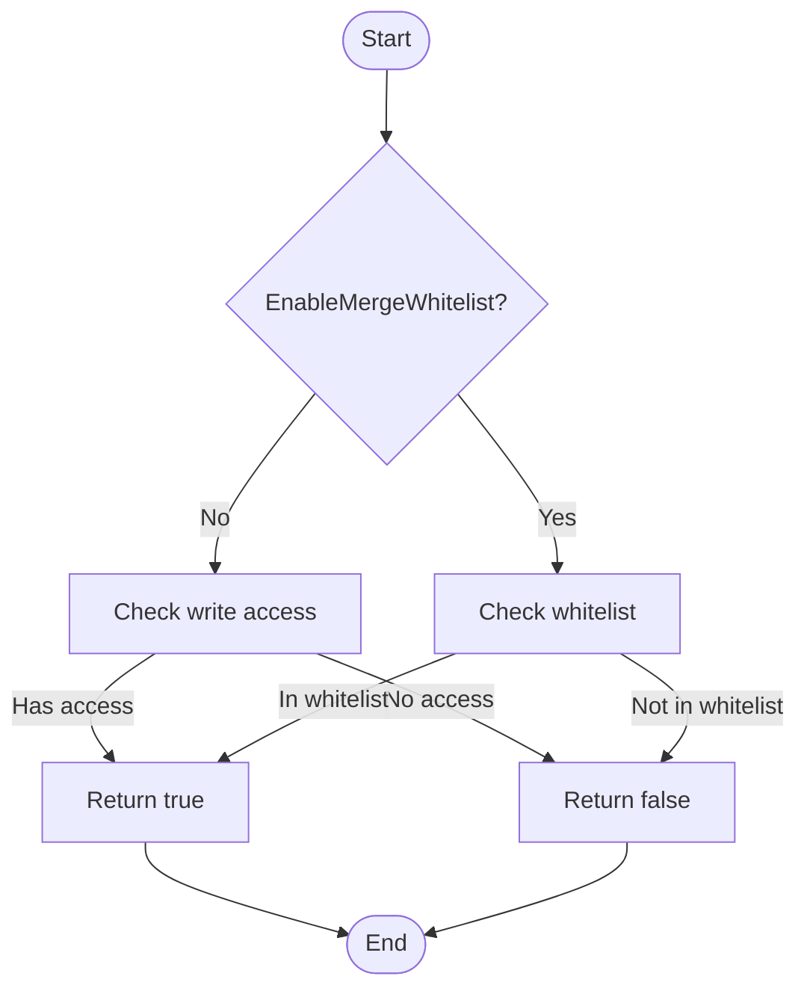
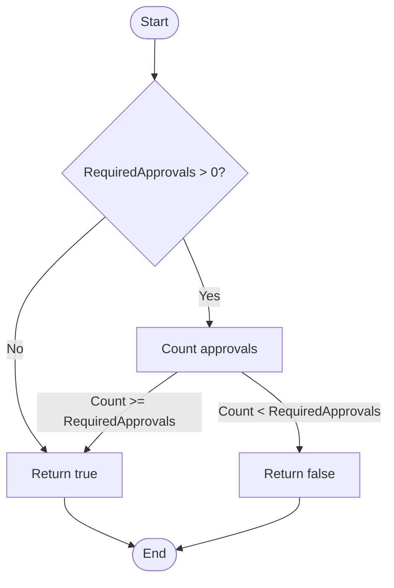
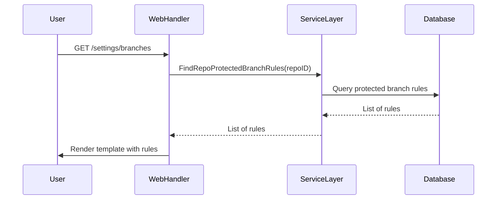
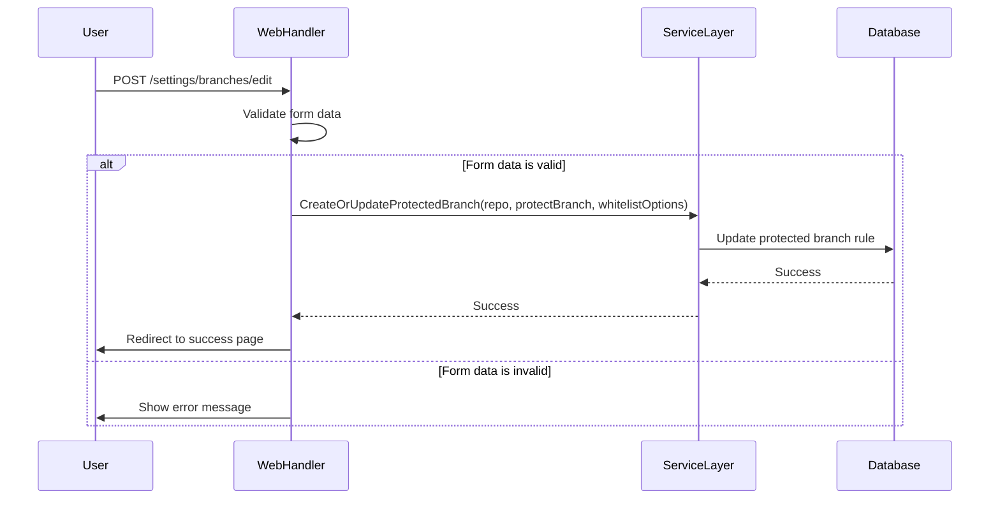
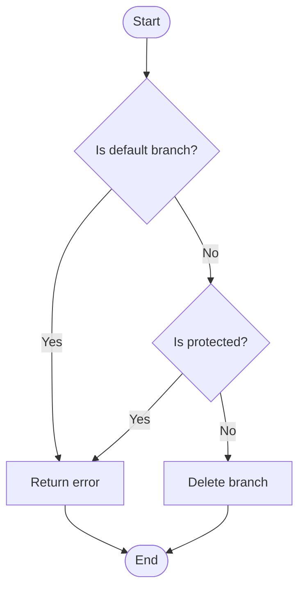
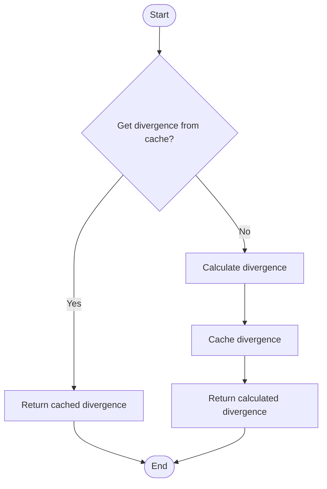

# Branching and Protection

<cite>
**Referenced Files in This Document**   
- [protected_branch.go](file://models/git/protected_branch.go)
- [branch.go](file://services/repository/branch.go)
- [protected_branch.go](file://routers/web/repo/setting/protected_branch.go)
- [protected_branch_list.go](file://models/git/protected_branch_list.go)
- [pull.go](file://services/pull/pull.go)
</cite>

## Table of Contents
1. [Introduction](#introduction)
2. [Core Domain Models](#core-domain-models)
3. [Branch Creation and Deletion](#branch-creation-and-deletion)
4. [Branch Protection Rules](#branch-protection-rules)
5. [Web Interface and Service Layer Integration](#web-interface-and-service-layer-integration)
6. [Protected Branch Configuration Examples](#protected-branch-configuration-examples)
7. [Common Issues and Conflicts](#common-issues-and-conflicts)
8. [Performance Considerations](#performance-considerations)
9. [Best Practices for Git Workflow Integration](#best-practices-for-git-workflow-integration)
10. [Conclusion](#conclusion)

## Introduction
This document provides a comprehensive analysis of the branching and branch protection mechanisms in Gitea, focusing on the implementation details in `models/git/protected_branch.go` and `services/repository/branch.go`. It covers branch creation, deletion, and protection rules, including the invocation relationship between the web interface and service layer through `routers/web/repo/setting/protected_branch.go`. The document also includes concrete examples of protected branch configurations with required pull request reviews, status checks, and push restrictions. It explains domain models for branch protection policies, including required approvers, code owner reviews, and dismissal rules. Additionally, it addresses common issues such as bypassing protection rules and conflicts during branch deletion, provides performance considerations for repositories with numerous branches, and offers best practices for Git workflow integration.

**Section sources**
- [protected_branch.go](file://models/git/protected_branch.go#L1-L610)
- [branch.go](file://services/repository/branch.go#L1-L831)

## Core Domain Models

The core domain model for branch protection in Gitea is the `ProtectedBranch` struct, which encapsulates all the rules and configurations for a protected branch. This struct is defined in `models/git/protected_branch.go` and includes various fields to control different aspects of branch protection.



**Diagram sources**
- [protected_branch.go](file://models/git/protected_branch.go#L28-L110)

The `ProtectedBranch` struct includes fields for controlling push permissions, merge permissions, force push permissions, status checks, required approvals, and file patterns. The `RuleName` field can be a specific branch name or a glob pattern to match multiple branches. The `Priority` field determines the order in which rules are applied, with higher priority rules taking precedence.

**Section sources**
- [protected_branch.go](file://models/git/protected_branch.go#L28-L110)

## Branch Creation and Deletion

Branch creation and deletion in Gitea are managed through the `CreateNewBranch` and `DeleteBranch` functions in `services/repository/branch.go`. These functions handle the creation and deletion of branches, including the necessary checks and updates to the repository's state.

### Branch Creation

The `CreateNewBranch` function creates a new branch from an existing branch or commit. It first checks if the branch name is valid and does not conflict with existing branches or tags. If the branch name is valid, it creates a new branch using the `git.Push` function.



**Diagram sources**
- [branch.go](file://services/repository/branch.go#L36-L76)

### Branch Deletion

The `DeleteBranch` function deletes a branch from the repository. It first checks if the branch can be deleted, which includes verifying that the branch is not the default branch and is not protected. If the branch can be deleted, it removes the branch from the Git repository and updates the database to mark the branch as deleted.



**Diagram sources**
- [branch.go](file://services/repository/branch.go#L224-L278)

**Section sources**
- [branch.go](file://services/repository/branch.go#L36-L278)

## Branch Protection Rules

Branch protection rules in Gitea are implemented through the `ProtectedBranch` struct and associated functions in `models/git/protected_branch.go`. These rules control various aspects of branch behavior, including push permissions, merge permissions, and required approvals.

### Push Permissions

Push permissions are controlled by the `CanPush` and `EnableWhitelist` fields. If `CanPush` is `true`, users with write access to the repository can push to the branch. If `EnableWhitelist` is `true`, only users and teams listed in `WhitelistUserIDs` and `WhitelistTeamIDs` can push to the branch.



**Diagram sources**
- [protected_branch.go](file://models/git/protected_branch.go#L109-L154)

### Merge Permissions

Merge permissions are controlled by the `EnableMergeWhitelist` field. If `EnableMergeWhitelist` is `true`, only users and teams listed in `MergeWhitelistUserIDs` and `MergeWhitelistTeamIDs` can merge to the branch. Otherwise, users with write access to the repository can merge to the branch.



**Diagram sources**
- [protected_branch.go](file://models/git/protected_branch.go#L155-L180)

### Required Approvals

Required approvals are controlled by the `RequiredApprovals` and `EnableApprovalsWhitelist` fields. If `RequiredApprovals` is greater than 0, a certain number of approvals are required before a pull request can be merged. If `EnableApprovalsWhitelist` is `true`, only users and teams listed in `ApprovalsWhitelistUserIDs` and `ApprovalsWhitelistTeamIDs` can provide approvals.



**Diagram sources**
- [protected_branch.go](file://models/git/protected_branch.go#L244-L262)

**Section sources**
- [protected_branch.go](file://models/git/protected_branch.go#L109-L262)

## Web Interface and Service Layer Integration

The web interface for managing branch protection rules is implemented in `routers/web/repo/setting/protected_branch.go`. This file contains the handlers for displaying and updating branch protection rules, which interact with the service layer to perform the necessary operations.

### Displaying Branch Protection Rules

The `ProtectedBranchRules` handler retrieves the list of protected branch rules for a repository and displays them in the web interface. It uses the `FindRepoProtectedBranchRules` function to retrieve the rules from the database and passes them to the template for rendering.



**Diagram sources**
- [protected_branch.go](file://routers/web/repo/setting/protected_branch.go#L15-L37)

### Updating Branch Protection Rules

The `SettingsProtectedBranchPost` handler updates the branch protection rules for a repository. It retrieves the form data from the request, validates it, and then calls the `CreateOrUpdateProtectedBranch` function to update the rules in the database.



**Diagram sources**
- [protected_branch.go](file://routers/web/repo/setting/protected_branch.go#L144-L296)

**Section sources**
- [protected_branch.go](file://routers/web/repo/setting/protected_branch.go#L15-L296)

## Protected Branch Configuration Examples

This section provides concrete examples of protected branch configurations, including required pull request reviews, status checks, and push restrictions.

### Example 1: Basic Protection with Required Approvals

This example configures a branch to require at least 2 approvals before a pull request can be merged.

```json
{
  "RuleName": "main",
  "CanPush": false,
  "EnableMergeWhitelist": false,
  "RequiredApprovals": 2,
  "BlockOnRejectedReviews": true,
  "DismissStaleApprovals": true
}
```

### Example 2: Advanced Protection with Status Checks and File Patterns

This example configures a branch to require status checks, specific file patterns, and a whitelist of users who can push.

```json
{
  "RuleName": "release/*",
  "CanPush": true,
  "EnableWhitelist": true,
  "WhitelistUserIDs": [1, 2, 3],
  "WhitelistTeamIDs": [4, 5],
  "EnableStatusCheck": true,
  "StatusCheckContexts": ["ci/circleci", "codeclimate/test"],
  "ProtectedFilePatterns": "config/*;secrets/*",
  "UnprotectedFilePatterns": "docs/*"
}
```

**Section sources**
- [protected_branch.go](file://models/git/protected_branch.go#L28-L110)
- [protected_branch.go](file://routers/web/repo/setting/protected_branch.go#L144-L296)

## Common Issues and Conflicts

This section addresses common issues and conflicts that may arise when working with branch protection rules.

### Bypassing Protection Rules

One common issue is users attempting to bypass protection rules by creating branches with similar names or using force push. Gitea prevents this by enforcing strict branch name validation and requiring explicit permissions for force push.

### Conflicts During Branch Deletion

Another common issue is conflicts during branch deletion, especially when the branch is protected or is the default branch. Gitea handles this by checking the branch's status before deletion and preventing deletion if the branch is protected or is the default branch.



**Diagram sources**
- [branch.go](file://services/repository/branch.go#L224-L278)

**Section sources**
- [branch.go](file://services/repository/branch.go#L224-L278)

## Performance Considerations

This section provides performance considerations for repositories with numerous branches.

### Repository with Numerous Branches

For repositories with numerous branches, it is important to optimize the branch listing and protection rule evaluation processes. Gitea uses caching and efficient database queries to minimize the performance impact of branch operations.

### Caching Divergence Information

Gitea caches divergence information for branches to avoid recalculating it on every request. This improves performance by reducing the number of Git operations required to display branch information.



**Diagram sources**
- [branch.go](file://services/repository/branch.go#L104-L139)

**Section sources**
- [branch.go](file://services/repository/branch.go#L104-L139)

## Best Practices for Git Workflow Integration

This section provides best practices for integrating branch protection rules with common Git workflows, such as Git Flow and GitHub Flow.

### Git Flow

In Git Flow, the `main` branch is protected and requires pull requests and approvals for all changes. Feature branches are created from `develop` and merged back into `develop` after review. Release branches are created from `develop` and merged into `main` after testing.

### GitHub Flow

In GitHub Flow, the `main` branch is protected and requires pull requests and approvals for all changes. Feature branches are created from `main` and merged back into `main` after review. Continuous integration and deployment are used to automate testing and deployment.

**Section sources**
- [protected_branch.go](file://models/git/protected_branch.go#L28-L110)
- [branch.go](file://services/repository/branch.go#L36-L278)

## Conclusion

This document has provided a comprehensive analysis of the branching and branch protection mechanisms in Gitea. It has covered the implementation details in `models/git/protected_branch.go` and `services/repository/branch.go`, including branch creation, deletion, and protection rules. It has also explained the invocation relationship between the web interface and service layer through `routers/web/repo/setting/protected_branch.go`. The document has included concrete examples of protected branch configurations with required pull request reviews, status checks, and push restrictions. It has addressed common issues such as bypassing protection rules and conflicts during branch deletion, provided performance considerations for repositories with numerous branches, and offered best practices for Git workflow integration.