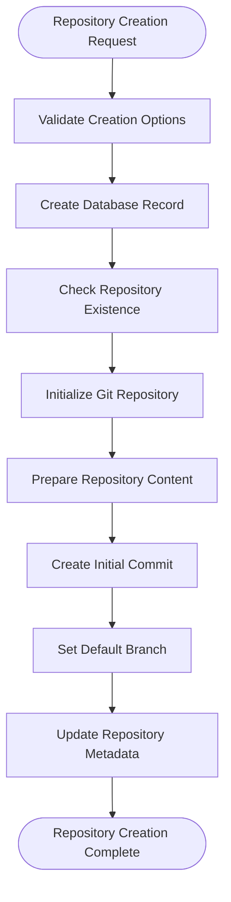
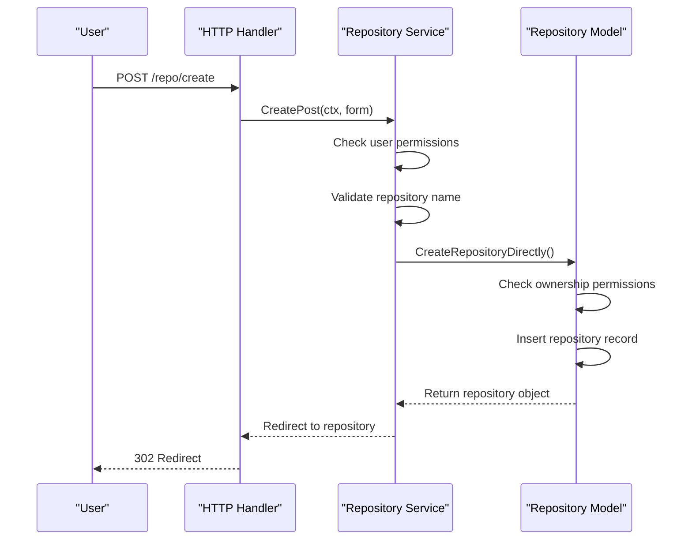
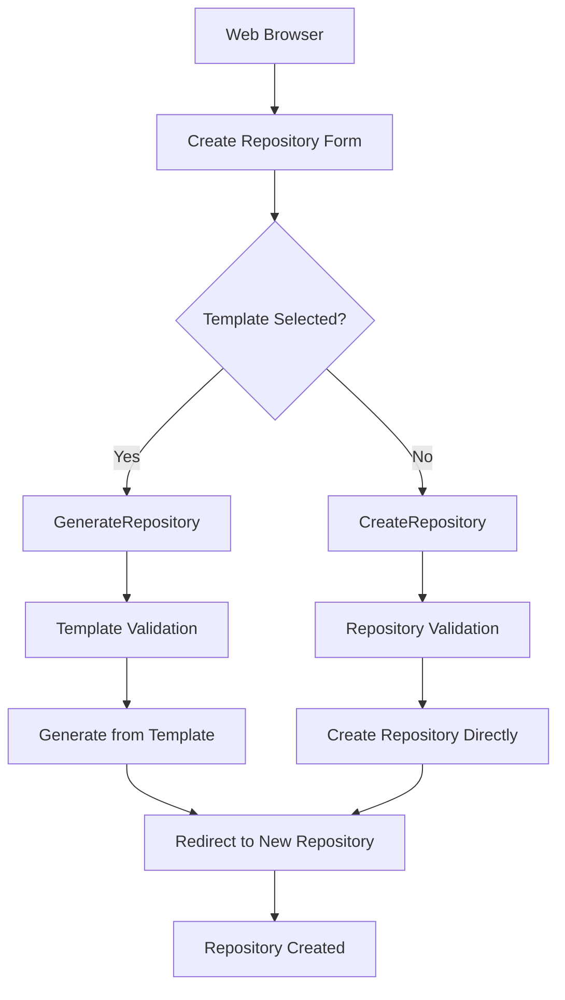
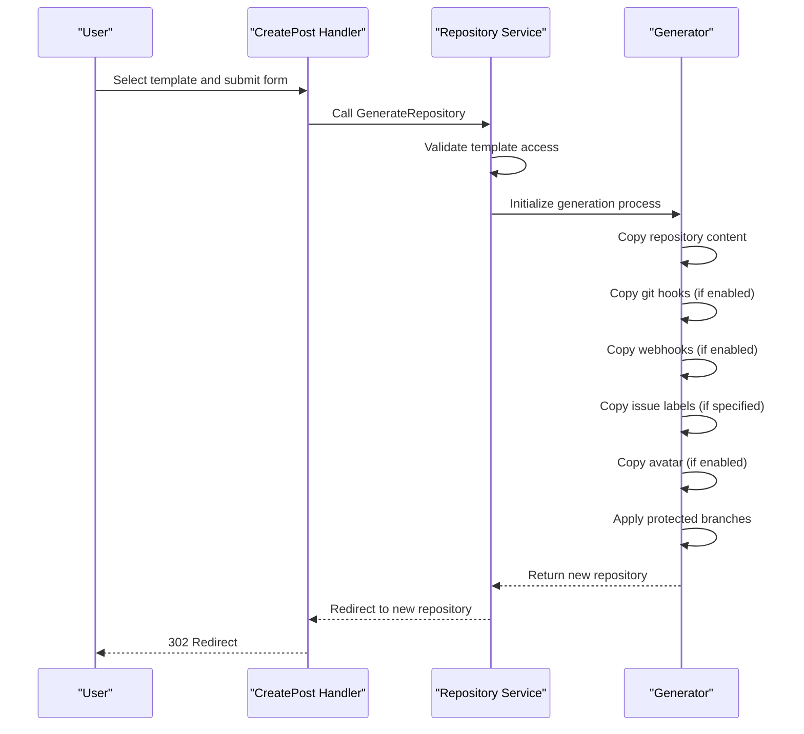
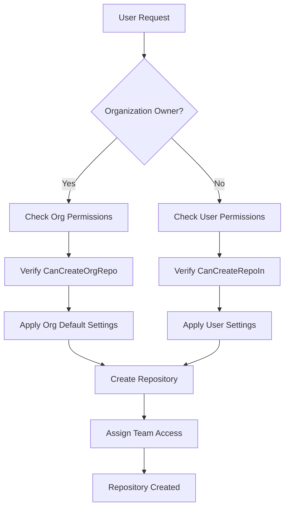
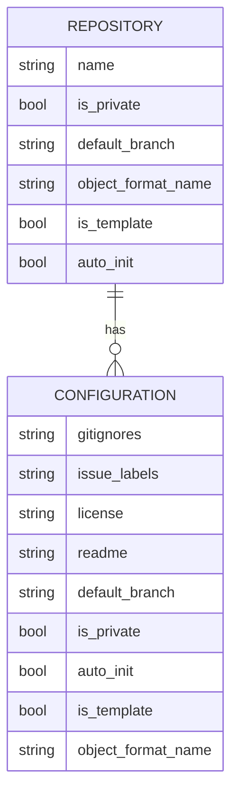
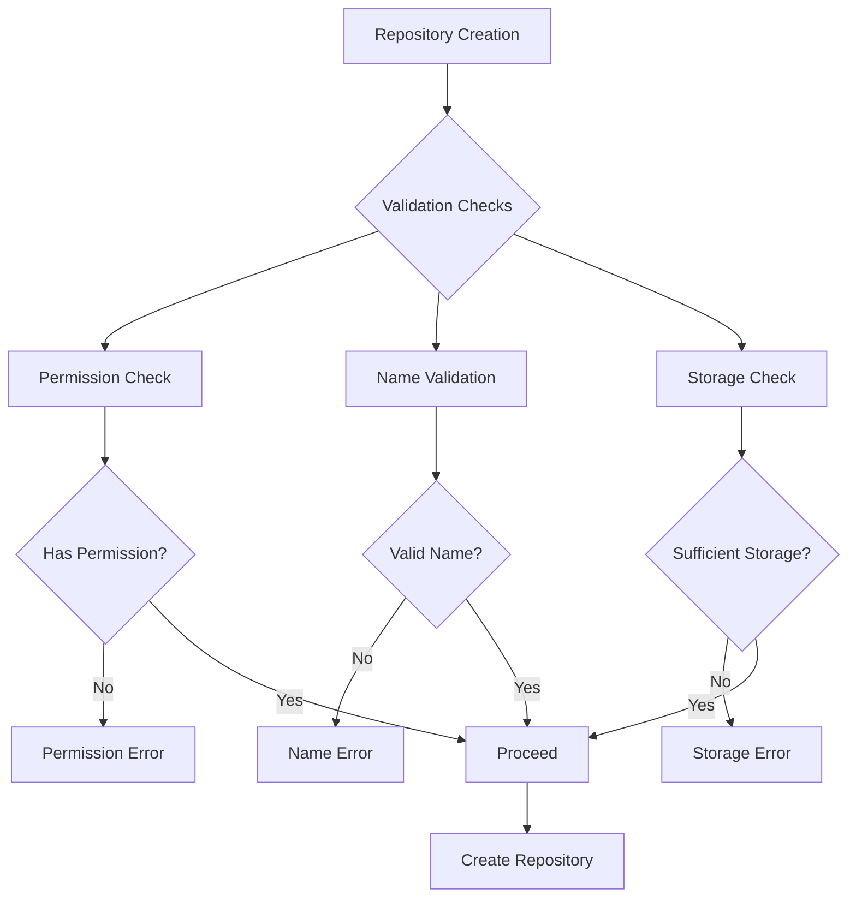
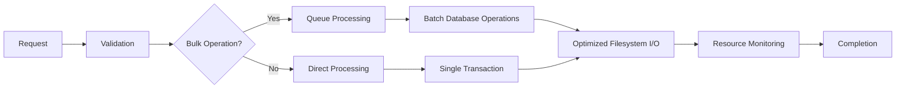
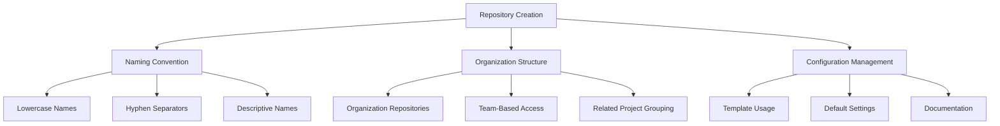

# Repository Creation

<cite>
**Referenced Files in This Document**   
- [services/repository/create.go](file://services/repository/create.go)
- [models/repo/repo.go](file://models/repo/repo.go)
- [routers/web/repo/repo.go](file://routers/web/repo/repo.go)
</cite>

## Table of Contents
1. [Introduction](#introduction)
2. [Repository Initialization Process](#repository-initialization-process)
3. [Ownership Assignment and Access Control](#ownership-assignment-and-access-control)
4. [Unit Configuration and Repository Features](#unit-configuration-and-repository-features)
5. [HTTP Handler Invocation Flow](#http-handler-invocation-flow)
6. [Template-Based Repository Creation](#template-based-repository-creation)
7. [Organization-Owned Repositories](#organization-owned-repositories)
8. [Configuration Options](#configuration-options)
9. [Common Issues and Error Handling](#common-issues-and-error-handling)
10. [Performance Considerations](#performance-considerations)
11. [Best Practices](#best-practices)

## Introduction
This document provides a comprehensive analysis of the repository creation process in Gitea, focusing on the implementation details in `services/repository/create.go` and `models/repo/repo.go`. It examines the complete workflow from HTTP request handling through repository initialization, ownership assignment, and unit configuration. The document also covers template-based creation, organization-owned repositories, configuration options, common issues, and performance considerations for bulk operations.

## Repository Initialization Process

The repository initialization process in Gitea follows a structured sequence of operations that ensures proper setup of the repository's git structure and database records. The core initialization logic is implemented in the `initRepository` function within `services/repository/create.go`, which orchestrates the creation of a new git repository and optional initialization with README, .gitignore, and license files.

When a repository is created with the `AutoInit` option enabled, the system first initializes an empty git bare repository using `gitrepo.InitRepository`. This creates the fundamental git structure for the repository. If auto-initialization is requested, the system then prepares the repository content by cloning into a temporary directory, where it generates and writes the README.md, .gitignore, and LICENSE files based on the provided templates or user selections.

The initialization process handles default branch configuration through the `CreateRepoOptions` struct, which contains a `DefaultBranch` field. If not explicitly specified, the default branch name falls back to the system-wide configuration defined in `setting.Repository.DefaultBranch`. The branch is set using `gitrepo.SetDefaultBranch` after the repository is created, ensuring that the specified branch becomes the default for the repository.



**Diagram sources**
- [services/repository/create.go](file://services/repository/create.go#L150-L250)
- [models/repo/repo.go](file://models/repo/repo.go#L300-L400)

**Section sources**
- [services/repository/create.go](file://services/repository/create.go#L150-L350)
- [models/repo/repo.go](file://models/repo/repo.go#L300-L400)

## Ownership Assignment and Access Control

Ownership assignment in Gitea is a critical aspect of repository creation, determining who has administrative control over the repository. The ownership model supports both user-owned and organization-owned repositories, with appropriate access control checks performed during creation.

The `CreateRepositoryDirectly` function in `services/repository/create.go` handles ownership assignment by accepting both a `doer` (the user initiating the creation) and an `owner` (the user or organization that will own the repository). Before proceeding with creation, the system verifies that the `doer` has permission to create repositories in the specified owner's namespace using the `CanCreateRepoIn` method. This check prevents unauthorized repository creation in user or organization namespaces.

For organization-owned repositories, additional access control checks are performed to ensure the creating user has the necessary permissions within the organization. The `checkContextUser` function in `routers/web/repo/repo.go` handles this logic, verifying that the user can create repositories in the organization by checking both direct permissions and organizational admin status. If the user is an organization administrator, they can create repositories regardless of specific team permissions.

When a repository is created, the system automatically grants appropriate access rights to the owner and creator. For organization-owned repositories, teams with "includes all repositories" permission are automatically granted access to the new repository. The creator is granted admin access unless they already have admin rights through team membership, ensuring they maintain control over repositories they create.



**Diagram sources**
- [services/repository/create.go](file://services/repository/create.go#L250-L350)
- [routers/web/repo/repo.go](file://routers/web/repo/repo.go#L150-L250)

**Section sources**
- [services/repository/create.go](file://services/repository/create.go#L250-L350)
- [routers/web/repo/repo.go](file://routers/web/repo/repo.go#L150-L250)

## Unit Configuration and Repository Features

Repository units in Gitea represent the various features and functionality available for a repository, such as issues, pull requests, projects, and wikis. The unit configuration system determines which features are enabled by default based on the repository type and system settings.

The `createRepositoryInDB` function in `services/repository/create.go` handles the initialization of repository units by inserting records into the database that define which features are enabled. The system uses different default unit configurations depending on the repository type:
- Regular repositories use `unit.DefaultRepoUnits`
- Forked repositories use `unit.DefaultForkRepoUnits` 
- Mirrored repositories use `unit.DefaultMirrorRepoUnits`
- Template repositories use `unit.DefaultTemplateRepoUnits`

Each unit type can have specific configuration options. For example, the Issues unit is configured with settings for time tracking, contributor-only time tracking, and issue dependencies, all of which are set to their system default values. Similarly, the Pull Requests unit is configured with merge options (allow merge, rebase, squash) and the default merge style from system settings.

The unit configuration process also handles special cases for repository types. For mirrored repositories, issue tracking and pull requests are typically disabled by default since the repository is intended to be a read-only mirror of another repository. Template repositories have their own default unit configuration that may differ from regular repositories to support their specialized use case.

```mermaid
classDiagram
class Repository {
+int64 ID
+int64 OwnerID
+string Name
+bool IsPrivate
+bool IsMirror
+bool IsTemplate
+string DefaultBranch
}
class RepoUnit {
+int64 RepoID
+unit.Type Type
+interface{} Config
}
class IssuesConfig {
+bool EnableTimetracker
+bool AllowOnlyContributorsToTrackTime
+bool EnableDependencies
}
class PullRequestsConfig {
+bool AllowMerge
+bool AllowRebase
+bool AllowRebaseMerge
+bool AllowSquash
+bool AllowFastForwardOnly
+MergeStyle DefaultMergeStyle
+bool AllowRebaseUpdate
}
class ProjectsConfig {
+string ProjectsMode
}
Repository "1" -- "0..*" RepoUnit : contains
RepoUnit "1" --> "1" IssuesConfig : config
RepoUnit "1" --> "1" PullRequestsConfig : config
RepoUnit "1" --> "1" ProjectsConfig : config
```

**Diagram sources**
- [services/repository/create.go](file://services/repository/create.go#L350-L450)
- [models/repo/repo.go](file://models/repo/repo.go#L100-L200)

**Section sources**
- [services/repository/create.go](file://services/repository/create.go#L350-L450)
- [models/repo/repo.go](file://models/repo/repo.go#L100-L200)

## HTTP Handler Invocation Flow

The HTTP handler invocation flow for repository creation begins with the web interface in `routers/web/repo/repo.go` and progresses through the service layer to the model layer. This flow ensures proper validation, permission checking, and error handling throughout the creation process.

The creation process starts with the `Create` handler, which renders the repository creation form and populates it with available options such as gitignores, license templates, and readme templates. When the form is submitted, the `CreatePost` handler processes the request, validating the input and determining whether to create a regular repository or generate a repository from a template.

For regular repository creation, the handler calls `repo_service.CreateRepository` with the validated options from the form. This service function performs additional validation and then calls `CreateRepositoryDirectly` to handle the actual creation process. The service layer acts as an intermediary between the HTTP handlers and the model layer, providing a clean separation of concerns.

Error handling is implemented through the `handleCreateError` function, which translates various error types into appropriate user-facing messages. For example, `ErrReachLimitOfRepo` errors are displayed as "reaching the limit of repository creation," while `ErrRepoAlreadyExist` errors show that the repository name is already taken. This centralized error handling ensures consistent user feedback across different error scenarios.



**Diagram sources**
- [routers/web/repo/repo.go](file://routers/web/repo/repo.go#L100-L300)
- [services/repository/create.go](file://services/repository/create.go#L200-L300)

**Section sources**
- [routers/web/repo/repo.go](file://routers/web/repo/repo.go#L100-L300)
- [services/repository/create.go](file://services/repository/create.go#L200-L300)

## Template-Based Repository Creation

Template-based repository creation in Gitea allows users to create new repositories based on predefined templates, ensuring consistency across projects and reducing setup time. This feature is implemented through the `GenerateRepository` function in the repository service, which copies content and configuration from a template repository to a new repository.

The template creation process begins when a user selects a template repository during the creation workflow. The system validates that the selected template is indeed marked as a template repository by checking the `IsTemplate` flag in the repository model. It also verifies that the user has read access to the template repository through the `CheckRepoUnitUser` function, ensuring proper permission enforcement.

When generating a repository from a template, the system copies various elements including:
- Repository content (files, directories, git history)
- Git hooks (if enabled in the generation options)
- Webhooks (if enabled in the generation options)
- Issue labels (if specified in the generation options)
- Avatar (if enabled in the generation options)
- Topics (if specified in the generation options)

The generation process preserves the structure and content of the template while allowing customization of certain aspects like repository name, description, and visibility. Protected branches in the template can also be carried over to the generated repository, maintaining the same branch protection rules.



**Diagram sources**
- [routers/web/repo/repo.go](file://routers/web/repo/repo.go#L250-L300)
- [services/repository/create.go](file://services/repository/create.go#L400-L450)

**Section sources**
- [routers/web/repo/repo.go](file://routers/web/repo/repo.go#L250-L300)
- [services/repository/create.go](file://services/repository/create.go#L400-L450)

## Organization-Owned Repositories

Organization-owned repositories in Gitea follow a specific creation workflow that respects organizational permissions and team structures. When creating a repository owned by an organization, the system performs additional checks to ensure the creating user has the necessary permissions within the organization.

The `checkContextUser` function in `routers/web/repo/repo.go` handles the logic for determining the owner context, which can be either a user or an organization. When an organization is selected as the owner, the function verifies that the user can create repositories in that organization by checking both direct permissions and organizational admin status. Users with administrative privileges in the organization can create repositories regardless of specific team permissions.

For organization-owned repositories, the system automatically applies team-based access control based on the organization's team settings. Teams with the "includes all repositories" permission are automatically granted access to newly created repositories. This ensures that organization-wide teams maintain their access to all repositories without requiring manual assignment for each new repository.

The repository creation process for organization-owned repositories also considers the organization's default settings, such as default visibility and default branch naming. These settings can be configured at the organization level and override user preferences, ensuring consistency across repositories within the organization.



**Diagram sources**
- [routers/web/repo/repo.go](file://routers/web/repo/repo.go#L50-L150)
- [services/repository/create.go](file://services/repository/create.go#L250-L350)

**Section sources**
- [routers/web/repo/repo.go](file://routers/web/repo/repo.go#L50-L150)
- [services/repository/create.go](file://services/repository/create.go#L250-L350)

## Configuration Options

Gitea provides several configuration options for repository creation that allow customization of repository behavior and appearance. These options are exposed through the `CreateRepoOptions` struct in `services/repository/create.go` and include settings for default branch naming, repository visibility, and description templates.

The default branch naming configuration is controlled by the `DefaultBranch` field in `CreateRepoOptions`. If not specified during creation, the system falls back to the default branch name configured in `setting.Repository.DefaultBranch`, which is typically "main" or "master". This setting determines the primary branch name for new repositories and affects various aspects of repository behavior, including the default branch for pull requests and the branch displayed by default in the web interface.

Repository visibility is configured through the `IsPrivate` field in `CreateRepoOptions`, which determines whether the repository is publicly accessible or restricted to authorized users. The system also supports forced private repositories through the `ForcePrivate` setting, which overrides user selections and ensures all repositories are created as private regardless of user choice.

Description templates are implemented through the `Readme` field in `CreateRepoOptions`, which specifies which README template to use for initialization. The system supports various templates that can be expanded with variables such as repository name, description, and clone URLs. These templates are processed using the `vars.Expand` function, which replaces placeholders with actual values before writing the README file to the repository.



**Diagram sources**
- [services/repository/create.go](file://services/repository/create.go#L20-L50)
- [models/repo/repo.go](file://models/repo/repo.go#L200-L300)

**Section sources**
- [services/repository/create.go](file://services/repository/create.go#L20-L50)
- [models/repo/repo.go](file://models/repo/repo.go#L200-L300)

## Common Issues and Error Handling

Repository creation in Gitea can encounter various issues related to permissions, naming conflicts, and storage limitations. The system implements comprehensive error handling to provide meaningful feedback to users and prevent inconsistent states.

Permission-related issues are handled through several error types, including `ErrReachLimitOfRepo` when a user or organization has reached their repository creation limit, and `ErrUserDoesNotHaveAccessToRepo` when a user attempts to create a repository in a namespace they don't have access to. These errors are caught and translated into user-friendly messages through the `handleCreateError` function in the web handlers.

Naming conflicts are managed through the `IsUsableRepoName` function in `models/repo/repo.go`, which validates repository names against a set of rules including character restrictions and reserved names. The system checks for both exact name conflicts using `ErrRepoAlreadyExist` and filesystem conflicts using `ErrRepoFilesAlreadyExist`, which occurs when repository files exist but are not registered in the database.

Storage limitations are handled at multiple levels. The system checks for disk space availability before creating repositories, and repository size limits can be configured at both the system and organization levels. When storage limits are exceeded, the system returns appropriate error messages to prevent repository creation that would exceed available resources.



**Diagram sources**
- [services/repository/create.go](file://services/repository/create.go#L100-L200)
- [models/repo/repo.go](file://models/repo/repo.go#L50-L100)

**Section sources**
- [services/repository/create.go](file://services/repository/create.go#L100-L200)
- [models/repo/repo.go](file://models/repo/repo.go#L50-L100)

## Performance Considerations

Bulk repository creation in Gitea requires careful consideration of performance implications, particularly regarding database operations, filesystem I/O, and resource utilization. The system implements several optimizations to handle bulk operations efficiently.

Database performance is optimized through the use of transactions and batch operations. The `createRepositoryInDB` function wraps repository creation in a database transaction, ensuring atomicity and reducing the overhead of multiple database round-trips. Repository units are inserted in a single batch operation rather than individual inserts, minimizing database load.

Filesystem operations are optimized by using temporary directories for repository initialization and minimizing the number of file operations during the creation process. The system uses efficient git operations for repository initialization, leveraging git's built-in capabilities for creating bare repositories and making initial commits.

Resource utilization is managed through context-aware operations that can be canceled or timed out if they exceed reasonable limits. The system uses graceful shutdown contexts to ensure that repository creation operations can be cleanly terminated if the server is shutting down, preventing orphaned repositories and incomplete states.

For bulk operations, it is recommended to implement rate limiting and queuing mechanisms to prevent overwhelming the system. The system should also consider using connection pooling for database operations and implementing proper error recovery mechanisms to handle partial failures during bulk creation.



**Diagram sources**
- [services/repository/create.go](file://services/repository/create.go#L300-L400)
- [models/repo/repo.go](file://models/repo/repo.go#L400-L500)

**Section sources**
- [services/repository/create.go](file://services/repository/create.go#L300-L400)
- [models/repo/repo.go](file://models/repo/repo.go#L400-L500)

## Best Practices

Adhering to best practices for repository creation in Gitea ensures consistent organization, optimal performance, and effective collaboration. These practices cover naming conventions, repository organization, and configuration management.

Naming conventions should follow a consistent pattern that makes repositories easily identifiable and searchable. Recommended practices include using lowercase letters, hyphens instead of spaces, and avoiding special characters. Repository names should be descriptive but concise, clearly indicating the purpose or content of the repository.

Repository organization should leverage Gitea's support for both user-owned and organization-owned repositories. Teams and departments should use organization repositories to centralize related projects, while individual projects or personal experiments can use user-owned repositories. Within organizations, teams can be used to manage access to groups of repositories with similar purposes or audiences.

Configuration management best practices include using templates for commonly used repository configurations, establishing organization-wide defaults for settings like default branch names and visibility, and documenting repository purpose and usage in the repository description. Regular repositories should be reviewed periodically to ensure they remain relevant and properly maintained.

For template repositories, it is recommended to maintain a small set of well-documented templates for common use cases rather than creating numerous specialized templates. Template repositories should be clearly marked as templates and include comprehensive documentation about their intended use and customization options.



**Diagram sources**
- [services/repository/create.go](file://services/repository/create.go#L450-L485)
- [models/repo/repo.go](file://models/repo/repo.go#L500-L600)

**Section sources**
- [services/repository/create.go](file://services/repository/create.go#L450-L485)
- [models/repo/repo.go](file://models/repo/repo.go#L500-L600)