# Repository Mirroring

<cite>
**Referenced Files in This Document**   
- [mirror.go](file://models/repo/mirror.go)
- [mirror.go](file://services/mirror/mirror.go)
- [migrate.go](file://routers/web/repo/migrate.go)
- [tasks.go](file://services/cron/tasks.go)
- [cron.go](file://services/cron/cron.go)
- [setting.go](file://services/cron/setting.go)
- [pushmirror.go](file://models/repo/pushmirror.go)
</cite>

## Table of Contents
1. [Introduction](#introduction)
2. [Core Components](#core-components)
3. [Architecture Overview](#architecture-overview)
4. [Detailed Component Analysis](#detailed-component-analysis)
5. [Invocation Mechanisms](#invocation-mechanisms)
6. [Configuration and Settings](#configuration-and-settings)
7. [Error Handling and Status Reporting](#error-handling-and-status-reporting)
8. [Common Issues and Troubleshooting](#common-issues-and-troubleshooting)
9. [Performance Considerations](#performance-considerations)
10. [Best Practices](#best-practices)

## Introduction
Repository mirroring in Gitea enables bidirectional synchronization between repositories, supporting both pull and push mirroring mechanisms. This documentation provides a comprehensive analysis of the implementation details, focusing on the core components in `models/repo/mirror.go` and `services/mirror/mirror.go`. It explains the integration with the scheduler (cron) system, manual triggers through web interfaces, and covers configuration options, error handling, and performance considerations for mirroring operations.

## Core Components
The repository mirroring system in Gitea consists of several key components that work together to provide reliable synchronization between repositories. The primary components include the Mirror model for storing mirroring configuration, the mirroring service for executing synchronization operations, and integration points with the cron scheduler and web interface for triggering mirroring operations.

**Section sources**
- [mirror.go](file://models/repo/mirror.go#L1-L124)
- [mirror.go](file://services/mirror/mirror.go#L1-L125)

## Architecture Overview
The repository mirroring architecture in Gitea follows a modular design with clear separation of concerns between data models, service logic, and invocation mechanisms. The system is designed to handle both pull and push mirroring operations through a unified interface while maintaining separate configuration and execution paths for each mirroring type.

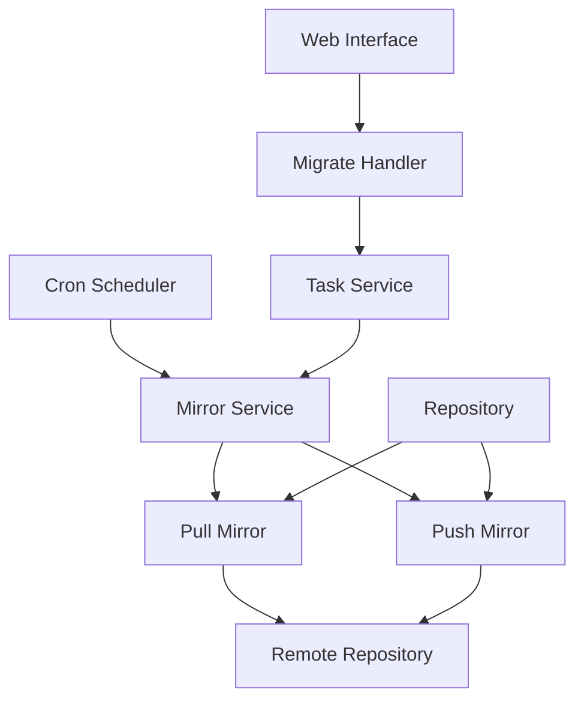

**Diagram sources**
- [mirror.go](file://models/repo/mirror.go#L1-L124)
- [mirror.go](file://services/mirror/mirror.go#L1-L125)
- [migrate.go](file://routers/web/repo/migrate.go#L1-L329)
- [tasks.go](file://services/cron/tasks.go#L1-L242)

## Detailed Component Analysis

### Mirror Model Analysis
The Mirror model in Gitea represents the configuration and state of a pull mirror operation. It contains essential fields for managing the mirroring process, including scheduling information, repository references, and synchronization settings.

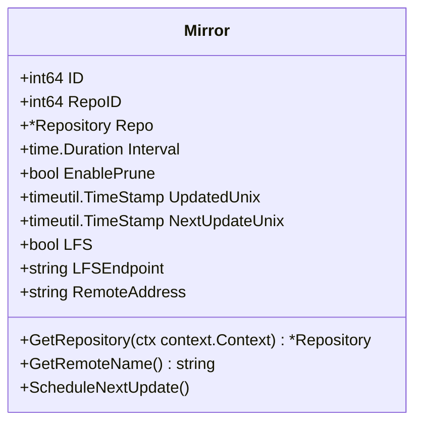

**Diagram sources**
- [mirror.go](file://models/repo/mirror.go#L15-L45)

**Section sources**
- [mirror.go](file://models/repo/mirror.go#L1-L124)

### Mirroring Service Analysis
The mirroring service implements the core logic for synchronizing repositories in both pull and push directions. It handles queue management, error handling, and coordination between different mirroring operations.

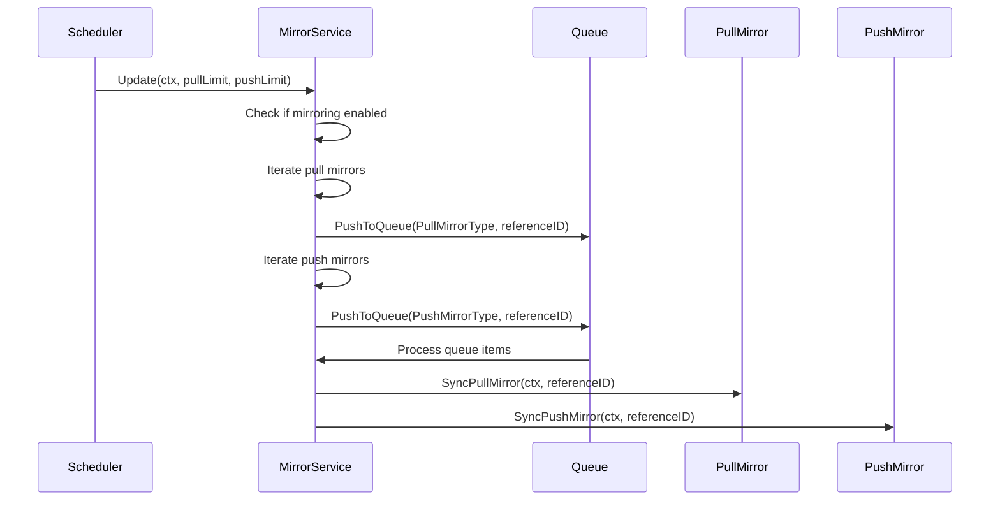

**Diagram sources**
- [mirror.go](file://services/mirror/mirror.go#L20-L120)

**Section sources**
- [mirror.go](file://services/mirror/mirror.go#L1-L125)

### Push Mirror Model Analysis
The PushMirror model extends the mirroring functionality to support push operations, allowing Gitea repositories to be synchronized with remote repositories by pushing changes rather than pulling them.

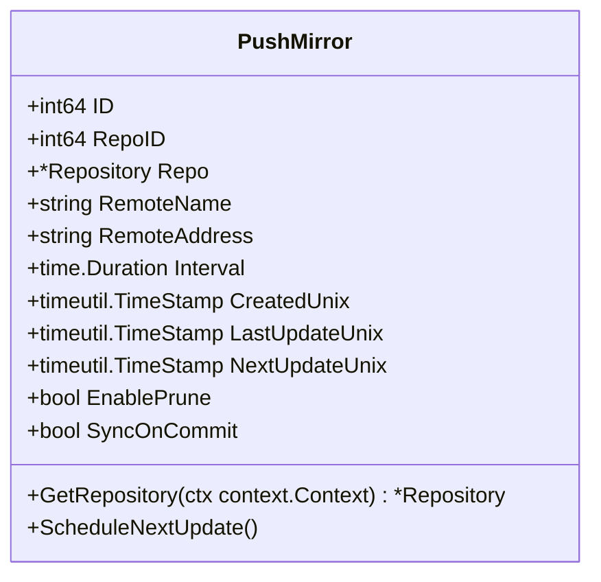

**Diagram sources**
- [pushmirror.go](file://models/repo/pushmirror.go#L15-L45)

**Section sources**
- [pushmirror.go](file://models/repo/pushmirror.go#L1-L100)

## Invocation Mechanisms

### Scheduler Integration
The repository mirroring system integrates with Gitea's cron scheduler to provide automated, periodic synchronization of mirrored repositories. The scheduler invokes the mirroring service according to configured intervals.

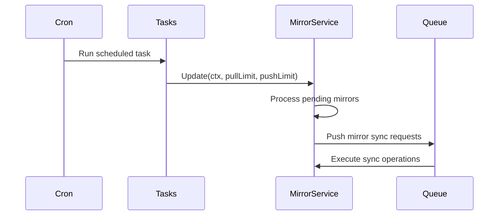

**Diagram sources**
- [tasks.go](file://services/cron/tasks.go#L1-L242)
- [mirror.go](file://services/mirror/mirror.go#L20-L40)

**Section sources**
- [tasks.go](file://services/cron/tasks.go#L1-L242)
- [cron.go](file://services/cron/cron.go#L1-L200)

### Manual Trigger through Web Interface
Users can manually trigger repository mirroring operations through the web interface when migrating or creating new repositories. This mechanism allows for on-demand synchronization outside the regular schedule.

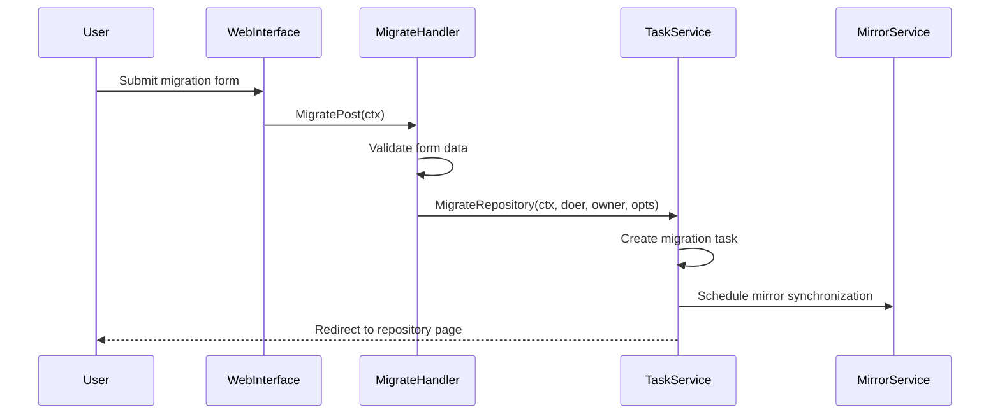

**Diagram sources**
- [migrate.go](file://routers/web/repo/migrate.go#L200-L300)

**Section sources**
- [migrate.go](file://routers/web/repo/migrate.go#L1-L329)

## Configuration and Settings

### Mirror Interval Configuration
Gitea allows configuration of mirror intervals through both the user interface and system settings. The interval determines how frequently pull and push mirrors are synchronized with their remote counterparts.

```mermaid
flowchart TD
A[User Interface] --> B[Set Mirror Interval]
C[System Settings] --> D[Default Mirror Interval]
B --> E[Store in Mirror Model]
D --> E
E --> F[ScheduleNextUpdate()]
F --> G[Calculate NextUpdateUnix]
G --> H[Queue for Synchronization]
```

**Section sources**
- [mirror.go](file://models/repo/mirror.go#L50-L60)
- [setting.go](file://services/cron/setting.go#L1-L50)

### Authentication Methods
The mirroring system supports multiple authentication methods for accessing remote repositories, including username/password, personal access tokens, and SSH keys. These credentials are securely stored and used during synchronization operations.

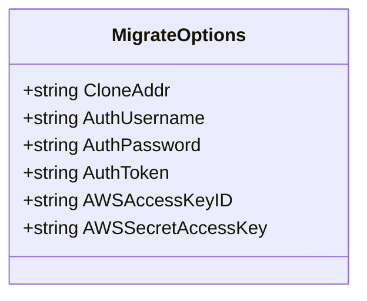

**Section sources**
- [migrate.go](file://routers/web/repo/migrate.go#L150-L200)

### SSL Verification Settings
Gitea provides options for configuring SSL verification when connecting to remote repositories. This includes the ability to disable SSL verification for self-signed certificates in private environments.

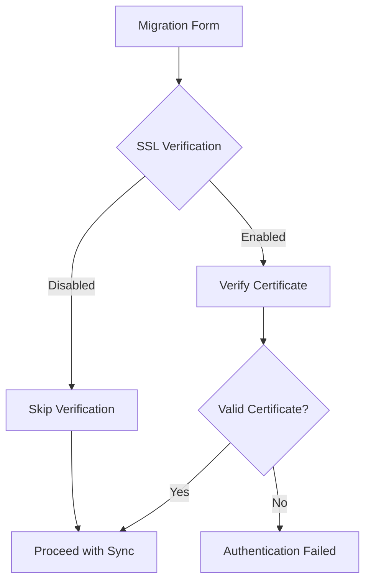

**Section sources**
- [migrate.go](file://routers/web/repo/migrate.go#L100-L150)

## Error Handling and Status Reporting

### Domain Models for Mirror Scheduling
The mirroring system uses several domain models to track the state and progress of mirror operations, including scheduling information, execution status, and error conditions.

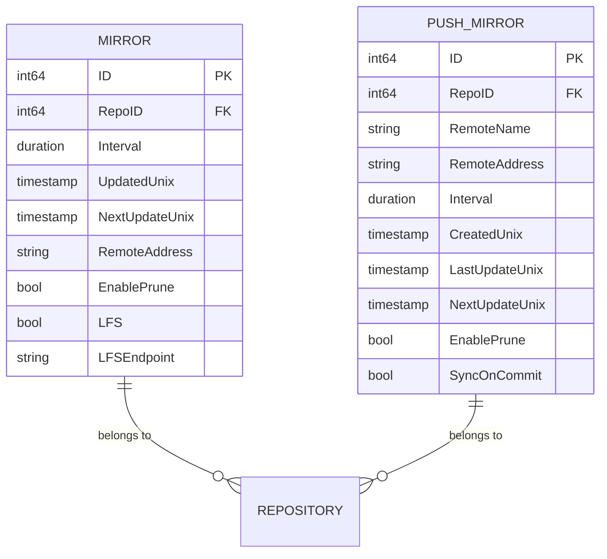

**Section sources**
- [mirror.go](file://models/repo/mirror.go#L15-L45)
- [pushmirror.go](file://models/repo/pushmirror.go#L15-L45)

### Error Handling Mechanisms
The mirroring system implements comprehensive error handling to manage various failure scenarios during synchronization operations, including network issues, authentication failures, and repository conflicts.

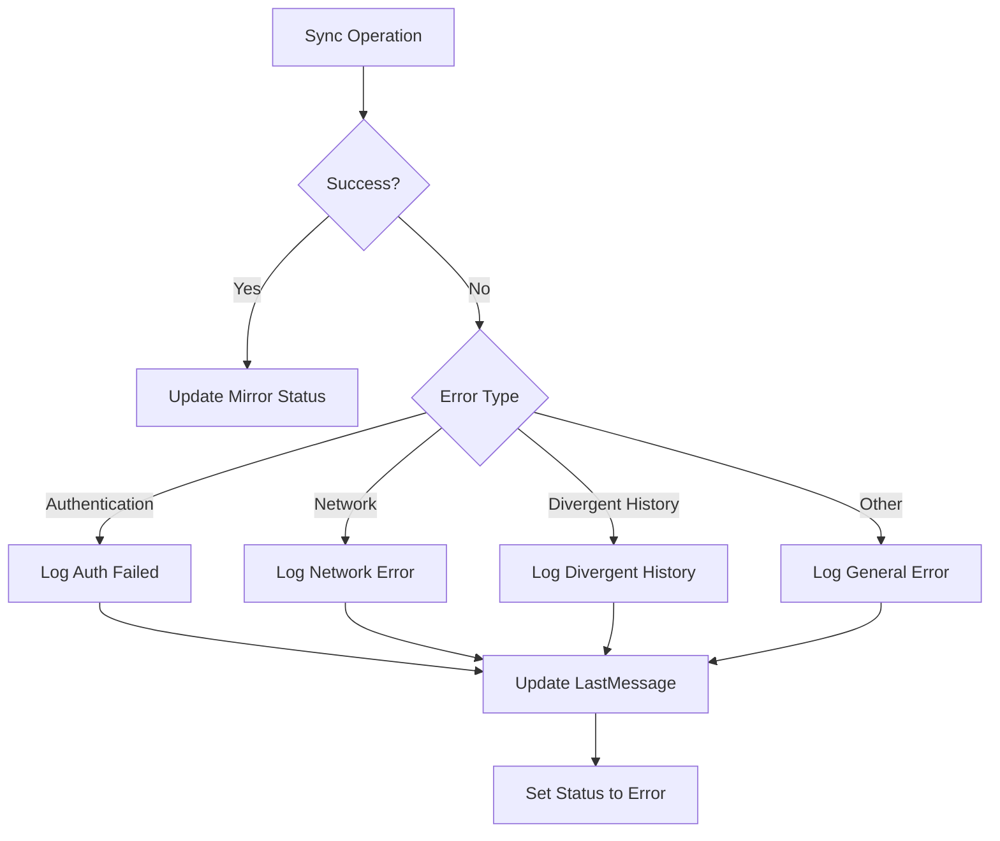

**Section sources**
- [mirror.go](file://services/mirror/mirror.go#L50-L100)
- [migrate.go](file://routers/web/repo/migrate.go#L250-L300)

### Status Reporting
The system provides detailed status reporting for mirror operations, including execution times, success/failure status, and error messages. This information is available through both the web interface and API.

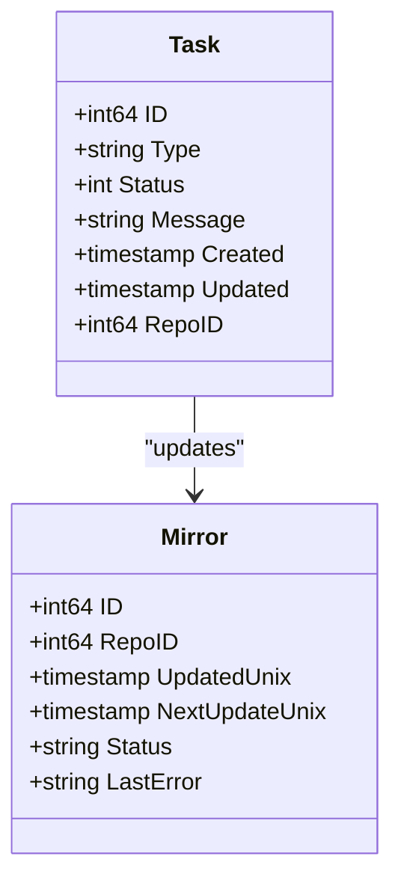

**Section sources**
- [mirror.go](file://models/repo/mirror.go#L30-L40)
- [tasks.go](file://services/cron/tasks.go#L50-L70)

## Common Issues and Troubleshooting

### Authentication Failures
Authentication failures are a common issue when setting up repository mirroring, typically caused by incorrect credentials or insufficient permissions on the remote repository.

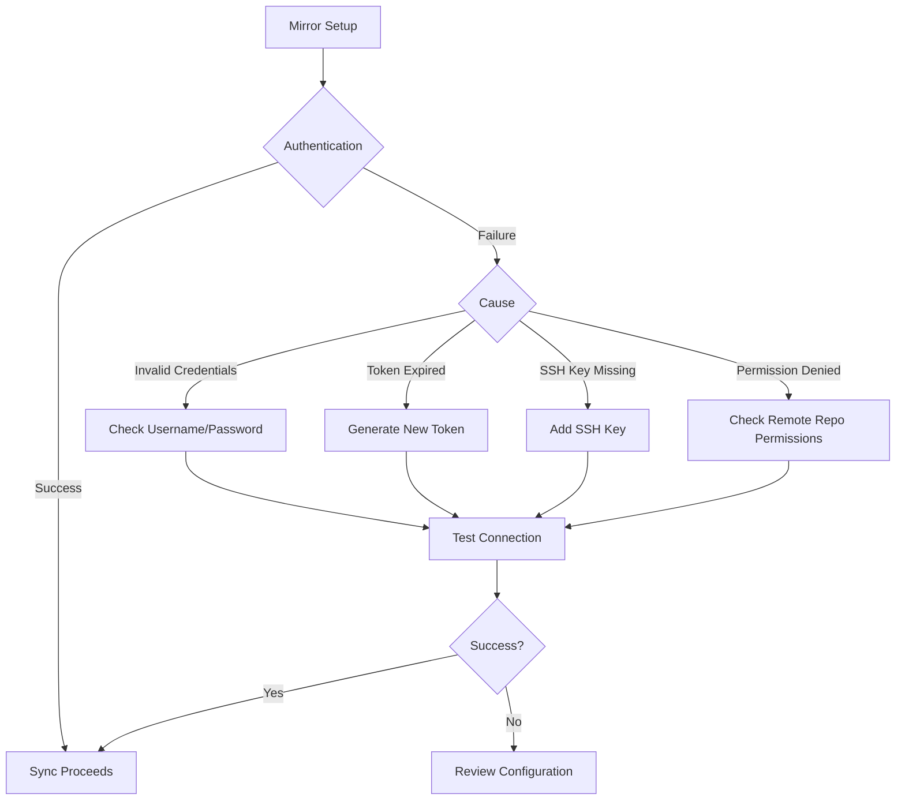

**Section sources**
- [migrate.go](file://routers/web/repo/migrate.go#L250-L300)

### Network Timeouts
Network timeouts can occur during mirroring operations, especially with large repositories or unreliable network connections. The system handles these by retrying operations and providing appropriate error messages.

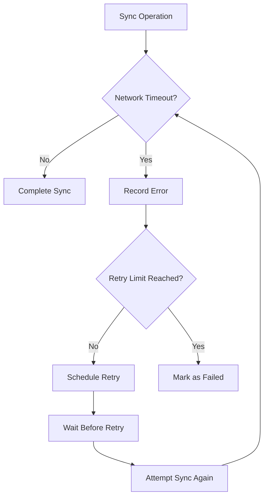

**Section sources**
- [mirror.go](file://services/mirror/mirror.go#L80-L100)

### Divergent Histories
Divergent histories between source and mirror repositories can occur when both repositories have been modified independently, leading to conflicts that prevent synchronization.

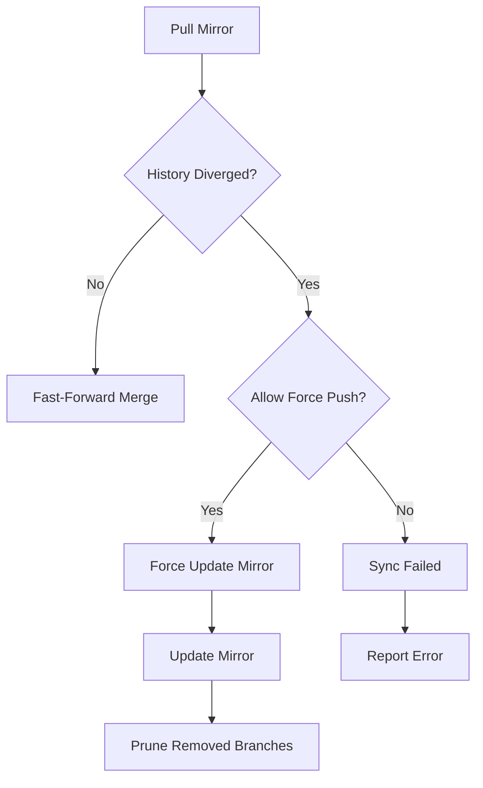

**Section sources**
- [mirror.go](file://services/mirror/mirror.go#L100-L120)

## Performance Considerations
When dealing with large repositories that have frequent updates, several performance considerations should be taken into account. The mirroring system should be configured with appropriate intervals to balance freshness with server load. For very large repositories, it may be beneficial to increase the mirror interval to reduce the frequency of potentially expensive synchronization operations. Additionally, the system supports limiting the number of concurrent mirror operations through the pullLimit and pushLimit parameters in the Update function, which helps prevent resource exhaustion on the server.

**Section sources**
- [mirror.go](file://services/mirror/mirror.go#L20-L40)

## Best Practices
For bidirectional mirroring setups, it is recommended to configure one direction as pull mirroring and the other as push mirroring to avoid conflicts. The primary repository should typically be configured to push changes to the secondary, while the secondary pulls changes from the primary. This creates a clear hierarchy and reduces the likelihood of divergent histories. Additionally, appropriate intervals should be set based on the expected update frequency, and SSL verification should be enabled in production environments to ensure secure connections.

**Section sources**
- [mirror.go](file://models/repo/mirror.go#L1-L124)
- [mirror.go](file://services/mirror/mirror.go#L1-L125)
- [migrate.go](file://routers/web/repo/migrate.go#L1-L329)