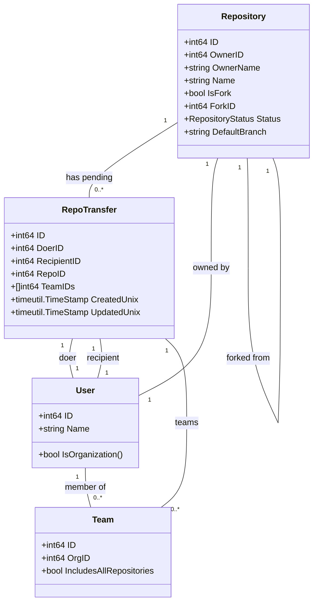
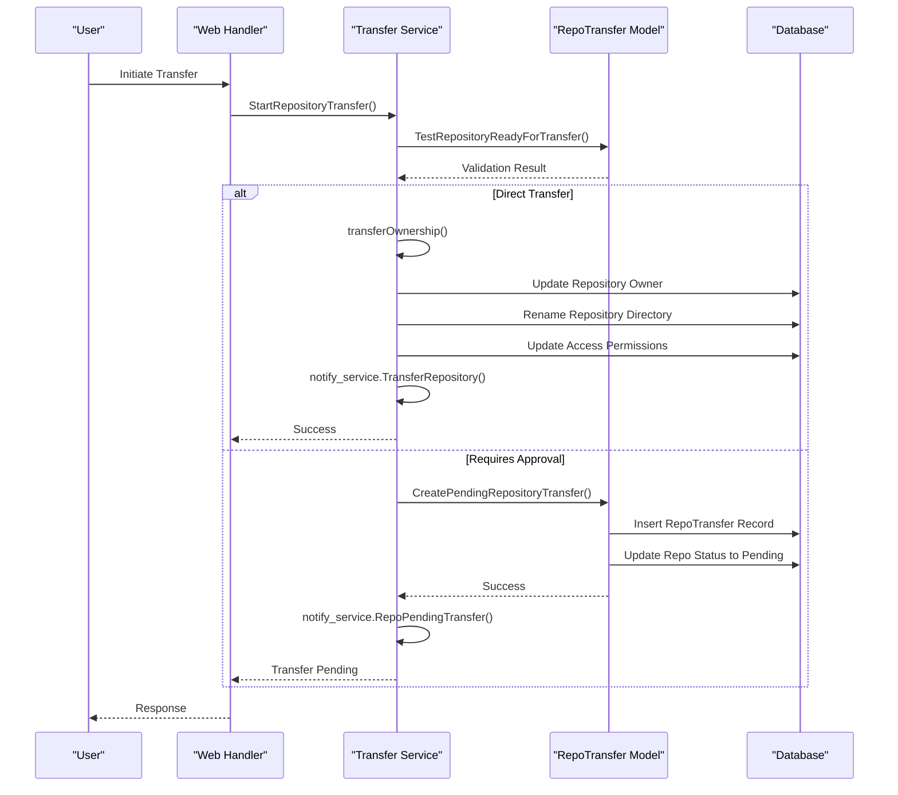
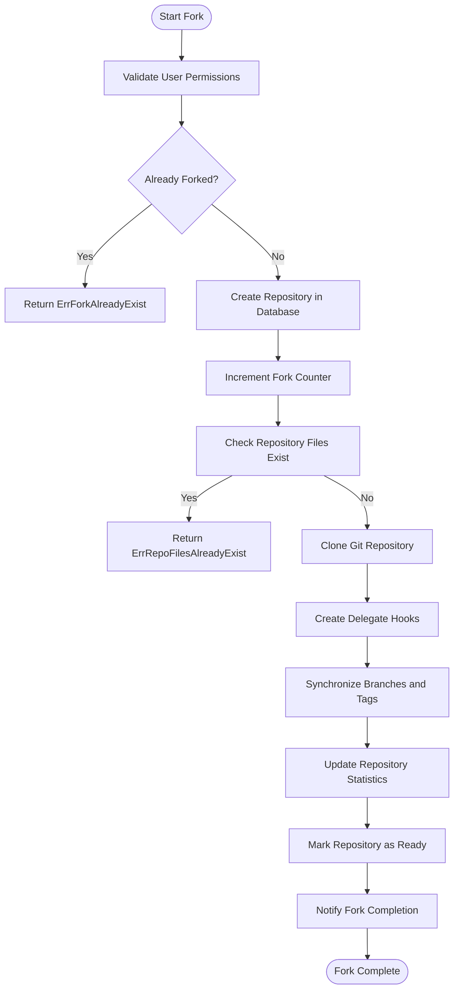
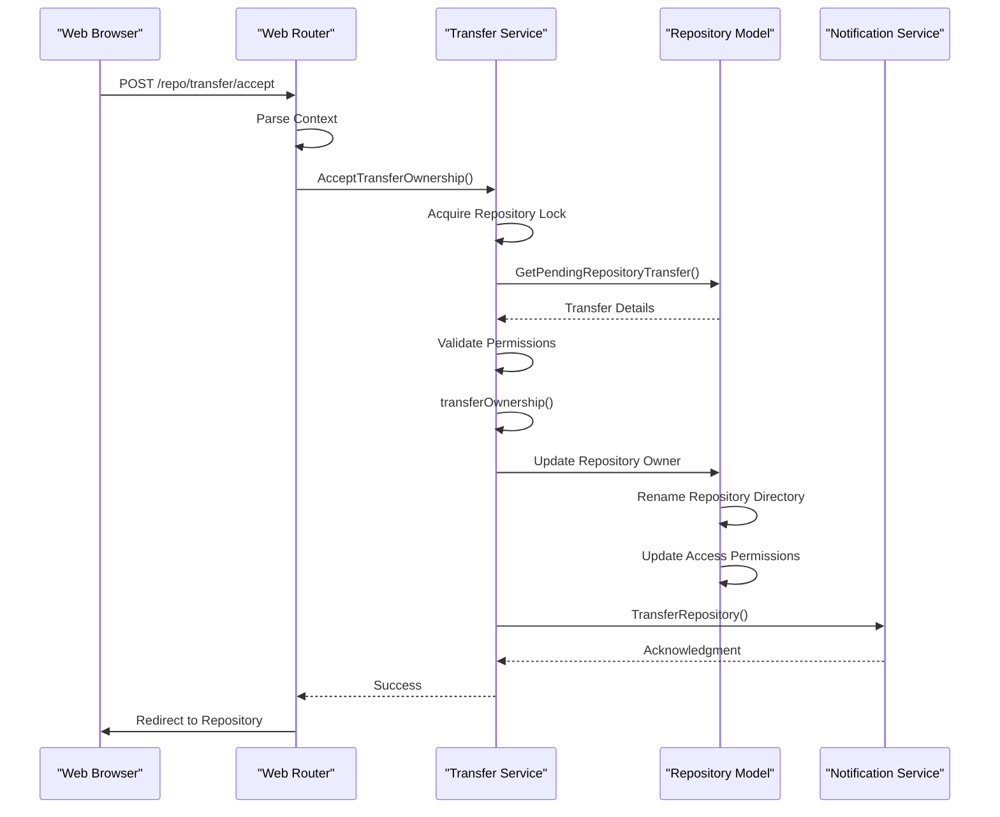
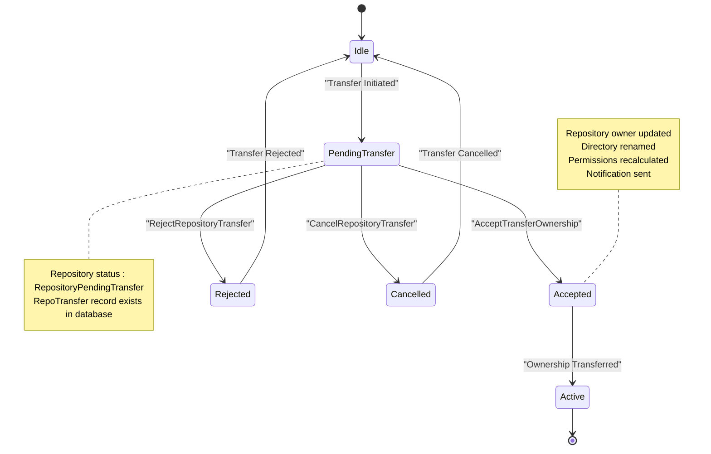
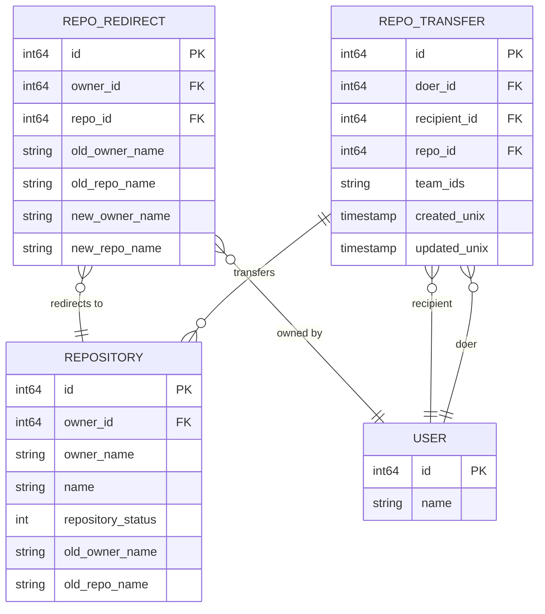
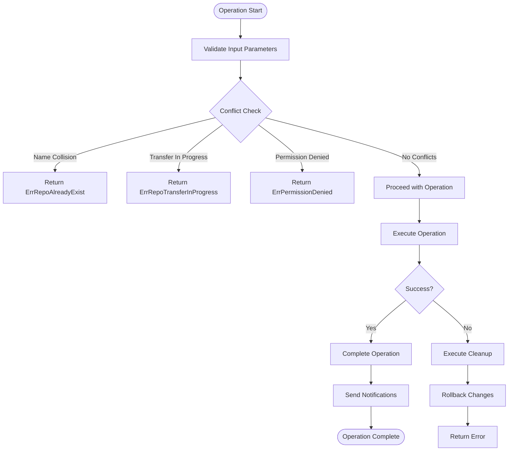
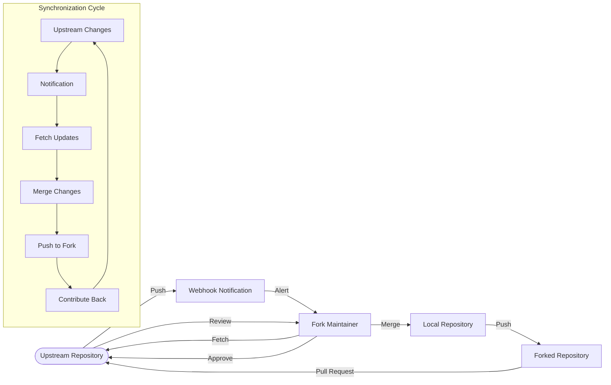

# Repository Transfer and Forking

<cite>
**Referenced Files in This Document**   
- [models/repo/transfer.go](file://models/repo/transfer.go)
- [services/repository/transfer.go](file://services/repository/transfer.go)
- [routers/web/repo/transfer.go](file://routers/web/repo/transfer.go)
- [models/repo/fork.go](file://models/repo/fork.go)
- [services/repository/fork.go](file://services/repository/fork.go)
- [models/repo/repo.go](file://models/repo/repo.go)
</cite>

## Table of Contents
1. [Introduction](#introduction)
2. [Domain Models for Repository Ownership and Forking](#domain-models-for-repository-ownership-and-forking)
3. [Repository Transfer Workflow](#repository-transfer-workflow)
4. [Forking Mechanism](#forking-mechanism)
5. [Web Interface and Service Layer Integration](#web-interface-and-service-layer-integration)
6. [Transfer Approval and Rejection](#transfer-approval-and-rejection)
7. [Audit Logging and Transfer Status](#audit-logging-and-transfer-status)
8. [Common Issues and Conflict Resolution](#common-issues-and-conflict-resolution)
9. [Performance Considerations](#performance-considerations)
10. [Best Practices for Fork Synchronization](#best-practices-for-fork-synchronization)
11. [Conclusion](#conclusion)

## Introduction
This document provides a comprehensive analysis of repository transfer and forking mechanisms in Gitea. It examines the implementation details of ownership transfer between users and organizations, the forking process, and the integration between web interfaces and service layers. The documentation covers domain models, workflow sequences, error handling, and performance considerations for managing repository ownership changes and fork relationships in the Gitea platform.

## Domain Models for Repository Ownership and Forking

The repository transfer and forking system in Gitea is built upon several key domain models that define the relationships between repositories, users, and organizations. The `RepoTransfer` model in `models/repo/transfer.go` represents a pending repository transfer operation, containing references to the doer (initiator), recipient, repository, and associated teams when transferring to an organization. This model includes timestamps for creation and updates, enabling audit trail functionality.

The `Repository` model in `models/repo/repo.go` contains essential fields for ownership management, including `OwnerID`, `OwnerName`, and `IsFork` status. For forked repositories, the `ForkID` field references the original repository's ID, establishing the parent-child relationship in the fork network. The model also includes a `Status` field with values like `RepositoryReady`, `RepositoryBeingMigrated`, and `RepositoryPendingTransfer`, which tracks the repository's state during ownership changes.

For forking operations, the `ForkRepoOptions` struct in `services/repository/fork.go` defines the parameters for creating a fork, including the base repository, name, description, and optional single branch specification. The system maintains fork relationships through database counters that track the number of forks for each repository, ensuring consistency in the fork network visualization.



**Diagram sources**
- [models/repo/transfer.go](file://models/repo/transfer.go#L38-L78)
- [models/repo/repo.go](file://models/repo/repo.go#L100-L250)

**Section sources**
- [models/repo/transfer.go](file://models/repo/transfer.go#L1-L282)
- [models/repo/repo.go](file://models/repo/repo.go#L1-L995)
- [models/repo/fork.go](file://models/repo/fork.go#L1-L104)

## Repository Transfer Workflow

The repository transfer process in Gitea follows a well-defined workflow that ensures data integrity and proper permission management during ownership changes. The process begins with the `StartRepositoryTransfer` function in `services/repository/transfer.go`, which initiates the transfer by validating the repository's readiness and checking the new owner's repository creation limits.

When transferring ownership, the system first checks if a direct transfer is possible. Direct transfers occur when the doer is an administrator, transferring back to their own account, or when transferring to an organization where the doer has repository creation privileges. In these cases, the transfer completes immediately without requiring approval.

For transfers requiring approval, the system creates a pending transfer record using `CreatePendingRepositoryTransfer` in `models/repo/transfer.go`. This function sets the repository status to `RepositoryPendingTransfer` and creates a `RepoTransfer` record in the database. The original repository's status is updated to prevent concurrent operations during the transfer process.

The transfer workflow includes several validation steps to prevent conflicts:
- Checking for existing pending transfers using `IsRepositoryTransferExist`
- Verifying the new owner doesn't already have a repository with the same name
- Ensuring the repository is not currently being migrated
- Validating the new owner's repository limit



**Diagram sources**
- [services/repository/transfer.go](file://services/repository/transfer.go#L200-L300)
- [models/repo/transfer.go](file://models/repo/transfer.go#L240-L280)

**Section sources**
- [services/repository/transfer.go](file://services/repository/transfer.go#L200-L300)
- [models/repo/transfer.go](file://models/repo/transfer.go#L240-L280)

## Forking Mechanism

The forking mechanism in Gitea enables users to create personal copies of existing repositories while maintaining a clear relationship with the original. The `ForkRepository` function in `services/repository/fork.go` orchestrates the forking process, which involves several key steps to ensure a consistent and functional fork.

The forking process begins with validation checks, including verifying the user's repository creation limits and checking if the user has already forked the repository using `GetUserFork` from `models/repo/fork.go`. If the fork doesn't exist, the system proceeds to create a new repository record with `IsFork` set to true and `ForkID` pointing to the original repository's ID.

The actual forking operation occurs in multiple phases:
1. Database creation: The new repository is inserted into the database with appropriate metadata
2. Repository counter update: The original repository's fork count is incremented via `IncrementRepoForkNum`
3. Git repository cloning: A bare clone of the original repository is created using git clone --bare
4. Hook creation: Delegate hooks are established for the new repository
5. Metadata synchronization: Branches, tags, and releases are synchronized with the original

The system handles LFS (Large File Storage) objects by copying them from the original repository to ensure the fork contains all necessary assets. After successful cloning, the system updates repository statistics, including size calculation and language statistics, before marking the repository as ready.



**Diagram sources**
- [services/repository/fork.go](file://services/repository/fork.go#L45-L200)
- [models/repo/fork.go](file://models/repo/fork.go#L1-L104)

**Section sources**
- [services/repository/fork.go](file://services/repository/fork.go#L45-L257)
- [models/repo/fork.go](file://models/repo/fork.go#L1-L104)

## Web Interface and Service Layer Integration

The integration between the web interface and service layer for repository transfer operations is implemented through the router handlers in `routers/web/repo/transfer.go`. These handlers bridge the HTTP request layer with the business logic in the service layer, providing a clean separation of concerns.

The `ActionTransfer` function serves as the entry point for transfer operations, routing requests based on the action parameter. When a user accepts or rejects a transfer, the corresponding handler (`acceptTransfer` or `rejectTransfer`) is invoked. These handlers extract the necessary context from the HTTP request, including the repository and authenticated user, before delegating to the service layer.

The service layer functions `AcceptTransferOwnership` and `RejectRepositoryTransfer` in `services/repository/transfer.go` handle the business logic, ensuring proper transaction management and error handling. The web handlers wrap these service calls with appropriate error handling, using `handleActionError` to manage different error types and provide user-friendly feedback.

This integration pattern follows a consistent approach across Gitea's web interface:
- Request validation and context extraction at the web layer
- Business logic execution in the service layer
- Transaction management within service functions
- Error translation and user feedback in the web layer
- Notification triggering upon successful operations



**Diagram sources**
- [routers/web/repo/transfer.go](file://routers/web/repo/transfer.go#L1-L39)
- [services/repository/transfer.go](file://services/repository/transfer.go#L1-L100)

**Section sources**
- [routers/web/repo/transfer.go](file://routers/web/repo/transfer.go#L1-L39)
- [services/repository/transfer.go](file://services/repository/transfer.go#L1-L100)

## Transfer Approval and Rejection

The transfer approval and rejection system in Gitea provides a secure mechanism for managing ownership changes, particularly when transferring repositories to other users or organizations. The `AcceptTransferOwnership` function in `services/repository/transfer.go` handles the acceptance process, which involves several critical steps to ensure a smooth transition.

When a transfer is accepted, the system first validates that the accepting user has the necessary permissions. For individual users, this means the transfer must be addressed to them. For organizations, the user must have repository creation privileges within that organization. The system then proceeds with the ownership transfer through the `transferOwnership` function, which performs the actual migration of repository data and permissions.

The rejection process, implemented in `RejectRepositoryTransfer`, allows the designated recipient to decline a transfer request. This function resets the repository status to `RepositoryReady` and removes the pending transfer record from the database. Both acceptance and rejection operations are wrapped in database transactions to ensure atomicity and prevent partial updates.

The system also supports transfer cancellation through `CancelRepositoryTransfer`, which allows the original sender or users with administrative privileges on the source repository to cancel a pending transfer. This provides an additional layer of control and security, preventing unauthorized or unwanted ownership changes.



**Diagram sources**
- [services/repository/transfer.go](file://services/repository/transfer.go#L100-L200)
- [models/repo/transfer.go](file://models/repo/transfer.go#L150-L200)

**Section sources**
- [services/repository/transfer.go](file://services/repository/transfer.go#L100-L200)
- [models/repo/transfer.go](file://models/repo/transfer.go#L150-L200)

## Audit Logging and Transfer Status

Gitea's repository transfer system incorporates comprehensive audit logging and status tracking to maintain transparency and accountability during ownership changes. The `RepoTransfer` model includes `CreatedUnix` and `UpdatedUnix` timestamp fields that provide a complete audit trail of transfer operations, recording when transfers were initiated and last modified.

The repository status system, defined in `models/repo/repo.go`, uses enumerated values to track the state of repositories during transfer operations. The `RepositoryPendingTransfer` status indicates that a transfer is in progress and prevents conflicting operations on the repository. This status is updated atomically with the creation of the `RepoTransfer` record, ensuring consistency between the repository state and the transfer record.

Notification services are integrated throughout the transfer workflow to provide audit trails and user notifications. The `notify_service` package triggers events for key operations:
- `TransferRepository`: Notifies when a transfer is completed
- `RepoPendingTransfer`: Notifies when a transfer requires approval
- `RenameRepository`: Notifies when a repository is renamed during transfer

These notifications serve both as audit logs and as communication mechanisms, ensuring that relevant users are informed of ownership changes. The system also maintains redirect records through `NewRedirect` and `DeleteRedirect` functions, preserving access to repositories that have been transferred or renamed.



**Diagram sources**
- [models/repo/transfer.go](file://models/repo/transfer.go#L38-L78)
- [models/repo/repo.go](file://models/repo/repo.go#L100-L250)
- [services/repository/transfer.go](file://services/repository/transfer.go#L400-L500)

**Section sources**
- [models/repo/transfer.go](file://models/repo/transfer.go#L1-L282)
- [models/repo/repo.go](file://models/repo/repo.go#L1-L995)
- [services/repository/transfer.go](file://services/repository/transfer.go#L400-L500)

## Common Issues and Conflict Resolution

The repository transfer and forking system in Gitea addresses several common issues and potential conflicts through proactive validation and error handling mechanisms. One of the most frequent conflicts is the repository name collision, handled by `IsRepositoryModelOrDirExist` in `services/repository/transfer.go`. This function checks both database records and filesystem directories to prevent naming conflicts when transferring or forking repositories.

Transfer conflicts are managed through the `ErrRepoTransferInProgress` error type, which prevents multiple concurrent transfer operations on the same repository. The system checks for existing pending transfers using `IsRepositoryTransferExist` before initiating a new transfer, ensuring that only one transfer process can be active at a time.

Permission inheritance during forking is handled by the `CanForkRepoIn` method, which verifies that the user has sufficient privileges to create repositories in the target namespace. This check considers both individual repository limits and organizational permissions, preventing unauthorized forking operations.

Repository dependencies are managed through careful transaction handling and cleanup procedures. The `transferOwnership` function includes a deferred recovery block that attempts to restore the original repository state if the transfer fails, including renaming directories back to their original locations. Similarly, the `ForkRepository` function includes a deferred cleanup that removes partially created repositories if any step fails.



**Diagram sources**
- [services/repository/transfer.go](file://services/repository/transfer.go#L200-L300)
- [models/repo/transfer.go](file://models/repo/transfer.go#L240-L280)
- [services/repository/fork.go](file://services/repository/fork.go#L45-L200)

**Section sources**
- [services/repository/transfer.go](file://services/repository/transfer.go#L200-L300)
- [models/repo/transfer.go](file://models/repo/transfer.go#L240-L280)
- [services/repository/fork.go](file://services/repository/fork.go#L45-L257)

## Performance Considerations

The repository transfer and forking operations in Gitea involve significant I/O and database operations, requiring careful performance considerations. Transferring large repositories can be particularly resource-intensive due to the need to rename repository directories and update file system references.

The system uses several optimization strategies to improve performance:
- **Locking**: The `globallock.Lock` mechanism in `getRepoWorkingLockKey` prevents concurrent operations on the same repository, avoiding race conditions while allowing parallel operations on different repositories
- **Batch operations**: Database updates are grouped into transactions to minimize round trips and ensure atomicity
- **Deferred cleanup**: Resource-intensive cleanup operations are deferred until the end of the function, allowing the main operation to complete quickly
- **Asynchronous notifications**: Notification services are called after the main operation completes, preventing them from blocking the critical path

For large repositories, the git clone operation during forking can be a bottleneck. The system uses a 10-minute timeout for the clone operation and runs it with appropriate resource limits to prevent excessive resource consumption. The `updateGitRepoAfterCreate` function optimizes repository initialization by only performing necessary updates.

The system also considers network performance by supporting both SSH and HTTPS clone protocols, allowing administrators to optimize for their specific network conditions. Repository size calculations are performed asynchronously after the main operation completes, preventing them from delaying the user experience.

```mermaid
graph TB
subgraph "Performance Optimizations"
A[Global Repository Locking]
B[Database Transactions]
C[Deferred Cleanup]
D[Asynchronous Notifications]
E[Batch Operations]
F[Resource Limits]
end
subgraph "I/O Operations"
G[Git Clone --bare]
H[Directory Rename]
I[Hook Creation]
J[Metadata Synchronization]
end
subgraph "Resource Management"
K[10-Minute Timeout]
L[Memory Limits]
M[Concurrent Operation Control]
end
A --> G
B --> H
C --> J
D --> "notify_service"
E --> B
F --> G
K --> G
L --> G
M --> A
```

**Diagram sources**
- [services/repository/transfer.go](file://services/repository/transfer.go#L1-L100)
- [services/repository/fork.go](file://services/repository/fork.go#L1-L100)

**Section sources**
- [services/repository/transfer.go](file://services/repository/transfer.go#L1-L100)
- [services/repository/fork.go](file://services/repository/fork.go#L1-L100)

## Best Practices for Fork Synchronization

Maintaining synchronization between forked repositories and their upstream sources is crucial for effective collaboration in Gitea. The system provides several mechanisms to support fork synchronization, including branch and tag synchronization through the `SyncRepoBranchesWithRepo` and `SyncReleasesWithTags` functions.

Best practices for maintaining fork synchronization include:
- Regularly pulling changes from the upstream repository using the web interface or git commands
- Using the repository's "Compare" feature to identify differences between fork and upstream
- Configuring webhooks to receive notifications about upstream changes
- Maintaining a clean commit history to facilitate pull requests back to the upstream

The system automatically synchronizes branches and tags when a fork is created, but subsequent updates require manual intervention. Users can manually update their forks through the web interface or by using git commands to fetch and merge changes from the upstream repository.

For organizations managing multiple forks, it's recommended to establish clear contribution guidelines and maintain regular communication with fork maintainers. The fork network visualization, accessible through the repository interface, provides a clear view of all forks and their relationships, helping maintainers understand the ecosystem around their repository.



**Diagram sources**
- [services/repository/fork.go](file://services/repository/fork.go#L200-L257)
- [services/repository/transfer.go](file://services/repository/transfer.go#L400-L500)

**Section sources**
- [services/repository/fork.go](file://services/repository/fork.go#L200-L257)
- [services/repository/transfer.go](file://services/repository/transfer.go#L400-L500)

## Conclusion
The repository transfer and forking system in Gitea provides a robust and secure mechanism for managing repository ownership and collaboration. Through well-defined domain models, comprehensive workflow management, and careful integration between web interfaces and service layers, the system enables seamless ownership transfers and efficient forking operations.

Key strengths of the implementation include:
- Clear separation of concerns between web, service, and model layers
- Comprehensive error handling and conflict resolution
- Robust audit logging and status tracking
- Performance optimizations for large repositories
- Flexible permission management for both individual and organizational transfers

The system effectively balances security and usability, requiring appropriate approvals for ownership changes while providing efficient mechanisms for collaboration through forking. By following the best practices outlined in this documentation, administrators and users can effectively manage repository ownership and maintain healthy fork ecosystems within their Gitea instances.