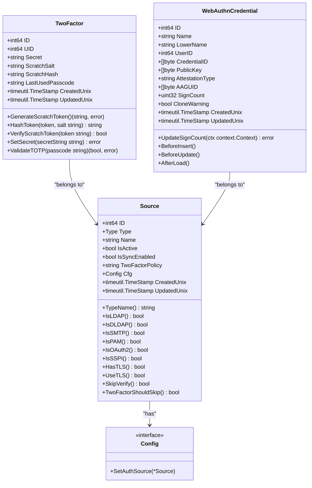
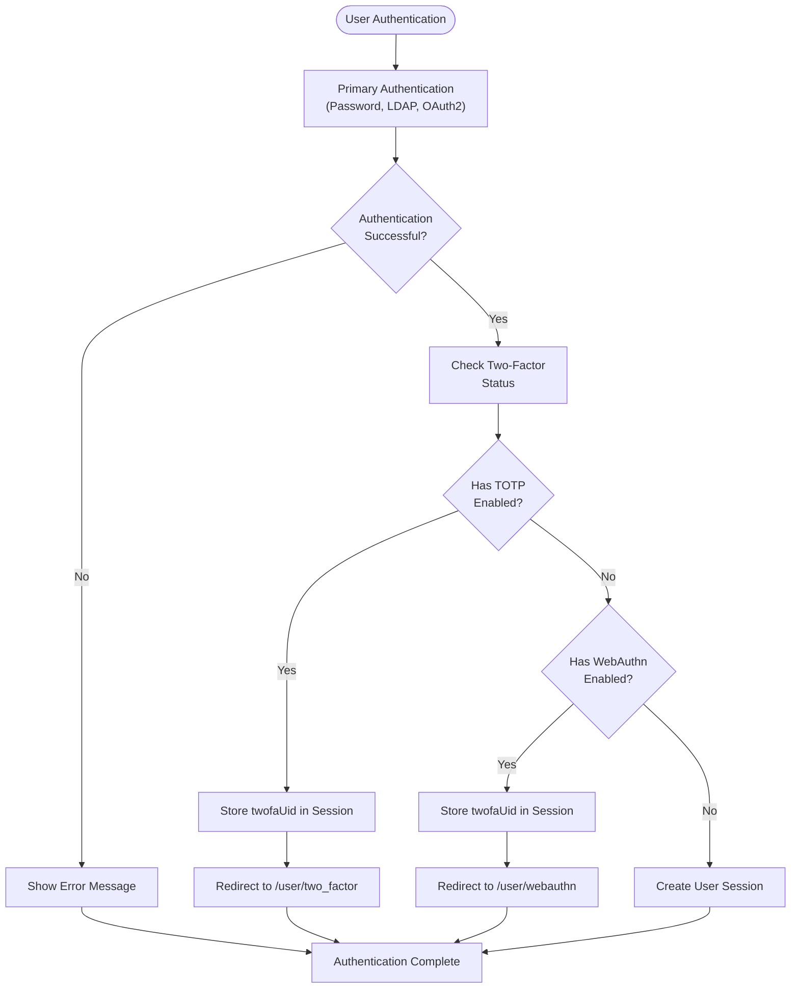

# Authentication

<cite>
**Referenced Files in This Document**   
- [source.go](file://models/auth/source.go)
- [password.go](file://modules/auth/password/password.go)
- [ldap/source.go](file://services/auth/source/ldap/source.go)
- [oauth2/source.go](file://services/auth/source/oauth2/source.go)
- [signin.go](file://services/auth/signin.go)
- [auth.go](file://routers/web/auth/auth.go)
- [twofactor.go](file://models/auth/twofactor.go)
- [webauthn.go](file://models/auth/webauthn.go)
- [2fa.go](file://routers/web/auth/2fa.go)
- [webauthn.go](file://routers/web/auth/webauthn.go)
- [oauth.go](file://routers/web/auth/oauth.go)
- [oauth2.go](file://services/auth/oauth2.go)
</cite>

## Table of Contents
1. [Introduction](#introduction)
2. [Authentication Mechanisms](#authentication-mechanisms)
3. [Domain Model](#domain-model)
4. [Authentication Flow](#authentication-flow)
5. [Two-Factor Authentication](#two-factor-authentication)
6. [Common Issues and Security Considerations](#common-issues-and-security-considerations)
7. [Custom Authentication Integration](#custom-authentication-integration)

## Introduction

Gitea provides a comprehensive authentication system supporting multiple mechanisms including password, LDAP, OAuth2, WebAuthn, and two-factor authentication. The system is designed to be extensible, secure, and user-friendly, allowing administrators to configure various authentication sources and users to secure their accounts with multiple factors. This document details the implementation of Gitea's authentication mechanisms, the domain model, and the interaction between components.

## Authentication Mechanisms

Gitea supports several authentication mechanisms, each implemented as a separate module with a consistent interface. The primary mechanisms include:

- **Password**: Local password authentication with complexity requirements and password strength checking.
- **LDAP**: Integration with LDAP directories for centralized user management.
- **OAuth2**: Support for OAuth2 providers including OpenID Connect.
- **WebAuthn**: Passwordless authentication using security keys and biometrics.
- **Two-Factor Authentication (2FA)**: Time-based one-time passwords (TOTP) and backup codes.

Each authentication mechanism is implemented as a source that can be configured through the admin interface. The system allows multiple authentication sources to be active simultaneously, enabling users to authenticate through different methods.

The authentication mechanisms are extensible through the `Config` interface in the `models/auth` package, which allows for custom configuration storage and retrieval. Each authentication type implements this interface to store its specific configuration in the database.

**Section sources**
- [source.go](file://models/auth/source.go#L1-L399)
- [password.go](file://modules/auth/password/password.go#L1-L137)
- [ldap/source.go](file://services/auth/source/ldap/source.go#L1-L119)
- [oauth2/source.go](file://services/auth/source/oauth2/source.go#L1-L48)

## Domain Model

The authentication domain model in Gitea revolves around the `Source` entity, which represents an authentication source. Each source has a type (password, LDAP, OAuth2, etc.), a name, and a configuration object that stores the specific settings for that source.

The `Source` struct in `models/auth/source.go` defines the core properties of an authentication source:

```go
type Source struct {
	ID              int64 `xorm:"pk autoincr"`
	Type            Type
	Name            string `xorm:"UNIQUE"`
	IsActive        bool   `xorm:"INDEX NOT NULL DEFAULT false"`
	IsSyncEnabled   bool   `xorm:"INDEX NOT NULL DEFAULT false"`
	TwoFactorPolicy string `xorm:"two_factor_policy NOT NULL DEFAULT ''"`
	Cfg             Config `xorm:"TEXT"`
	CreatedUnix timeutil.TimeStamp `xorm:"INDEX created"`
	UpdatedUnix timeutil.TimeStamp `xorm:"INDEX updated"`
}
```

The `Cfg` field is an interface that allows each authentication type to store its specific configuration. The configuration is serialized to JSON and stored in the database. When a source is loaded from the database, the `BeforeSet` method is called to instantiate the appropriate configuration type based on the source type.

For two-factor authentication, Gitea uses two separate models: `TwoFactor` for TOTP-based authentication and `WebAuthnCredential` for WebAuthn-based authentication. The `TwoFactor` model stores the TOTP secret, scratch tokens, and usage information, while the `WebAuthnCredential` model stores the public key credentials for security keys.



**Diagram sources**
- [source.go](file://models/auth/source.go#L1-L399)
- [twofactor.go](file://models/auth/twofactor.go#L1-L177)
- [webauthn.go](file://models/auth/webauthn.go#L1-L213)

## Authentication Flow

The authentication flow in Gitea follows a consistent pattern across different mechanisms. When a user attempts to authenticate, the system first checks if the username is an email address. If so, it looks up the user by email; otherwise, it looks up the user by username.

The authentication process is handled by the `UserSignIn` function in `services/auth/signin.go`, which coordinates the authentication across multiple sources. The function first attempts to authenticate the user with their primary authentication source (stored in the user record). If that fails or if the user doesn't exist, it tries all active authentication sources in sequence.

For password-based authentication, the system verifies the password against the stored hash. For LDAP and OAuth2, it delegates to the respective authentication modules. The authentication result is then used to create a session for the user.

When two-factor authentication is enabled, the authentication flow is extended. After successful primary authentication, the user is redirected to the two-factor authentication page. The system checks if the user has TOTP or WebAuthn configured and redirects to the appropriate page. Once the second factor is verified, the user is fully authenticated.

```mermaid
sequenceDiagram
participant User
participant Router
participant AuthService
participant Source
participant Session
User->>Router : POST /user/login
Router->>AuthService : UserSignIn(username, password)
AuthService->>AuthService : Check primary auth source
alt Primary auth exists
AuthService->>Source : Authenticate(user, username, password)
Source-->>AuthService : Authenticated user
else Try all active sources
AuthService->>AuthService : Iterate active sources
loop Each active source
AuthService->>Source : Authenticate(nil, username, password)
alt Authentication successful
Source-->>AuthService : Authenticated user
break
end
end
end
alt User authenticated
AuthService->>AuthService : Check two-factor status
alt Two-factor required
AuthService->>Session : Store twofaUid, twofaRemember
Session-->>AuthService : Session updated
AuthService->>Router : Redirect to /user/two_factor or /user/webauthn
Router-->>User : 302 Redirect
else No two-factor
AuthService->>Session : Create session
Session-->>AuthService : Session created
AuthService->>Router : Redirect to home
Router-->>User : 302 Redirect
end
else Authentication failed
AuthService->>Router : Return error
Router-->>User : Render error
end
```

**Diagram sources**
- [signin.go](file://services/auth/signin.go#L1-L129)
- [auth.go](file://routers/web/auth/auth.go#L1-L799)

## Two-Factor Authentication

Gitea supports two-factor authentication through both TOTP (Time-based One-Time Password) and WebAuthn (FIDO2) standards. The two-factor authentication system is designed to be secure and user-friendly, with support for backup codes and multiple authentication methods.

The TOTP implementation uses the `github.com/pquerna/otp/totp` library to generate and verify time-based codes. The secret key is encrypted using the application's secret key before being stored in the database. Users can generate backup codes that can be used in case they lose access to their authenticator app.

WebAuthn authentication allows users to use security keys or biometric authentication to log in. The implementation uses the `github.com/go-webauthn/webauthn` library to handle the WebAuthn protocol. When a user registers a security key, the public key credential is stored in the database. During authentication, the system verifies the signature using the stored public key.

The two-factor authentication flow is integrated into the main authentication process. After successful primary authentication, if two-factor is enabled, the user is redirected to the appropriate two-factor authentication page. The system maintains the authentication state in the session, storing the user ID and remember preference until the second factor is verified.



**Diagram sources**
- [twofactor.go](file://models/auth/twofactor.go#L1-L177)
- [webauthn.go](file://models/auth/webauthn.go#L1-L213)
- [2fa.go](file://routers/web/auth/2fa.go#L1-L165)
- [webauthn.go](file://routers/web/auth/webauthn.go#L1-L285)

## Common Issues and Security Considerations

Gitea's authentication system addresses several common security issues and provides mechanisms to mitigate potential vulnerabilities:

1. **Failed Login Attempts**: The system logs failed authentication attempts and provides appropriate error messages without revealing whether the username or password was incorrect. This prevents username enumeration attacks.

2. **Session Expiration**: Sessions are managed through the session middleware, with configurable expiration times. The system supports "remember me" functionality with secure token storage.

3. **Authentication Bypass**: The system prevents authentication bypass by validating all authentication tokens and ensuring that two-factor authentication is properly enforced when required.

4. **Password Security**: Passwords are hashed using secure algorithms (bcrypt, scrypt, etc.) and are checked against known compromised passwords using the "Have I Been Pwned" API.

5. **Account Lockout**: While not explicitly implemented in the provided code, the system provides hooks for implementing account lockout policies after multiple failed attempts.

6. **Session Fixation**: The system regenerates session IDs after successful authentication to prevent session fixation attacks.

7. **Cross-Site Request Forgery (CSRF)**: The system uses CSRF tokens to protect against CSRF attacks on authentication endpoints.

8. **Secure Token Storage**: Authentication tokens are stored securely with appropriate expiration and revocation mechanisms.

The system also provides administrative controls for managing authentication sources, including the ability to disable sources, configure synchronization, and set two-factor policies. These controls help administrators maintain a secure authentication environment.

**Section sources**
- [auth.go](file://routers/web/auth/auth.go#L1-L799)
- [signin.go](file://services/auth/signin.go#L1-L129)
- [password.go](file://modules/auth/password/password.go#L1-L137)

## Custom Authentication Integration

Gitea's authentication system is designed to be extensible, allowing developers to integrate custom authentication sources. The system uses a plugin architecture where each authentication type implements the `Config` interface and registers itself with the authentication system.

To create a custom authentication source, developers need to:

1. Define a configuration struct that implements the `Config` interface.
2. Register the configuration type with the authentication system using `RegisterTypeConfig`.
3. Implement the authentication logic in the `Authenticate` method.
4. Provide any necessary configuration options in the admin interface.

The system handles the storage and retrieval of configuration data automatically, serializing the configuration to JSON and storing it in the database. The authentication flow is consistent across all sources, making it easy to integrate new authentication methods.

For example, to add a new authentication source type, a developer would:

```go
type CustomSource struct {
    auth.ConfigBase `json:"-"`
    // Custom configuration fields
    APIEndpoint string
    ClientID    string
    ClientSecret string
}

func (s *CustomSource) FromDB(bs []byte) error {
    return json.UnmarshalHandleDoubleEncode(bs, &s)
}

func (s *CustomSource) ToDB() ([]byte, error) {
    return json.Marshal(s)
}

func init() {
    auth.RegisterTypeConfig(auth.Custom, &CustomSource{})
}
```

This extensibility allows Gitea to support a wide range of authentication methods while maintaining a consistent and secure authentication framework.

**Section sources**
- [source.go](file://models/auth/source.go#L1-L399)
- [common.go](file://modules/auth/common.go)
- [source.go](file://services/auth/source.go)