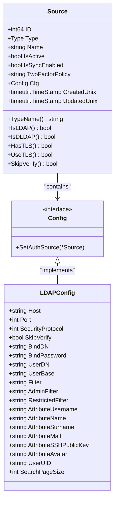
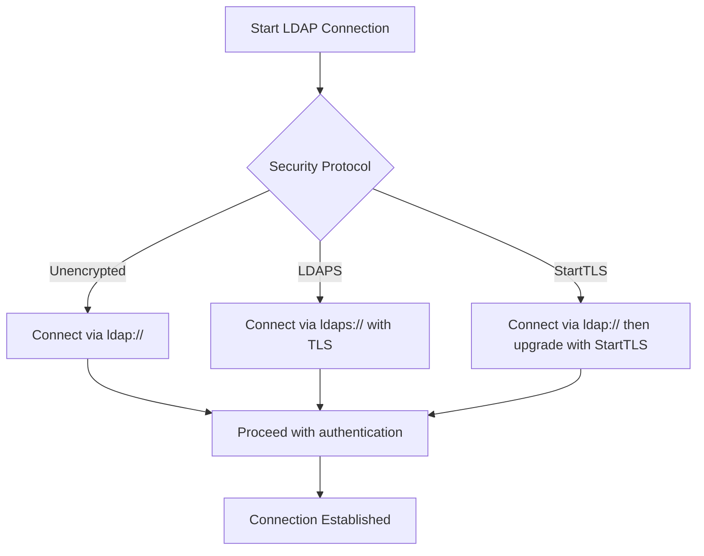
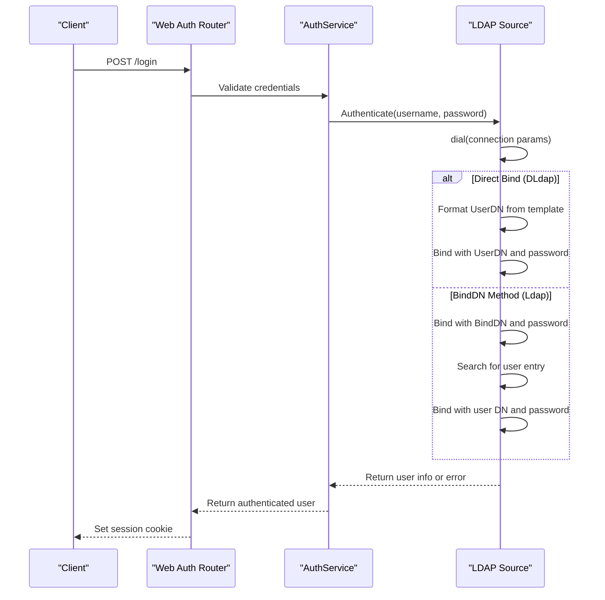
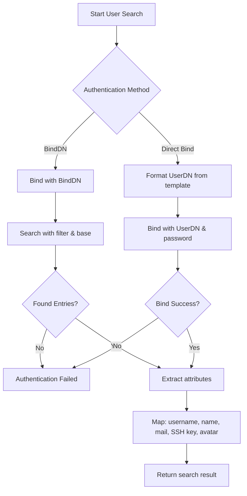
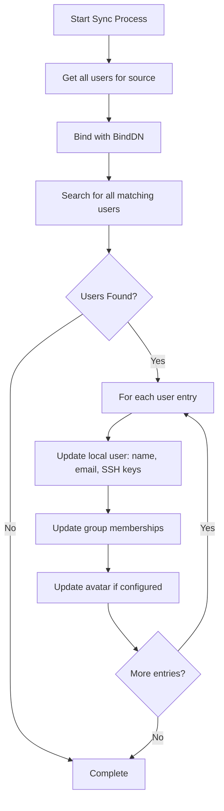

# LDAP Authentication

<cite>
**Referenced Files in This Document**   
- [models/auth/source.go](file://models/auth/source.go)
- [services/auth/source/ldap/source.go](file://services/auth/source/ldap/source.go)
- [services/auth/source/ldap/source_authenticate.go](file://services/auth/source/ldap/source_authenticate.go)
- [services/auth/source/ldap/source_search.go](file://services/auth/source/ldap/source_search.go)
- [services/auth/source/ldap/source_sync.go](file://services/auth/source/ldap/source_sync.go)
- [services/auth/auth.go](file://services/auth/auth.go)
- [routers/web/auth/auth.go](file://routers/web/auth/auth.go)
- [routers/web/admin/auths.go](file://routers/web/admin/auths.go)
</cite>

## Table of Contents
1. [Introduction](#introduction)
2. [LDAP Configuration and Domain Model](#ldap-configuration-and-domain-model)
3. [Connection Setup and Security Protocols](#connection-setup-and-security-protocols)
4. [Authentication Flow](#authentication-flow)
5. [User Search and Attribute Mapping](#user-search-and-attribute-mapping)
6. [User Synchronization Mechanisms](#user-synchronization-mechanisms)
7. [Active Directory Integration](#active-directory-integration)
8. [Common Issues and Troubleshooting](#common-issues-and-troubleshooting)
9. [Performance Considerations](#performance-considerations)

## Introduction
Gitea supports LDAP authentication as a method for integrating with external directory services such as OpenLDAP and Active Directory. This enables centralized user management and single sign-on capabilities. Gitea implements two LDAP authentication methods: LDAP via BindDN (type `LDAP`) and LDAP simple authentication (type `DLdap`). The system allows flexible configuration of connection parameters, user filters, attribute mappings, and synchronization settings. This document details the implementation, configuration, and operational aspects of LDAP integration in Gitea.

## LDAP Configuration and Domain Model

The domain model for LDAP login sources is centered around the `Source` struct defined in the authentication package. Each LDAP source represents a configured connection to an external directory service and contains both generic and protocol-specific configuration data.

**Diagram sources**
- [models/auth/source.go](file://models/auth/source.go#L50-L150)
- [services/auth/source/ldap/source.go](file://services/auth/source/ldap/source.go#L20-L100)

**Section sources**
- [models/auth/source.go](file://models/auth/source.go#L50-L200)
- [services/auth/source/ldap/source.go](file://services/auth/source/ldap/source.go#L1-L150)

## Connection Setup and Security Protocols

LDAP connections in Gitea support multiple security protocols including unencrypted, LDAPS (SSL/TLS), and StartTLS. The connection is established using the host, port, and security settings specified in the LDAP configuration. Certificate verification can be disabled via the `SkipVerify` option, which is useful for testing with self-signed certificates but should be avoided in production environments.

The `dial` function in the LDAP source implementation handles establishing the underlying connection based on the configured security protocol. For LDAPS and StartTLS, the connection is secured before any authentication attempts. The system uses the `go-ldap` library to manage LDAP operations and supports connection pooling through the underlying library's mechanisms.

**Diagram sources**
- [services/auth/source/ldap/source.go](file://services/auth/source/ldap/source.go#L150-L200)
- [services/auth/source/ldap/util.go](file://services/auth/source/ldap/util.go#L10-L50)

**Section sources**
- [services/auth/source/ldap/source.go](file://services/auth/source/ldap/source.go#L150-L250)
- [services/auth/source/ldap/security_protocol.go](file://services/auth/source/ldap/security_protocol.go#L1-L30)

## Authentication Flow

The LDAP authentication process in Gitea follows a well-defined sequence from web request to user creation or login. The flow begins at the web authentication router, proceeds through the authentication service layer, and finally invokes the LDAP source implementation.

**Diagram sources**
- [routers/web/auth/auth.go](file://routers/web/auth/auth.go#L50-L100)
- [services/auth/auth.go](file://services/auth/auth.go#L100-L150)
- [services/auth/source/ldap/source_authenticate.go](file://services/auth/source/ldap/source_authenticate.go#L10-L50)

**Section sources**
- [services/auth/source/ldap/source_authenticate.go](file://services/auth/source/ldap/source_authenticate.go#L1-L60)
- [services/auth/auth.go](file://services/auth/auth.go#L1-L200)
- [routers/web/auth/auth.go](file://routers/web/auth/auth.go#L1-L150)

## User Search and Attribute Mapping

Gitea's LDAP integration supports flexible user search configurations and attribute mapping. The system can locate users using either a search base with filter or a direct UserDN template. When using the BindDN method, Gitea first binds with the configured BindDN credentials, then searches for the user entry using the configured filter and base DN.

The attribute mapping configuration allows administrators to specify which LDAP attributes correspond to Gitea user properties such as username, full name, email, SSH public key, and avatar. During authentication, Gitea retrieves these attributes from the user entry and uses them to create or update the local user account.

**Diagram sources**
- [services/auth/source/ldap/source_search.go](file://services/auth/source/ldap/source_search.go#L200-L400)
- [services/auth/source/ldap/source_authenticate.go](file://services/auth/source/ldap/source_authenticate.go#L40-L60)

**Section sources**
- [services/auth/source/ldap/source_search.go](file://services/auth/source/ldap/source_search.go#L1-L400)
- [services/auth/source/ldap/source_authenticate.go](file://services/auth/source/ldap/source_authenticate.go#L1-L60)

## User Synchronization Mechanisms

LDAP user synchronization in Gitea allows periodic updates of user information from the directory service. This feature is controlled by the `IsSyncEnabled` flag on the authentication source. When enabled, Gitea can synchronize user attributes, group memberships, and SSH keys according to the configured schedule.

The synchronization process uses the same connection and search parameters as authentication but operates in batch mode. It iterates through users associated with the LDAP source and updates their local information based on current directory data. This ensures that changes made in the LDAP directory (such as email address updates or group membership changes) are reflected in Gitea.

**Diagram sources**
- [services/auth/source/ldap/source_sync.go](file://services/auth/source/ldap/source_sync.go#L1-L100)
- [models/auth/source.go](file://models/auth/source.go#L180-L200)

**Section sources**
- [services/auth/source/ldap/source_sync.go](file://services/auth/source/ldap/source_sync.go#L1-L150)
- [services/auth/source/ldap/source.go](file://services/auth/source/ldap/source.go#L80-L90)

## Active Directory Integration

Gitea's LDAP implementation supports Active Directory integration through standard LDAP protocols. For Active Directory environments, administrators typically use the BindDN method with appropriate security settings (usually LDAPS or StartTLS). The configuration requires specifying the domain components in the DN structure and using Active Directory-specific attributes.

Common Active Directory configurations include using `sAMAccountName` for the username attribute and `userPrincipalName` for email. Group membership can be determined using the `memberOf` attribute or through custom filters that check for specific group DNs. The system supports nested group membership evaluation when properly configured with appropriate search scopes.

**Section sources**
- [services/auth/source/ldap/source.go](file://services/auth/source/ldap/source.go#L1-L150)
- [routers/web/admin/auths.go](file://routers/web/admin/auths.go#L90-L114)

## Common Issues and Troubleshooting

Common LDAP connectivity issues in Gitea include certificate validation failures, incorrect DN configurations, and firewall restrictions. When troubleshooting, administrators should first verify basic connectivity using tools like `ldapsearch` with the same parameters configured in Gitea.

Certificate-related issues can be temporarily bypassed using the `SkipVerify` option, but this should only be used for testing. Authentication failures often stem from incorrect BindDN credentials or user filter configurations. Enabling debug logging in Gitea can provide detailed information about LDAP operations and error messages from the directory server.

Connection pooling issues may arise when the LDAP server has strict connection limits. In such cases, ensuring proper connection closure and considering the use of connection pooling at the infrastructure level can help mitigate problems.

**Section sources**
- [services/auth/source/ldap/source.go](file://services/auth/source/ldap/source.go#L150-L250)
- [services/auth/source/ldap/source_search.go](file://services/auth/source/ldap/source_search.go#L239-L288)
- [services/auth/source/ldap/source_authenticate.go](file://services/auth/source/ldap/source_authenticate.go#L1-L20)

## Performance Considerations

For large directories, LDAP performance in Gitea can be optimized through several configuration settings. The `SearchPageSize` parameter controls the number of entries returned in a single search operation, which can prevent timeouts with large result sets. Using indexed attributes in search filters improves query performance on the LDAP server.

Binding operations should be minimized by using connection pooling where possible. The BindDN method may introduce additional latency due to the two-step process (search then bind), while direct bind authentication can be faster but offers less flexibility in user filtering. Caching of authentication results and user information can also improve performance for frequently accessed accounts.

**Section sources**
- [services/auth/source/ldap/source.go](file://services/auth/source/ldap/source.go#L70-L90)
- [services/auth/source/ldap/source_search.go](file://services/auth/source/ldap/source_search.go#L337-L373)
- [services/auth/source/ldap/source_sync.go](file://services/auth/source/ldap/source_sync.go#L1-L50)