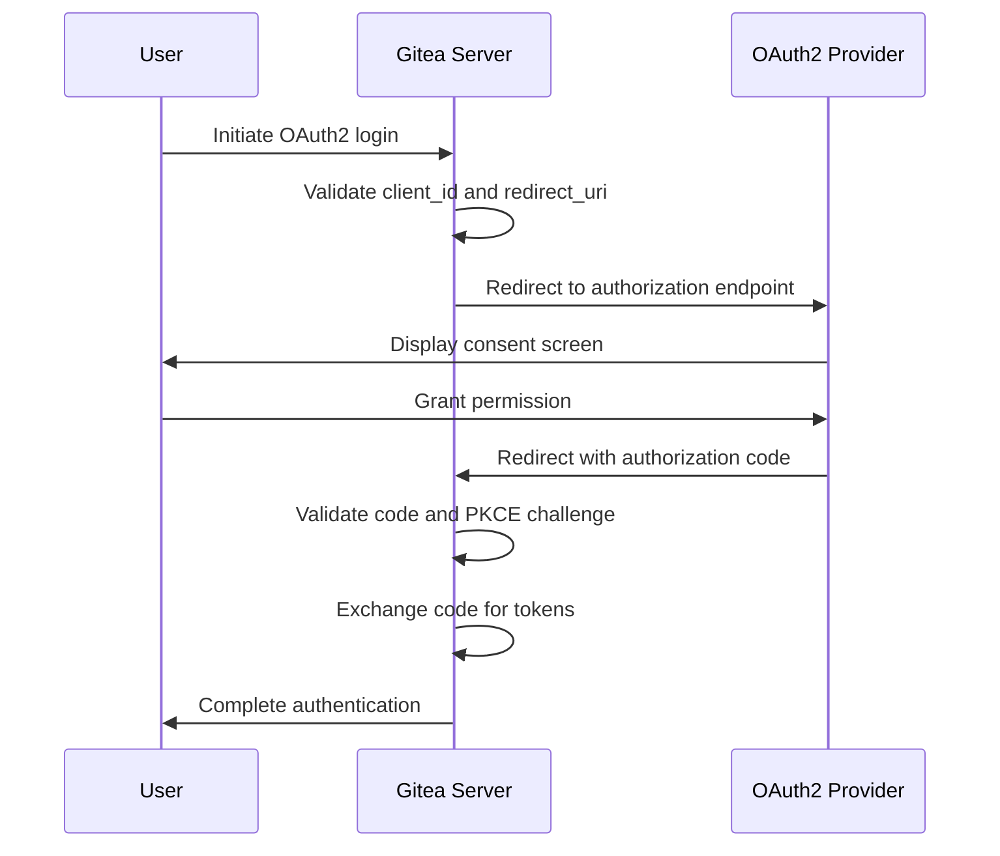
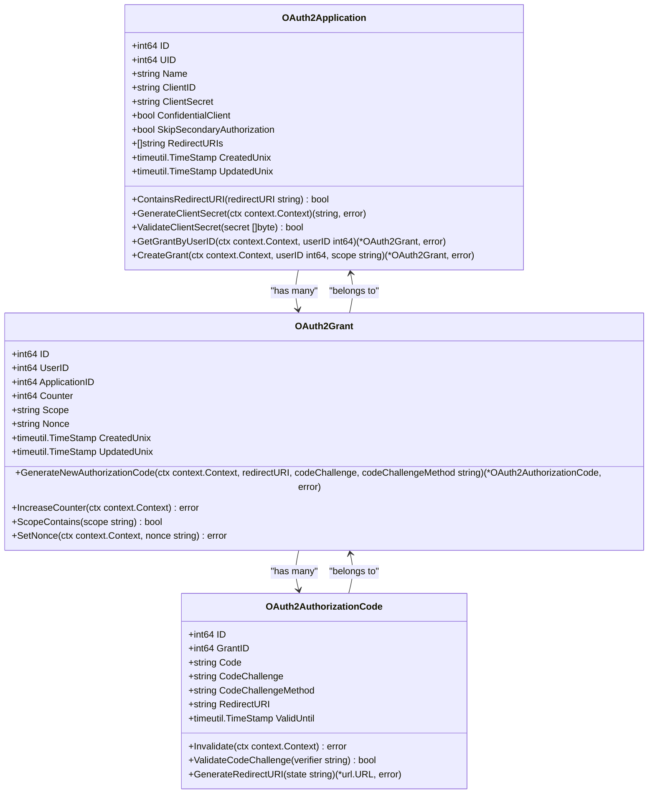
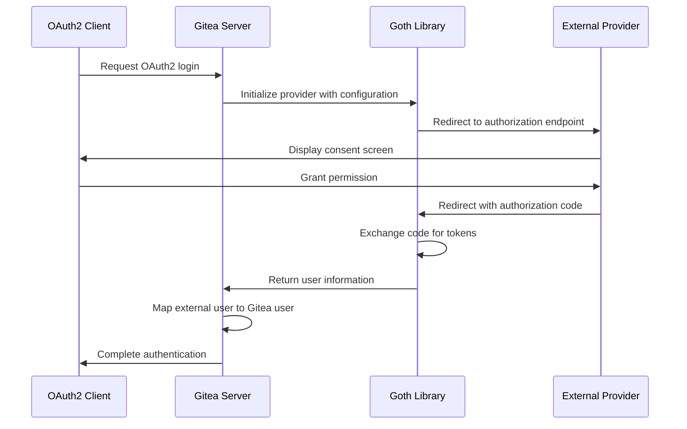
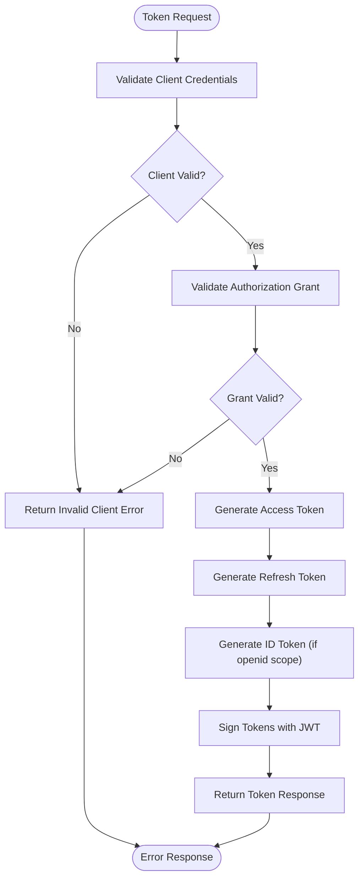
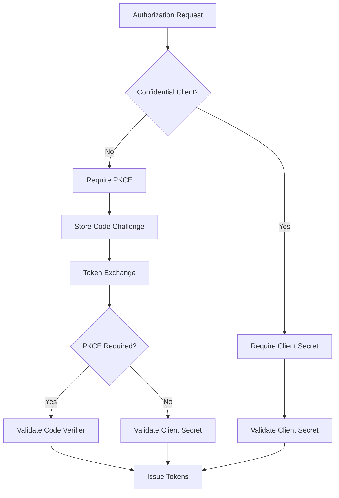

# OAuth2 Authentication

<cite>
**Referenced Files in This Document**   
- [oauth2.go](file://models/auth/oauth2.go)
- [oauth2_provider.go](file://routers/web/auth/oauth2_provider.go)
- [oauth2.go](file://services/auth/oauth2.go)
- [init.go](file://services/auth/source/oauth2/init.go)
- [source_callout.go](file://services/auth/source/oauth2/source_callout.go)
- [token.go](file://services/oauth2_provider/token.go)
- [access_token.go](file://services/oauth2_provider/access_token.go)
- [source.go](file://models/auth/source.go)
</cite>

## Table of Contents
1. [Introduction](#introduction)
2. [OAuth2 Flow Implementation](#oauth2-flow-implementation)
3. [Domain Model](#domain-model)
4. [Provider Integration](#provider-integration)
5. [Token Management](#token-management)
6. [Security Considerations](#security-considerations)
7. [Configuration and Troubleshooting](#configuration-and-troubleshooting)

## Introduction
Gitea implements a comprehensive OAuth2 authentication system that enables users to authenticate through external identity providers such as GitHub, GitLab, and Google. The implementation follows RFC 6749 specifications for the authorization code grant flow and supports OpenID Connect for identity verification. This document details the architecture, implementation, and integration aspects of Gitea's OAuth2 system, focusing on the authorization flow, token exchange, user information retrieval, and provider integration patterns.

## OAuth2 Flow Implementation

The OAuth2 authorization flow in Gitea follows the standard authorization code grant pattern with PKCE (Proof Key for Code Exchange) support for enhanced security. The flow begins when a user initiates authentication through an OAuth2 provider, triggering the authorization endpoint.

**Diagram sources**
- [oauth2_provider.go](file://routers/web/auth/oauth2_provider.go#L67-L105)
- [source_callout.go](file://services/auth/source/oauth2/source_callout.go#L0-L46)

The authorization process is managed by the `AuthorizeOAuth` handler, which validates the client ID, redirect URI, and response type. For public clients, PKCE is mandatory to prevent authorization code interception attacks. The server stores the code challenge and method in the session during the authorization request and validates the code verifier during the token exchange phase.

**Section sources**
- [oauth2_provider.go](file://routers/web/auth/oauth2_provider.go#L67-L105)

## Domain Model

Gitea's OAuth2 domain model consists of three primary entities: OAuth2Application, OAuth2Grant, and OAuth2AuthorizationCode. These entities represent the core components of the OAuth2 authorization framework.

**Diagram sources**
- [oauth2.go](file://models/auth/oauth2.go#L0-L45)

The `OAuth2Application` entity represents an OAuth2 client registered with Gitea, containing configuration such as client ID, client secret, and redirect URIs. The `OAuth2Grant` entity represents a user's authorization for a specific application, storing the scope of access granted. The `OAuth2AuthorizationCode` entity represents a temporary authorization code used in the authorization code grant flow, including PKCE parameters for enhanced security.

**Section sources**
- [oauth2.go](file://models/auth/oauth2.go#L0-L45)

## Provider Integration

Gitea integrates with external OAuth2 providers through the Goth library, which provides a unified interface for multiple OAuth2 providers. The integration is managed through the `Source` configuration, which encapsulates provider-specific settings.

**Diagram sources**
- [source_callout.go](file://services/auth/source/oauth2/source_callout.go#L0-L46)
- [init.go](file://services/auth/source/oauth2/init.go#L0-L59)

The `Callout` method initiates the OAuth2 flow by redirecting the user to the provider's authorization endpoint, while the `Callback` method handles the provider's response and retrieves the user information. The integration uses a thread-safe mutex to ensure proper handling when multiple providers are configured.

**Section sources**
- [source_callout.go](file://services/auth/source/oauth2/source_callout.go#L0-L46)
- [init.go](file://services/auth/source/oauth2/init.go#L0-L59)

## Token Management

Gitea implements JWT-based token management for OAuth2 access and refresh tokens. The token system supports both symmetric and asymmetric signing methods, with configurable expiration times for access and refresh tokens.

**Diagram sources**
- [token.go](file://services/oauth2_provider/token.go#L0-L94)
- [access_token.go](file://services/oauth2_provider/access_token.go#L0-L270)

The token generation process creates three types of tokens: access tokens for API access, refresh tokens for obtaining new access tokens, and ID tokens for OpenID Connect identity verification. Access tokens have a configurable expiration time (default 1 hour), while refresh tokens have a longer expiration period (default 720 hours). The system supports token invalidation through a counter mechanism when the `InvalidateRefreshTokens` setting is enabled.

**Section sources**
- [token.go](file://services/oauth2_provider/token.go#L0-L94)
- [access_token.go](file://services/oauth2_provider/access_token.go#L0-L270)

## Security Considerations

Gitea implements several security measures to protect the OAuth2 authentication process. These include PKCE for public clients, client secret validation for confidential clients, and strict redirect URI validation.

For public clients (such as mobile or desktop applications), PKCE is mandatory to prevent authorization code interception attacks. The server validates the code verifier against the stored code challenge using either the S256 or plain method. For confidential clients, the client secret must be provided and validated during both the token exchange and refresh operations.

The system enforces strict redirect URI validation, requiring an exact match between the requested redirect URI and those registered for the application. For HTTP loopback URIs, the port number is ignored to accommodate dynamic ports used by desktop applications, following RFC 8252 section 7.3.

**Diagram sources**
- [oauth2_provider.go](file://routers/web/auth/oauth2_provider.go#L67-L105)
- [access_token.go](file://services/oauth2_provider/access_token.go#L0-L270)

## Configuration and Troubleshooting

Configuring OAuth2 providers in Gitea requires proper setup of client credentials, redirect URIs, and scope definitions. Common issues include incorrect callback URLs, scope mismatches, and token refresh problems.

When implementing custom OAuth2 providers, developers should extend the `Source` configuration and implement the `RegisterableSource` interface. The provider configuration should include the authorization URL, token URL, profile URL, and any provider-specific endpoints. Client secrets should be stored securely and never exposed in client-side code.

For troubleshooting OAuth2 issues, administrators should verify the following:
- The redirect URI in the authorization request exactly matches one of the registered URIs
- The client ID and client secret are correct and properly encoded
- The requested scopes are supported by the application
- The authorization code has not expired (default 30 minutes)
- For PKCE, the code verifier matches the original code challenge

The system provides OpenID Connect discovery endpoints at `/.well-known/openid-configuration` and JWKs at `/api/v1/user/oidc/keys` for client configuration and token validation.

**Section sources**
- [oauth2_provider.go](file://routers/web/auth/oauth2_provider.go#L67-L105)
- [source.go](file://models/auth/source.go#L0-L398)