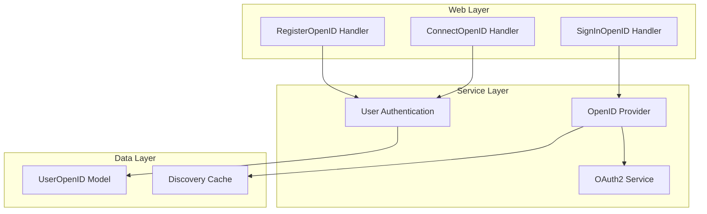
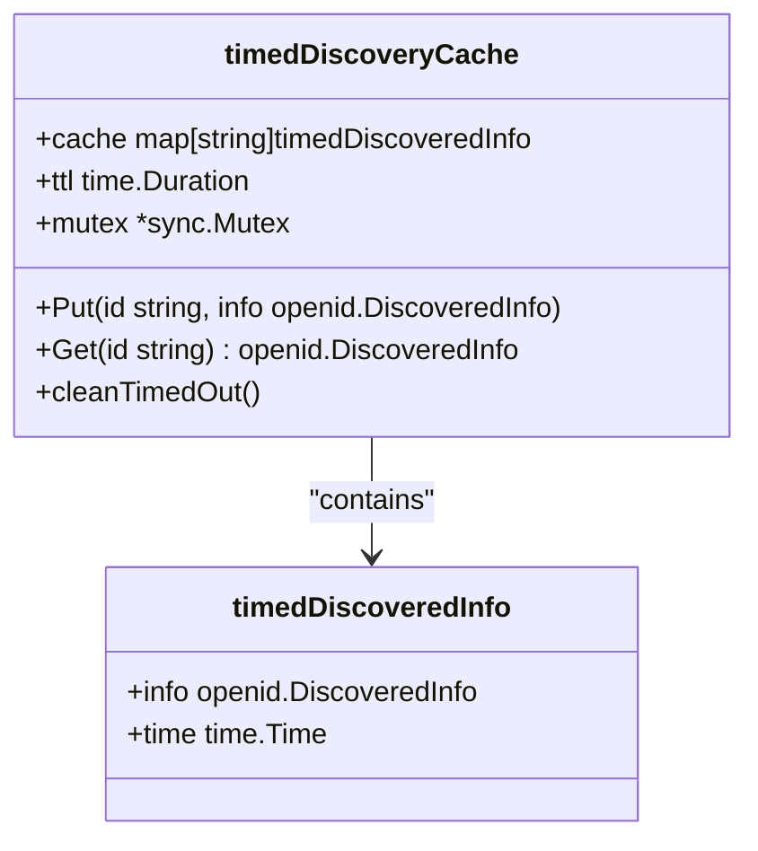
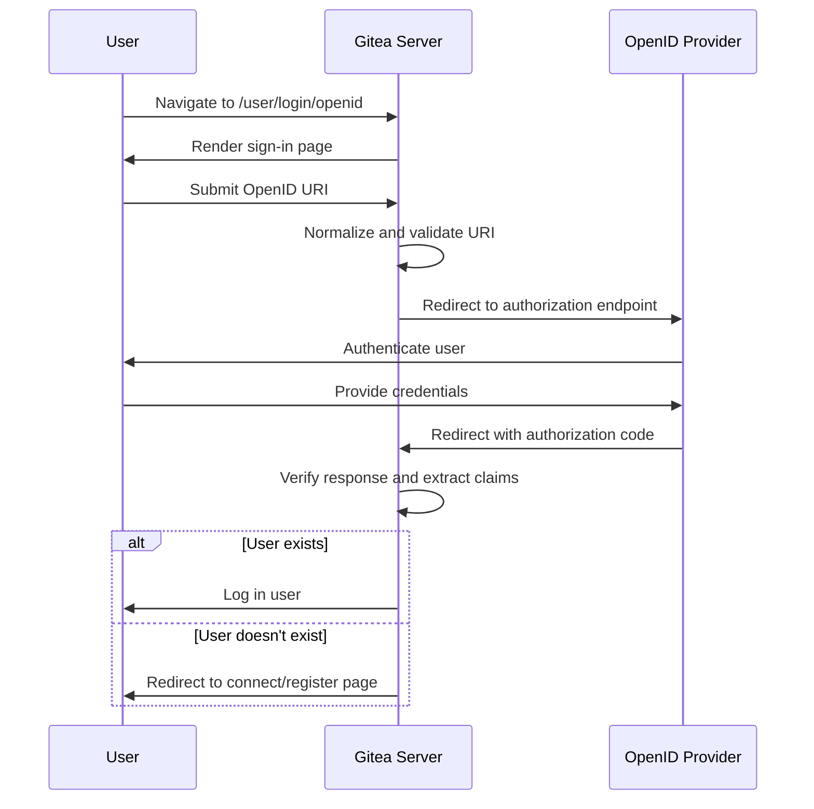
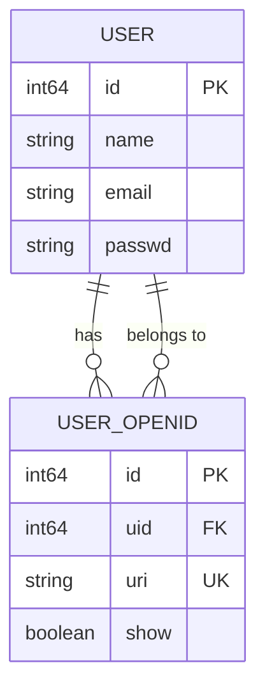

# OpenID Connect Authentication

<cite>
**Referenced Files in This Document**   
- [openid.go](file://modules/auth/openid/openid.go)
- [discovery_cache.go](file://modules/auth/openid/discovery_cache.go)
- [user/openid.go](file://models/user/openid.go)
- [web/auth/openid.go](file://routers/web/auth/openid.go)
- [auth/source/oauth2/providers_openid.go](file://services/auth/source/oauth2/providers_openid.go)
</cite>

## Table of Contents
1. [Introduction](#introduction)
2. [OpenID Connect Flow Overview](#openid-connect-flow-overview)
3. [Core Components and Architecture](#core-components-and-architecture)
4. [Discovery and Provider Configuration](#discovery-and-provider-configuration)
5. [Authentication Handlers and Web Flow](#authentication-handlers-and-web-flow)
6. [User Identity and OpenID Mapping](#user-identity-and-openid-mapping)
7. [Security Considerations and Validation](#security-considerations-and-validation)
8. [Custom Provider Implementation](#custom-provider-implementation)
9. [Troubleshooting Common Issues](#troubleshooting-common-issues)

## Introduction
OpenID Connect (OIDC) in Gitea provides a secure and standardized method for user authentication through external identity providers. This document details the implementation of the OpenID Connect flow within Gitea, covering discovery, authorization, token validation, and user information retrieval. The system integrates with the OAuth2 framework and supports provider-specific configurations, including issuer validation, scope management, and SSH public key claims. This documentation serves as a comprehensive guide for administrators configuring OIDC and developers extending the authentication system.

## OpenID Connect Flow Overview
The OpenID Connect authentication flow in Gitea follows the standard OAuth2 authorization code flow with OpenID Connect extensions. The process begins with the user initiating a login via an OpenID Connect provider. Gitea redirects the user to the provider's authorization endpoint, obtained through OpenID discovery. Upon successful authentication, the provider redirects back to Gitea with an authorization code. Gitea exchanges this code for an ID token and access token, validates the tokens, and either creates a new user account or logs in an existing user based on the OpenID claim. The flow supports optional user information such as email and nickname, which can be used to pre-fill registration forms when connecting or creating accounts.

**Section sources**
- [web/auth/openid.go](file://routers/web/auth/openid.go#L0-L388)

## Core Components and Architecture
The OpenID Connect implementation in Gitea is structured across multiple layers, including web handlers, service logic, and data models. The architecture separates concerns between authentication flow management, provider integration, and user identity persistence. The web layer handles HTTP requests and responses, the service layer manages the OAuth2 and OpenID Connect protocol interactions, and the data layer stores user OpenID associations. This separation enables extensibility and maintainability while ensuring security boundaries are respected.

**Diagram sources **
- [web/auth/openid.go](file://routers/web/auth/openid.go#L0-L388)
- [auth/source/oauth2/providers_openid.go](file://services/auth/source/oauth2/providers_openid.go#L0-L62)
- [user/openid.go](file://models/user/openid.go#L0-L108)

**Section sources**
- [web/auth/openid.go](file://routers/web/auth/openid.go#L0-L388)
- [auth/source/oauth2/providers_openid.go](file://services/auth/source/oauth2/providers_openid.go#L0-L62)

## Discovery and Provider Configuration
OpenID Connect discovery is implemented through the `discoveryCache` mechanism, which stores provider metadata with a time-to-live (TTL) of 24 hours. The discovery process retrieves the provider's configuration from the `.well-known/openid-configuration` endpoint and caches the results to improve performance and reduce external requests. The `timedDiscoveryCache` struct uses a mutex-protected map to ensure thread safety, with periodic cleanup of expired entries. Provider configuration is managed through the admin interface, where administrators specify the auto-discovery URL, client credentials, and optional claim mappings for user attributes such as full name and SSH public key.

**Diagram sources **
- [discovery_cache.go](file://modules/auth/openid/discovery_cache.go#L0-L57)

**Section sources**
- [discovery_cache.go](file://modules/auth/openid/discovery_cache.go#L0-L57)
- [providers_openid.go](file://services/auth/source/oauth2/providers_openid.go#L0-L62)

## Authentication Handlers and Web Flow
The web authentication flow for OpenID Connect is managed by handlers in the `routers/web/auth` package. The `SignInOpenID` handler renders the login page and initiates the OpenID authentication process by normalizing the user-provided OpenID URI and redirecting to the provider. The `signInOpenIDVerify` handler processes the callback from the OpenID provider, verifies the response, and determines whether to connect to an existing account or register a new user. The flow includes session management for preserving state across redirects and handles both connection of OpenID identities to existing accounts and registration of new users with OpenID authentication.

**Diagram sources **
- [web/auth/openid.go](file://routers/web/auth/openid.go#L0-L388)

**Section sources**
- [web/auth/openid.go](file://routers/web/auth/openid.go#L0-L388)

## User Identity and OpenID Mapping
User identity management in the OpenID Connect system is handled by the `UserOpenID` model, which maintains a many-to-one relationship between OpenID URIs and user accounts. Each `UserOpenID` record contains the user ID, the normalized OpenID URI, and a visibility flag. The system supports multiple OpenID identities per user, allowing users to authenticate through different providers. When a user authenticates with an OpenID URI, Gitea checks for existing associations and either logs in the corresponding user or prompts for account connection or registration. The mapping process includes validation to prevent duplicate OpenID URIs and supports visibility toggling for user privacy.

**Diagram sources **
- [user/openid.go](file://models/user/openid.go#L0-L108)

**Section sources**
- [user/openid.go](file://models/user/openid.go#L0-L108)

## Security Considerations and Validation
The OpenID Connect implementation includes several security measures to protect against common attacks. The system validates OpenID URIs against configurable whitelist and blacklist patterns to prevent unauthorized provider usage. The discovery cache prevents excessive external requests and potential denial-of-service attacks. Nonce verification is handled by the underlying `openid-go` library to prevent replay attacks. The implementation also includes protection against OpenID URI enumeration by returning generic error messages. Session management ensures that authentication state is securely maintained across the multi-step flow, and all sensitive operations require proper authentication and authorization checks.

**Section sources**
- [web/auth/openid.go](file://routers/web/auth/openid.go#L0-L388)
- [discovery_cache.go](file://modules/auth/openid/discovery_cache.go#L0-L57)

## Custom Provider Implementation
Custom OpenID Connect providers can be implemented by extending the OAuth2 provider interface in Gitea. The `OpenIDProvider` struct demonstrates the pattern for implementing a provider that supports SSH public key claims and uses the `goth` library for protocol handling. Custom providers must implement the `CreateGothProvider` method to configure the underlying OAuth2 client with the appropriate endpoints, client credentials, and scopes. The provider registration system allows new providers to be added through the `RegisterGothProvider` function, enabling extensibility without modifying core authentication logic. Configuration options such as custom URLs and claim mappings can be exposed through the admin interface for flexible deployment scenarios.

**Section sources**
- [providers_openid.go](file://services/auth/source/oauth2/providers_openid.go#L0-L62)

## Troubleshooting Common Issues
Common issues in OpenID Connect authentication typically involve configuration errors, network connectivity problems, or provider-specific requirements. Misconfigured auto-discovery URLs prevent successful provider discovery and result in authentication failures. Network issues between Gitea and the OpenID provider can cause timeouts during the discovery or token exchange phases. Provider-specific scope requirements may need to be configured in the Gitea admin settings to ensure proper claim retrieval. Issues with signature verification or issuer validation can occur when there are clock synchronization problems or when the provider's signing keys are not properly trusted. Administrators should check server logs for detailed error messages and verify that all configuration settings match the provider's documentation.

**Section sources**
- [web/auth/openid.go](file://routers/web/auth/openid.go#L0-L388)
- [providers_openid.go](file://services/auth/source/oauth2/providers_openid.go#L0-L62)
- [discovery_cache.go](file://modules/auth/openid/discovery_cache.go#L0-L57)