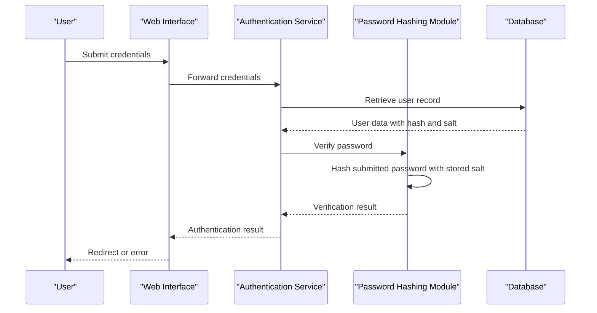
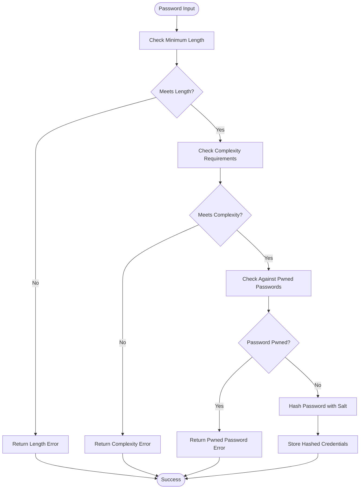
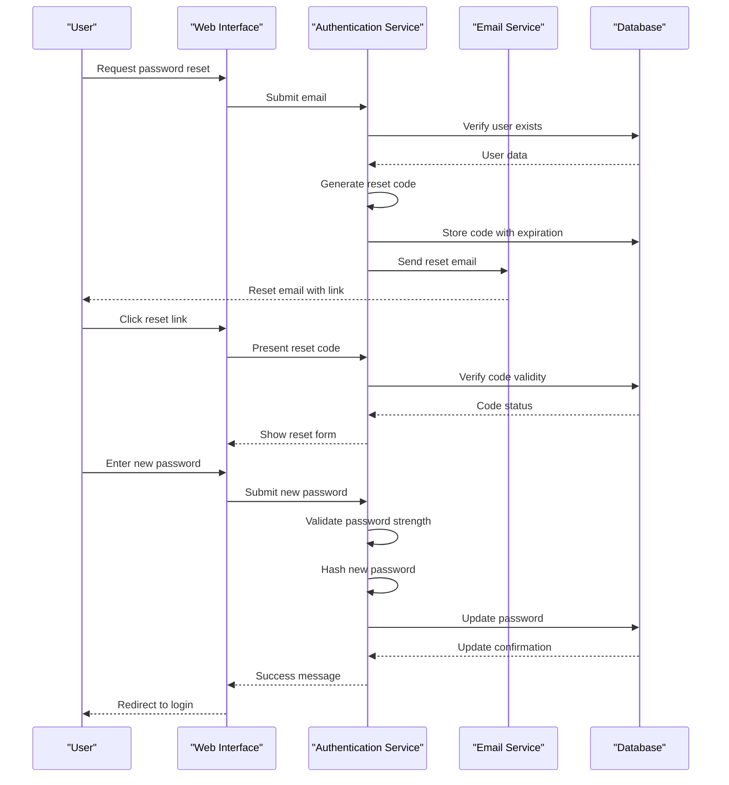

# Password Authentication

<cite>
**Referenced Files in This Document**   
- [password.go](file://modules/auth/password/password.go)
- [pwn.go](file://modules/auth/password/pwn.go)
- [user.go](file://models/user/user.go)
- [signin.go](file://services/auth/signin.go)
- [auth.go](file://routers/web/auth/auth.go)
- [password.go](file://routers/web/auth/password.go)
</cite>

## Table of Contents
1. [Introduction](#introduction)
2. [Authentication Flow](#authentication-flow)
3. [Password Hashing Implementation](#password-hashing-implementation)
4. [Domain Model for User Credentials](#domain-model-for-user-credentials)
5. [Password Policy and Complexity](#password-policy-and-complexity)
6. [Session Creation and Management](#session-creation-and-management)
7. [Error Handling and Security](#error-handling-and-security)
8. [Account Recovery and Password Reset](#account-recovery-and-password-reset)
9. [Configuration and External Integration](#configuration-and-external-integration)
10. [Troubleshooting Common Issues](#troubleshooting-common-issues)

## Introduction
This document provides a comprehensive analysis of the password authentication system in Gitea, an open-source Git service. The documentation covers the complete authentication flow from the web interface through the service layer to the database model, with detailed examination of password hashing, verification, and security mechanisms. The system implements robust password policies, complexity requirements, and protection against common security threats such as brute force attacks and credential stuffing. The documentation also addresses account recovery processes, session management, and configuration options for administrators to customize password strength requirements and integrate with external validation services.

## Authentication Flow
The password authentication flow in Gitea follows a multi-layered approach that begins with the web interface and progresses through service layers to the database model. When a user submits credentials through the sign-in form, the request is handled by the `SignInPost` function in the authentication router, which validates the input and forwards the credentials to the authentication service. The service layer then processes the authentication request by first checking if the username is an email address or a username, and then retrieving the corresponding user record from the database. The authentication service delegates the password verification to the appropriate authenticator based on the user's login source, with local accounts using the password authentication mechanism. Upon successful verification, the system creates a session, sets authentication cookies, and redirects the user to the appropriate destination page. The flow also incorporates two-factor authentication checks when enabled, redirecting users to the appropriate verification page if additional authentication factors are required.

**Section sources**
- [auth.go](file://routers/web/auth/auth.go#L200-L300)
- [signin.go](file://services/auth/signin.go#L15-L120)

## Password Hashing Implementation
Gitea implements password hashing through the `modules/auth/password` package, which provides a flexible and secure mechanism for storing user credentials. The system supports multiple hashing algorithms, with Argon2 as the default algorithm configured in the application settings. When a user sets or changes their password, the system generates a random salt using cryptographically secure random bytes, which is then stored alongside the hashed password in the database. The hashing process combines the password, salt, and selected algorithm to produce a secure hash that is resistant to rainbow table attacks. The implementation allows for algorithm migration, enabling administrators to upgrade hashing algorithms without requiring users to change their passwords. The password hashing module also integrates with external password validation services to check if passwords have been compromised in data breaches, providing an additional layer of security by preventing the use of known compromised passwords.

**Diagram sources **
- [password.go](file://modules/auth/password/password.go#L100-L150)
- [user.go](file://models/user/user.go#L150-L200)

## Domain Model for User Credentials
The domain model for user credentials in Gitea is centered around the User entity, which contains fields for storing authentication-related information. The User model includes the `Passwd` field for storing the hashed password, the `Salt` field for the password salt, and the `PasswdHashAlgo` field to indicate which hashing algorithm was used. Additional fields such as `MustChangePassword` allow administrators to require users to change their password upon first login, while `ProhibitLogin` can be used to temporarily disable account access. The model also includes timestamps for tracking user activity, such as `LastLoginUnix`, which helps in monitoring account usage and detecting potential security issues. The User model is designed to support multiple authentication methods, with the `LoginType` field indicating whether the account uses local authentication, OAuth2, LDAP, or other external authentication sources. This flexible design allows Gitea to support various authentication scenarios while maintaining a consistent user experience.

**Section sources**
- [user.go](file://models/user/user.go#L50-L150)

## Password Policy and Complexity
Gitea implements comprehensive password policies to ensure strong password security across the platform. The system enforces minimum password length requirements, with the threshold configurable through the application settings. Password complexity can be customized to require specific character classes, including lowercase letters, uppercase letters, digits, and special characters. Administrators can configure these requirements based on their security needs, with options to require one or more character classes or disable complexity checks entirely. The password validation system also integrates with the Have I Been Pwned service to check if passwords have appeared in known data breaches, preventing users from using compromised passwords. During user registration and password changes, the system performs real-time validation of password strength, providing detailed feedback to users about which requirements are not met. This approach balances security with usability, guiding users toward creating strong, memorable passwords while preventing common weak password patterns.

**Diagram sources **
- [password.go](file://modules/auth/password/password.go#L50-L150)
- [password.go](file://routers/web/auth/password.go#L150-L200)

## Session Creation and Management
Session management in Gitea is handled through a combination of server-side sessions and persistent authentication tokens. When a user successfully authenticates, the system creates a session that stores user identification information and authentication state. For persistent login, Gitea generates authentication tokens that are stored in the database and used to create secure cookies. These tokens include a random identifier and a cryptographic token that are combined and stored in the user's browser cookie. The system implements token expiration and rotation to enhance security, with options to configure the remember-me duration through application settings. Sessions are also used to manage multi-factor authentication states, temporarily storing information about pending two-factor verification until the process is completed. The session system integrates with the CSRF protection mechanism, ensuring that authenticated users are protected against cross-site request forgery attacks. Additionally, the system tracks user login activity and provides administrators with tools to manage active sessions and invalidate tokens when necessary.

**Section sources**
- [auth.go](file://routers/web/auth/auth.go#L300-L400)
- [signin.go](file://services/auth/signin.go#L100-L120)

## Error Handling and Security
Gitea implements comprehensive error handling and security measures throughout the authentication process to protect against various attack vectors. The system distinguishes between different types of authentication failures, providing appropriate feedback while avoiding information leakage that could aid attackers. For example, when a username or email does not exist, the system returns a generic error message rather than revealing whether the account exists. The authentication flow includes protection against brute force attacks through logging and monitoring of failed login attempts, with potential integration with external rate-limiting systems. The system also handles edge cases such as account activation requirements, password expiration, and login prohibitions, guiding users through the appropriate recovery processes. Security-related errors, such as compromised password detection or invalid authentication tokens, are handled with appropriate user messaging and administrative notifications. The error handling system is designed to maintain security while providing sufficient information to legitimate users to resolve authentication issues.

**Section sources**
- [auth.go](file://routers/web/auth/auth.go#L250-L300)
- [signin.go](file://services/auth/signin.go#L80-L120)

## Account Recovery and Password Reset
Gitea provides a secure account recovery mechanism that allows users to reset their passwords when they are forgotten. The password reset process begins with the user providing their email address, which triggers a verification email containing a time-limited reset code. This code is generated using cryptographic functions to ensure unpredictability and is stored with an expiration time to prevent misuse. When the user accesses the reset link, they are prompted to enter a new password that must meet the same complexity requirements as during registration. The system verifies the reset code before allowing the password change, ensuring that only the legitimate account owner can reset the password. For accounts with two-factor authentication enabled, the system requires additional verification during the reset process, either through a scratch token or a time-based one-time password. The password reset functionality also includes rate limiting to prevent abuse, with temporary locks after multiple failed attempts to prevent brute force attacks on the recovery mechanism.

**Diagram sources **
- [password.go](file://routers/web/auth/password.go#L50-L150)
- [user.go](file://models/user/user.go#L200-L250)

## Configuration and External Integration
Gitea offers extensive configuration options for password authentication, allowing administrators to tailor the security settings to their specific requirements. The system configuration includes settings for minimum password length, complexity requirements, and password hashing algorithms. Administrators can enable or disable the integration with the Have I Been Pwned service to check for compromised passwords, balancing security with privacy considerations. The configuration also supports integration with external authentication services, allowing organizations to implement centralized identity management through LDAP, OAuth2, or other protocols. Password policies can be customized globally or on a per-authentication-source basis, providing flexibility for organizations with diverse user populations. The system also supports integration with external password validation services, enabling organizations to enforce custom password rules or integrate with enterprise password management solutions. These configuration options are accessible through the administrative interface or configuration files, allowing for both interactive and automated management of authentication settings.

**Section sources**
- [setting.go](file://modules/setting/setting.go#L100-L200)
- [password.go](file://modules/auth/password/password.go#L10-L50)

## Troubleshooting Common Issues
Common issues in the password authentication system typically fall into several categories: configuration problems, user experience issues, and security-related concerns. Configuration issues may include incorrect password complexity settings, misconfigured email services for account activation and password reset, or problems with external authentication sources. User experience issues often involve password complexity requirements that are too restrictive, causing frustration during registration or password changes. Security-related issues may include problems with two-factor authentication setup or concerns about password hashing algorithms. To troubleshoot these issues, administrators should first verify the application configuration settings, particularly those related to authentication and email services. Checking server logs for authentication-related errors can provide insights into specific problems. For user-reported issues, examining the password policy settings and ensuring they are clearly communicated to users can help resolve confusion. When integrating with external authentication sources, verifying network connectivity and authentication source configuration is essential. Regular monitoring of authentication logs can help identify patterns of failed login attempts or other suspicious activity that may indicate security issues.

**Section sources**
- [auth.go](file://routers/web/auth/auth.go#L400-L500)
- [password.go](file://routers/web/auth/password.go#L200-L300)