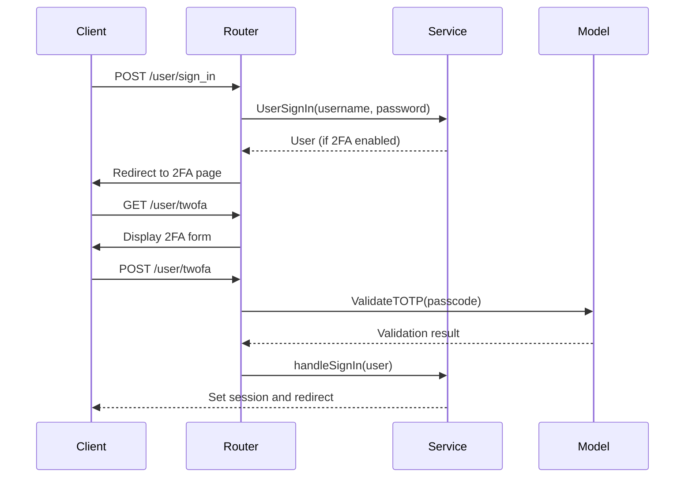
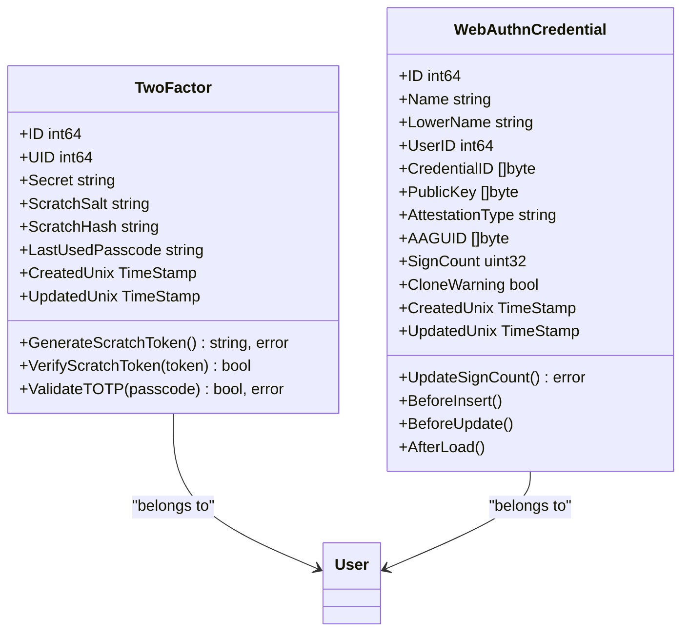

# Two-Factor Authentication

<cite>
**Referenced Files in This Document**   
- [twofactor.go](file://models/auth/twofactor.go)
- [webauthn.go](file://models/auth/webauthn.go)
- [2fa.go](file://routers/web/auth/2fa.go)
- [webauthn.go](file://routers/web/auth/webauthn.go)
- [signin.go](file://services/auth/signin.go)
- [user-auth-webauthn.ts](file://web_src/js/features/user-auth-webauthn.ts)
- [two_factor.yml](file://models/fixtures/two_factor.yml)
- [webauthn_credential.yml](file://models/fixtures/webauthn_credential.yml)
</cite>

## Table of Contents
1. [Introduction](#introduction)
2. [TOTP-Based 2FA Implementation](#totp-based-2fa-implementation)
3. [WebAuthn-Based 2FA Implementation](#webauthn-based-2fa-implementation)
4. [Authentication Flow and Router Invocation](#authentication-flow-and-router-invocation)
5. [Domain Model for 2FA Tokens and Device Registration](#domain-model-for-2fa-tokens-and-device-registration)
6. [Recovery Mechanisms and Backup Codes](#recovery-mechanisms-and-backup-codes)
7. [Common Issues and Troubleshooting](#common-issues-and-troubleshooting)
8. [Configuration and Policy Enforcement](#configuration-and-policy-enforcement)

## Introduction
Two-factor authentication (2FA) in Gitea enhances account security by requiring users to provide two forms of identification: their password and a second factor. Gitea supports two primary 2FA methods: Time-based One-Time Password (TOTP) and WebAuthn (Web Authentication). TOTP uses time-synchronized codes generated by authenticator apps, while WebAuthn leverages public-key cryptography through security keys or biometric devices. This document details the implementation of both 2FA flows, including setup, verification, and recovery mechanisms, as well as the interaction between the authentication router, service layer, and 2FA model.

## TOTP-Based 2FA Implementation
The TOTP-based 2FA implementation in Gitea is managed through the `TwoFactor` model in `models/auth/twofactor.go`. During setup, a TOTP secret is generated and encrypted using AES encryption with a key derived from the application's `SECRET_KEY`. The secret is stored in the database in base64-encoded format. When a user logs in, the provided passcode is validated against the stored secret using the `github.com/pquerna/otp/totp` library. The validation accounts for clock drift by checking passcodes within a configurable time window. The `ValidateTOTP` method decrypts the stored secret and verifies the passcode, ensuring that the same passcode cannot be reused immediately by storing the last used passcode.

**Section sources**
- [twofactor.go](file://models/auth/twofactor.go#L100-L125)

## WebAuthn-Based 2FA Implementation
WebAuthn-based 2FA in Gitea is implemented using the `go-webauthn/webauthn` library. The `WebAuthnCredential` model in `models/auth/webauthn.go` stores public-key credentials, including the credential ID, public key, attestation type, and sign count. During registration, a new credential is created and stored in the database. During authentication, the server initiates a login challenge via `WebAuthnLoginAssertion`, which generates a cryptographic challenge and stores session data. The client responds with a signed assertion, which is validated using `WebAuthnLoginAssertionPost`. The sign count is updated to prevent replay attacks, and the `CloneWarning` flag is checked to detect potential credential cloning.

**Section sources**
- [webauthn.go](file://models/auth/webauthn.go#L100-L150)
- [webauthn.go](file://routers/web/auth/webauthn.go#L150-L250)

## Authentication Flow and Router Invocation
The 2FA authentication flow begins in the `UserSignIn` function in `services/auth/signin.go`, which validates the user's credentials. If the user has 2FA enabled, the authentication process redirects to the 2FA router. For TOTP, the `TwoFactor` handler in `routers/web/auth/2fa.go` displays the 2FA page, and `TwoFactorPost` validates the provided passcode. For WebAuthn, the `WebAuthn` handler displays the WebAuthn login page, and `WebAuthnLoginAssertion` initiates the challenge. The JavaScript in `web_src/js/features/user-auth-webauthn.ts` handles the WebAuthn assertion on the client side, sending the signed response to `WebAuthnLoginAssertionPost` for validation. Upon successful validation, the user is signed in through `handleSignInFull`.

**Diagram sources**
- [signin.go](file://services/auth/signin.go#L20-L50)
- [2fa.go](file://routers/web/auth/2fa.go#L50-L100)
- [twofactor.go](file://models/auth/twofactor.go#L100-L125)

## Domain Model for 2FA Tokens and Device Registration
The domain model for 2FA tokens consists of two primary entities: `TwoFactor` for TOTP and `WebAuthnCredential` for WebAuthn. The `TwoFactor` struct includes fields for the user ID (`UID`), encrypted secret, scratch token salt and hash, and the last used passcode. The `WebAuthnCredential` struct includes the user ID, credential ID, public key, sign count, and metadata such as attestation type and AAGUID. Both models are registered with the ORM in their respective `init` functions and include methods for database operations such as insertion, update, and deletion. The `WebAuthnCredential` also implements XORM callbacks to ensure the `LowerName` field is synchronized with the `Name` field.

**Diagram sources**
- [twofactor.go](file://models/auth/twofactor.go#L30-L50)
- [webauthn.go](file://models/auth/webauthn.go#L30-L50)

## Recovery Mechanisms and Backup Codes
Gitea provides recovery mechanisms for both TOTP and WebAuthn 2FA. For TOTP, users are provided with a set of scratch codes during setup. These codes are generated using `GenerateScratchToken`, which creates a random 6-byte token encoded in base32 using a custom alphabet to avoid ambiguous characters. The token is hashed using PBKDF2 with a salt and stored in the database. When a user enters a scratch code, it is verified using `VerifyScratchToken`, which hashes the provided token and performs a constant-time comparison with the stored hash. Upon successful verification, a new scratch code is generated to replace the used one. For WebAuthn, recovery is handled by registering multiple devices, allowing users to authenticate with any of their registered credentials.

**Section sources**
- [twofactor.go](file://models/auth/twofactor.go#L60-L90)

## Common Issues and Troubleshooting
Common issues with 2FA in Gitea include lost devices, time synchronization problems, and recovery code management. For lost devices, users can disable 2FA through account recovery options if configured. Time synchronization issues with TOTP can be mitigated by ensuring the server and client clocks are synchronized, as the TOTP validation includes a configurable time window. Recovery codes should be stored securely by users, as they are the only means of access if the primary 2FA method is unavailable. Administrators can assist users by resetting 2FA through the database, though this should be done with caution to maintain security.

## Configuration and Policy Enforcement
2FA policies in Gitea can be configured through the application settings. Administrators can enforce 2FA for specific user groups by configuring authentication sources and user permissions. The `HasTwoFactorOrWebAuthn` function checks if a user has either TOTP or WebAuthn enabled, allowing the system to require 2FA for sensitive operations. WebAuthn can be enabled or disabled globally through the `EnablePasskeyAuth` setting, and the sign count validation ensures the integrity of WebAuthn credentials. Backup codes are automatically generated during TOTP setup, and their usage is logged for audit purposes.