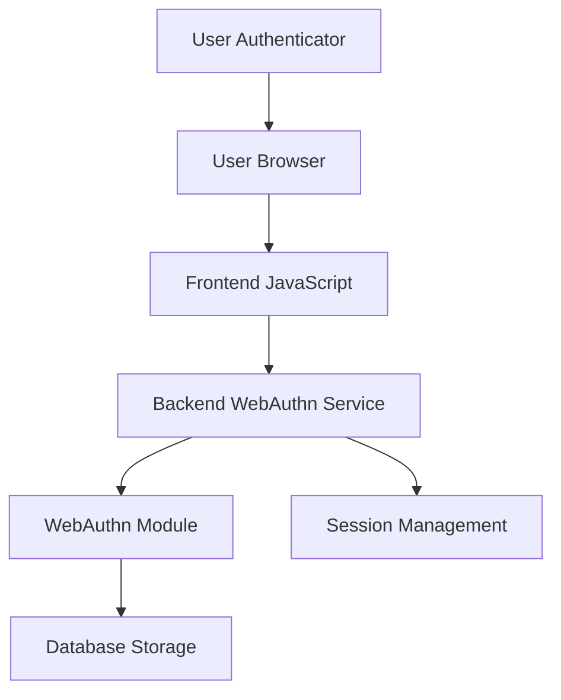
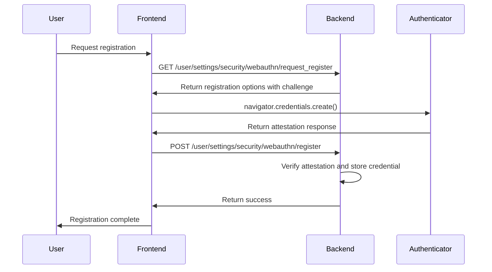
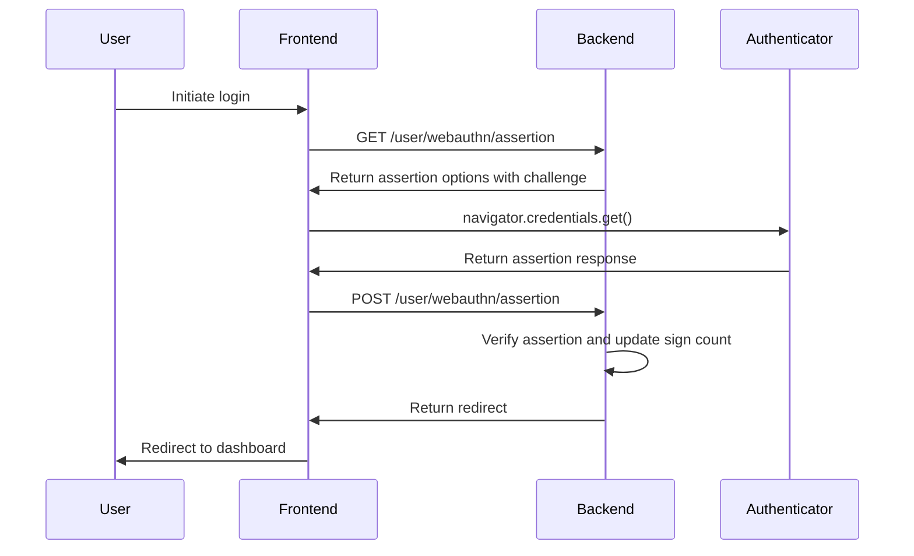
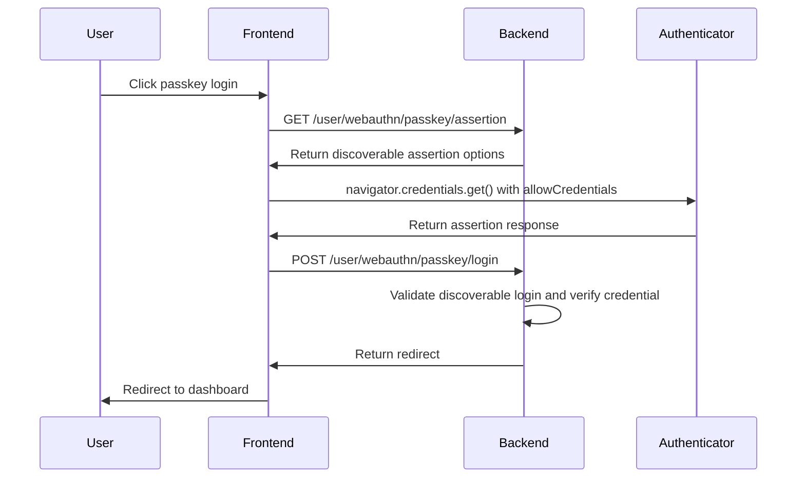
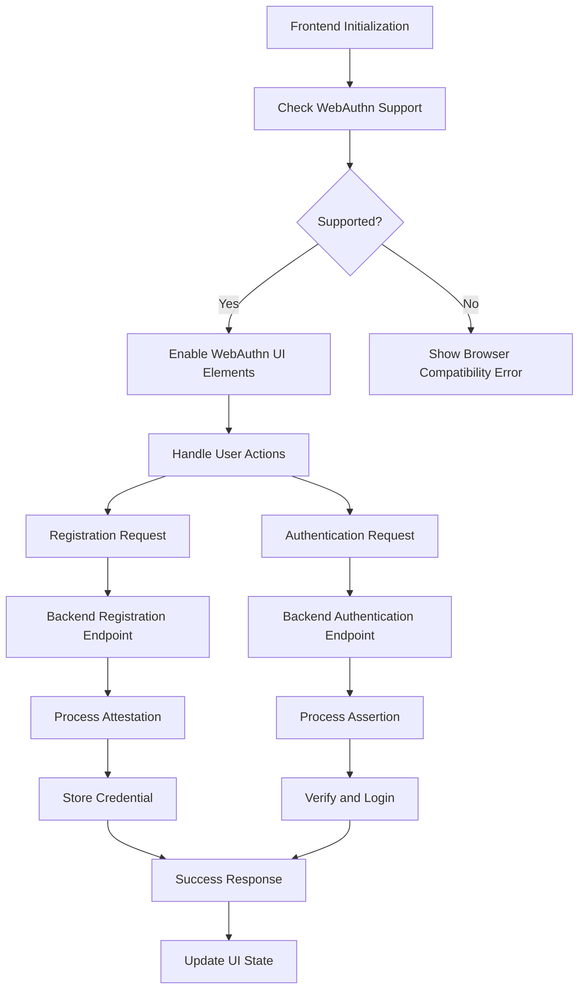
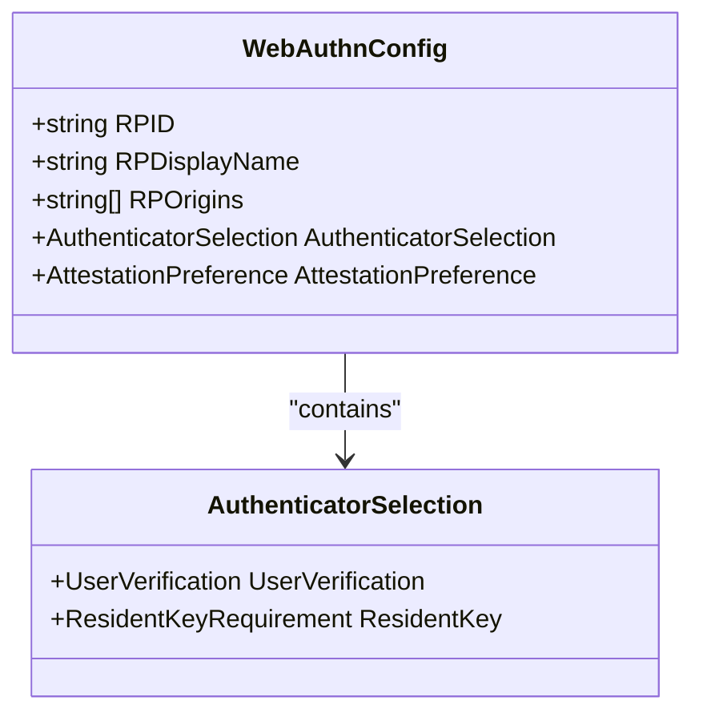

# WebAuthn Authentication

<cite>
**Referenced Files in This Document**   
- [webauthn.go](file://models/auth/webauthn.go)
- [webauthn.go](file://modules/auth/webauthn/webauthn.go)
- [webauthn.go](file://routers/web/auth/webauthn.go)
- [webauthn.ts](file://web_src/js/features/user-auth-webauthn.ts)
- [security/webauthn.go](file://routers/web/user/setting/security/webauthn.go)
- [service.go](file://modules/setting/service.go)
</cite>

## Table of Contents
1. [Introduction](#introduction)
2. [WebAuthn Implementation Overview](#webauthn-implementation-overview)
3. [Domain Model for WebAuthn Credentials](#domain-model-for-webauthn-credentials)
4. [Credential Registration Flow](#credential-registration-flow)
5. [Authentication Ceremony](#authentication-ceremony)
6. [Passkey Authentication](#passkey-authentication)
7. [Frontend-Backend Invocation Relationship](#frontend-backend-invocation-relationship)
8. [Attestation Verification and Security](#attestation-verification-and-security)
9. [Configuration and Settings](#configuration-and-settings)
10. [Device Management and Recovery](#device-management-and-recovery)
11. [Troubleshooting Common Issues](#troubleshooting-common-issues)

## Introduction
WebAuthn (Web Authentication) provides passwordless authentication in Gitea using FIDO2 security keys and platform authenticators. This implementation enables users to register and authenticate using public key cryptography instead of traditional passwords. The system supports both security keys and passkeys, offering phishing-resistant authentication while maintaining usability. This document details the implementation architecture, data flow, and security considerations for WebAuthn integration in Gitea.

## WebAuthn Implementation Overview
Gitea's WebAuthn implementation follows the W3C Web Authentication standard, leveraging the go-webauthn/webauthn library to handle cryptographic operations. The authentication flow involves coordination between the frontend JavaScript, backend Go services, and the user's authenticator (security key or platform authenticator). The system supports both traditional WebAuthn credentials and passkey authentication, with configuration options to enable or disable specific authentication methods.



**Diagram sources**
- [webauthn.ts](file://web_src/js/features/user-auth-webauthn.ts)
- [webauthn.go](file://modules/auth/webauthn/webauthn.go)
- [webauthn.go](file://routers/web/auth/webauthn.go)

**Section sources**
- [webauthn.go](file://modules/auth/webauthn/webauthn.go#L1-L80)
- [webauthn.ts](file://web_src/js/features/user-auth-webauthn.ts#L1-L267)

## Domain Model for WebAuthn Credentials
The WebAuthn credential domain model in Gitea stores essential information about registered authenticators. Each credential is associated with a user and contains the public key material, credential identifiers, and metadata for authentication verification. The model includes fields for tracking the authenticator's state and preventing replay attacks.

```mermaid
erDiagram
WEBAUTHN_CREDENTIAL {
int64 id PK
string name
string lower_name UK
int64 user_id FK
byte[] credential_id INDEX
byte[] public_key
string attestation_type
byte[] aaguid
uint32 sign_count
boolean clone_warning
timestamp created_unix
timestamp updated_unix
}
USER {
int64 id PK
string name
string login_name
}
USER ||--o{ WEBAUTHN_CREDENTIAL : "has"
```

**Diagram sources**
- [webauthn.go](file://models/auth/webauthn.go#L30-L75)

**Section sources**
- [webauthn.go](file://models/auth/webauthn.go#L1-L212)

## Credential Registration Flow
The credential registration process begins when a user requests to register a new WebAuthn device. The backend generates registration options including a challenge that is sent to the frontend. The browser's WebAuthn API uses these options to create a new credential with the authenticator. Upon successful creation, the attestation response is sent back to the server for verification and storage.



**Diagram sources**
- [security/webauthn.go](file://routers/web/user/setting/security/webauthn.go#L1-L141)
- [webauthn.ts](file://web_src/js/features/user-auth-webauthn.ts#L229-L266)

**Section sources**
- [security/webauthn.go](file://routers/web/user/setting/security/webauthn.go#L1-L141)
- [webauthn.ts](file://web_src/js/features/user-auth-webauthn.ts#L229-L266)

## Authentication Ceremony
The WebAuthn authentication ceremony follows a challenge-response pattern to verify the user's possession of their authenticator. The backend generates an assertion challenge that is sent to the frontend. The browser's WebAuthn API uses this challenge to request authentication from the authenticator. The resulting assertion response is sent back to the server for verification, including signature validation and sign count checking.



**Diagram sources**
- [webauthn.go](file://routers/web/auth/webauthn.go#L127-L284)
- [webauthn.ts](file://web_src/js/features/user-auth-webauthn.ts#L87-L120)

**Section sources**
- [webauthn.go](file://routers/web/auth/webauthn.go#L127-L284)
- [webauthn.ts](file://web_src/js/features/user-auth-webauthn.ts#L87-L120)

## Passkey Authentication
Gitea supports passkey authentication as an alternative to traditional WebAuthn credentials. Passkey authentication uses discoverable credentials that are stored on the authenticator and can be used across multiple devices. The implementation follows a similar flow to standard WebAuthn authentication but uses discoverable credential methods and includes additional session management for passkey-specific operations.



**Diagram sources**
- [webauthn.go](file://routers/web/auth/webauthn.go#L56-L126)
- [webauthn.ts](file://web_src/js/features/user-auth-webauthn.ts#L32-L85)

**Section sources**
- [webauthn.go](file://routers/web/auth/webauthn.go#L56-L126)
- [webauthn.ts](file://web_src/js/features/user-auth-webauthn.ts#L32-L85)

## Frontend-Backend Invocation Relationship
The WebAuthn implementation in Gitea follows a clear separation of concerns between frontend and backend components. The frontend JavaScript handles browser API interactions and user interface elements, while the backend Go services manage cryptographic verification and database operations. The communication occurs through well-defined API endpoints that exchange serialized data structures.



**Diagram sources**
- [webauthn.ts](file://web_src/js/features/user-auth-webauthn.ts)
- [webauthn.go](file://routers/web/auth/webauthn.go)

**Section sources**
- [webauthn.ts](file://web_src/js/features/user-auth-webauthn.ts#L1-L267)
- [webauthn.go](file://routers/web/auth/webauthn.go#L1-L284)

## Attestation Verification and Security
Gitea's WebAuthn implementation includes comprehensive attestation verification to ensure the authenticity and security of registered credentials. During registration, the server verifies the attestation statement to confirm the credential was generated by a genuine authenticator. The system also implements sign count validation to detect potential credential cloning and replay attacks.

The security model includes several protective measures:
- Challenge-response authentication to prevent replay attacks
- Sign count validation to detect cloned credentials
- Secure session management to prevent session hijacking
- Proper origin verification to prevent phishing attacks
- Secure storage of credential data in the database

**Section sources**
- [webauthn.go](file://models/auth/webauthn.go#L150-L212)
- [webauthn.go](file://routers/web/user/setting/security/webauthn.go#L40-L141)

## Configuration and Settings
WebAuthn functionality in Gitea can be configured through the application settings. The `ENABLE_PASSKEY_AUTHENTICATION` setting in the service configuration controls whether passkey authentication is available to users. The WebAuthn instance is initialized with configuration values from the application settings, including the relying party identifier, display name, and allowed origins.



**Diagram sources**
- [webauthn.go](file://modules/auth/webauthn/webauthn.go#L30-L53)
- [service.go](file://modules/setting/service.go#L100-L120)

**Section sources**
- [webauthn.go](file://modules/auth/webauthn/webauthn.go#L30-L53)
- [service.go](file://modules/setting/service.go#L100-L120)

## Device Management and Recovery
Users can manage their registered WebAuthn devices through the security settings interface. The system allows users to register multiple devices for redundancy and delete devices they no longer use. Each credential is stored with a name that users can set during registration, making it easier to identify different security keys or passkeys.

For recovery scenarios, users should register multiple authenticators during the initial setup. If all registered devices are lost, users must rely on alternative authentication methods or account recovery procedures configured by the system administrator. The system does not provide built-in backup mechanisms for WebAuthn credentials, as this would compromise the security model.

**Section sources**
- [security/webauthn.go](file://routers/web/user/setting/security/webauthn.go#L100-L141)
- [webauthn.ts](file://web_src/js/features/user-auth-webauthn.ts#L184-L199)

## Troubleshooting Common Issues
Several common issues may arise when using WebAuthn authentication in Gitea. Browser compatibility is a primary concern, as WebAuthn requires modern browsers that support the Web Authentication API. Users may also encounter issues with authenticator connectivity or registration conflicts when attempting to register duplicate credentials.

Security key management presents additional challenges, including ensuring proper USB or NFC connectivity and handling platform-specific requirements for built-in authenticators. Phishing protection is inherent in the WebAuthn protocol through origin verification, but users should still be cautious of suspicious login requests.

Recovery scenarios require careful planning, as losing all registered authenticators typically requires alternative authentication methods or administrative intervention. System administrators should ensure proper backup authentication methods are available for users who may lose access to their WebAuthn devices.

**Section sources**
- [webauthn.ts](file://web_src/js/features/user-auth-webauthn.ts#L201-L227)
- [webauthn.go](file://routers/web/user/setting/security/webauthn.go#L40-L99)