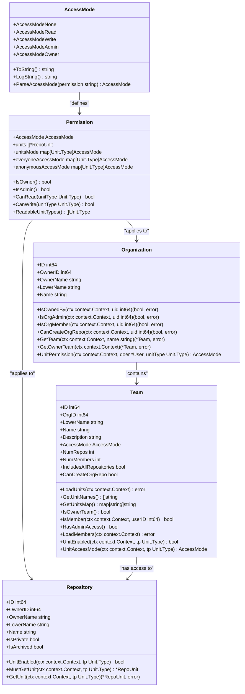
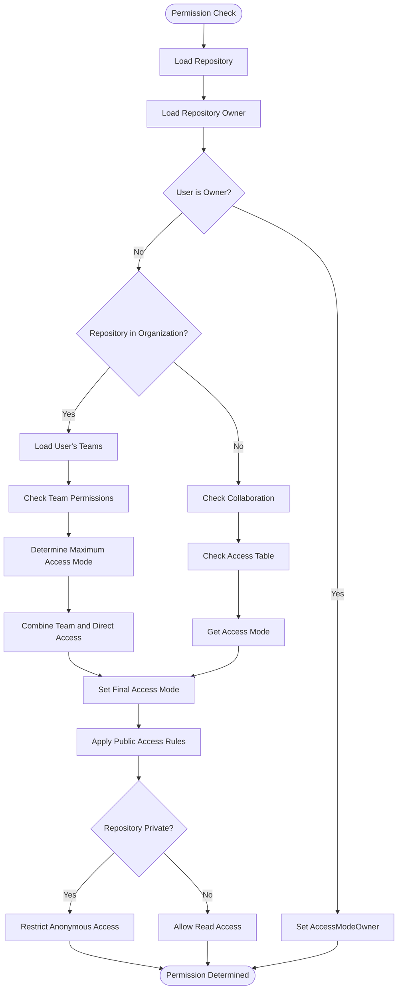
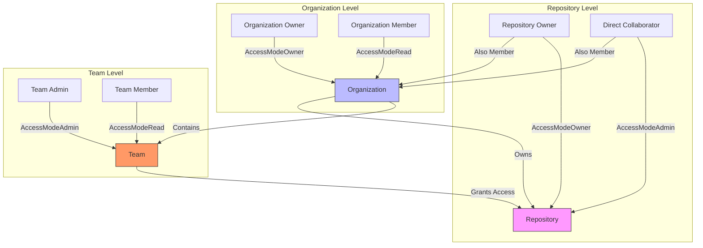
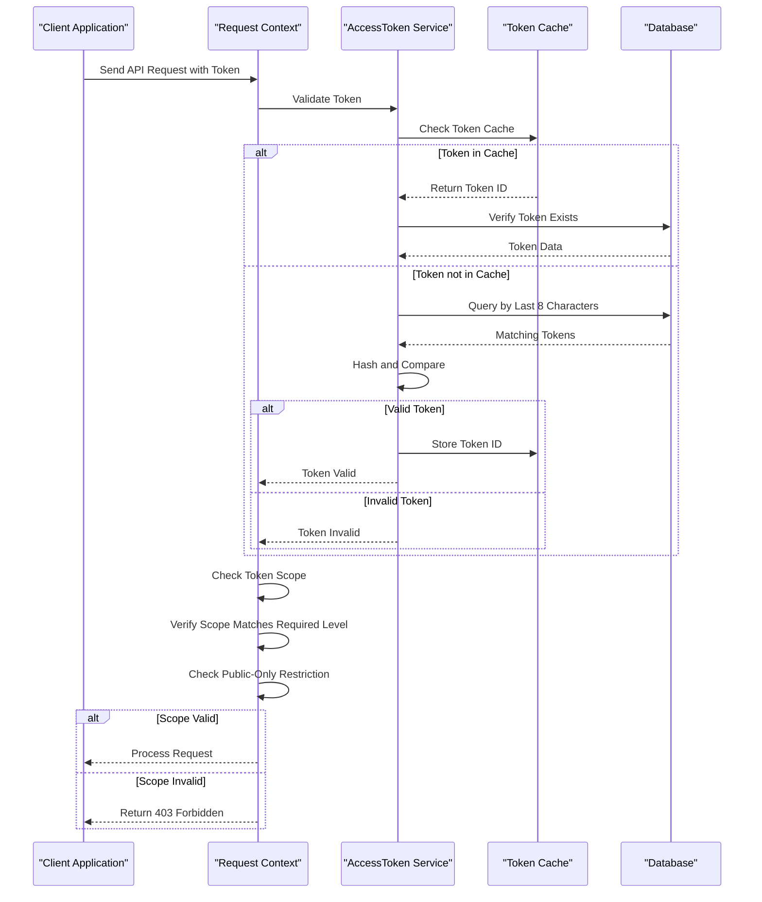
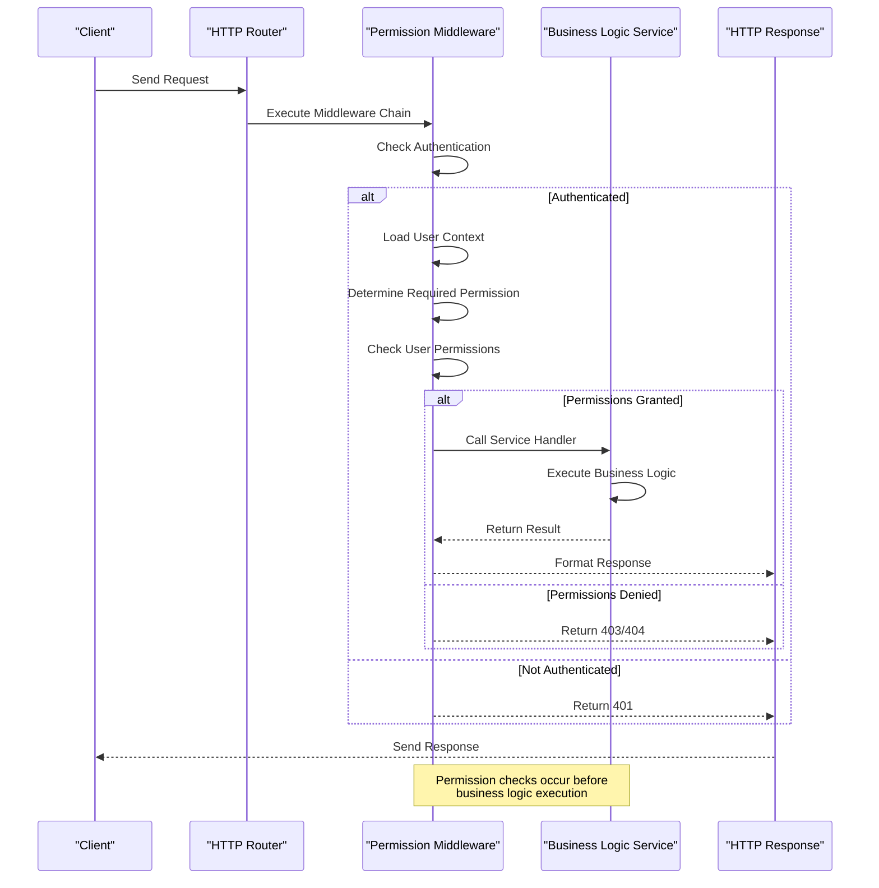
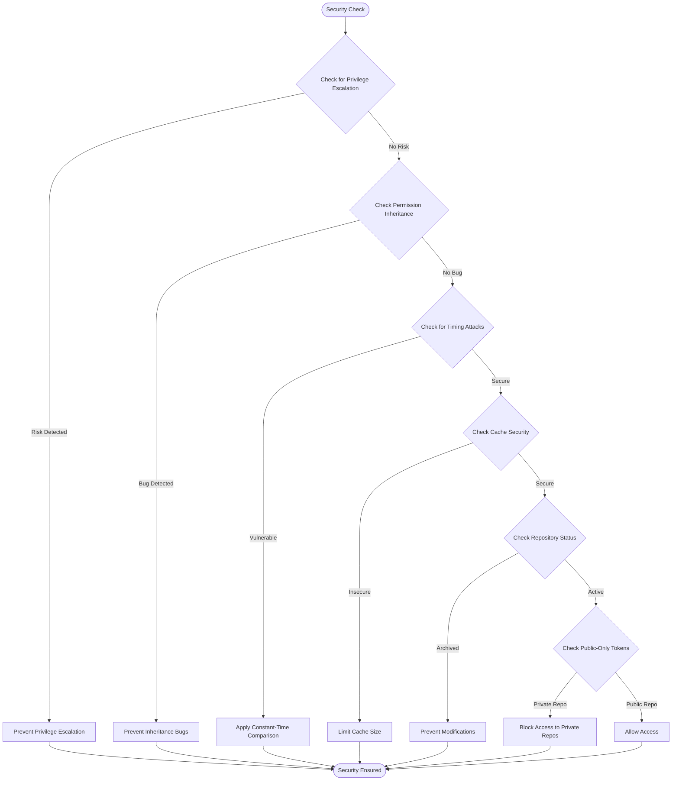

# Authorization

<cite>
**Referenced Files in This Document**   
- [access.go](file://models/perm/access/access.go)
- [access_mode.go](file://models/perm/access_mode.go)
- [access_token.go](file://models/auth/access_token.go)
- [access_token_scope.go](file://models/auth/access_token_scope.go)
- [org.go](file://models/organization/org.go)
- [team.go](file://models/organization/team.go)
- [repo.go](file://models/repo/repo.go)
- [permission.go](file://services/context/permission.go)
</cite>

## Table of Contents
1. [Introduction](#introduction)
2. [Role-Based Access Control System](#role-based-access-control-system)
3. [Permission Model Implementation](#permission-model-implementation)
4. [Repository, Organization, and Team Permissions](#repository-organization-and-team-permissions)
5. [Access Tokens and Scope Limitations](#access-tokens-and-scope-limitations)
6. [Permission Checks in Services and Routers](#permission-checks-in-services-and-routers)
7. [Common Issues and Security Considerations](#common-issues-and-security-considerations)
8. [Conclusion](#conclusion)

## Introduction
Gitea implements a comprehensive role-based access control (RBAC) system that governs user permissions across repositories, organizations, and teams. This document provides a detailed analysis of Gitea's authorization framework, focusing on the implementation of permission models, access token management, and security mechanisms. The system is designed to provide fine-grained control over resource access while maintaining usability for both beginners and advanced users. By examining the core components and their interactions, this documentation aims to clarify how Gitea enforces security policies and manages user privileges throughout the application.

## Role-Based Access Control System

Gitea's role-based access control system is built around a hierarchical permission model that defines user access levels across different organizational units. The system implements four primary access modes: None, Read, Write, and Admin, with an additional Owner level for repository and organization owners. These access modes are defined in the `AccessMode` type within the `perm` package, where each mode corresponds to a specific integer value that determines the user's privileges.

The RBAC system operates at multiple levels, including repository, organization, and team scopes, allowing for granular permission management. At the repository level, users can be granted specific access modes that determine their ability to read, write, or administer repository contents. Organization-level permissions extend this model to include administrative capabilities across multiple repositories within an organization. Team-based permissions provide an additional layer of access control, enabling organizations to group users and assign collective permissions to repository units.

The implementation leverages a context-aware permission system that evaluates user privileges based on their relationship to the requested resource. When a user attempts to access a repository or perform an action, the system checks their access mode against the required permission level for that operation. This evaluation considers various factors, including direct repository ownership, team membership, and organization roles, to determine the highest applicable access level.

**Diagram sources**
- [access_mode.go](file://models/perm/access_mode.go#L15-L64)
- [access.go](file://models/perm/access/repo_permission.go#L0-L42)
- [repo.go](file://models/repo/repo.go#L200-L250)
- [org.go](file://models/organization/org.go#L200-L300)
- [team.go](file://models/organization/team.go#L200-L250)

**Section sources**
- [access_mode.go](file://models/perm/access_mode.go#L15-L64)
- [access.go](file://models/perm/access/repo_permission.go#L0-L42)

## Permission Model Implementation

Gitea's permission model is implemented through a sophisticated system that evaluates user access rights based on multiple factors including direct ownership, team membership, and organization roles. The core of this system is the `Permission` struct, which encapsulates all permission-related variables for a repository from a user's perspective. This struct contains the user's access mode, repository units, and unit-specific access modes, providing a comprehensive view of the user's privileges.

The permission evaluation process begins with determining the user's highest access level to a repository. This is accomplished through the `accessLevel` function, which considers various scenarios such as direct ownership, team membership, and organization roles. For organization-owned repositories, the system checks if the user is a member of the owners team, which grants owner-level access. The evaluation also considers special cases like repository collaborators and team-based permissions, ensuring that the highest applicable access mode is granted.

A key aspect of the permission model is the handling of repository units, which represent different functional areas within a repository such as code, issues, pull requests, and wiki. Each unit can have independent permission settings, allowing for fine-grained control over specific repository features. The system maintains a mapping of unit types to access modes, enabling efficient permission checks for specific operations. When a user attempts to access a particular unit, the system verifies their access mode against the required permission level for that unit.

The implementation also includes mechanisms for handling anonymous and public access. For public repositories, the system grants read access to anonymous users while maintaining stricter controls for private repositories. This is managed through the `everyoneAccessMode` and `anonymousAccessMode` maps in the `Permission` struct, which define the minimum access levels for signed-in and non-signed-in users respectively. The system evaluates these access modes in conjunction with the user's specific permissions to determine the final access level.

**Diagram sources**
- [access.go](file://models/perm/access/access.go#L40-L100)
- [access.go](file://models/perm/access/repo_permission.go#L0-L42)
- [repo.go](file://models/repo/repo.go#L200-L250)

**Section sources**
- [access.go](file://models/perm/access/access.go#L40-L100)
- [access.go](file://models/perm/access/repo_permission.go#L0-L42)

## Repository, Organization, and Team Permissions

Gitea's permission system implements a hierarchical structure that governs access across repositories, organizations, and teams. At the repository level, permissions are managed through the `Repository` struct, which contains fields for access control including `IsPrivate`, `IsArchived`, and methods for checking various permission levels. The system evaluates repository permissions by considering the user's relationship to the repository, including direct ownership, collaboration status, and team membership within the containing organization.

Organization-level permissions are implemented through the `Organization` struct and associated methods. When a repository belongs to an organization, the permission system checks the user's membership in the organization and their roles within various teams. The `UnitPermission` method in the `Organization` struct determines the user's access level for specific units based on their team memberships and the permissions assigned to those teams. This allows organizations to create complex permission structures where different teams have varying levels of access to repositories and features.

Team-based permissions provide a powerful mechanism for managing access within organizations. Each team has an `AccessMode` field that defines the team's overall permission level, along with specific unit permissions that can override the team's default access mode. The system supports special teams like the "Owners" team, which automatically grants owner-level access to all repositories in the organization. Teams can be configured to include all repositories or specific ones, and can be granted the ability to create new repositories within the organization.

The interaction between these permission levels follows a specific hierarchy where more specific permissions override more general ones. For example, a user's direct collaboration status on a repository takes precedence over their team membership permissions. Similarly, team-specific unit permissions override the team's general access mode. This hierarchical approach allows for flexible permission management while maintaining clear rules for permission resolution.

**Diagram sources**
- [repo.go](file://models/repo/repo.go#L200-L250)
- [org.go](file://models/organization/org.go#L200-L300)
- [team.go](file://models/organization/team.go#L200-L250)

**Section sources**
- [repo.go](file://models/repo/repo.go#L200-L250)
- [org.go](file://models/organization/org.go#L200-L300)
- [team.go](file://models/organization/team.go#L200-L250)

## Access Tokens and Scope Limitations

Gitea implements a robust access token system that enables secure authentication for API access and automated operations. The `AccessToken` struct represents a personal access token with fields for identification, security, and scope management. Each token contains a unique identifier, user ID, name, and security components including a token hash, salt, and the last eight characters of the token for efficient lookup. The system uses SHA-256 hashing with salt to securely store token values in the database, preventing exposure of the actual token values.

Access tokens in Gitea are governed by a comprehensive scope system that defines the specific permissions granted to each token. The `AccessTokenScope` type implements a bitmap-based permission model where each scope category (such as repository, organization, issue, or user) has corresponding read and write permissions. The system supports hierarchical scopes where write permissions imply read permissions, and includes special scopes like "all" for full access and "public-only" for limiting access to public resources. This scope system allows for fine-grained control over what operations a token can perform.

The token validation process involves multiple security checks to ensure the integrity and validity of access tokens. When a token is presented, the system first verifies its format and length, then checks against a cache of recently used tokens for performance optimization. If the token is not in the cache, the system queries the database for tokens matching the last eight characters and performs a constant-time comparison of the hashed values to prevent timing attacks. Successful token validation updates the token's usage timestamp and caches the result for future requests.

Scope enforcement is implemented through the `CheckRepoScopedToken` function in the context package, which verifies that a token has the required permissions for the requested operation. The system checks whether the token's scope matches the required level (read or write) for the specific category (repository, organization, etc.) and whether the "public-only" restriction applies to private repositories. This ensures that tokens cannot be used to access resources beyond their intended scope, providing an additional layer of security for API operations.

**Diagram sources**
- [access_token.go](file://models/auth/access_token.go#L0-L236)
- [access_token_scope.go](file://models/auth/access_token_scope.go#L0-L377)
- [permission.go](file://services/context/permission.go#L0-L95)

**Section sources**
- [access_token.go](file://models/auth/access_token.go#L0-L236)
- [access_token_scope.go](file://models/auth/access_token_scope.go#L0-L377)

## Permission Checks in Services and Routers

Gitea implements permission checks through a middleware-based system in its services and routers, ensuring that authorization is consistently enforced across all API endpoints and web interfaces. The system uses functional middleware that can be composed and applied to specific routes, allowing for flexible and reusable permission validation. These middleware functions are defined in the `services/context/permission.go` file and are designed to be used with Gitea's context system to provide seamless integration with the request handling pipeline.

The permission middleware system includes several specialized functions for common authorization scenarios. The `RequireRepoAdmin` middleware verifies that the authenticated user has administrative privileges on the target repository, returning a 404 error if the check fails. Similarly, `RequireUnitWriter` and `RequireUnitReader` middleware functions check for write and read permissions on specific repository units, respectively. These functions accept variable arguments for unit types, allowing them to be customized for different endpoints that require access to specific repository features.

For API endpoints, the system implements token-based authorization through the `CheckRepoScopedToken` function, which validates that personal access tokens have the appropriate scope for the requested operation. This function checks whether the token has the required permission level (read or write) for the specific category (repository, organization, etc.) and verifies that "public-only" tokens are not used to access private resources. The middleware integrates with Gitea's authentication system to distinguish between basic authentication, personal access tokens, and OAuth2 tokens, applying the appropriate validation logic for each authentication method.

The implementation follows a fail-safe approach where permission checks are performed early in the request processing pipeline, preventing unauthorized access before any business logic is executed. When a permission check fails, the system returns appropriate HTTP status codes (typically 403 Forbidden or 404 Not Found) to indicate the authorization failure. This approach ensures that sensitive operations are protected while maintaining a consistent API response pattern.

**Diagram sources**
- [permission.go](file://services/context/permission.go#L0-L95)
- [access_token.go](file://models/auth/access_token.go#L0-L236)

**Section sources**
- [permission.go](file://services/context/permission.go#L0-L95)

## Common Issues and Security Considerations

Gitea's authorization system addresses several common security issues and potential vulnerabilities through careful design and implementation. One of the primary concerns is privilege escalation, which is mitigated through strict permission hierarchy enforcement and comprehensive access checks. The system ensures that users cannot gain higher privileges than their assigned roles by validating permissions at multiple levels and using the highest applicable access mode rather than combining permissions from different sources.

Permission inheritance bugs are prevented through explicit permission resolution rather than implicit inheritance. When evaluating a user's access to a repository, the system calculates the maximum access mode from all possible sources (direct ownership, team membership, collaboration) rather than allowing permissions to accumulate. This approach prevents scenarios where a user might inadvertently gain elevated privileges through complex permission interactions. The system also includes safeguards against orphaned permissions, automatically cleaning up access records when users are removed from teams or organizations.

The implementation addresses timing attack vulnerabilities in token validation through the use of constant-time comparison functions when verifying token hashes. This prevents attackers from using timing information to guess valid tokens. Additionally, the system employs a caching mechanism for successful token validations to improve performance while maintaining security, with the cache size configurable through system settings to balance performance and memory usage.

Security considerations also extend to the handling of sensitive operations and edge cases. The system includes specific error types like `ErrUserDoesNotHaveAccessToRepo` and `ErrRepoIsArchived` to provide clear feedback while avoiding information leakage about the existence of restricted resources. For archived repositories, the system implements a `MustNotBeArchived` check that prevents modifications to archived content, preserving the integrity of historical data. The authorization framework also considers the security implications of public-only tokens, ensuring they cannot be used to access private repositories even if the token itself is valid.

**Diagram sources**
- [access.go](file://models/perm/access/access.go#L40-L100)
- [access_token.go](file://models/auth/access_token.go#L0-L236)
- [repo.go](file://models/repo/repo.go#L200-L250)

**Section sources**
- [access.go](file://models/perm/access/access.go#L40-L100)
- [access_token.go](file://models/auth/access_token.go#L0-L236)

## Conclusion
Gitea's authorization system provides a comprehensive and secure framework for managing user permissions across repositories, organizations, and teams. The role-based access control model, combined with fine-grained unit permissions and token-based authentication, creates a flexible yet robust security architecture. By implementing hierarchical permission evaluation, scope-limited access tokens, and comprehensive middleware checks, Gitea ensures that users can only access resources for which they have appropriate privileges.

The system's design prioritizes both security and usability, addressing common vulnerabilities like privilege escalation and timing attacks while providing clear error handling and intuitive permission management. The separation of concerns between different permission levels (repository, organization, team) allows for complex access patterns while maintaining clear rules for permission resolution. For developers and administrators, the system offers extensive customization options through team configurations, unit permissions, and token scopes.

Future enhancements could include more advanced permission auditing capabilities, improved support for external identity providers, and enhanced visualization of permission relationships. However, the current implementation provides a solid foundation for secure collaboration in both small teams and large organizations. By understanding the underlying mechanisms and best practices outlined in this documentation, users can effectively leverage Gitea's authorization system to protect their code and collaborate securely.