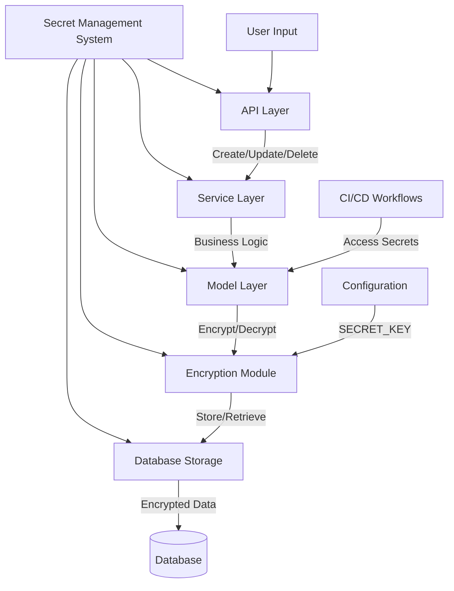
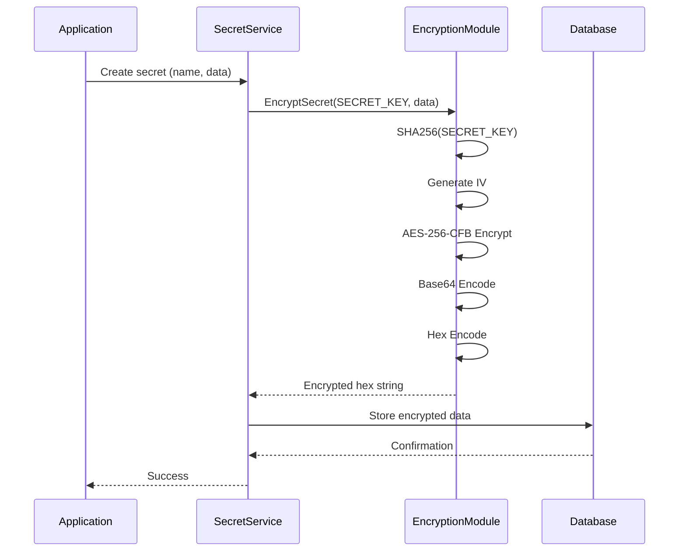
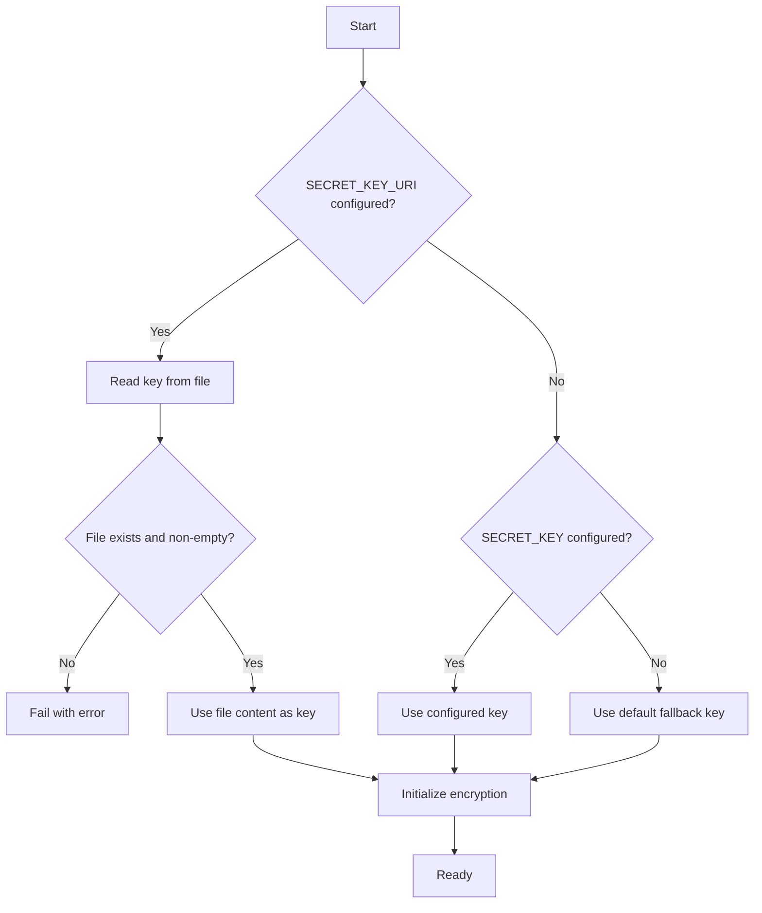

# Data Security

<cite>
**Referenced Files in This Document**   
- [secret.go](file://models/secret/secret.go)
- [secret.go](file://modules/secret/secret.go)
- [secrets.go](file://services/secrets/secrets.go)
- [security.go](file://modules/setting/security.go)
- [twofactor.go](file://models/auth/twofactor.go)
</cite>

## Table of Contents
1. [Introduction](#introduction)
2. [Secret Management Architecture](#secret-management-architecture)
3. [Encryption Implementation](#encryption-implementation)
4. [Domain Model for Secrets](#domain-model-for-secrets)
5. [Key Management and Configuration](#key-management-and-configuration)
6. [Two-Factor Authentication Secrets](#two-factor-authentication-secrets)
7. [Security Best Practices](#security-best-practices)
8. [Common Issues and Troubleshooting](#common-issues-and-troubleshooting)

## Introduction
Gitea implements a comprehensive data encryption and secret management system to protect sensitive information such as passwords, tokens, and API keys. This document details the implementation of Gitea's encryption mechanisms, focusing on how secrets are securely stored at rest, the domain model for encrypted fields, and best practices for secure secret handling in CI/CD contexts. The system uses AES encryption with a master secret key to protect sensitive data in the database, ensuring that even if the database is compromised, the secrets remain protected.

## Secret Management Architecture

Gitea's secret management system is designed with security and usability in mind, providing a hierarchical approach to secret storage and access control. The architecture consists of multiple layers that work together to ensure secure handling of sensitive data.



**Diagram sources**
- [secrets.go](file://services/secrets/secrets.go#L1-L80)
- [secret.go](file://models/secret/secret.go#L1-L202)

**Section sources**
- [secrets.go](file://services/secrets/secrets.go#L1-L80)
- [secret.go](file://models/secret/secret.go#L1-L202)

## Encryption Implementation

Gitea uses AES encryption with CFB mode to protect sensitive data at rest. The encryption process involves several key components that work together to ensure data security.

### Encryption Workflow
The encryption workflow in Gitea follows a standardized process for securing sensitive data before storage in the database:



**Diagram sources**
- [secret.go](file://modules/secret/secret.go#L35-L79)
- [secret.go](file://models/secret/secret.go#L46-L84)

**Section sources**
- [secret.go](file://modules/secret/secret.go#L35-L79)
- [secret.go](file://models/secret/secret.go#L46-L84)

### Core Encryption Functions
Gitea's encryption module provides several key functions for securing data:

- **AesEncrypt**: Performs AES encryption with CFB mode using a randomly generated IV
- **AesDecrypt**: Decrypts AES-encrypted data using the provided key
- **EncryptSecret**: High-level function that encrypts a string and returns a hex-encoded ciphertext
- **DecryptSecret**: High-level function that decrypts a hex-encoded ciphertext

The encryption process uses the following steps:
1. Hash the SECRET_KEY using SHA-256 to create a 32-byte key
2. Generate a random initialization vector (IV) of 16 bytes
3. Encrypt the plaintext using AES-256-CFB mode
4. Base64 encode the encrypted data
5. Hex encode the final result for storage

This multi-step encoding ensures compatibility with database storage requirements while maintaining security.

## Domain Model for Secrets

The domain model for secrets in Gitea is designed to support both repository-level and organization/user-level secrets with clear ownership and access control.

### Secret Entity Structure
```mermaid
classDiagram
class Secret {
+int64 ID
+int64 OwnerID
+int64 RepoID
+string Name
+string Data
+string Description
+TimeStamp CreatedUnix
}
note right of Secret
OwnerID : Org/User ID when RepoID = 0
RepoID : Repository ID when OwnerID = 0
Data : Encrypted secret value
Name : Uppercase only, unique per owner/repo
end
```

**Diagram sources**
- [secret.go](file://models/secret/secret.go#L19-L49)

**Section sources**
- [secret.go](file://models/secret/secret.go#L19-L49)

### Ownership and Scope Rules
Gitea enforces strict rules for secret ownership and scope to prevent security issues:

- **Repository-level secrets**: OwnerID = 0, RepoID > 0
- **Organization/User-level secrets**: OwnerID > 0, RepoID = 0
- **Global secrets**: Not supported (both OwnerID and RepoID cannot be zero)
- **Ambiguous ownership**: Not allowed (both OwnerID and RepoID cannot be non-zero)

These rules ensure clear ownership and prevent confusion about secret accessibility. The system automatically corrects accidental misconfigurations by setting OwnerID to 0 when creating repository-level secrets.

### Validation and Constraints
The secret model includes several validation rules and constraints:

- **Data length**: Maximum 65,536 characters
- **Description length**: Maximum 4,096 characters
- **Name normalization**: Converted to uppercase
- **Description truncation**: Automatically truncated to maximum length
- **Name uniqueness**: Enforced at the database level with composite index

These constraints help prevent denial-of-service attacks and ensure consistent behavior across the system.

## Key Management and Configuration

Proper key management is critical to the security of Gitea's encryption system. The system provides flexible configuration options while maintaining strong security defaults.

### Secret Key Configuration
Gitea supports multiple methods for configuring the SECRET_KEY:

- **Direct configuration**: Set SECRET_KEY in app.ini
- **File-based configuration**: Use SECRET_KEY_URI to reference a file containing the key
- **Default fallback**: Uses a widely-known default value if not configured



**Diagram sources**
- [security.go](file://modules/setting/security.go#L1-L185)

**Section sources**
- [security.go](file://modules/setting/security.go#L1-L185)

### Key Generation
Gitea provides utilities for generating secure secret keys:

- **CryptoRandomString**: Generates cryptographically secure random strings
- **NewSecretKey**: Creates a 64-character random string suitable for SECRET_KEY
- **Key rotation**: Supported through configuration changes

The recommended approach is to generate a new 64-character random string for the SECRET_KEY during installation or when rotating keys.

## Two-Factor Authentication Secrets

Gitea implements secure storage for two-factor authentication (2FA) secrets using the same encryption infrastructure as other sensitive data.

### 2FA Secret Storage
Two-factor authentication secrets are stored in the database using AES encryption with a key derived from the SECRET_KEY:

```mermaid
classDiagram
class TwoFactor {
+int64 ID
+int64 UID
+string Secret
+string ScratchSalt
+string ScratchHash
+string LastUsedPasscode
+TimeStamp CreatedUnix
+TimeStamp UpdatedUnix
}
TwoFactor --> Secret : "encrypted with MD5(SECRET_KEY)"
note right of TwoFactor
Secret : Base64-encoded AES-encrypted 2FA secret
ScratchHash : PBKDF2 hash of scratch token
end
```

**Diagram sources**
- [twofactor.go](file://models/auth/twofactor.go#L0-L176)

**Section sources**
- [twofactor.go](file://models/auth/twofactor.go#L0-L176)

### 2FA Encryption Process
The 2FA secret encryption process differs slightly from the general secret encryption:

1. Derive encryption key using MD5 hash of SECRET_KEY
2. Encrypt the 2FA secret using AES
3. Base64 encode the encrypted data
4. Store in the Secret field

This approach maintains compatibility with existing installations while providing adequate security for 2FA secrets.

## Security Best Practices

### CI/CD Context Security
When using secrets in CI/CD workflows, follow these best practices:

- **Limit secret scope**: Use repository-level secrets when possible
- **Regular rotation**: Rotate secrets periodically
- **Audit access**: Monitor secret usage in workflows
- **Environment isolation**: Use different secrets for different environments

### Custom Encryption Modules
For advanced use cases, consider these approaches:

- **External key management**: Integrate with external KMS solutions
- **Hardware security modules**: Use HSMs for key storage
- **Multi-factor encryption**: Combine multiple encryption layers

### Secure Configuration
Follow these configuration best practices:

- **Set a strong SECRET_KEY**: Generate a random 64-character string
- **Use file-based key storage**: Store SECRET_KEY in a file with restricted permissions
- **Regular backups**: Include encrypted secrets in backup procedures
- **Access controls**: Restrict database access to authorized personnel only

## Common Issues and Troubleshooting

### Key Rotation Challenges
Key rotation in Gitea requires careful planning as it affects all encrypted data:

- **Data re-encryption**: All existing encrypted data must be decrypted with the old key and re-encrypted with the new key
- **Downtime considerations**: Plan for potential downtime during rotation
- **Backup strategy**: Ensure backups are available before rotation
- **Testing**: Test the rotation process in a staging environment first

### Data Leakage Prevention
Prevent data leakage through these measures:

- **Log filtering**: Ensure secrets are not logged in plaintext
- **Error handling**: Avoid exposing secret information in error messages
- **Audit trails**: Maintain logs of secret access and modifications
- **Access monitoring**: Monitor for unusual access patterns

### Troubleshooting Encryption Issues
Common issues and their solutions:

- **"Unable to decrypt" errors**: Verify SECRET_KEY matches the one used for encryption
- **Invalid hex string errors**: Check for data corruption in the database
- **Ciphertext too short errors**: Verify IV and ciphertext integrity
- **Base64 decoding errors**: Check for encoding/decoding mismatches

When troubleshooting, always verify that the SECRET_KEY configuration matches across all instances in a clustered environment.