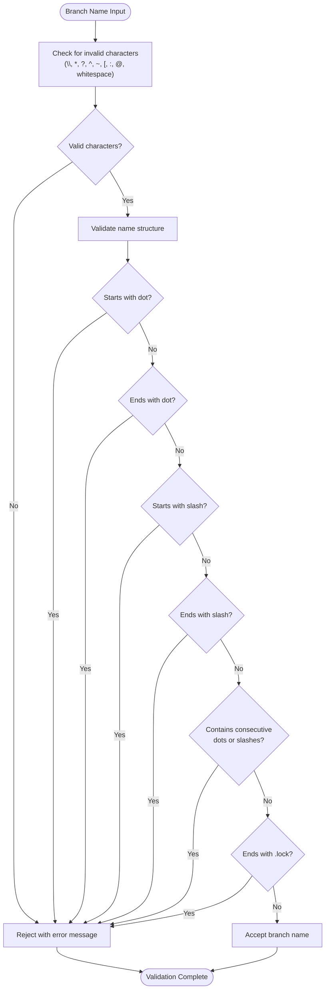
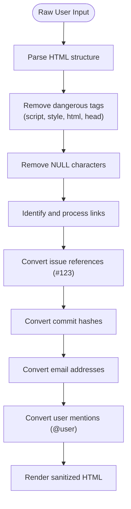

# Input Validation

<cite>
**Referenced Files in This Document**   
- [repo.go](file://models/repo/repo.go)
- [helpers.go](file://modules/validation/helpers.go)
- [repo_form.go](file://services/forms/repo_form.go)
- [html.go](file://modules/markup/html.go)
- [branch.go](file://routers/web/repo/branch.go)
- [refname_test.go](file://modules/validation/refname_test.go)
</cite>

## Table of Contents
1. [Introduction](#introduction)
2. [Repository Name Validation](#repository-name-validation)
3. [Branch and Tag Validation](#branch-and-tag-validation)
4. [Form Validation Mechanisms](#form-validation-mechanisms)
5. [Markup and Content Sanitization](#markup-and-content-sanitization)
6. [Security Headers and XSS Protection](#security-headers-and-xss-protection)
7. [Error Handling and User Feedback](#error-handling-and-user-feedback)
8. [Conclusion](#conclusion)

## Introduction
Gitea implements comprehensive input validation and output sanitization mechanisms to ensure data integrity and protect against common security vulnerabilities such as XSS attacks and path traversal. The system validates user inputs across various entry points including web forms, API endpoints, and markup rendering. This document details the implementation of these validation mechanisms, focusing on repository names, branch names, and user-generated content. The validation framework combines pattern matching, reserved name checking, and context-specific rules to maintain security while providing flexibility for legitimate use cases.

## Repository Name Validation
Gitea enforces strict validation rules for repository names through pattern matching and reserved name checking. The system uses regular expressions to ensure repository names contain only valid characters and do not include prohibited patterns. Repository names must match the pattern `^[-.\w]+$` and cannot contain consecutive dots. Additionally, certain names are reserved and cannot be used, including ".", "..", and "-". The system also prevents the use of patterns like "*.wiki", "*.git", "*.rss", and "*.atom" to avoid conflicts with internal functionality. This validation occurs at multiple levels, including form submission and API endpoints, ensuring consistent enforcement across all entry points.

**Section sources**
- [repo.go](file://models/repo/repo.go#L53-L89)

## Branch and Tag Validation
Branch and tag names undergo rigorous validation to prevent security issues and maintain repository integrity. Gitea uses the `GitRefName` validation rule, which prohibits special characters that could lead to path traversal or command injection attacks. Invalid characters include backslash (\), asterisk (*), question mark (?), and caret (^). The validation also prevents names that start or end with a dot or slash, contain consecutive dots or slashes, or end with ".lock". These rules align with Git's reference naming conventions while adding additional security constraints. The validation framework supports internationalized branch names through proper URL encoding, allowing non-ASCII characters while maintaining security.

**Diagram sources**
- [refname_test.go](file://modules/validation/refname_test.go#L0-L264)
- [branch.go](file://routers/web/repo/branch.go#L0-L274)

## Form Validation Mechanisms
Gitea employs a structured form validation system using binding rules and custom validators. The framework defines validation rules directly on form structs using tags that specify requirements such as required fields, maximum length, and pattern matching. For example, repository names require the `AlphaDashDot` tag, which enforces the use of alphanumeric characters, hyphens, dots, and underscores. The validation system integrates with the web framework to automatically validate form submissions and provide appropriate error responses. Custom validation functions handle complex requirements, such as ensuring external URLs are not loopback addresses and preventing API URL references. This approach provides consistent validation across both web interfaces and API endpoints.

**Section sources**
- [repo_form.go](file://services/forms/repo_form.go#L0-L715)
- [helpers.go](file://modules/validation/helpers.go#L0-L133)

## Markup and Content Sanitization
Gitea implements comprehensive markup processing and content sanitization to prevent XSS attacks and ensure safe rendering of user-generated content. The system uses a multi-stage approach that includes HTML parsing, tag cleaning, and link processing. During rendering, potentially dangerous HTML tags like `<script>`, `<style>`, and `<html>` are escaped to prevent execution. The sanitization process also handles special patterns such as issue references (#123), commit hashes, and email addresses, converting them to appropriate links while maintaining security. For repository descriptions and other user content, Gitea applies additional sanitization to remove NULL characters and escape known HTML tags, ensuring that malicious content cannot be injected through markup.

**Diagram sources**
- [html.go](file://modules/markup/html.go#L0-L417)

## Security Headers and XSS Protection
Gitea implements multiple layers of security headers and XSS protection mechanisms to safeguard user content and prevent cross-site scripting attacks. The system automatically sets appropriate Content-Security-Policy headers for different content types, particularly for SVG and PDF files, which can present security risks. For SVG content, when SVG support is disabled, files are served with attachment disposition to prevent inline rendering. The framework also implements CSRF protection through token generation and validation, requiring valid tokens for state-changing operations. Additionally, Gitea uses safe attribute handling in HTML rendering, protecting against attribute injection attacks by prefixing sensitive attributes with security identifiers.

**Section sources**
- [html.go](file://modules/markup/html.go#L0-L417)
- [serve.go](file://modules/httplib/serve.go#L119-L157)

## Error Handling and User Feedback
Gitea provides clear and informative error messages to guide users through validation failures while maintaining security. When validation fails, the system returns appropriate HTTP status codes such as 422 Unprocessable Entity for invalid input patterns and 409 Conflict for naming conflicts. Error messages are localized and provide specific guidance on how to correct the issue, such as indicating which characters are not allowed in a repository name. The error handling system distinguishes between different types of validation failures, providing tailored messages for reserved names, character restrictions, and pattern violations. This approach helps users understand and resolve issues without exposing sensitive system information.

**Section sources**
- [repo.go](file://models/repo/repo.go#L53-L89)
- [repo_form.go](file://services/forms/repo_form.go#L0-L715)

## Conclusion
Gitea's input validation and output sanitization mechanisms provide a robust defense against common web application vulnerabilities while maintaining usability for legitimate users. The system combines pattern-based validation, reserved name checking, and context-specific rules to ensure data integrity across repository names, branch names, and user content. By implementing these validation mechanisms at multiple levels—from form submission to API endpoints—Gitea maintains consistent security policies throughout the application. The comprehensive error handling and user feedback system helps users understand and correct validation issues, contributing to a secure and user-friendly experience.