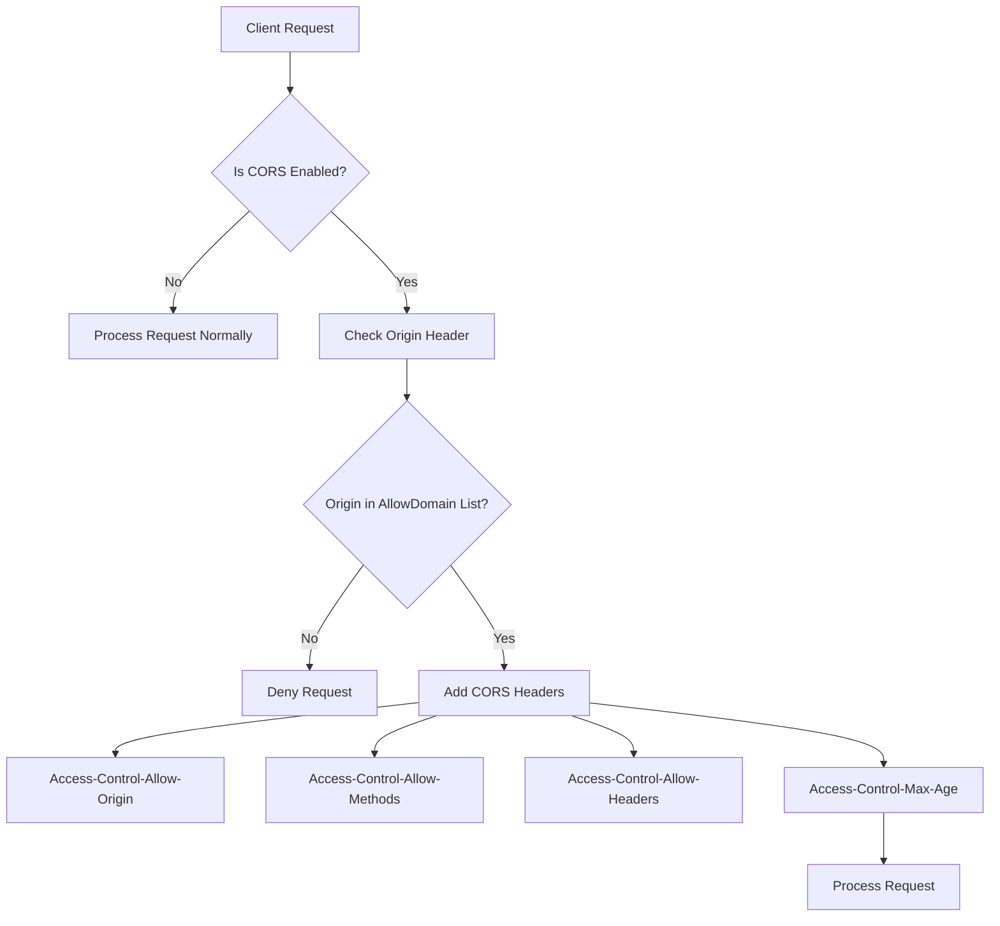
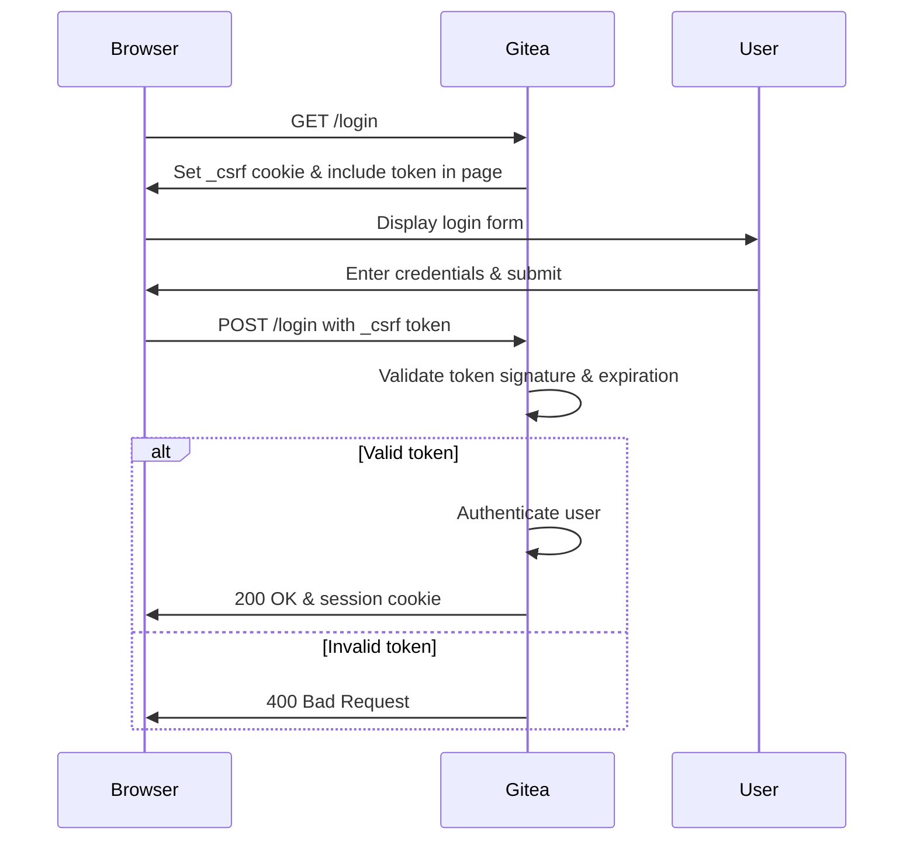

# Security Headers

<cite>
**Referenced Files in This Document**   
- [cors.go](file://modules/setting/cors.go)
- [middleware.go](file://routers/common/middleware.go)
- [context.go](file://services/context/context.go)
- [csrf.go](file://services/context/csrf.go)
- [xsrf.go](file://services/context/xsrf.go)
- [serve.go](file://modules/httplib/serve.go)
- [markup.go](file://modules/setting/markup.go)
- [app.ini](file://docker/root/etc/templates/app.ini)
</cite>

## Table of Contents
1. [Introduction](#introduction)
2. [Security Headers Overview](#security-headers-overview)
3. [Content Security Policy (CSP)](#content-security-policy-csp)
4. [Cross-Origin Resource Sharing (CORS)](#cross-origin-resource-sharing-cors)
5. [X-Frame-Options](#x-frame-options)
6. [CSRF Protection](#csrf-protection)
7. [Configuration via app.ini](#configuration-via-appini)
8. [Common Issues and Troubleshooting](#common-issues-and-troubleshooting)
9. [Conclusion](#conclusion)

## Introduction
Gitea implements multiple security headers to protect against common web vulnerabilities such as cross-site scripting (XSS), clickjacking, and cross-site request forgery (CSRF). These security mechanisms are configured through the app.ini configuration file and enforced at the middleware level throughout the application. This document provides a comprehensive analysis of Gitea's security header implementation, explaining how Content Security Policy, CORS, X-Frame-Options, and CSRF protection work together to create a secure environment for both users and administrators.

## Security Headers Overview
Gitea's security architecture implements multiple HTTP security headers to protect against various web-based attacks. The system uses a layered approach where security policies are defined in configuration files and enforced through middleware components. The security model is designed to balance protection with flexibility, allowing administrators to customize settings based on their deployment requirements. Security headers are injected at various levels of the request-response cycle, with different components responsible for different aspects of security enforcement.

## Content Security Policy (CSP)
Gitea implements Content Security Policy to mitigate cross-site scripting (XSS) attacks by restricting the sources from which content can be loaded. The CSP implementation is context-aware, applying different policies based on the content type being served. For SVG images, Gitea applies a restrictive policy: "default-src 'none'; style-src 'unsafe-inline'; sandbox". This policy prevents execution of any scripts while allowing inline styles necessary for SVG rendering. For PDF files, the policy "default-src 'none'; style-src 'unsafe-inline'" is applied without the sandbox attribute, as sandboxing can interfere with PDF rendering in some browsers.

The CSP header is set in the `setServeHeadersByFile` function within the httplib module when serving potentially risky content types. This function detects content type using MIME sniffing and applies appropriate security policies. For external markup renderers configured with iframe display, Gitea adds a frame-src directive to the Content-Security-Policy header, restricting framing to the same origin. The system explicitly warns against using "allow-same-origin" in sandbox policies, as this could lead to XSS attacks by allowing JavaScript in iframes to access parent window configuration and CSRF tokens.

**Section sources**
- [serve.go](file://modules/httplib/serve.go#L119-L157)
- [markup.go](file://modules/setting/markup.go#L230-L261)
- [render.go](file://modules/markup/render.go#L184-L212)

## Cross-Origin Resource Sharing (CORS)
Gitea's CORS implementation provides fine-grained control over cross-origin requests through configuration in the app.ini file. The CORS settings are defined in the `[cors]` section and include options for allowed domains, HTTP methods, maximum age of preflight requests, and credential handling. By default, Gitea allows all domains ("*") and common HTTP methods including GET, POST, PUT, DELETE, and OPTIONS. The default maximum age for preflight responses is 10 minutes, reducing the number of preflight requests for legitimate clients.

CORS configuration is managed through the `CORSConfig` struct in the setting package, which is populated from the app.ini configuration during application startup. The implementation supports wildcard domains and allows administrators to specify multiple allowed origins. The system also includes X-Frame-Options configuration within the CORS settings, with a default value of "SAMEORIGIN" to prevent clickjacking attacks. CORS policies are applied selectively, with API endpoints and web interfaces having different CORS behavior based on security requirements.

**Diagram sources**
- [cors.go](file://modules/setting/cors.go#L0-L28)
- [middleware.go](file://routers/common/middleware.go#L0-L42)

**Section sources**
- [cors.go](file://modules/setting/cors.go#L0-L28)
- [cors_test.go](file://tests/integration/cors_test.go#L71-L93)

## X-Frame-Options
Gitea implements X-Frame-Options to prevent clickjacking attacks by controlling whether pages can be embedded in iframes. The X-Frame-Options header is set to "SAMEORIGIN" by default, allowing framing only by pages from the same origin. This setting is configured as part of the CORS configuration in app.ini, specifically in the `XFrameOptions` field of the `CORSConfig` struct.

The X-Frame-Options header is injected into HTTP responses in the context initialization phase, specifically in the `RequestContextHandler` middleware. When a request is processed, the header is added to the response with the value from the CORS configuration. This ensures consistent application of the framing policy across all endpoints. The implementation allows administrators to customize this setting through configuration, providing flexibility for deployments with specific embedding requirements while maintaining security by default.

**Section sources**
- [context.go](file://services/context/context.go#L165-L196)
- [cors.go](file://modules/setting/cors.go#L0-L28)

## CSRF Protection
Gitea implements comprehensive CSRF protection using token-based validation for state-changing operations. The CSRF protection system generates cryptographically secure tokens that are validated on each POST request. The implementation uses HMAC-SHA1 with a secret key and user-specific identifiers to generate tokens that expire after 24 hours. Tokens are regenerated every 10 minutes to enhance security while maintaining usability.

The CSRF system creates a token cookie named "_csrf" with appropriate security attributes including HttpOnly and SameSite protections. The token is also made available to templates as "CsrfToken" and "CsrfTokenHtml" variables, allowing seamless integration with HTML forms. Validation occurs through the `Validate` method of the CSRF protector, which checks tokens from either the "X-Csrf-Token" header or "_csrf" form field. The system uses constant-time comparison to prevent timing attacks during token validation.

For API requests, Gitea expects the CSRF token in the "X-Csrf-Token" header, while web forms can include it as a hidden input field. When validation fails, the system returns a 400 Bad Request response with an appropriate error message. The implementation includes mechanisms to handle user session changes, regenerating tokens when user IDs change to prevent token invalidation issues.

**Diagram sources**
- [csrf.go](file://services/context/csrf.go#L0-L44)
- [xsrf.go](file://services/context/xsrf.go#L0-L38)

**Section sources**
- [csrf.go](file://services/context/csrf.go#L0-L167)
- [xsrf.go](file://services/context/xsrf.go#L38-L98)

## Configuration via app.ini
Security policies in Gitea are primarily configured through the app.ini configuration file, allowing administrators to customize security settings without code changes. The main security-related sections include `[security]`, `[cors]`, and `[session]`. In the `[cors]` section, administrators can set `ENABLED` to control whether CORS is active, `ALLOW_DOMAIN` to specify allowed origins, `METHODS` to define permitted HTTP methods, and `MAX_AGE` to set the preflight cache duration.

The `[security]` section includes settings like `REVERSE_PROXY_LIMIT` and `REVERSE_PROXY_TRUSTED_PROXIES` which affect how headers from trusted proxies are handled. Session security is configured in the `[session]` section with options for cookie security attributes including `SECURE`, `SAME_SITE`, and domain settings. For markup rendering, the `[markup]` section allows configuration of content security policies for external renderers through `RENDER_CONTENT_SANDBOX` and `RENDER_CONTENT_MODE` settings.

Default values provide reasonable security out of the box, with CORS enabled for all domains and X-Frame-Options set to SAMEORIGIN. Administrators can tighten these policies based on their specific requirements, such as restricting CORS to specific domains or adjusting CSRF token timeouts for higher security environments.

**Section sources**
- [app.ini](file://docker/root/etc/templates/app.ini#L0-L62)
- [cors.go](file://modules/setting/cors.go#L0-L28)
- [session.go](file://modules/setting/session.go#L61-L75)

## Common Issues and Troubleshooting
Common issues with Gitea's security headers typically involve CORS misconfiguration and CSRF token invalidation. CORS problems often occur when integrating Gitea with external applications, particularly when the `ALLOW_DOMAIN` setting doesn't include the client's origin. Administrators should verify that the exact origin (including protocol and port) is included in the allowed domains list. For development environments, using wildcard domains may be appropriate, but production deployments should specify exact origins.

CSRF token issues commonly arise from session changes or token expiration. When a user's session ID changes, the CSRF token becomes invalid, requiring regeneration. This can occur during authentication state changes or session timeouts. Applications integrating with Gitea's API should handle 400 Bad Request responses by refreshing the CSRF token. For web integrations, ensuring that the CSRF token is properly included in AJAX requests either as a header or form field is crucial.

Another common issue involves SVG and PDF rendering, where overly restrictive CSP policies may prevent legitimate content from displaying. Administrators should verify that the `UI.SVG.Enabled` setting matches their security requirements, as disabling SVG rendering forces attachment downloads instead of inline display. When configuring external markup renderers, care should be taken with sandbox policies to avoid security vulnerabilities while maintaining functionality.

**Section sources**
- [csrf.go](file://services/context/csrf.go#L88-L128)
- [serve.go](file://modules/httplib/serve.go#L119-L157)
- [cors_test.go](file://tests/integration/cors_test.go#L71-L93)

## Conclusion
Gitea's security header implementation provides a robust defense against common web vulnerabilities through a combination of Content Security Policy, CORS, X-Frame-Options, and CSRF protection. The system balances security with flexibility, allowing administrators to customize policies through the app.ini configuration file while maintaining strong defaults. The middleware-based architecture ensures consistent application of security policies across all endpoints, with context-aware policies for different content types. By understanding the configuration options and common issues, administrators can effectively tune Gitea's security settings to meet their specific requirements while protecting against cross-site scripting, clickjacking, and cross-site request forgery attacks.