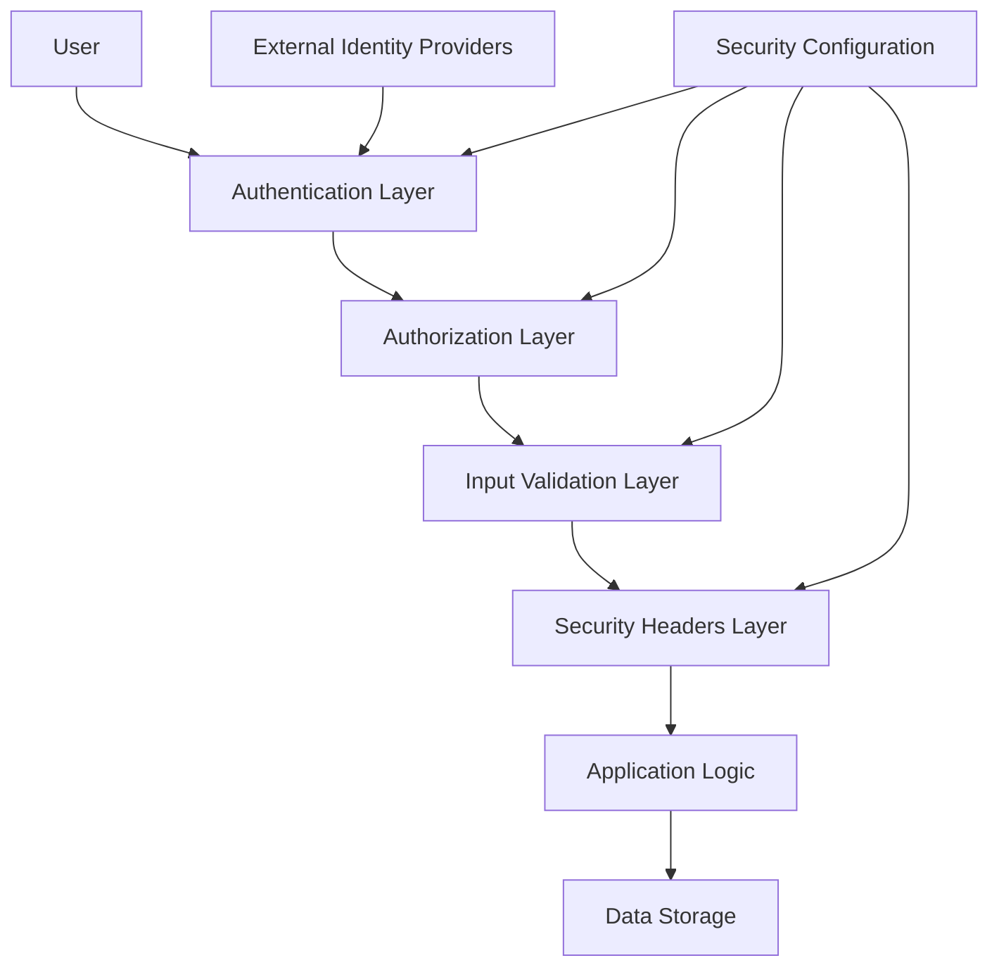
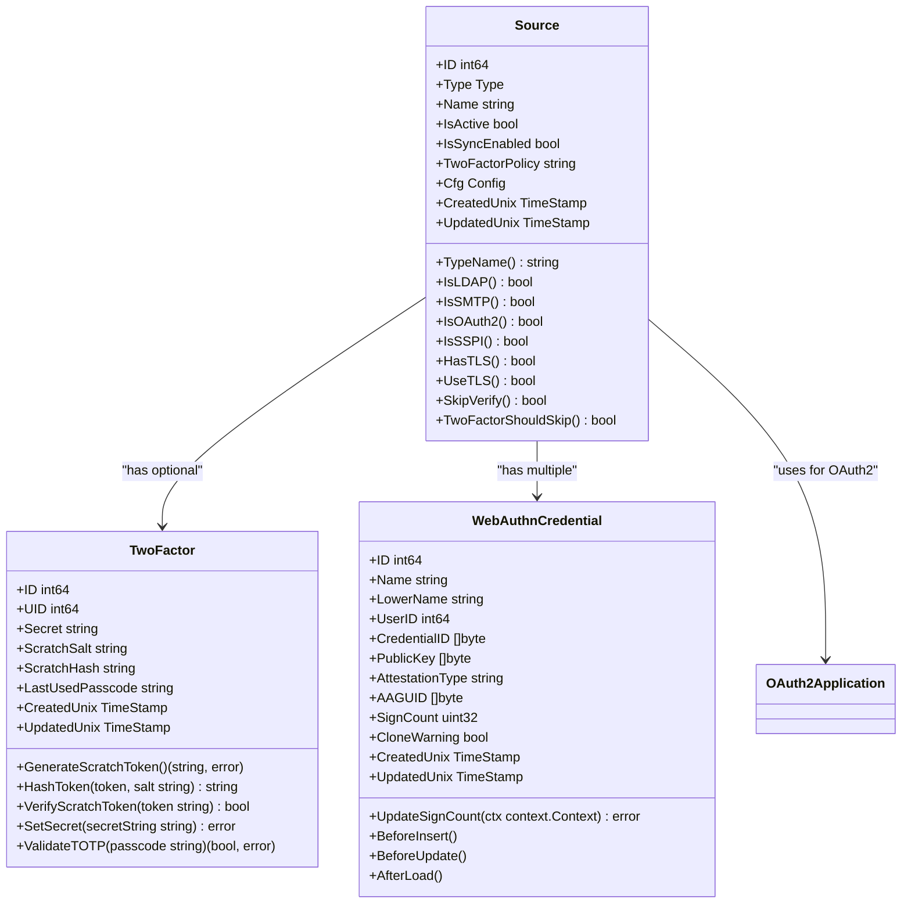
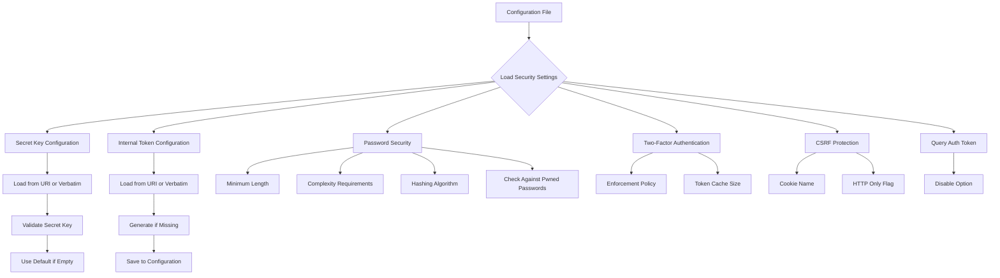

# Security

<cite>
**Referenced Files in This Document**   
- [source.go](file://models/auth/source.go)
- [twofactor.go](file://models/auth/twofactor.go)
- [webauthn.go](file://models/auth/webauthn.go)
- [oauth2.go](file://models/auth/oauth2.go)
- [security.go](file://modules/setting/security.go)
- [security.txt](file://public/.well-known/security.txt)
</cite>

## Table of Contents
1. [Introduction](#introduction)
2. [Multi-Layered Security Architecture](#multi-layered-security-architecture)
3. [Authentication Mechanisms](#authentication-mechanisms)
4. [Authorization Models](#authorization-models)
5. [Security Settings and Configuration](#security-settings-and-configuration)
6. [Input Validation and Security Headers](#input-validation-and-security-headers)
7. [Common Security Issues and Mitigation](#common-security-issues-and-mitigation)
8. [Performance Considerations](#performance-considerations)
9. [Best Practices for Secure Deployment](#best-practices-for-secure-deployment)
10. [Conclusion](#conclusion)

## Introduction
Gitea implements a comprehensive security model designed to protect user data and maintain system integrity through multiple layers of protection. This document details the security architecture, focusing on authentication mechanisms, authorization models, input validation, and security headers. The implementation ensures robust protection against common vulnerabilities while providing flexible configuration options for administrators. The security model is built around the principle of defense in depth, combining multiple security controls to create a resilient system.

**Section sources**
- [source.go](file://models/auth/source.go)
- [security.go](file://modules/setting/security.go)

## Multi-Layered Security Architecture
Gitea's security architecture employs a multi-layered approach to protect both user data and system integrity. The architecture consists of several interconnected components that work together to provide comprehensive protection. At the foundation is the authentication system, which verifies user identity through multiple methods including password-based authentication, LDAP, OAuth2, and WebAuthn. Above this layer, authorization mechanisms control access to resources based on user roles and permissions. The security model also includes input validation to prevent injection attacks and security headers to protect against cross-site scripting and other client-side vulnerabilities. Each layer is designed to operate independently while contributing to the overall security posture, ensuring that compromise of one layer does not necessarily lead to compromise of the entire system.

**Diagram sources**
- [source.go](file://models/auth/source.go)
- [security.go](file://modules/setting/security.go)

**Section sources**
- [source.go](file://models/auth/source.go)
- [security.go](file://modules/setting/security.go)

## Authentication Mechanisms
Gitea supports multiple authentication methods through its flexible authentication system implemented in the models/auth package. The system allows administrators to configure various authentication sources, including local database authentication, LDAP, SMTP, PAM, OAuth2, and WebAuthn. Each authentication source is represented by a Source object that contains configuration details and type information. The authentication system uses a pluggable architecture that allows new authentication methods to be added through the registration of configuration types. For two-factor authentication, Gitea implements both TOTP-based authentication and WebAuthn (FIDO2) support, providing users with modern, secure authentication options. The system also supports reverse proxy authentication, allowing integration with external authentication systems.

**Diagram sources**
- [source.go](file://models/auth/source.go)
- [twofactor.go](file://models/auth/twofactor.go)
- [webauthn.go](file://models/auth/webauthn.go)
- [oauth2.go](file://models/auth/oauth2.go)

**Section sources**
- [source.go](file://models/auth/source.go)
- [twofactor.go](file://models/auth/twofactor.go)
- [webauthn.go](file://models/auth/webauthn.go)
- [oauth2.go](file://models/auth/oauth2.go)

## Authorization Models
Gitea's authorization model implements a role-based access control system that determines user permissions based on their role within the organization or repository. The model supports multiple levels of access, including read, write, and administrative privileges. Authorization decisions are made based on the user's membership in organizations, teams, and repositories, with inheritance rules that propagate permissions from higher-level entities to lower-level ones. The system also supports fine-grained permission control through repository units, allowing administrators to enable or disable specific features for individual repositories. For API access, Gitea implements token-based authorization with configurable scopes that limit the actions a token can perform. The authorization system is tightly integrated with the authentication system, ensuring that access decisions are based on verified user identity.

**Section sources**
- [source.go](file://models/auth/source.go)

## Security Settings and Configuration
The security configuration in Gitea is managed through the modules/setting/security.go file, which defines various security-related settings that can be configured in the app.ini file. Key security settings include password complexity requirements, minimum password length, and password hashing algorithms. The system supports configurable two-factor authentication policies, including the ability to enforce two-factor authentication for all users. Other important security settings include CSRF protection with configurable cookie settings, control over query-based authentication tokens, and configuration of reverse proxy authentication. The security configuration also includes settings for internal tokens, secret keys, and session management. These settings can be loaded from files or directly from the configuration file, with appropriate validation to ensure security.

**Diagram sources**
- [security.go](file://modules/setting/security.go)

**Section sources**
- [security.go](file://modules/setting/security.go)

## Input Validation and Security Headers
Gitea implements comprehensive input validation to prevent common web vulnerabilities such as SQL injection, cross-site scripting (XSS), and command injection. The input validation system operates at multiple levels, including form validation, API parameter validation, and content filtering. For XSS protection, Gitea employs both input sanitization and output encoding, using context-aware escaping to prevent malicious script execution. The system also implements security headers to enhance client-side protection, including Content Security Policy (CSP), X-Content-Type-Options, and X-Frame-Options headers. These headers help prevent clickjacking, MIME type sniffing, and other client-side attacks. The security.txt file in the .well-known directory provides a standardized way for security researchers to report vulnerabilities, following the IETF draft specification for security.txt.

**Section sources**
- [security.txt](file://public/.well-known/security.txt)

## Common Security Issues and Mitigation
Gitea addresses several common security issues through its architecture and implementation. Authentication bypass attempts are mitigated through strong session management, secure token generation, and proper validation of authentication credentials. For XSS vulnerabilities, Gitea employs a multi-layered defense including input validation, output encoding, and security headers. The system prevents CSRF attacks through the use of anti-forgery tokens with configurable properties. Password security is enhanced through configurable complexity requirements, support for modern hashing algorithms, and optional checking against known compromised passwords. The system also includes protections against brute force attacks through configurable rate limiting and account lockout policies. For API security, Gitea supports OAuth2 with PKCE (Proof Key for Code Exchange) to prevent authorization code interception attacks.

**Section sources**
- [source.go](file://models/auth/source.go)
- [security.go](file://modules/setting/security.go)

## Performance Considerations
Security checks in Gitea are designed to balance security requirements with performance considerations. Authentication operations are optimized through the use of caching for successful authentication tokens, reducing the need for repeated database queries. The system implements efficient password hashing using modern algorithms that provide strong security while minimizing performance impact. For two-factor authentication, Gitea uses optimized cryptographic operations and caches recent authentication attempts to improve performance. The authorization system employs efficient database queries and caching to minimize the performance impact of access control checks. Security headers are generated efficiently and cached where appropriate to avoid unnecessary processing overhead. The system also includes configuration options that allow administrators to tune security settings based on their performance requirements and threat model.

**Section sources**
- [security.go](file://modules/setting/security.go)

## Best Practices for Secure Deployment
For secure deployment of Gitea, administrators should follow several best practices. The secret key should be configured using a secure random value and stored in a secure location, preferably using the SECRET_KEY_URI configuration option. Two-factor authentication should be enforced for all users, particularly for administrative accounts. Password policies should be configured to require sufficient complexity and length to resist brute force attacks. The system should be configured to use HTTPS with secure TLS settings to protect data in transit. Regular updates should be applied to ensure the latest security fixes are in place. Backup procedures should be established to protect against data loss. Monitoring and logging should be configured to detect and respond to security incidents. The security.txt file should be maintained to provide clear guidance for security researchers reporting vulnerabilities.

**Section sources**
- [security.go](file://modules/setting/security.go)
- [security.txt](file://public/.well-known/security.txt)

## Conclusion
Gitea's security model provides a comprehensive framework for protecting user data and system integrity through multiple layers of protection. The multi-layered architecture combines authentication, authorization, input validation, and security headers to create a robust defense against common threats. The flexible authentication system supports various methods including modern standards like WebAuthn and OAuth2, while the authorization model provides fine-grained access control. Security settings are configurable through the app.ini file, allowing administrators to tailor the security posture to their specific requirements. By following best practices for secure deployment and staying current with updates, organizations can effectively protect their Gitea instances against evolving threats.