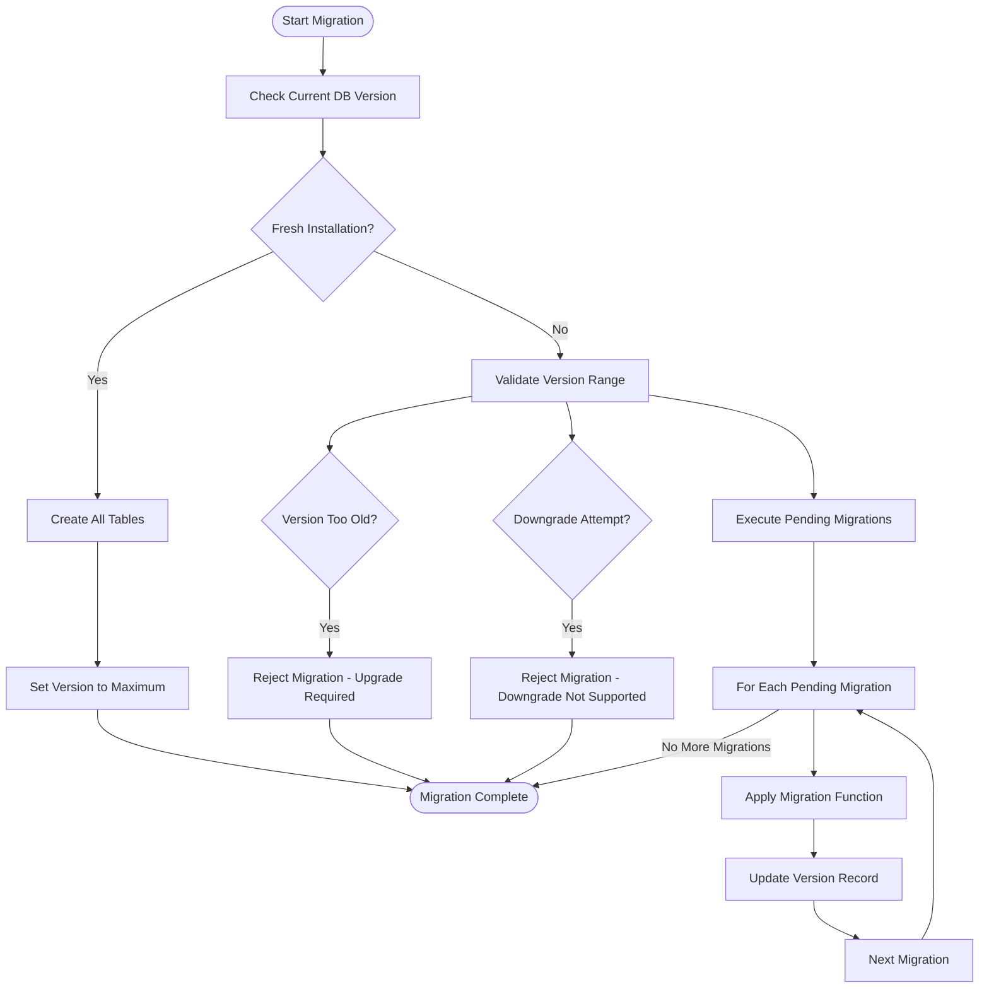

# Database Problems

<cite>
**Referenced Files in This Document**   
- [dbconsistency.go](file://models/db/consistency.go)
- [dbconsistency.go](file://services/doctor/dbconsistency.go)
- [migrate.go](file://cmd/migrate.go)
- [migrations.go](file://models/migrations/migrations.go)
- [engine_init.go](file://models/db/engine_init.go)
</cite>

## Table of Contents
1. [Database Consistency Checks](#database-consistency-checks)
2. [Database Migration System](#database-migration-system)
3. [Schema Version and Application Compatibility](#schema-version-and-application-compatibility)
4. [Common Database Issues](#common-database-issues)
5. [Troubleshooting Database Operations](#troubleshooting-database-operations)

## Database Consistency Checks

Gitea implements a comprehensive database consistency verification and repair system through its doctor command. The system identifies and resolves orphaned records, null field values, and data inconsistencies across various database tables. The implementation is structured around a series of consistency checks that can be executed with optional automatic fixing.

The core functionality is provided by the `CountOrphanedObjects` and `DeleteOrphanedObjects` functions in the database package, which use LEFT JOIN operations to identify records in a subject table that reference non-existent records in a related table. These functions serve as the foundation for higher-level consistency checks that target specific data models such as issues, repositories, actions, and user relationships.

The system performs over 40 different consistency checks, including orphaned labels without existing repositories or organizations, issue labels without existing labels, releases without existing repositories, pull requests without base repositories, tracked times without existing issues, and attachments without existing issues or releases. For PostgreSQL databases, the system also checks and fixes sequence values to ensure they are properly synchronized with table data.

When executed with autofix enabled, the system automatically repairs identified inconsistencies and reports the number of fixed records. Without autofix, it only reports warnings about inconsistencies without making changes. Before performing consistency checks, the system verifies that the database schema is up-to-date with the current Gitea version to prevent conflicts between data repair operations and schema migration requirements.

**Section sources**
- [dbconsistency.go](file://models/db/consistency.go#L1-L32)
- [dbconsistency.go](file://services/doctor/dbconsistency.go#L1-L275)

## Database Migration System

Gitea's database migration system is designed to manage schema evolution across different versions of the application. The system is implemented as a sequence of incremental migration functions that transform the database schema and data from one version to the next. Each migration is assigned a unique ID number and description, and the system tracks the current database version in a dedicated Version table.

The migration process begins by establishing a database connection and verifying the current schema version. If the database has not been initialized, the system creates all necessary tables using XORM's synchronization functionality and sets the initial version to the maximum expected version, effectively skipping all migrations for fresh installations.

For existing databases, the system compares the current version with the expected version based on the complete migration sequence. If the database version is older than the minimum supported version (currently 70, corresponding to Gitea 1.5.3), the system refuses to migrate, requiring users to upgrade through intermediate versions first. If the database version is newer than the expected version, the system prevents downgrading to avoid data loss.

The migration execution process iterates through pending migrations in sequence, applying each migration function to update the schema or transform data. After each successful migration, the system updates the version record to reflect the new state. The system supports various database types including MySQL, PostgreSQL, and MSSQL, with specific SQL syntax handling for each database engine.

**Diagram sources**
- [migrations.go](file://models/migrations/migrations.go#L1-L531)
- [migrate.go](file://cmd/migrate.go#L1-L43)

**Section sources**
- [migrations.go](file://models/migrations/migrations.go#L1-L531)
- [migrate.go](file://cmd/migrate.go#L1-L43)
- [engine_init.go](file://models/db/engine_init.go#L1-L140)

## Schema Version and Application Compatibility

Gitea maintains strict compatibility between database schema versions and application code through a version tracking system. The application code expects a specific database schema version, and operations are blocked if the actual database version does not match the expected version. This ensures that features depending on specific schema elements are not activated when those elements are missing or different.

The version tracking is implemented through a Version table with a single row containing the current database version number. This version number corresponds to the ID of the last applied migration plus one. The application code defines the expected version based on the complete list of available migrations, creating a direct relationship between the codebase version and the required database schema.

When starting the application or running maintenance commands, Gitea checks the database version against the expected version. If they don't match, the application refuses to proceed with operations that might cause data corruption or inconsistent behavior. Users are instructed to run the migration command to update the database schema to the expected version.

This versioning system prevents common issues that occur when application code and database schema become out of sync, such as missing columns, incompatible data types, or incorrect relationships between tables. It also provides a clear upgrade path, as each migration represents a small, incremental change that can be applied in sequence to bring an older database up to date.

The system includes safeguards against both upgrading from versions that are too old (requiring intermediate upgrades) and attempting to downgrade to an older version (which is not supported to prevent data loss). This ensures that database evolution follows a controlled, forward-only path that maintains data integrity throughout the upgrade process.

**Section sources**
- [migrations.go](file://models/migrations/migrations.go#L1-L531)

## Common Database Issues

Gitea's architecture addresses several common database issues through proactive design and maintenance tools. Migration failures can occur when upgrading from versions older than 1.6.4, as the migration system requires intermediate steps to reach current versions. Schema inconsistencies may arise when orphaned records exist, such as labels without associated repositories or pull requests without corresponding issues, which the consistency check system is designed to detect and resolve.

Connection pool exhaustion is mitigated through configuration options that allow administrators to set maximum open connections, maximum idle connections, and connection lifetime limits. These settings help prevent resource exhaustion under high load conditions by ensuring that database connections are properly recycled and that the number of concurrent connections remains within manageable limits.

The system also addresses issues related to database collation and character set configuration. During initialization, Gitea checks the database and table column collations, warning administrators if case-insensitive collations are in use (which may lead to unexpected behavior) or if column collations are inconsistent with the database default. For empty databases, the system can automatically configure the database collation to a case-sensitive option if available.

Sequence synchronization issues, particularly on PostgreSQL, are handled by a dedicated migration check that verifies and corrects sequence values to ensure they are properly aligned with table data, preventing primary key conflicts during record insertion.

**Section sources**
- [migrations.go](file://models/migrations/migrations.go#L1-L531)
- [engine_init.go](file://models/db/engine_init.go#L1-L140)
- [dbconsistency.go](file://services/doctor/dbconsistency.go#L1-L275)

## Troubleshooting Database Operations

### Database Backup and Restore
For database backup operations, administrators should use database-specific tools appropriate to their database engine (mysqldump for MySQL, pg_dump for PostgreSQL, etc.). When restoring, ensure that the database schema version matches the Gitea application version, running migrations if necessary after restoration. Always backup the entire Gitea data directory along with the database to preserve file system data such as repositories, attachments, and configuration.

### Index Optimization
Gitea automatically creates necessary indexes through its migration system, but administrators can monitor query performance and add additional indexes if needed. The system includes specific migrations that add indexes to improve performance of common operations such as issue listing, comment retrieval, and action processing. Use database-specific tools to analyze query execution plans and identify slow queries that might benefit from additional indexing.

### Large Database Migrations
For large databases, migration operations may take significant time to complete. Monitor the migration progress through the application logs, which report each migration step as it is executed. Ensure adequate system resources (memory, disk space, and CPU) are available during migration. For very large installations, consider performing migrations during maintenance windows with the application offline to prevent user impact. The migration system is designed to be resilient, with each migration as a discrete transaction that can be retried if interrupted.

**Section sources**
- [migrations.go](file://models/migrations/migrations.go#L1-L531)
- [engine_init.go](file://models/db/engine_init.go#L1-L140)
- [dbconsistency.go](file://services/doctor/dbconsistency.go#L1-L275)