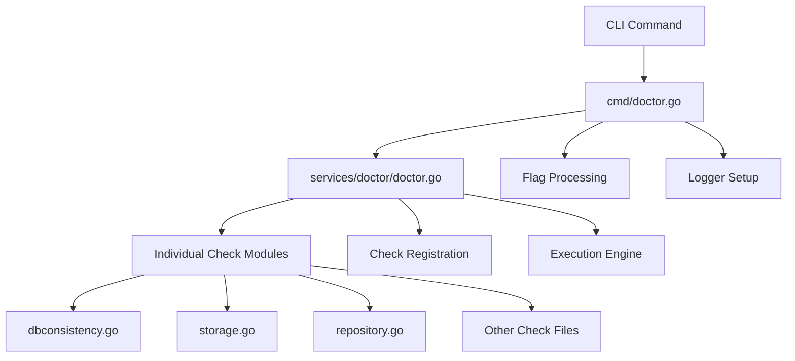
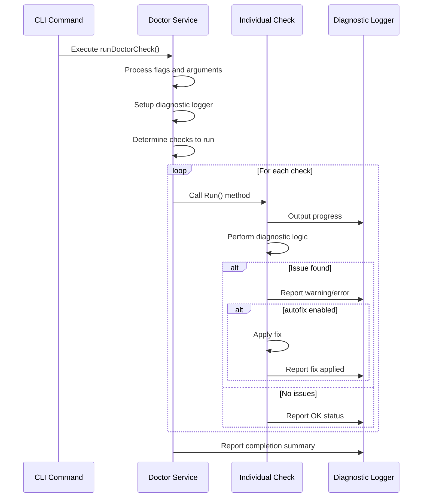
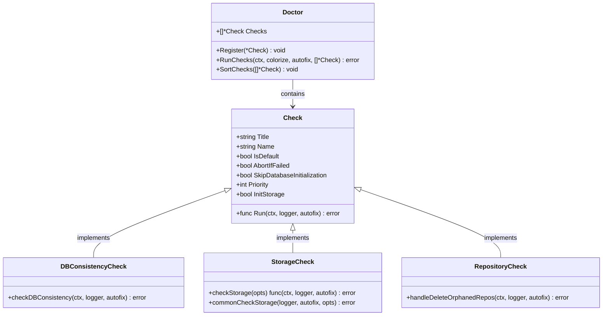
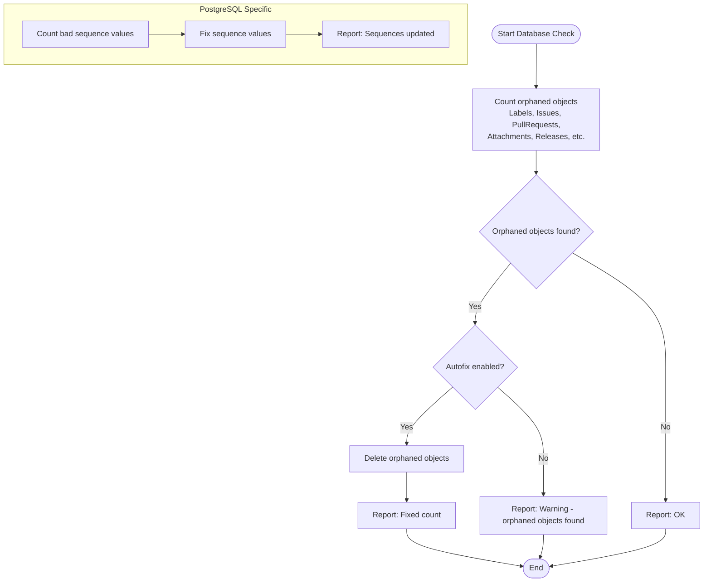
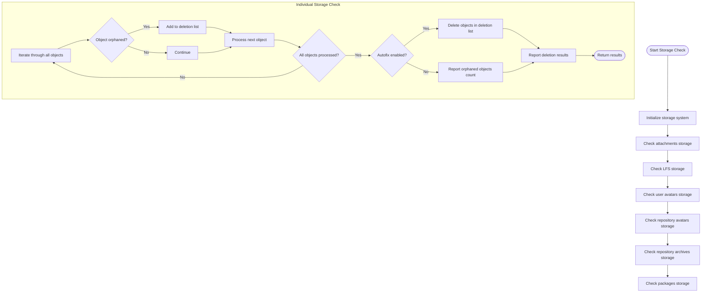
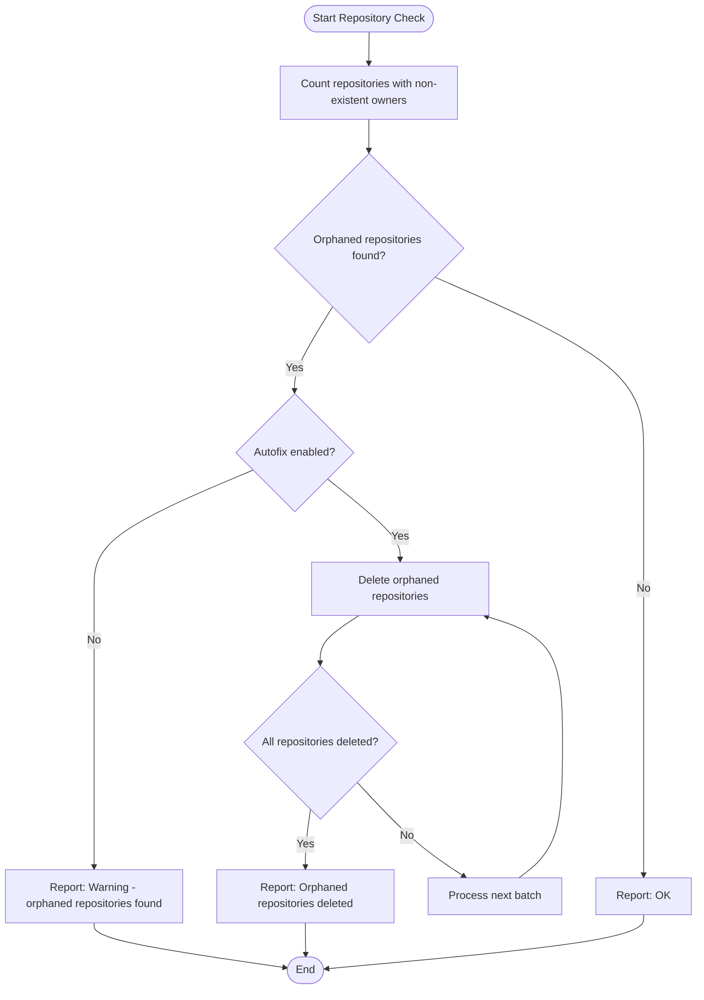
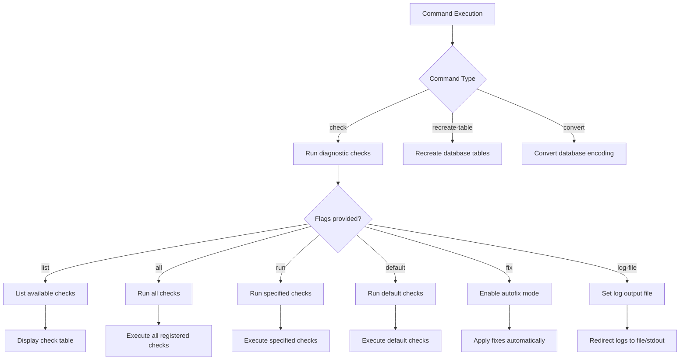
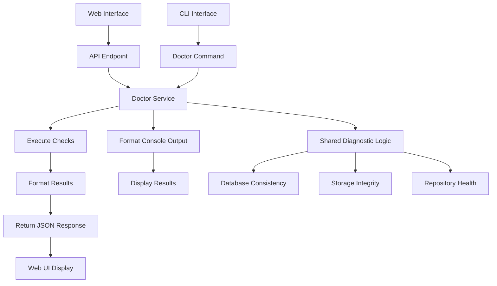
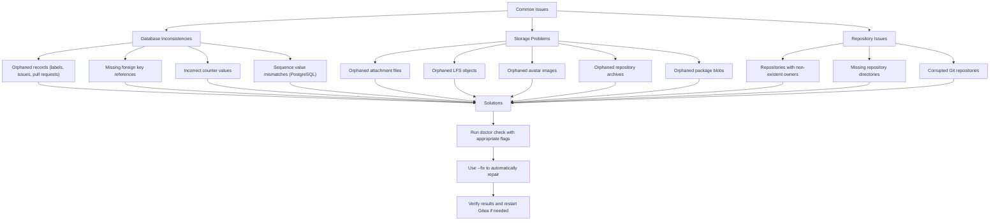

# Diagnostic Commands

<cite>
**Referenced Files in This Document**   
- [cmd/doctor.go](file://cmd/doctor.go)
- [cmd/doctor_test.go](file://cmd/doctor_test.go)
- [services/doctor/doctor.go](file://services/doctor/doctor.go)
- [services/doctor/dbconsistency.go](file://services/doctor/dbconsistency.go)
- [services/doctor/storage.go](file://services/doctor/storage.go)
- [services/doctor/repository.go](file://services/doctor/repository.go)
</cite>

## Table of Contents
1. [Introduction](#introduction)
2. [Doctor Command Architecture](#doctor-command-architecture)
3. [Check Registration and Execution](#check-registration-and-execution)
4. [Core Diagnostic Checks](#core-diagnostic-checks)
5. [Database Consistency Checks](#database-consistency-checks)
6. [Storage Integrity Verification](#storage-integrity-verification)
7. [Repository Health Checks](#repository-health-checks)
8. [CLI Usage and Examples](#cli-usage-and-examples)
9. [Web Interface Integration](#web-interface-integration)
10. [Common Issues and Solutions](#common-issues-and-solutions)

## Introduction
Gitea's diagnostic tools provide comprehensive health checking and repair capabilities for Gitea instances. The doctor command system enables administrators to identify and resolve various issues related to database consistency, storage integrity, and repository health. This document details the architecture and implementation of the diagnostic system, focusing on the services/doctor package and its integration with both CLI and web interfaces.

**Section sources**
- [cmd/doctor.go](file://cmd/doctor.go#L0-L37)
- [services/doctor/doctor.go](file://services/doctor/doctor.go#L0-L138)

## Doctor Command Architecture

**Diagram sources**
- [cmd/doctor.go](file://cmd/doctor.go#L0-L215)
- [services/doctor/doctor.go](file://services/doctor/doctor.go#L0-L138)

**Section sources**
- [cmd/doctor.go](file://cmd/doctor.go#L0-L215)
- [services/doctor/doctor.go](file://services/doctor/doctor.go#L0-L138)

## Check Registration and Execution

**Diagram sources**
- [cmd/doctor.go](file://cmd/doctor.go#L118-L166)
- [services/doctor/doctor.go](file://services/doctor/doctor.go#L81-L120)

**Section sources**
- [cmd/doctor.go](file://cmd/doctor.go#L32-L75)
- [services/doctor/doctor.go](file://services/doctor/doctor.go#L81-L120)

## Core Diagnostic Checks

**Diagram sources**
- [services/doctor/doctor.go](file://services/doctor/doctor.go#L0-L138)
- [services/doctor/dbconsistency.go](file://services/doctor/dbconsistency.go#L0-L274)
- [services/doctor/storage.go](file://services/doctor/storage.go#L0-L270)
- [services/doctor/repository.go](file://services/doctor/repository.go#L0-L78)

**Section sources**
- [services/doctor/doctor.go](file://services/doctor/doctor.go#L0-L138)

## Database Consistency Checks

**Diagram sources**
- [services/doctor/dbconsistency.go](file://services/doctor/dbconsistency.go#L0-L274)

**Section sources**
- [services/doctor/dbconsistency.go](file://services/doctor/dbconsistency.go#L0-L274)

## Storage Integrity Verification

**Diagram sources**
- [services/doctor/storage.go](file://services/doctor/storage.go#L0-L270)

**Section sources**
- [services/doctor/storage.go](file://services/doctor/storage.go#L0-L270)

## Repository Health Checks

**Diagram sources**
- [services/doctor/repository.go](file://services/doctor/repository.go#L0-L78)

**Section sources**
- [services/doctor/repository.go](file://services/doctor/repository.go#L0-L78)

## CLI Usage and Examples

**Diagram sources**
- [cmd/doctor.go](file://cmd/doctor.go#L32-L75)

**Section sources**
- [cmd/doctor.go](file://cmd/doctor.go#L32-L75)

## Web Interface Integration

**Diagram sources**
- [cmd/doctor.go](file://cmd/doctor.go#L0-L215)
- [services/doctor/doctor.go](file://services/doctor/doctor.go#L0-L138)

## Common Issues and Solutions

**Section sources**
- [services/doctor/dbconsistency.go](file://services/doctor/dbconsistency.go#L0-L274)
- [services/doctor/storage.go](file://services/doctor/storage.go#L0-L270)
- [services/doctor/repository.go](file://services/doctor/repository.go#L0-L78)