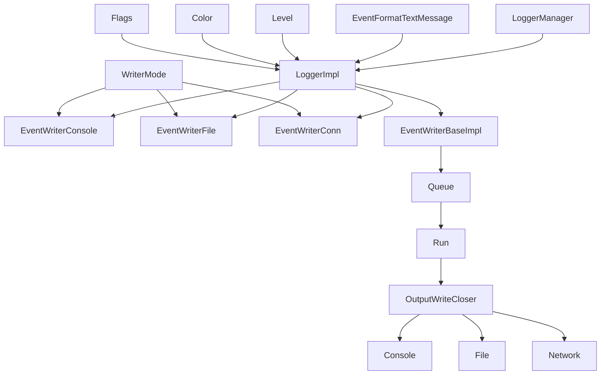
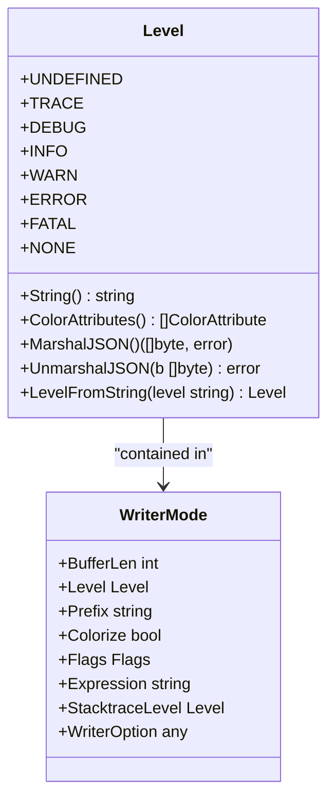
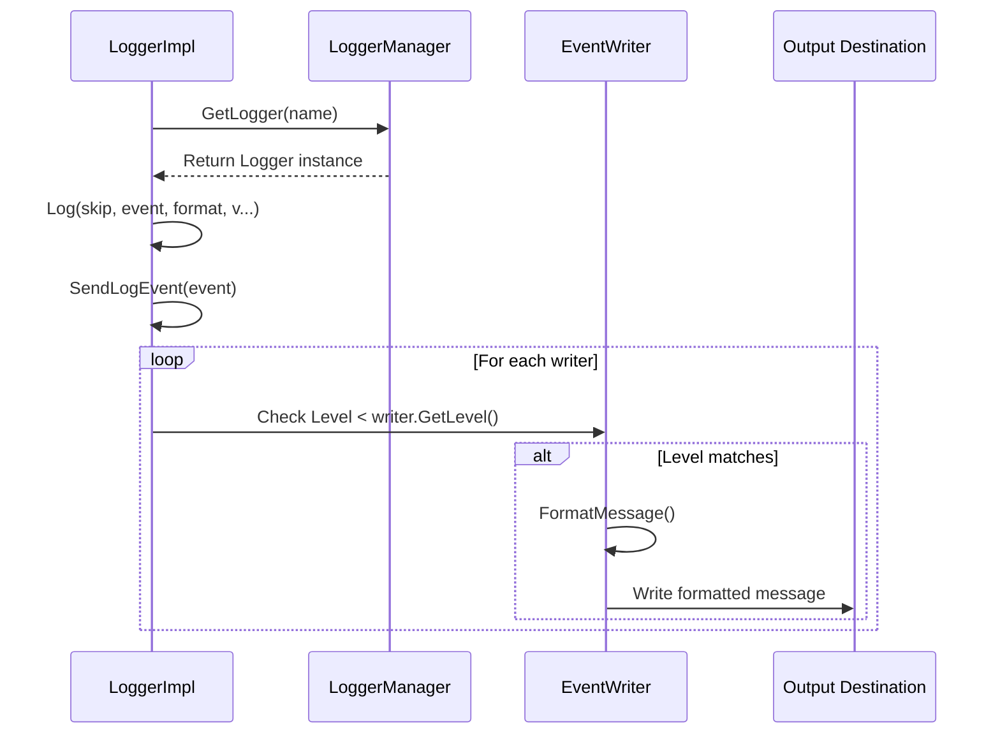
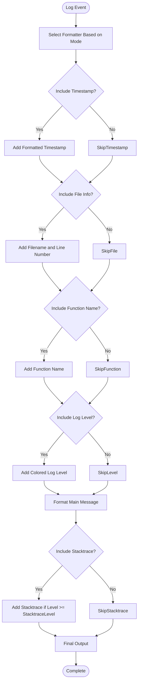
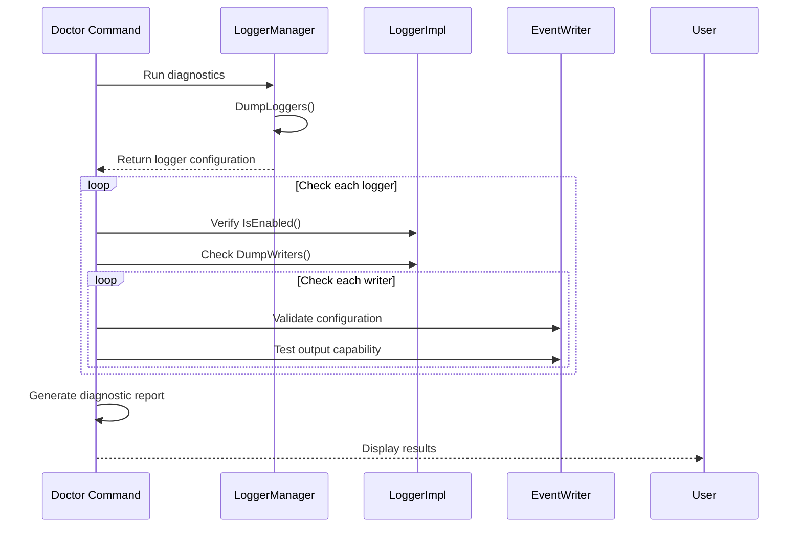
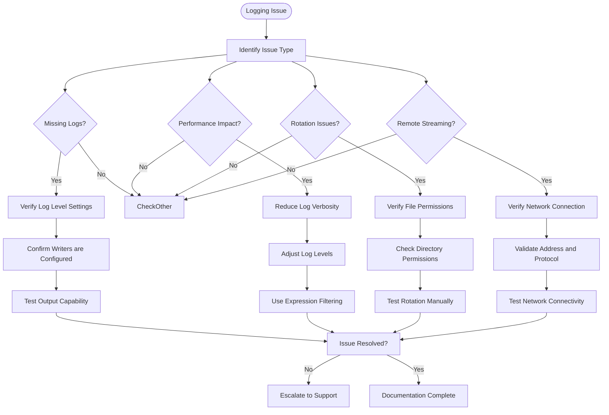

# Log Analysis

<cite>
**Referenced Files in This Document**   
- [logger.go](file://modules/log/logger.go)
- [manager.go](file://modules/log/manager.go)
- [level.go](file://modules/log/level.go)
- [event_writer.go](file://modules/log/event_writer.go)
- [event_writer_console.go](file://modules/log/event_writer_console.go)
- [event_writer_file.go](file://modules/log/event_writer_file.go)
- [event_writer_conn.go](file://modules/log/event_writer_conn.go)
- [event_writer_base.go](file://modules/log/event_writer_base.go)
- [event_format.go](file://modules/log/event_format.go)
- [color.go](file://modules/log/color.go)
- [init.go](file://modules/log/init.go)
</cite>

## Table of Contents
1. [Introduction](#introduction)
2. [Core Components](#core-components)
3. [Logging Architecture Overview](#logging-architecture-overview)
4. [Log Levels and Configuration](#log-levels-and-configuration)
5. [Output Destinations and Routing](#output-destinations-and-routing)
6. [Structured Logging and Formatting](#structured-logging-and-formatting)
7. [Logging and System Diagnostics](#logging-and-system-diagnostics)
8. [Common Logging Issues and Troubleshooting](#common-logging-issues-and-troubleshooting)
9. [Conclusion](#conclusion)

## Introduction
This document provides a comprehensive analysis of Gitea's logging system, focusing on the implementation within the `modules/log` package. The logging framework is designed to provide flexible, efficient, and structured logging capabilities for both development and production environments. The system supports multiple log levels, various output destinations (console, file, network), and advanced features like log filtering and structured formatting. This documentation explains the core components, configuration options, and integration with system diagnostics, particularly the doctor command for issue detection.

## Core Components

The Gitea logging system is built around several key components that work together to provide a robust logging solution. The primary components include the Logger interface, EventWriter implementations, and the LoggerManager for centralized management. The Logger interface defines the basic logging functions and level-specific methods, while EventWriters handle the actual output to various destinations. The LoggerManager coordinates multiple loggers and shared writers, ensuring efficient resource utilization and consistent behavior across the application.

**Section sources**
- [logger.go](file://modules/log/logger.go#L1-L50)
- [manager.go](file://modules/log/manager.go#L1-L142)
- [event_writer.go](file://modules/log/event_writer.go#L1-L54)

## Logging Architecture Overview

**Diagram sources**
- [logger.go](file://modules/log/logger.go#L1-L50)
- [manager.go](file://modules/log/manager.go#L1-L142)
- [event_writer_base.go](file://modules/log/event_writer_base.go#L1-L169)

## Log Levels and Configuration

Gitea's logging system implements a comprehensive set of log levels that follow standard conventions while providing additional flexibility for debugging and production environments. The available levels include TRACE, DEBUG, INFO, WARN, ERROR, FATAL, and NONE, with TRACE being the most verbose and NONE disabling all logging. Each level serves a specific purpose in the logging hierarchy, allowing administrators to control the verbosity of log output based on their needs.

The log level configuration is managed through the WriterMode structure, which contains the Level field to specify the minimum level that should be logged. This configuration can be set independently for each writer, allowing different destinations to have different verbosity levels. For example, console output might be set to INFO level while file logging captures DEBUG level messages for later analysis.

**Diagram sources**
- [level.go](file://modules/log/level.go#L1-L116)
- [event_writer.go](file://modules/log/event_writer.go#L1-L54)

**Section sources**
- [level.go](file://modules/log/level.go#L1-L116)
- [event_writer.go](file://modules/log/event_writer.go#L1-L54)

## Output Destinations and Routing

The Gitea logging system supports multiple output destinations through specialized EventWriter implementations. Each writer type handles routing logs to a specific destination while maintaining a consistent interface. The primary output destinations include console, file, and network streams, each with its own configuration options and performance characteristics.

Console output is handled by the eventWriterConsole implementation, which can direct logs to either stdout or stderr based on configuration. File output is managed by eventWriterFile, which supports advanced features like log rotation, daily rotation, and compression. Network output is provided by eventWriterConn, enabling remote log streaming to syslog servers or other network-based logging systems.

**Diagram sources**
- [event_writer_console.go](file://modules/log/event_writer_console.go#L1-L35)
- [event_writer_file.go](file://modules/log/event_writer_file.go#L1-L54)
- [event_writer_conn.go](file://modules/log/event_writer_conn.go#L1-L111)

**Section sources**
- [event_writer_console.go](file://modules/log/event_writer_console.go#L1-L35)
- [event_writer_file.go](file://modules/log/event_writer_file.go#L1-L54)
- [event_writer_conn.go](file://modules/log/event_writer_conn.go#L1-L111)

## Structured Logging and Formatting

Gitea's logging system provides sophisticated formatting capabilities through the EventFormatTextMessage function and related components. The formatting system supports various output styles and metadata inclusion based on configuration flags. These flags control the inclusion of timestamps, file information, function names, and log levels in the output.

The formatting process begins with the Event structure, which contains all relevant log information including timestamp, caller details, log level, and message content. This event is then processed by the formatter according to the WriterMode configuration, resulting in a properly formatted output string. The system also supports colored output for console destinations, enhancing readability during development and debugging.

**Diagram sources**
- [event_format.go](file://modules/log/event_format.go#L1-L255)
- [color.go](file://modules/log/color.go#L1-L121)
- [event_writer_base.go](file://modules/log/event_writer_base.go#L1-L169)

**Section sources**
- [event_format.go](file://modules/log/event_format.go#L1-L255)
- [color.go](file://modules/log/color.go#L1-L121)

## Logging and System Diagnostics

The logging system plays a crucial role in Gitea's diagnostic capabilities, particularly through integration with the doctor command. The LoggerManager provides diagnostic functions like DumpLoggers that return comprehensive information about all active loggers and their configurations. This information is essential for troubleshooting logging issues and verifying that the logging system is configured correctly.

The doctor command leverages the logging system to detect and report various issues, including missing log files, incorrect permissions, and configuration problems. By analyzing the logger state and output destinations, the doctor command can identify potential problems before they impact system operation. The logging system also provides fallback mechanisms to ensure that critical error messages are not lost even when primary logging destinations fail.

**Diagram sources**
- [manager.go](file://modules/log/manager.go#L1-L142)
- [logger_impl.go](file://modules/log/logger_impl.go#L1-L249)

**Section sources**
- [manager.go](file://modules/log/manager.go#L1-L142)
- [logger_impl.go](file://modules/log/logger_impl.go#L1-L249)

## Common Logging Issues and Troubleshooting

Several common issues can arise with Gitea's logging system, particularly related to configuration, file permissions, and performance. Missing logs are often caused by incorrect log level settings or misconfigured output destinations. When logs are not appearing as expected, administrators should first verify the log level configuration and ensure that the appropriate writers are enabled.

Log rotation issues typically stem from file permission problems or disk space constraints. The rotatingfilewriter package handles log rotation, but requires appropriate permissions to create and modify log files. Performance impact from verbose logging can be mitigated by adjusting log levels and using expression-based filtering to limit the volume of logged messages.

**Diagram sources**
- [event_writer_file.go](file://modules/log/event_writer_file.go#L1-L54)
- [event_writer_conn.go](file://modules/log/event_writer_conn.go#L1-L111)
- [logger_impl.go](file://modules/log/logger_impl.go#L1-L249)

**Section sources**
- [event_writer_file.go](file://modules/log/event_writer_file.go#L1-L54)
- [event_writer_conn.go](file://modules/log/event_writer_conn.go#L1-L111)
- [logger_impl.go](file://modules/log/logger_impl.go#L1-L249)

## Conclusion
Gitea's logging system provides a comprehensive and flexible solution for application logging and diagnostics. The modular architecture with pluggable writers allows for diverse output destinations while maintaining consistent behavior. The system's support for multiple log levels, structured formatting, and advanced features like expression filtering makes it suitable for both development and production environments. Integration with the doctor command enhances system reliability by enabling proactive issue detection and resolution. Proper configuration and understanding of the logging system are essential for maintaining a healthy and observable Gitea installation.