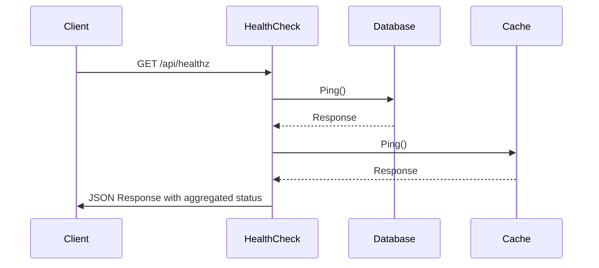
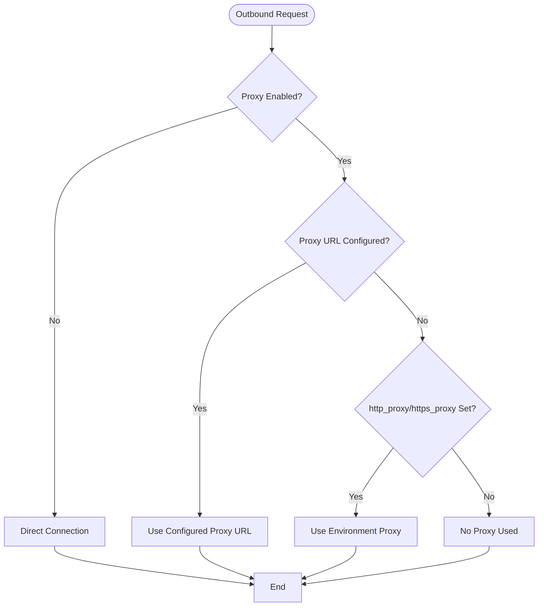
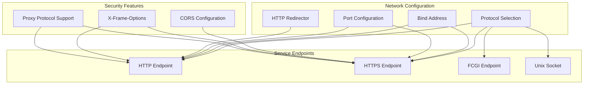

# Network and Connectivity

<cite>
**Referenced Files in This Document**   
- [check.go](file://routers/web/healthcheck/check.go)
- [proxy.go](file://modules/proxy/proxy.go)
- [web.go](file://cmd/web.go)
- [cors.go](file://modules/setting/cors.go)
- [camo.go](file://modules/setting/camo.go)
</cite>

## Table of Contents
1. [Introduction](#introduction)
2. [Health Check Implementation](#health-check-implementation)
3. [Proxy Handling Architecture](#proxy-handling-architecture)
4. [Network Configuration and Service Accessibility](#network-configuration-and-service-accessibility)
5. [Common Connectivity Issues](#common-connectivity-issues)
6. [Troubleshooting Guide](#troubleshooting-guide)
7. [Conclusion](#conclusion)

## Introduction
This document provides comprehensive coverage of network connectivity features in Gitea, focusing on health checks, proxy handling, and protocol support. It explains how Gitea verifies system health through endpoint availability testing, manages outbound HTTP/HTTPS connections via proxy configuration, and ensures service accessibility through proper network configuration. The documentation includes analysis of key implementation files and provides guidance for diagnosing and resolving common connectivity problems.

## Health Check Implementation

Gitea implements a standardized health check system that follows IETF draft guidelines for API health checks. The implementation provides detailed status reporting for critical system components including database and cache services. Health checks are exposed through a dedicated API endpoint that returns structured JSON responses with comprehensive diagnostic information.

The health check system evaluates multiple components and aggregates their status to determine overall service health. Each component check returns detailed information including status, timestamp, and optional output messages. The system uses standardized status values ("pass", "fail", "warn") that map to appropriate HTTP response codes, ensuring compatibility with monitoring systems and service meshes.

**Diagram sources**
- [check.go](file://routers/web/healthcheck/check.go#L40-L138)

**Section sources**
- [check.go](file://routers/web/healthcheck/check.go#L40-L138)

## Proxy Handling Architecture

Gitea's proxy system provides flexible configuration for outbound HTTP/HTTPS connections, supporting both direct configuration and environment variable integration. The architecture allows selective proxying based on host patterns using glob-style matching, enabling fine-grained control over which external services are accessed through the proxy.

The proxy implementation follows a layered approach with multiple fallback mechanisms. When proxying is enabled, Gitea first checks for explicit proxy URL configuration, then falls back to standard environment variables (http_proxy, https_proxy). The system supports both static configuration and dynamic environment-based proxy selection, ensuring compatibility with various deployment scenarios.

**Diagram sources**
- [proxy.go](file://modules/proxy/proxy.go#L20-L97)

**Section sources**
- [proxy.go](file://modules/proxy/proxy.go#L20-L97)

## Network Configuration and Service Accessibility

Gitea's network configuration system integrates multiple components to ensure proper service accessibility across different deployment scenarios. The configuration supports various protocols (HTTP, HTTPS, FCGI, Unix sockets) and includes features for port redirection, CORS handling, and secure communication.

The system provides comprehensive control over network interfaces, allowing configuration of bind addresses, port numbers, and URL routing. It supports reverse proxy scenarios through proper handling of forwarded headers and protocol bridging. The configuration also includes security features such as frame options protection and cross-origin resource sharing controls.

**Diagram sources**
- [web.go](file://cmd/web.go#L300-L379)
- [cors.go](file://modules/setting/cors.go#L10-L30)

**Section sources**
- [web.go](file://cmd/web.go#L300-L379)
- [cors.go](file://modules/setting/cors.go#L10-L30)

## Common Connectivity Issues

### Reverse Proxy Misconfiguration
Reverse proxy issues commonly occur when headers are not properly forwarded or when protocol mismatches exist between the proxy and Gitea. Key configuration requirements include proper forwarding of Host, X-Forwarded-For, X-Forwarded-Proto, and X-Forwarded-Port headers. Failure to configure these headers correctly can result in incorrect URL generation and redirect loops.

### SSL/TLS Handshake Failures
SSL/TLS issues typically stem from certificate validation problems, protocol version mismatches, or cipher suite incompatibilities. Common causes include expired certificates, self-signed certificates without proper trust configuration, and outdated TLS versions. The system requires proper certificate chain validation and supports modern TLS configurations for secure communication.

### Firewall Restrictions
Firewall issues can prevent both inbound and outbound connectivity. Inbound restrictions may block access to Gitea's listening ports, while outbound restrictions can prevent Gitea from accessing external services such as SMTP servers, OAuth providers, or webhook endpoints. Proper firewall configuration must account for both HTTP/HTTPS traffic and any additional ports used by integrated services.

### Connection Timeouts
Timeout issues often occur in high-latency environments or when backend services are overloaded. Gitea's health checks and proxy system include timeout handling, but network infrastructure must also be configured with appropriate timeout values to prevent premature connection termination. Load balancer timeout settings should align with Gitea's internal timeout configurations.

## Troubleshooting Guide

### Diagnosing Connection Timeouts
When experiencing connection timeouts, first verify network connectivity between client and server using basic tools like ping and telnet. Check firewall rules and security group configurations to ensure required ports are open. Review Gitea's log files for timeout-related error messages and verify that the server is not overloaded. For reverse proxy scenarios, ensure timeout settings are consistent across all components in the request chain.

### Resolving Certificate Validation Errors
For certificate validation issues, verify the certificate chain is complete and valid. Check certificate expiration dates and ensure the certificate matches the domain name being accessed. For self-signed certificates, ensure they are properly trusted by the client system. In development environments, temporary bypass options may be available, but should never be used in production.

### Load Balancer Integration Problems
When integrating with load balancers, ensure health check endpoints are properly configured and accessible. Verify that session persistence requirements are met, especially for authenticated sessions. Check that all nodes in the cluster have consistent configuration and that shared resources (database, storage) are properly accessible from all instances. Monitor load balancer logs for failed health checks or connection resets.

### Proxy Configuration Verification
To verify proxy configuration, test outbound connectivity from the Gitea server using command-line tools. Check that the proxy URL is correctly configured in both Gitea settings and environment variables. Verify that host patterns in the proxy configuration match the intended targets. Test connectivity to external services both with and without proxy settings to isolate configuration issues.

**Section sources**
- [proxy.go](file://modules/proxy/proxy.go#L20-L97)
- [check.go](file://routers/web/healthcheck/check.go#L40-L138)
- [web.go](file://cmd/web.go#L300-L379)

## Conclusion
Gitea provides a comprehensive network connectivity framework that supports various deployment scenarios while maintaining security and reliability. The health check system enables proactive monitoring of critical components, while the proxy architecture allows flexible integration with external networks. Proper configuration of network settings is essential for ensuring service accessibility and performance. By understanding the implementation details and common issues, administrators can effectively deploy and maintain Gitea in complex network environments.