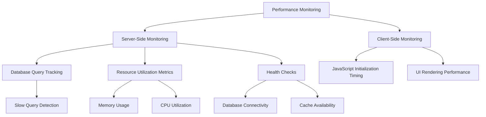
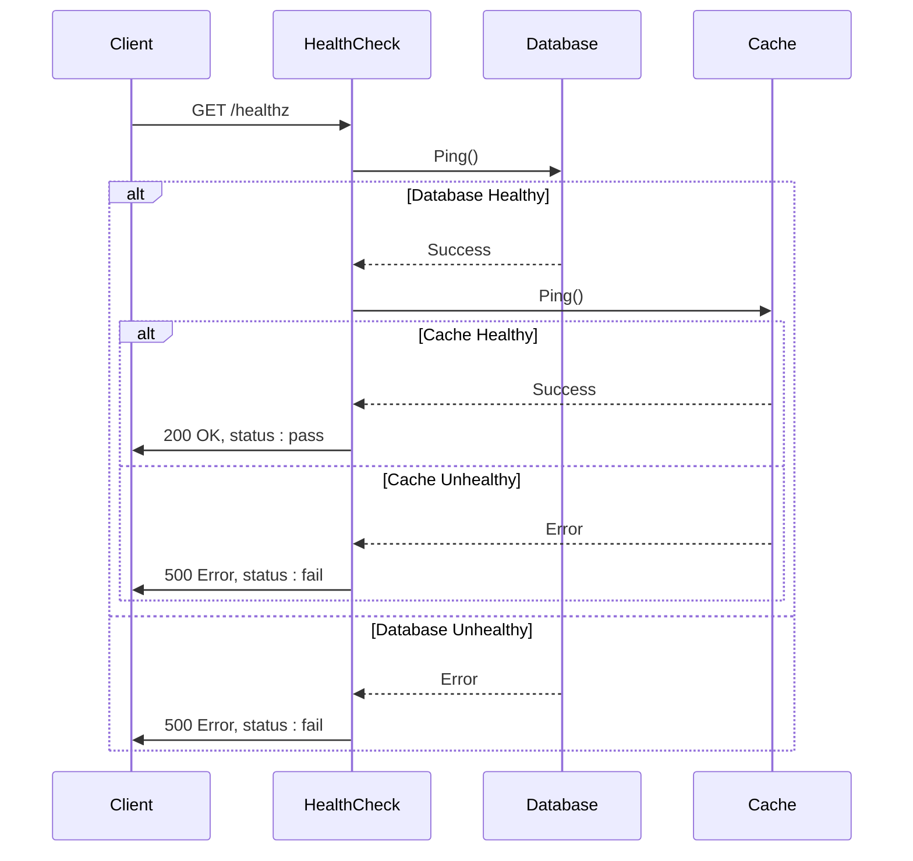

# Performance Issues

<cite>
**Referenced Files in This Document**   
- [check.go](file://routers/web/healthcheck/check.go)
- [engine_hook.go](file://models/db/engine_hook.go)
- [setting.go](file://modules/setting/setting.go)
- [database.go](file://modules/setting/database.go)
- [log.go](file://modules/setting/log.go)
- [init.ts](file://web_src/js/modules/init.ts)
</cite>

## Table of Contents
1. [Introduction](#introduction)
2. [Performance Monitoring Capabilities](#performance-monitoring-capabilities)
3. [Health Check Implementation](#health-check-implementation)
4. [Diagnostic Services for Performance Issues](#diagnostic-services-for-performance-issues)
5. [Logging Verbosity and Performance Impact](#logging-verbosity-and-performance-impact)
6. [Common Performance Bottlenecks](#common-performance-bottlenecks)
7. [Troubleshooting Guidance](#troubleshooting-guidance)
8. [Conclusion](#conclusion)

## Introduction
This document provides comprehensive guidance on diagnosing and resolving performance issues in Gitea. It covers the system's performance monitoring capabilities, health check implementations, diagnostic services, and common performance bottlenecks. The documentation focuses on practical troubleshooting techniques for identifying slow database queries, high memory usage, and inefficient repository operations, while also addressing the relationship between logging verbosity and system performance.

## Performance Monitoring Capabilities
Gitea implements comprehensive performance monitoring through multiple integrated systems that track response time, database query performance, and resource utilization metrics. The system leverages both server-side and client-side performance tracking mechanisms to provide holistic insights into application performance.

The database performance monitoring is implemented through the EngineHook system in the models/db package, which intercepts database operations and logs queries that exceed configurable threshold durations. This hook captures execution time, SQL statements, and query parameters, enabling administrators to identify slow database queries that may be impacting overall system performance.

Client-side performance monitoring is implemented through the InitPerformanceTracer class in the web interface, which measures the execution time of JavaScript initialization functions. This client-side tracing can be activated by adding `_ui_performance_trace=1` to the URL query parameters, providing detailed timing information for frontend initialization processes.

Resource utilization metrics are collected through the system's logging infrastructure, which can be configured to capture various performance-related data points. The system also includes built-in health checks that monitor database connectivity, cache availability, and other critical system components.

**Diagram sources**
- [engine_hook.go](file://models/db/engine_hook.go#L0-L46)
- [init.ts](file://web_src/js/modules/init.ts#L0-L25)
- [check.go](file://routers/web/healthcheck/check.go#L0-L139)

**Section sources**
- [engine_hook.go](file://models/db/engine_hook.go#L0-L46)
- [init.ts](file://web_src/js/modules/init.ts#L0-L25)
- [setting.go](file://modules/setting/setting.go#L0-L243)

## Health Check Implementation
The health check functionality in Gitea is implemented in the routers/web/healthcheck/check.go file, providing a standardized endpoint for monitoring system health and detecting performance degradation. The health check system follows the IETF draft for API health checks, using standardized status codes and response formats.

The health check handler performs validation of critical system components, including database connectivity and cache availability. Each component check returns a status of "pass", "fail", or "warn" along with a timestamp and optional output message. The overall health status is determined by the status of individual components, with a "fail" status taking precedence over "pass" or "warn" statuses.

Database health checks verify connectivity to the database server and, for SQLite databases, confirm the existence of the database file. Cache health checks validate connectivity to the configured cache backend. These checks are only performed when the installation is locked, ensuring they are only available in production environments.

The health check endpoint returns a JSON response containing the overall status, a description, and detailed results for each component check. The HTTP response code is determined by the overall status, with 2xx-3xx codes for "pass" and "warn" statuses, and 4xx-5xx codes for "fail" status.

**Diagram sources**
- [check.go](file://routers/web/healthcheck/check.go#L0-L139)

**Section sources**
- [check.go](file://routers/web/healthcheck/check.go#L0-L139)

## Diagnostic Services for Performance Issues
Gitea provides several diagnostic services to identify and resolve performance issues, focusing on slow database queries, high memory usage, and inefficient repository operations. These diagnostic capabilities are integrated into the system's core components and can be configured through the application settings.

The database diagnostic system is implemented through the EngineHook in models/db/engine_hook.go, which monitors all database queries and logs those that exceed the configured slow query threshold. This threshold is configurable through the SLOW_QUERY_THRESHOLD setting in the database configuration, with a default value of 5 seconds. When a query exceeds this threshold, it is logged with a warning level, including the SQL statement and execution time.

Memory usage monitoring is integrated into the system's logging infrastructure, with configurable log levels that can help identify memory-intensive operations. The system also includes resource index management that helps prevent database contention during high-concurrency operations.

Repository operation diagnostics are available through the web interface's performance tracing capabilities. The InitPerformanceTracer class in web_src/js/modules/init.ts provides detailed timing information for JavaScript initialization functions, helping identify slow frontend operations. This client-side performance tracing can be activated by adding `_ui_performance_trace=1` to the URL query parameters.

The system also includes diagnostic capabilities for identifying unindexed database queries, large repository operations, and misconfigured caching. These diagnostics are accessible through the administrative interface and command-line tools, allowing administrators to proactively identify and resolve performance issues.

**Section sources**
- [engine_hook.go](file://models/db/engine_hook.go#L0-L46)
- [init.ts](file://web_src/js/modules/init.ts#L0-L25)
- [database.go](file://modules/setting/database.go#L0-L225)

## Logging Verbosity and Performance Impact
The relationship between logging verbosity and performance impact in Gitea is carefully managed through configurable log levels and output destinations. The system provides multiple logging categories with independent verbosity settings, allowing administrators to balance diagnostic information needs with performance considerations.

The logging system is configured through the [log] section of the app.ini configuration file, with separate settings for different log categories including default, access, router, and xorm (database) logging. Each category can have its own log level, output destination, and formatting options, enabling fine-grained control over logging verbosity.

Database query logging (xorm) has a significant performance impact when enabled at debug level, as it logs every SQL statement executed by the application. This can generate large volumes of log data and impact disk I/O performance. The system provides a configurable slow query threshold that allows administrators to log only queries that exceed a specified execution time, reducing the performance impact while still capturing potentially problematic queries.

Access logging records HTTP request details and can generate substantial log volume in high-traffic environments. The system allows administrators to disable access logging entirely or configure it to log only specific request types. Router logging provides detailed information about request routing and can be useful for debugging but should be used judiciously in production environments due to its performance impact.

The logging system supports multiple output destinations including console, file, and network connections, with configurable log rotation and compression to manage disk space usage. Buffering is used to minimize the performance impact of logging operations, with configurable buffer sizes to balance memory usage and log delivery latency.

**Section sources**
- [log.go](file://modules/setting/log.go#L0-L268)
- [database.go](file://modules/setting/database.go#L0-L225)
- [setting.go](file://modules/setting/setting.go#L0-L243)

## Common Performance Bottlenecks
Gitea systems commonly experience performance bottlenecks related to unindexed database queries, large repository operations, and misconfigured caching. Understanding and addressing these common issues is essential for maintaining optimal system performance.

Unindexed database queries are a frequent cause of performance degradation, particularly in installations with large numbers of repositories, users, or issues. The system's slow query detection mechanism helps identify these problematic queries by logging any database operation that exceeds the configured threshold. Common examples include queries on large tables without appropriate indexes, such as repository search operations or issue list retrieval in large organizations.

Large repository operations, including cloning, fetching, and pushing large repositories, can consume significant system resources and impact overall performance. These operations are particularly problematic when multiple large operations occur simultaneously, leading to disk I/O contention and increased memory usage. The system's resource index management helps mitigate some of these issues by preventing database contention during high-concurrency operations.

Misconfigured caching is another common performance bottleneck. When cache settings are not properly configured for the system's workload and available resources, it can lead to excessive database queries and increased response times. The system supports multiple cache backends including Redis and in-memory caching, with configurable expiration times and eviction policies.

Other common performance issues include inadequate database connection pooling settings, insufficient memory allocation for the application server, and suboptimal storage configuration for repository files and database files. Network latency can also impact performance, particularly for distributed installations or when using remote cache and database servers.

**Section sources**
- [engine_hook.go](file://models/db/engine_hook.go#L0-L46)
- [database.go](file://modules/setting/database.go#L0-L225)
- [setting.go](file://modules/setting/setting.go#L0-L243)

## Troubleshooting Guidance
Effective troubleshooting of performance issues in Gitea requires a systematic approach that combines monitoring, diagnostics, and optimization techniques. This section provides practical guidance for identifying and resolving common performance problems.

To identify slow API endpoints, enable router logging and analyze the access logs to identify endpoints with high response times. Use the health check endpoint to verify system component health and identify potential bottlenecks. For database-related performance issues, enable slow query logging with an appropriate threshold and analyze the logged queries to identify unindexed or inefficient queries.

Database performance optimization should focus on creating appropriate indexes for frequently queried fields, optimizing query patterns in the application code, and tuning database configuration parameters such as connection pooling and query cache size. Regular database maintenance tasks like vacuuming (for SQLite) or analyzing and reindexing (for PostgreSQL and MySQL) can also improve performance.

System resource tuning involves adjusting configuration settings to match the available hardware resources. This includes configuring appropriate memory limits for the application server, optimizing cache size and eviction policies, and ensuring adequate disk I/O performance for repository and database files. For high-traffic installations, consider using a dedicated cache server and optimizing database server configuration.

When troubleshooting performance issues, follow a systematic approach:
1. Monitor system metrics to identify the nature and scope of the performance problem
2. Use diagnostic tools to pinpoint the specific components or operations causing the issue
3. Implement targeted optimizations based on the identified bottlenecks
4. Verify the effectiveness of optimizations through continued monitoring
5. Document the findings and solutions for future reference

Regular performance monitoring and proactive optimization can prevent many performance issues before they impact users. Establish baseline performance metrics for your installation and monitor for deviations that may indicate emerging problems.

**Section sources**
- [engine_hook.go](file://models/db/engine_hook.go#L0-L46)
- [check.go](file://routers/web/healthcheck/check.go#L0-L139)
- [database.go](file://modules/setting/database.go#L0-L225)
- [log.go](file://modules/setting/log.go#L0-L268)

## Conclusion
Gitea provides comprehensive performance monitoring and diagnostic capabilities to help administrators identify and resolve performance issues. The system's health check implementation, database query monitoring, and client-side performance tracing provide valuable insights into system performance. By understanding common performance bottlenecks and following systematic troubleshooting procedures, administrators can maintain optimal system performance and provide a responsive user experience. Regular monitoring, proactive optimization, and careful configuration of logging and caching settings are essential for maintaining high-performance Gitea installations.