# Troubleshooting

<cite>
**Referenced Files in This Document**   
- [cmd/doctor.go](file://cmd/doctor.go)
- [modules/log/logger.go](file://modules/log/logger.go)
- [modules/log/manager.go](file://modules/log/manager.go)
- [modules/log/color_console.go](file://modules/log/color_console.go)
- [modules/log/event_writer_file.go](file://modules/log/event_writer_file.go)
- [services/doctor/doctor.go](file://services/doctor/doctor.go)
- [services/doctor/dbconsistency.go](file://services/doctor/dbconsistency.go)
- [services/doctor/dbversion.go](file://services/doctor/dbversion.go)
</cite>

## Table of Contents
1. [Introduction](#introduction)
2. [Diagnostic Tools Overview](#diagnostic-tools-overview)
3. [Logging System Implementation](#logging-system-implementation)
4. [Doctor Command Implementation](#doctor-command-implementation)
5. [Database Diagnostics](#database-diagnostics)
6. [Practical Diagnostic Procedures](#practical-diagnostic-procedures)
7. [Performance Considerations](#performance-considerations)
8. [Best Practices for Proactive Monitoring](#best-practices-for-proactive-monitoring)

## Introduction
This document provides comprehensive guidance on Gitea's troubleshooting capabilities, focusing on the diagnostic tools and logging system that help identify and resolve issues. It covers the implementation details of the logging framework in modules/log and the diagnostic commands in cmd/doctor.go, addressing common troubleshooting aspects including log analysis, performance issues, database problems, and network connectivity.

**Section sources**
- [cmd/doctor.go](file://cmd/doctor.go#L1-L215)
- [services/doctor/doctor.go](file://services/doctor/doctor.go#L1-L138)

## Diagnostic Tools Overview
Gitea provides a comprehensive diagnostic system through its "doctor" command, designed to identify and optionally fix various issues within the application. The diagnostic tools serve multiple purposes including database consistency checking, version verification, and system health assessment. These tools are particularly valuable for identifying orphaned records, database schema inconsistencies, and configuration issues that could lead to system instability.

The diagnostic system is extensible, allowing new checks to be registered and executed either individually or as part of a comprehensive diagnostic suite. Each diagnostic check follows a consistent pattern with a title, name, default status, execution function, and priority level. The system supports both manual and automated execution modes, with the ability to automatically fix identified issues when the --fix flag is provided.

**Diagram sources**
- [cmd/doctor.go](file://cmd/doctor.go#L1-L215)
- [services/doctor/doctor.go](file://services/doctor/doctor.go#L1-L138)

**Section sources**
- [cmd/doctor.go](file://cmd/doctor.go#L1-L215)
- [services/doctor/doctor.go](file://services/doctor/doctor.go#L1-L138)

## Logging System Implementation
The logging system in Gitea is implemented in the modules/log package and provides a flexible and extensible framework for capturing application events. The system is built around several key components: Logger, EventWriter, and LoggerManager, which work together to provide comprehensive logging capabilities.

The Logger interface provides the basic logging functions (Trace, Debug, Info, Warn, Error, Critical) and level-based logging control. Each logger can have multiple EventWriters attached, which are responsible for writing log events to various destinations such as console, files, or network endpoints. The LoggerManager serves as the central coordinator, managing all loggers and shared event writers across the application.

The logging system supports multiple output formats and destinations through different writer types. The color_console.go implementation provides colored output for terminal displays, while event_writer_file.go handles file-based logging with rotation and compression capabilities. The system also supports log level filtering, allowing different verbosity levels for different components.

**Diagram sources**
- [modules/log/logger.go](file://modules/log/logger.go#L1-L51)
- [modules/log/manager.go](file://modules/log/manager.go#L1-L143)
- [modules/log/event_writer_file.go](file://modules/log/event_writer_file.go#L1-L55)

**Section sources**
- [modules/log/logger.go](file://modules/log/logger.go#L1-L51)
- [modules/log/manager.go](file://modules/log/manager.go#L1-L143)
- [modules/log/color_console.go](file://modules/log/color_console.go#L1-L15)
- [modules/log/event_writer_file.go](file://modules/log/event_writer_file.go#L1-L55)

## Doctor Command Implementation
The doctor command is implemented in cmd/doctor.go and serves as the primary interface for Gitea's diagnostic capabilities. The command provides several sub-commands including "check" for general diagnostics, "recreate-table" for database table reconstruction, and "convert" for data format conversion.

The check sub-command is the most comprehensive diagnostic tool, supporting multiple execution modes: listing available checks, running default checks, running specific checks by name, or running all available checks. The command accepts various flags to control its behavior, including --fix to automatically fix identified issues, --log-file to specify a log output destination, and --color to enable colored output.

The doctor command initializes the logging system appropriately based on the provided flags, setting up console or file-based logging as needed. It also handles the redirection of the standard Go logger to Gitea's logging system, ensuring all log output is properly captured and formatted.

**Diagram sources**
- [cmd/doctor.go](file://cmd/doctor.go#L1-L215)
- [services/doctor/doctor.go](file://services/doctor/doctor.go#L1-L138)

**Section sources**
- [cmd/doctor.go](file://cmd/doctor.go#L1-L215)

## Database Diagnostics
Gitea's database diagnostic system includes several specialized checks for identifying and resolving database-related issues. The most comprehensive of these is the database consistency check, which examines the integrity of various database relationships and identifies orphaned records.

The database consistency check (implemented in services/doctor/dbconsistency.go) performs a thorough examination of the database, looking for records that reference non-existent parent records. This includes orphaned labels, issues, pull requests, releases, attachments, and various other entities. The check also verifies the integrity of foreign key relationships across multiple tables.

Another important diagnostic is the database version check (implemented in services/doctor/dbversion.go), which ensures that the database schema version matches the expected version for the current Gitea installation. This check is critical after upgrades, as it verifies that all database migrations have been successfully applied.

```mermaid
flowchart TD
DBStart([Database Diagnostics]) --> VersionCheck["Check Database Version"]
VersionCheck --> VersionMatch{"Version Matches?"}
VersionMatch --> |No| MigrationNeeded["Migration Required"]
MigrationNeeded --> AutoFix{"Auto-Fix Enabled?"}
AutoFix --> |Yes| RunMigration["Run Database Migration"]
AutoFix --> |No| ReportError["Report Version Mismatch"]
VersionMatch --> |Yes| ConsistencyCheck["Check Database Consistency"]
ConsistencyCheck --> FindOrphans["Identify Orphaned Records"]
FindOrphans --> OrphansFound{"Orphans Found?"}
OrphansFound --> |Yes| LogOrphans["Log Orphaned Records"]
LogOrphans --> AutoFix2{"Auto-Fix Enabled?"}
AutoFix2 --> |Yes| DeleteOrphans["Delete Orphaned Records"]
AutoFix2 --> |No| ReportOrphans["Report Orphaned Records"]
OrphansFound --> |No| NoIssues["No Orphaned Records Found"]
DeleteOrphans --> VerifyDeletion["Verify Deletion Success"]
VerifyDeletion --> LogResult["Log Result"]
ReportOrphans --> LogResult
NoIssues --> LogResult
LogResult --> Continue["Continue to Next Check"]
ReportError --> Continue
RunMigration --> MigrationSuccess{"Migration Successful?"}
MigrationSuccess --> |Yes| Continue
MigrationSuccess --> |No| Abort["Abort with Error"]
```

**Diagram sources**
- [services/doctor/dbconsistency.go](file://services/doctor/dbconsistency.go#L1-L275)
- [services/doctor/dbversion.go](file://services/doctor/dbversion.go#L1-L44)

**Section sources**
- [services/doctor/dbconsistency.go](file://services/doctor/dbconsistency.go#L1-L275)
- [services/doctor/dbversion.go](file://services/doctor/dbversion.go#L1-L44)

## Practical Diagnostic Procedures
Practical diagnostic procedures in Gitea involve a systematic approach to identifying and resolving issues using the available diagnostic tools. The most common procedure begins with running the default diagnostic checks using the "gitea doctor check" command, which executes a predefined set of essential checks.

For startup failures, the diagnostic process typically starts with checking the database version and consistency, as these are common causes of startup issues. If the database version is outdated, the system may fail to start until migrations are applied. Similarly, severe database inconsistencies can prevent proper initialization.

When investigating performance degradation, administrators should first examine the log files for any error patterns or warnings that might indicate underlying issues. The diagnostic tools can then be used to check for database inconsistencies that might be affecting query performance, such as orphaned records or missing indexes.

Network connectivity issues can be diagnosed by checking the system's ability to communicate with external services, though this specific aspect is not covered by the current diagnostic tools. However, database connectivity issues can be identified through the diagnostic checks that attempt to establish database connections.

**Diagram sources**
- [cmd/doctor.go](file://cmd/doctor.go#L1-L215)
- [services/doctor/doctor.go](file://services/doctor/doctor.go#L1-L138)
- [services/doctor/dbconsistency.go](file://services/doctor/dbconsistency.go#L1-L275)

**Section sources**
- [cmd/doctor.go](file://cmd/doctor.go#L1-L215)
- [services/doctor/doctor.go](file://services/doctor/doctor.go#L1-L138)
- [services/doctor/dbconsistency.go](file://services/doctor/dbconsistency.go#L1-L275)

## Performance Considerations
Diagnostic operations in Gitea can have significant performance implications, particularly when dealing with large databases or extensive file systems. The database consistency checks, in particular, can be resource-intensive as they involve numerous queries to identify orphaned records and verify referential integrity.

To minimize the impact on system performance, diagnostic operations should be scheduled during periods of low activity. The --fix flag should be used cautiously, as automatic fixes may involve large-scale database modifications that could affect system availability.

The logging system itself can impact performance when configured with high verbosity levels or when writing to slow storage devices. File-based logging with rotation and compression can introduce additional I/O overhead. Administrators should carefully balance the need for detailed logs with the performance impact of log generation and storage.

For large installations, it may be beneficial to run specific diagnostic checks rather than the full suite, focusing on areas most likely to contain issues based on the specific symptoms being experienced.

**Section sources**
- [cmd/doctor.go](file://cmd/doctor.go#L1-L215)
- [modules/log/manager.go](file://modules/log/manager.go#L1-L143)
- [services/doctor/dbconsistency.go](file://services/doctor/dbconsistency.go#L1-L275)

## Best Practices for Proactive Monitoring
Proactive monitoring of Gitea instances involves establishing regular diagnostic routines and implementing alerting mechanisms for potential issues. Regular execution of diagnostic checks, particularly the database consistency and version checks, can help identify and resolve issues before they impact system stability.

Log analysis should be performed regularly to identify patterns of errors or warnings that might indicate underlying problems. Automated log monitoring tools can be configured to alert administrators when specific error conditions are detected.

Backup procedures should be verified regularly, and database backups should be tested for integrity. This is particularly important before running diagnostic operations that may modify the database, such as those with the --fix flag enabled.

For production environments, it's recommended to establish a maintenance window during which diagnostic operations can be performed with minimal impact on users. During this window, comprehensive diagnostic checks can be run, and any necessary fixes applied.

**Section sources**
- [cmd/doctor.go](file://cmd/doctor.go#L1-L215)
- [services/doctor/doctor.go](file://services/doctor/doctor.go#L1-L138)
- [modules/log/logger.go](file://modules/log/logger.go#L1-L51)