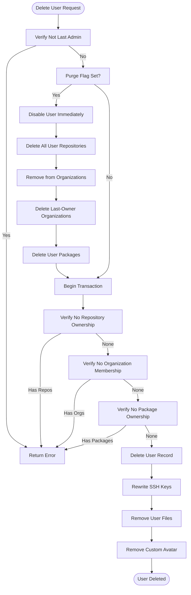
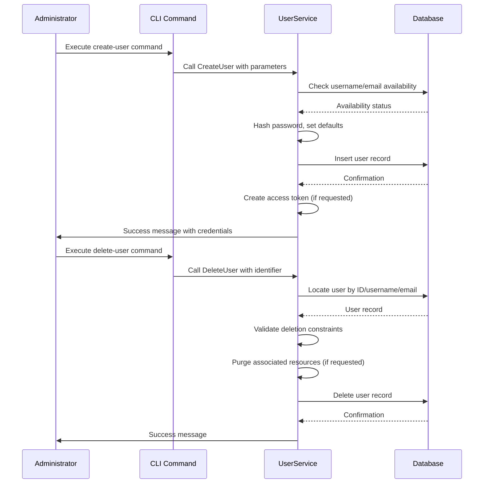

# User Account Lifecycle Management

<cite>
**Referenced Files in This Document**   
- [models/user/user.go](file://models/user/user.go)
- [services/user/user.go](file://services/user/user.go)
- [cmd/admin_user_create.go](file://cmd/admin_user_create.go)
- [cmd/admin_user_delete.go](file://cmd/admin_user_delete.go)
- [routers/web/user/profile.go](file://routers/web/user/profile.go)
- [routers/web/auth/auth.go](file://routers/web/auth/auth.go)
</cite>

## Table of Contents
1. [Introduction](#introduction)
2. [User Registration Process](#user-registration-process)
3. [Account Activation and Email Verification](#account-activation-and-email-verification)
4. [User Suspension and Deactivation](#user-suspension-and-deactivation)
5. [Account Deletion and Data Retention](#account-deletion-and-data-retention)
6. [Administrator Management of User Accounts](#administrator-management-of-user-accounts)
7. [Common Issues and Troubleshooting](#common-issues-and-troubleshooting)
8. [Performance Considerations for Bulk Operations](#performance-considerations-for-bulk-operations)
9. [Conclusion](#conclusion)

## Introduction
This document provides a comprehensive analysis of the user account lifecycle management system in Gitea, focusing on the implementation details across key components. The user account lifecycle encompasses registration, activation, suspension, and deletion processes, with special attention to administrator privileges and data retention policies. The core implementation resides in `models/user/user.go` for data structures and business logic, while `services/user/user.go` handles service-level operations. Administrative functions are accessible through CLI commands in `cmd/admin_user_*.go` and web interface endpoints in `routers/web/user`. This documentation examines the complete workflow from account creation to deletion, including edge cases, security considerations, and performance implications.

## User Registration Process
The user registration process in Gitea is implemented through a combination of model-level validation and service orchestration. The `User` struct in `models/user/user.go` defines the core attributes including authentication credentials, personal information, and account preferences. During registration, the system validates username usability through `IsUsableUsername` which checks against reserved names and patterns, and ensures email validity through `ValidateEmail`. The `CreateUser` function orchestrates the creation process, setting default values for visibility, repository creation limits, and notification preferences based on system configuration. Passwords are securely hashed using the algorithm specified in `setting.PasswordHashAlgo` with a randomly generated salt. The registration process also captures metadata such as the initial IP address and user agent for security purposes when `setting.RecordUserSignupMetadata` is enabled. For administrator-created users, the `AdminCreateUser` function provides additional flexibility in setting account properties.

**Section sources**
- [models/user/user.go](file://models/user/user.go#L15-L800)
- [services/user/user.go](file://services/user/user.go#L1-L300)

## Account Activation and Email Verification
Account activation in Gitea follows a security-conscious workflow designed to verify user ownership of their email address. After registration, users are created with `IsActive` set to false when email confirmation is required by system settings. The activation process is triggered through a time-limited code generated by `GenerateUserTimeLimitCode` with the purpose `TimeLimitCodeActivateAccount`. Users can access the activation page where they have the option to verify their password and potentially change their email address before activation. The `handleAccountActivation` function in the authentication router finalizes the process by setting `IsActive` to true, generating a new random salt (`Rands`), and activating the primary email address through `ActivateUserEmail`. The system allows users to change their email during activation, which updates the user record and sends a new confirmation email. This process ensures that only users with access to the specified email can fully activate their accounts, preventing unauthorized account creation.

**Section sources**
- [routers/web/auth/auth.go](file://routers/web/auth/auth.go#L735-L813)
- [models/user/user.go](file://models/user/user.go#L15-L800)

## User Suspension and Deactivation
User suspension and deactivation in Gitea are implemented through a combination of status flags and access controls. The system uses several boolean fields in the `User` struct to manage account status: `IsActive` controls general access to the platform, `ProhibitLogin` specifically prevents authentication while potentially allowing Git operations, and `IsRestricted` limits visibility to only explicitly granted repositories. Administrators can suspend accounts through the web interface or CLI, which typically sets `IsActive` to false and `ProhibitLogin` to true. The `MustChangePassword` flag can force users to update their credentials on next login, serving as a security measure. When a user is suspended, their sessions are terminated through the event source manager, ensuring immediate access revocation. The system prevents deletion of the last administrative user through `IsLastAdminUser` validation, maintaining system security. Suspended users retain their data and repository ownership, but cannot authenticate or perform actions within the system.

**Section sources**
- [models/user/user.go](file://models/user/user.go#L15-L800)
- [services/user/user.go](file://services/user/user.go#L1-L300)

## Account Deletion and Data Retention
Account deletion in Gitea follows a comprehensive process that addresses both user data and associated resources. The `DeleteUser` function in `services/user/user.go` implements a two-phase approach: first purging associated resources when the `purge` flag is set, then removing the user record itself. When purging, the system disables the user immediately by clearing credentials and setting restrictive flags, then proceeds to delete all repositories owned by the user through `DeleteOwnerRepositoriesDirectly`. Organization memberships are removed, with last-owner organizations being deleted entirely. Packages are removed if package management is enabled. The final phase occurs within a transaction that verifies the user no longer owns repositories, belongs to organizations, or owns packages before deleting the user record. User data files are removed from the filesystem, and custom avatars are deleted from storage. Repository ownership transfers to the "ghost" user, preserving commit history and issue tracking while indicating the original author has been deleted. This approach ensures data integrity while respecting privacy requirements.

**Diagram sources **
- [services/user/user.go](file://services/user/user.go#L128-L297)
- [models/user/user.go](file://models/user/user.go#L15-L800)

**Section sources**
- [services/user/user.go](file://services/user/user.go#L1-L300)
- [models/user/user.go](file://models/user/user.go#L15-L800)

## Administrator Management of User Accounts
Administrators manage user accounts in Gitea through both command-line interface (CLI) commands and the web interface. The CLI provides `admin-user-create` and `admin-user-delete` commands that offer programmatic access to user management functions. The `runCreateUser` function processes creation parameters including username, email, password options (explicit or random generation), administrative status, and access token generation. It validates inputs and creates users with specified properties, optionally generating access tokens with defined scopes. The `runDeleteUser` function handles user deletion by locating users via ID, username, or email, with an option to purge all associated data. Through the web interface, administrators access user management via the admin panel, where they can view, edit, suspend, or delete accounts. The system ensures consistency between CLI and web operations by using the same underlying service functions. Administrator actions are subject to validation, such as preventing deletion of the last admin user, and generate appropriate audit trails through system notices.

**Diagram sources **
- [cmd/admin_user_create.go](file://cmd/admin_user_create.go#L1-L242)
- [cmd/admin_user_delete.go](file://cmd/admin_user_delete.go#L1-L85)
- [services/user/user.go](file://services/user/user.go#L1-L300)

**Section sources**
- [cmd/admin_user_create.go](file://cmd/admin_user_create.go#L1-L242)
- [cmd/admin_user_delete.go](file://cmd/admin_user_delete.go#L1-L85)
- [services/user/user.go](file://services/user/user.go#L1-L300)

## Common Issues and Troubleshooting
Common issues in Gitea's user account lifecycle typically involve account recovery, email verification failures, and orphaned repositories. Account recovery is handled through the password reset functionality, which generates time-limited codes for verification. Users may encounter issues when the reset code doesn't match their current session, indicated by the `reset_password_wrong_user` error message. Email verification failures can occur due to expired codes, incorrect email addresses, or delivery issues, with the system preventing repeated email sends within a short timeframe to prevent abuse. Orphaned repositories may exist when users are deleted but repositories remain, though Gitea's deletion process specifically checks for repository ownership before allowing user deletion. The system includes a doctor command `delete-orphaned-repos` to identify and remove repositories belonging to non-existent users. Other common issues include username conflicts during registration, password complexity requirements, and activation email delivery problems, all of which are addressed through appropriate error messages and recovery workflows.

**Section sources**
- [routers/web/auth/auth.go](file://routers/web/auth/auth.go#L735-L813)
- [routers/web/auth/password.go](file://routers/web/auth/password.go#L131-L165)
- [services/doctor/repository.go](file://services/doctor/repository.go#L37-L77)

## Performance Considerations for Bulk Operations
Bulk user operations in Gitea require careful consideration of performance implications, particularly for deletion and inactivation processes. The `DeleteInactiveUsers` function processes users in batches to prevent memory exhaustion and database locks, iterating through inactive accounts and deleting them individually. Repository deletion occurs outside the main transaction to maintain consistency while allowing the operation to proceed even if some repositories are created during the process. The system rewrites SSH keys after user deletion, which can be resource-intensive with many users, suggesting that bulk operations should be scheduled during low-activity periods. Filesystem operations for removing user directories and avatars are performed synchronously, which may impact performance with large user data. For optimal performance, administrators should avoid simultaneous bulk operations and consider the impact on database connections and storage systems. The use of pagination in user listing operations helps mitigate performance issues when dealing with large user bases.

**Section sources**
- [services/user/user.go](file://services/user/user.go#L1-L300)
- [services/doctor/repository.go](file://services/doctor/repository.go#L37-L77)

## Conclusion
Gitea's user account lifecycle management system provides a comprehensive framework for handling user accounts from creation to deletion. The implementation balances security, data integrity, and usability through a well-structured architecture that separates concerns between models, services, and interface layers. Key strengths include the thorough deletion process that ensures data consistency, flexible administrator controls, and robust email verification workflows. The system's attention to edge cases, such as preventing deletion of the last administrator and handling orphaned resources, demonstrates careful design. For optimal use, administrators should understand the implications of the purge flag, the data retention policies for deleted users, and the performance characteristics of bulk operations. Future improvements could include more granular suspension options and enhanced audit logging for account management activities.