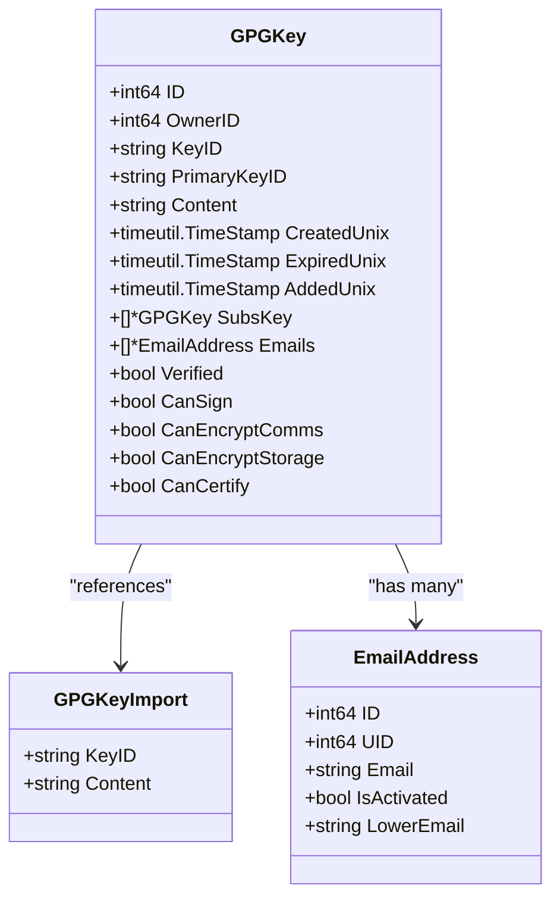
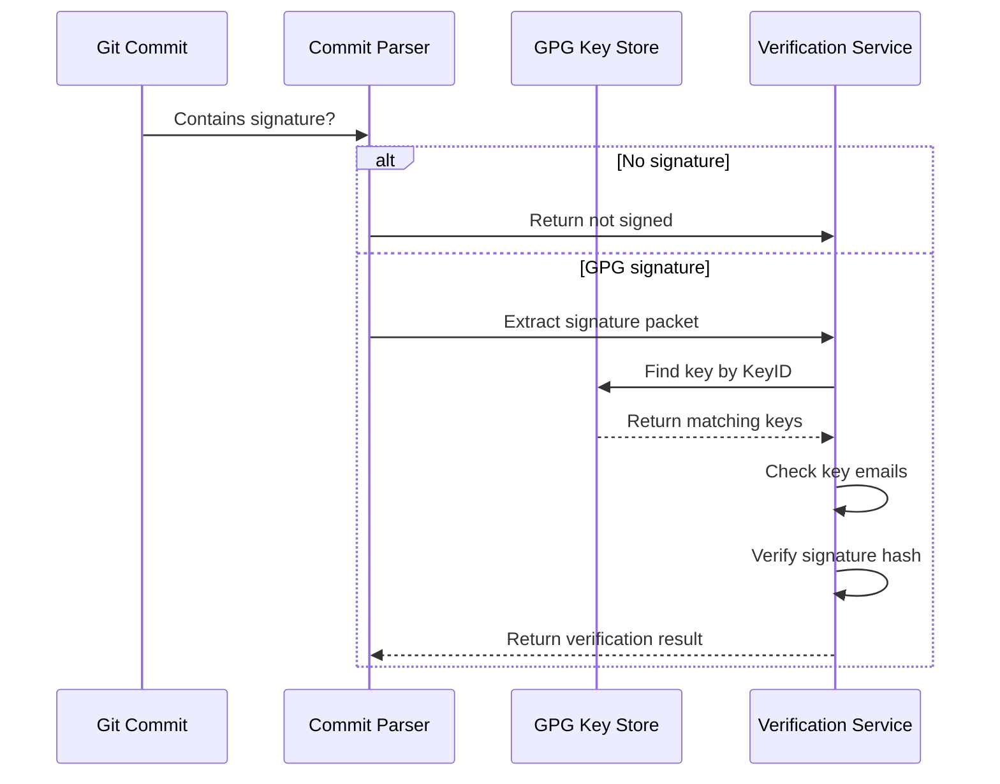
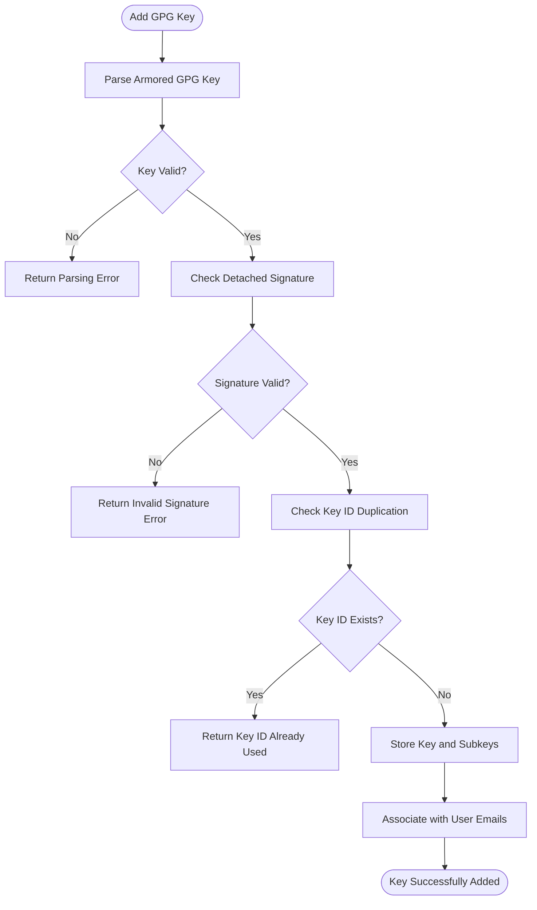
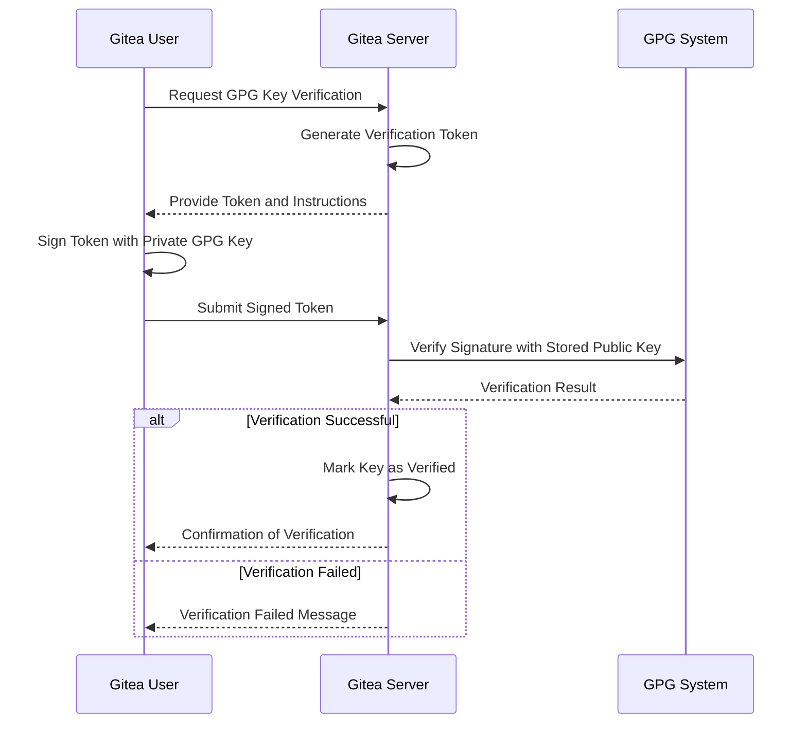
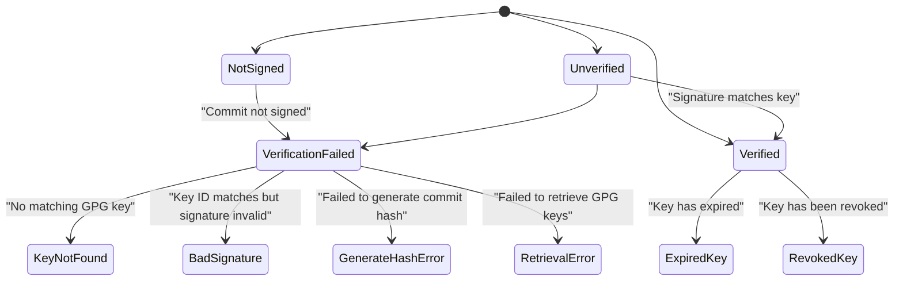
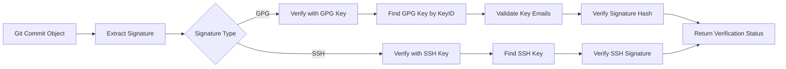
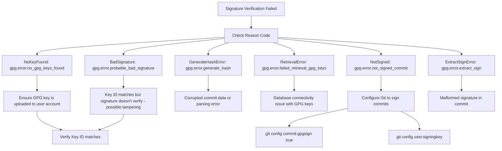

# GPG Key Authentication

<cite>
**Referenced Files in This Document**   
- [gpg_key.go](file://models/asymkey/gpg_key.go)
- [gpg_key_add.go](file://models/asymkey/gpg_key_add.go)
- [gpg_key_import.go](file://models/asymkey/gpg_key_import.go)
- [gpg_key_list.go](file://models/asymkey/gpg_key_list.go)
- [gpg_key_verify.go](file://models/asymkey/gpg_key_verify.go)
- [gpg_key_commit_verification.go](file://models/asymkey/gpg_key_commit_verification.go)
- [commit.go](file://services/asymkey/commit.go)
- [repo_gpg.go](file://modules/git/repo_gpg.go)
</cite>

## Table of Contents
1. [Introduction](#introduction)
2. [GPG Key Management](#gpg-key-management)
3. [Commit Verification Process](#commit-verification-process)
4. [GPG Key Import and Validation](#gpg-key-import-and-validation)
5. [Trust Establishment and Verification](#trust-establishment-and-verification)
6. [Instance-Wide Signing Configuration](#instance-wide-signing-configuration)
7. [Error Handling and Verification States](#error-handling-and-verification-states)
8. [Integration with Git GPG Functionality](#integration-with-git-gpg-functionality)
9. [Key Expiration and Revocation Handling](#key-expiration-and-revocation-handling)
10. [GPG Agent Configuration](#gpg-agent-configuration)
11. [Troubleshooting Signature Verification](#troubleshooting-signature-verification)

## Introduction
Gitea provides comprehensive GPG key authentication and commit verification functionality, allowing users to sign their commits with GPG keys and verify the authenticity of commits in repositories. This documentation details the complete workflow of GPG key management, commit signing, and verification within the Gitea system. The implementation supports both GPG and SSH signature verification, with mechanisms for key import, validation, trust establishment, and display of verification status in the web interface.

## GPG Key Management

Gitea manages GPG keys through a structured data model that stores key information in the database. The `GPGKey` struct represents a GPG key with essential properties including the key ID, owner ID, content, creation and expiration timestamps, and associated email addresses.



**Diagram sources**
- [gpg_key.go](file://models/asymkey/gpg_key.go#L15-L45)
- [gpg_key_import.go](file://models/asymkey/gpg_key_import.go#L15-L20)

**Section sources**
- [gpg_key.go](file://models/asymkey/gpg_key.go#L15-L243)

## Commit Verification Process

The commit verification process in Gitea involves extracting the signature from a Git commit and validating it against stored GPG keys. The system first checks if the commit contains a signature, then attempts to verify it using multiple potential key sources in a specific order of precedence.



**Diagram sources**
- [commit.go](file://services/asymkey/commit.go#L219-L289)
- [gpg_key_commit_verification.go](file://models/asymkey/gpg_key_commit_verification.go#L62-L99)

**Section sources**
- [commit.go](file://services/asymkey/commit.go#L219-L450)

## GPG Key Import and Validation

Gitea provides a robust mechanism for importing and validating GPG keys. When a user adds a GPG key, the system parses the armored key content, extracts the primary key and subkeys, and validates the key structure before storing it in the database.



**Diagram sources**
- [gpg_key_add.go](file://models/asymkey/gpg_key_add.go#L40-L161)
- [gpg_key.go](file://models/asymkey/gpg_key.go#L120-L200)

**Section sources**
- [gpg_key_add.go](file://models/asymkey/gpg_key_add.go#L40-L161)

## Trust Establishment and Verification

Gitea establishes trust for GPG keys through a verification process that requires users to sign a token with their private key. This process confirms that the user possesses the private key corresponding to the public key they are attempting to add to their account.



**Diagram sources**
- [gpg_key_verify.go](file://models/asymkey/gpg_key_verify.go#L15-L98)
- [gpg_key_commit_verification.go](file://models/asymkey/gpg_key_commit_verification.go#L32-L60)

**Section sources**
- [gpg_key_verify.go](file://models/asymkey/gpg_key_verify.go#L15-L98)

## Instance-Wide Signing Configuration

Gitea supports instance-wide GPG signing configuration, allowing administrators to set up default signing keys for repositories. This feature enables automatic signing of commits with a designated key when repository-specific signing is configured.

```mermaid
classDiagram
class GPGSettings {
+bool Sign
+string KeyID
+string Name
+string Email
+string Format
+string PublicKeyContent
}
class Repository {
+string Path
+*GPGSettings gpgSettings
}
Repository --> GPGSettings : "has default"
GPGSettings --> "os.ReadFile" : "loads SSH key"
GPGSettings --> "gpg -a --export" : "loads GPG key"
```

**Diagram sources**
- [repo_gpg.go](file://modules/git/repo_gpg.go#L40-L71)
- [commit.go](file://services/asymkey/commit.go#L406-L449)

**Section sources**
- [repo_gpg.go](file://modules/git/repo_gpg.go#L40-L71)

## Error Handling and Verification States

Gitea implements comprehensive error handling for GPG key operations and commit verification, providing specific error codes and messages for different failure scenarios. The system distinguishes between various verification states to provide meaningful feedback to users.



**Diagram sources**
- [gpg_key_commit_verification.go](file://models/asymkey/gpg_key_commit_verification.go#L32-L60)
- [commit.go](file://services/asymkey/commit.go#L249-L289)

**Section sources**
- [gpg_key_commit_verification.go](file://models/asymkey/gpg_key_commit_verification.go#L32-L60)

## Integration with Git GPG Functionality

Gitea integrates with Git's native GPG signing functionality by extracting signature information from commit objects and validating them against stored public keys. The system supports both OpenPGP and SSH signature formats, providing flexibility in signing methods.



**Diagram sources**
- [commit.go](file://services/asymkey/commit.go#L219-L252)
- [repo_gpg.go](file://modules/git/repo_gpg.go#L15-L39)

**Section sources**
- [commit.go](file://services/asymkey/commit.go#L219-L450)

## Key Expiration and Revocation Handling

Gitea handles key expiration and revocation by storing expiration timestamps and verification status in the database. When verifying signatures, the system checks both the key's expiration status and its verification status to determine the trustworthiness of a signature.

```mermaid
classDiagram
class GPGKey {
+timeutil.TimeStamp ExpiredUnix
+bool Verified
+bool CanSign
}
class CommitVerification {
+bool Verified
+bool Warning
+string Reason
+*User SigningUser
+*User CommittingUser
+string SigningEmail
+*GPGKey SigningKey
+*PublicKey SigningSSHKey
+string TrustStatus
}
class TrustModelType {
+string CommitterTrustModel
+string CollaboratorCommitterTrustModel
}
CommitVerification --> GPGKey : "references signing key"
CommitVerification --> TrustModelType : "evaluates trust"
note right of GPGKey
Keys are checked for expiration
during verification process.
Expired keys may still verify
signatures but with warnings.
end
note right of CommitVerification
TrustStatus is calculated based on
repository trust model and user
relationships (owner, collaborator, etc.)
end
```

**Diagram sources**
- [gpg_key.go](file://models/asymkey/gpg_key.go#L15-L45)
- [gpg_key_commit_verification.go](file://models/asymkey/gpg_key_commit_verification.go#L10-L30)

**Section sources**
- [gpg_key.go](file://models/asymkey/gpg_key.go#L15-L45)

## GPG Agent Configuration

While Gitea handles public key storage and signature verification on the server side, proper GPG agent configuration is required on the client side for commit signing. Users must configure their local Git environment to use their GPG keys for signing commits that will be verified by Gitea.

The recommended configuration includes:
- Setting the user name and email in Git to match the GPG key identities
- Configuring Git to sign commits by default with `commit.gpgsign = true`
- Specifying the GPG key to use with `user.signingkey`
- Ensuring the GPG agent is running and the private key is available

This client-side configuration ensures that commits are properly signed before being pushed to the Gitea server for verification.

**Section sources**
- [repo_gpg.go](file://modules/git/repo_gpg.go#L40-L71)
- [commit.go](file://services/asymkey/commit.go#L219-L450)

## Troubleshooting Signature Verification

When signature verification fails in Gitea, several common issues may be encountered. The system provides specific error codes to help diagnose verification problems:



Common troubleshooting steps include:
- Verifying that the GPG key is properly uploaded to the user's Gitea account
- Ensuring the commit was actually signed (check Git configuration)
- Confirming that the user's email in Git matches an email associated with the GPG key
- Checking that the GPG key has not expired or been revoked
- Validating that the correct key ID is being used for signing

**Diagram sources**
- [gpg_key_commit_verification.go](file://models/asymkey/gpg_key_commit_verification.go#L32-L60)
- [commit.go](file://services/asymkey/commit.go#L249-L289)

**Section sources**
- [gpg_key_commit_verification.go](file://models/asymkey/gpg_key_commit_verification.go#L32-L60)