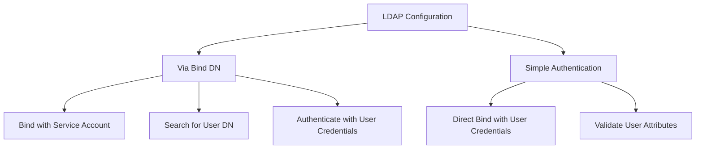
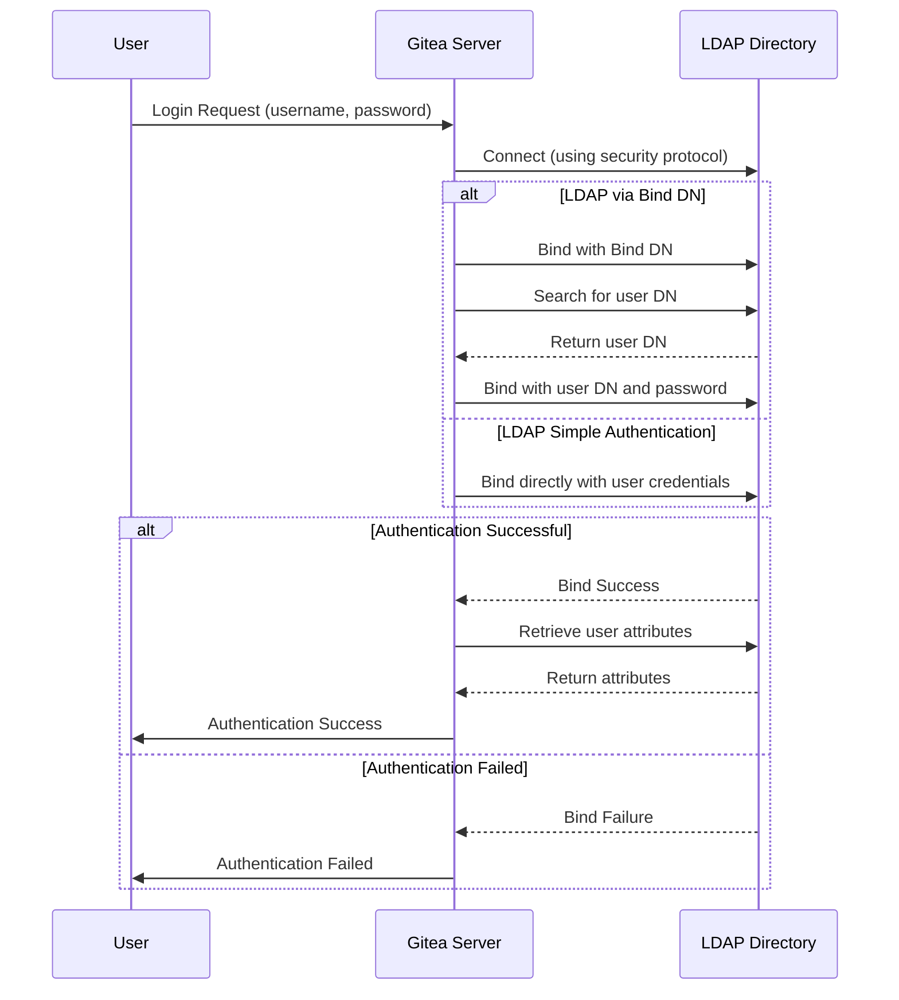
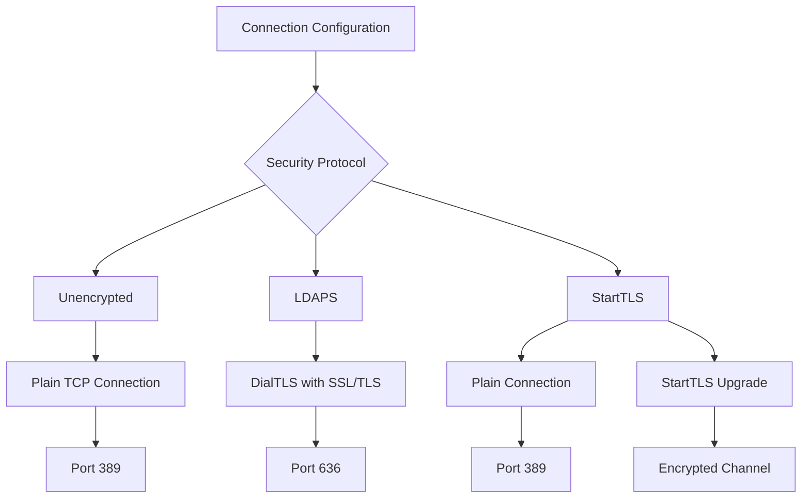
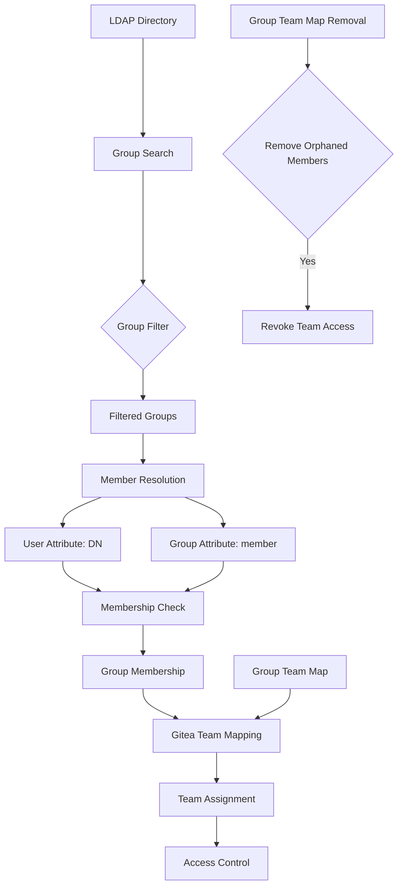
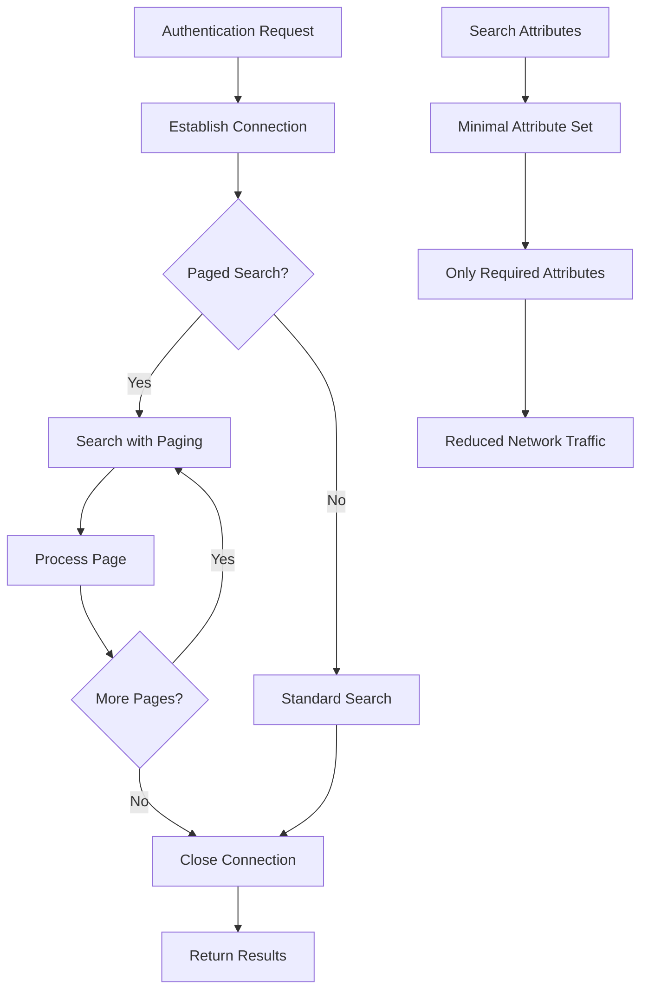
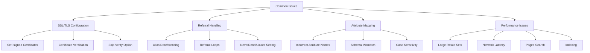
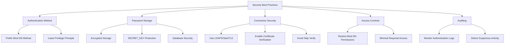
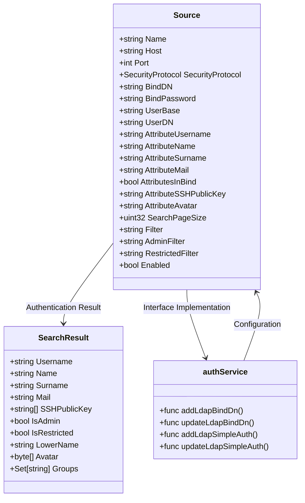

# LDAP Authentication

<cite>
**Referenced Files in This Document**   
- [source.go](file://models/auth/source.go)
- [admin_auth_ldap.go](file://cmd/admin_auth_ldap.go)
- [source.go](file://services/auth/source/ldap/source.go)
- [source_search.go](file://services/auth/source/ldap/source_search.go)
- [source_authenticate.go](file://services/auth/source/ldap/source_authenticate.go)
- [security_protocol.go](file://services/auth/source/ldap/security_protocol.go)
- [assert_interface_test.go](file://services/auth/source/ldap/assert_interface_test.go)
- [README.md](file://services/auth/source/ldap/README.md)
</cite>

## Table of Contents
1. [Introduction](#introduction)
2. [Configuration Methods](#configuration-methods)
3. [Authentication Flow](#authentication-flow)
4. [Connection and Security Configuration](#connection-and-security-configuration)
5. [User Attribute Mapping](#user-attribute-mapping)
6. [Group Management and Team Mapping](#group-management-and-team-mapping)
7. [Connection Pooling and Performance](#connection-pooling-and-performance)
8. [Common Issues and Troubleshooting](#common-issues-and-troubleshooting)
9. [Security Best Practices](#security-best-practices)
10. [Implementation Examples](#implementation-examples)

## Introduction

LDAP authentication in Gitea provides integration with LDAP directories for user authentication and authorization. The system supports two authentication methods: LDAP via Bind DN and LDAP simple authentication. This documentation details the configuration, authentication flow, attribute synchronization, and security considerations for LDAP integration in Gitea.

**Section sources**
- [README.md](file://services/auth/source/ldap/README.md#L0-L22)

## Configuration Methods

LDAP authentication sources can be configured through both the administrative web interface and command-line tools. The configuration includes two distinct methods: LDAP via Bind DN and LDAP simple authentication.

LDAP via Bind DN uses a dedicated service account (Bind DN) to search for user entries in the directory before authenticating with the user's credentials. This method provides better security as the Bind DN can have restricted permissions. LDAP simple authentication directly binds to the LDAP server using the user's credentials without a separate search phase.

Configuration parameters include the LDAP host, port, security protocol, bind credentials, user search base, and various attribute mappings. The configuration can be managed through the admin interface or via command-line tools such as `gitea admin auth add-ldap` and `gitea admin auth add-ldap-simple`.



**Diagram sources**
- [source.go](file://services/auth/source/ldap/source.go#L29-L52)
- [admin_auth_ldap.go](file://cmd/admin_auth_ldap.go#L100-L150)

**Section sources**
- [source.go](file://services/auth/source/ldap/source.go#L29-L52)
- [admin_auth_ldap.go](file://cmd/admin_auth_ldap.go#L100-L150)

## Authentication Flow

The LDAP authentication flow in Gitea follows a structured process that varies slightly between the two authentication methods. For LDAP via Bind DN, the process begins with establishing a connection to the LDAP server using the configured security protocol. The system then binds to the directory using the configured Bind DN and password, if specified, or proceeds with an anonymous search.

Once connected, Gitea searches for the user entry using the configured user search base and filter. The search query is constructed using the username provided during login and the configured user filter template. If a single matching entry is found, the system extracts the user's DN for the subsequent authentication step.

The authentication then proceeds by attempting to bind to the LDAP server using the user's DN and provided password. If this bind operation succeeds, the user is considered authenticated. For LDAP simple authentication, this direct bind approach is used from the beginning, eliminating the initial search phase.

After successful authentication, Gitea retrieves the user's attributes as configured in the LDAP source settings, including username, name, email, and optional SSH public key and avatar data. These attributes are then used to create or update the user's account in Gitea.



**Diagram sources**
- [source_search.go](file://services/auth/source/ldap/source_search.go#L239-L288)
- [source_authenticate.go](file://services/auth/source/ldap/source_authenticate.go#L0-L44)

**Section sources**
- [source_search.go](file://services/auth/source/ldap/source_search.go#L239-L288)
- [source_authenticate.go](file://services/auth/source/ldap/source_authenticate.go#L0-L44)

## Connection and Security Configuration

LDAP connection configuration in Gitea includes several security protocols and connection parameters. The system supports three security protocols: Unencrypted, LDAPS, and StartTLS. Unencrypted connections use plain text communication on the standard LDAP port (389). LDAPS encrypts the entire communication channel using SSL/TLS on port 636. StartTLS upgrades an existing unencrypted connection to an encrypted one using the STARTTLS command.

The connection parameters include the LDAP host address, port number, and options for certificate verification. The Skip Verify option allows connections to LDAP servers with self-signed or invalid certificates, though this is not recommended for production environments due to security risks.

Connection establishment is handled by the dial function, which creates an appropriate connection based on the configured security protocol. For LDAPS, it uses DialTLS to establish an encrypted connection from the start. For StartTLS, it first establishes a plain connection and then upgrades it using the StartTLS command. The TLS configuration includes options for server name verification and certificate validation.



**Diagram sources**
- [source_search.go](file://services/auth/source/ldap/source_search.go#L91-L135)
- [security_protocol.go](file://services/auth/source/ldap/security_protocol.go#L0-L30)

**Section sources**
- [source_search.go](file://services/auth/source/ldap/source_search.go#L91-L135)
- [security_protocol.go](file://services/auth/source/ldap/security_protocol.go#L0-L30)

## User Attribute Mapping

User attribute mapping in Gitea's LDAP integration allows administrators to specify which LDAP attributes correspond to user properties in Gitea. The configuration includes mappings for essential user attributes such as username, first name, surname, and email address.

The Attribute Username field specifies which LDAP attribute contains the user's login name. This is typically "uid" in Unix-like directories or "sAMAccountName" in Active Directory. The Attribute Name and Attribute Surname fields map to the user's first and last names, commonly "givenName" and "sn" respectively. The Attribute Mail field specifies the attribute containing the user's email address, usually "mail".

Additional attribute mappings include SSH public key and avatar data. The Attribute SSH Public Key field allows users to store their SSH public keys directly in the LDAP directory, enabling seamless SSH access to Gitea repositories. The Attribute Avatar field can reference binary attributes containing image data for user avatars.

During authentication, Gitea retrieves these attributes from the user's LDAP entry and uses them to create or update the corresponding user account. If an attribute is not found or is empty, Gitea applies fallback mechanisms, such as using the username as the display name or generating a placeholder email address.

```mermaid
classDiagram
class LDAPUser {
+string uid
+string givenName
+string sn
+string mail
+string sshPublicKey
+binary jpegPhoto
}
class GiteaUser {
+string Username
+string Name
+string Surname
+string Email
+string[] SSHPublicKey
+byte[] Avatar
}
LDAPUser --> GiteaUser : Attribute Mapping
LDAPUser : : uid --> GiteaUser : : Username
LDAPUser : : givenName --> GiteaUser : : Name
LDAPUser : : sn --> GiteaUser : : Surname
LDAPUser : : mail --> GiteaUser : : Email
LDAPUser : : sshPublicKey --> GiteaUser : : SSHPublicKey
LDAPUser : : jpegPhoto --> GiteaUser : : Avatar
```

**Diagram sources**
- [source.go](file://services/auth/source/ldap/source.go#L29-L52)
- [source_search.go](file://services/auth/source/ldap/source_search.go#L337-L373)

**Section sources**
- [source.go](file://services/auth/source/ldap/source.go#L29-L52)
- [source_search.go](file://services/auth/source/ldap/source_search.go#L337-L373)

## Group Management and Team Mapping

Gitea's LDAP integration includes comprehensive group management capabilities that allow synchronization of LDAP group memberships with Gitea organization teams. This feature enables centralized user management through the LDAP directory while maintaining team-based access control within Gitea.

The group management configuration includes several key parameters: Group Search Base (GroupDN), Group Filter, Group Member Attribute (GroupMemberUID), and User Attribute Listed in Group (UserUID). The Group Search Base specifies the LDAP container where group entries are located. The Group Filter allows filtering which groups are considered for synchronization, improving performance in large directories.

The Group Member Attribute specifies which attribute in the group entry contains references to member users, typically "member" or "memberOf". The User Attribute Listed in Group defines which attribute of the user entry is used to establish the membership relationship, often "dn" or a unique identifier attribute.

Gitea supports mapping LDAP groups to organization teams through the Group Team Map configuration. This allows automatic team membership based on LDAP group membership. The Group Team Map Removal option, when enabled, ensures that users are removed from synchronized teams when they are removed from the corresponding LDAP group, maintaining consistent access control.



**Diagram sources**
- [source_search.go](file://services/auth/source/ldap/source_search.go#L183-L240)
- [source.go](file://services/auth/source/ldap/source.go#L29-L52)

**Section sources**
- [source_search.go](file://services/auth/source/ldap/source_search.go#L183-L240)
- [source.go](file://services/auth/source/ldap/source.go#L29-L52)

## Connection Pooling and Performance

Gitea's LDAP implementation manages connections efficiently to optimize performance and resource utilization. The system establishes a new LDAP connection for each authentication request, which is then closed after the operation completes. This approach ensures connection isolation and prevents potential issues with connection state.

For user synchronization operations that involve searching multiple entries, Gitea supports paged search functionality through the Search Page Size configuration parameter. When this value is set above zero, Gitea uses LDAP's paging extension to retrieve results in chunks, reducing memory usage and improving performance for large result sets.

The search operations are optimized by requesting only the necessary attributes, as specified in the configuration. This reduces network traffic and LDAP server load. The attribute list includes only those attributes that are actually used by Gitea, avoiding unnecessary data transfer.

Connection performance can be further optimized by proper indexing of search attributes in the LDAP directory. Ensuring that attributes used in search filters (such as the username attribute) are indexed can significantly improve search response times, especially in large directories.



**Diagram sources**
- [source_search.go](file://services/auth/source/ldap/source_search.go#L462-L495)
- [source.go](file://services/auth/source/ldap/source.go#L29-L52)

**Section sources**
- [source_search.go](file://services/auth/source/ldap/source_search.go#L462-L495)
- [source.go](file://services/auth/source/ldap/source.go#L29-L52)

## Common Issues and Troubleshooting

Several common issues may arise when configuring and using LDAP authentication in Gitea. SSL/TLS configuration problems are frequent, particularly when connecting to LDAP servers with self-signed certificates. The Skip Verify option can temporarily resolve connection issues but should be used cautiously in production environments.

Referral handling can cause issues in directory environments that use referrals to other directory servers. Gitea's LDAP implementation is configured to not dereference aliases, which prevents potential infinite loops but may cause issues in complex directory topologies that rely on referrals for user resolution.

Attribute mapping errors are another common issue, typically occurring when the configured attribute names do not match those in the LDAP directory. This can result in missing user information or authentication failures. Careful verification of attribute names against the directory schema is essential during configuration.

Connection timeouts and performance issues may occur with large directories or slow network connections. Configuring appropriate search filters to limit result sets and ensuring proper indexing of search attributes in the LDAP directory can mitigate these issues. The paged search functionality helps manage memory usage when synchronizing large numbers of users.



**Diagram sources**
- [source_search.go](file://services/auth/source/ldap/source_search.go#L52-L89)
- [source.go](file://services/auth/source/ldap/source.go#L29-L52)

**Section sources**
- [source_search.go](file://services/auth/source/ldap/source_search.go#L52-L89)
- [source.go](file://services/auth/source/ldap/source.go#L29-L52)

## Security Best Practices

Securing LDAP authentication in Gitea requires careful consideration of several factors. The choice between LDAP via Bind DN and simple authentication has significant security implications. LDAP via Bind DN is generally recommended as it allows the use of a service account with limited permissions, reducing the attack surface.

The Bind DN password is encrypted when stored in the database using Gitea's secret key. This encryption ensures that even if the database is compromised, the LDAP credentials remain protected. Administrators should ensure that the SECRET_KEY in Gitea's configuration is strong and kept secure.

For production environments, unencrypted LDAP connections should be avoided. LDAPS or StartTLS should be used to encrypt all communication between Gitea and the LDAP server, preventing credential interception and other attacks. Certificate verification should be enabled to prevent man-in-the-middle attacks, with certificates from trusted certificate authorities.

Access controls in the LDAP directory should be configured to limit what the Bind DN account can read, following the principle of least privilege. This prevents potential information disclosure if the service account credentials are compromised. Regular auditing of LDAP authentication logs can help detect suspicious activity.



**Diagram sources**
- [source.go](file://services/auth/source/ldap/source.go#L61-L117)
- [assert_interface_test.go](file://services/auth/source/ldap/assert_interface_test.go#L0-L24)

**Section sources**
- [source.go](file://services/auth/source/ldap/source.go#L61-L117)
- [assert_interface_test.go](file://services/auth/source/ldap/assert_interface_test.go#L0-L24)

## Implementation Examples

The LDAP authentication implementation in Gitea demonstrates several key design patterns and integration points. The Source struct implements multiple interfaces, including PasswordAuthenticator, SynchronizableSource, and SSHKeyProvider, allowing it to integrate seamlessly with Gitea's authentication framework.

Configuration management is handled through the FromDB and ToDB methods, which serialize and deserialize the LDAP configuration to and from the database. The FromDB method decrypts the stored Bind Password, while the ToDB method encrypts it before storage, ensuring secure credential management.

The authentication process is implemented in the SearchEntry method, which handles both authentication methods through the directBind parameter. This method orchestrates the connection, binding, and attribute retrieval processes, returning a SearchResult struct containing the authenticated user's information.

Command-line interface tools provide programmatic access to LDAP configuration, allowing automation of setup and management tasks. These tools validate required parameters and construct the appropriate configuration objects for database storage.



**Diagram sources**
- [source.go](file://services/auth/source/ldap/source.go#L29-L52)
- [source_search.go](file://services/auth/source/ldap/source_search.go#L0-L525)
- [admin_auth_ldap.go](file://cmd/admin_auth_ldap.go#L0-L455)

**Section sources**
- [source.go](file://services/auth/source/ldap/source.go#L29-L52)
- [source_search.go](file://services/auth/source/ldap/source_search.go#L0-L525)
- [admin_auth_ldap.go](file://cmd/admin_auth_ldap.go#L0-L455)